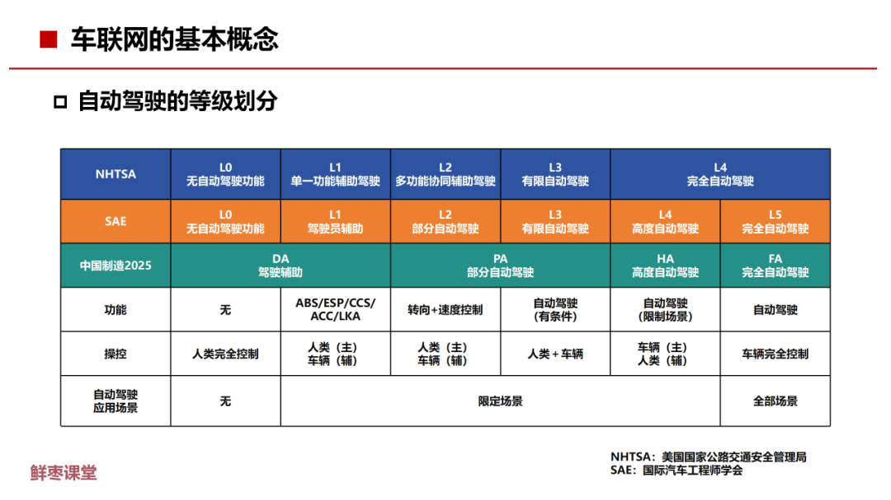

[[engines]]
[[transmissions]]

[什么是汽车域控制器？汽车电子电气架构转变趋势，理解智能座舱与智能驾驶芯片方案 - YouTube](https://www.youtube.com/watch?v=jt7Yl0zJNPE)

## Cars

[Every Car Shape Explained - YouTube](https://www.youtube.com/watch?v=UmoGULPLPOc)
roadster
coupes
spyder
[車款百百樣，什麼是 Coupe？ - 世界高級品 LuxuryWatcher](https://www.luxurywatcher.com/zh-Hant/article/24316)
[Every Construction Machine Explained in 15 Minutes - YouTube](https://www.youtube.com/watch?v=6CmX4ZmhwPM)

[Under the Hood Channel - HowStuffWorks](http://auto.howstuffworks.com/under-the-hood-channel.htm)

[Wings and Spoilers; Lift and Drag | How It Works - YouTube](https://www.youtube.com/watch?v=AXjiThF1LXU)
[Side Skirts, Diffusers, and Air Dams | How It Works | Science Garage - YouTube](https://www.youtube.com/watch?v=Woq-nl9QyfQ)
[The EVOLUTION of Aerodynamics - YouTube](https://www.youtube.com/watch?v=OnUFE0Uqd80)

[【亦】电动汽车覆灭史 - YouTube](https://www.youtube.com/watch?v=g6cWaOqIguo)

Start motor
Overdrive
Overrun
Traction control

## Driving/Road Safety

[This Image Breaks AI - YouTube](https://www.youtube.com/watch?v=p6CfR3Wpz7Y)

[【e ＋車路事】駕車遇交通意外應如何應對？律師教路保障自己 - ezone.hk - 科技焦點 - 科技 - D180727](https://ezone.ulifestyle.com.hk/article/2124744/【e＋車路事】駕車遇交通意外應如何應對？律師教路保障自己)
[【e ＋車路事】遇交通意外想和解「私了」要點做？ 大律師教你簽和解紙 - ezone.hk - 科技焦點 - 科技 - D180810](https://ezone.ulifestyle.com.hk/article/2125126/【e＋車路事】遇交通意外想和解「私了」要點做？%20大律師教你簽和解紙!)

[【龍 Sir 教室 Ep13】簡單一招 keep 住在行車線中央（內附字幕）｜ TopGear HK 極速誌 - YouTube](https://www.youtube.com/watch?v=B0zvlv9bemQ)
[【龍 Sir 教室 Ep32】龍系嫡傳泊車心得．L 位篇（內附字幕）｜ TopGear Magazine HK 極速誌 topgearhk - YouTube](https://www.youtube.com/watch?v=Qv2s2QR96Lo)
[【龍 Sir 教室 Ep33】龍系嫡傳泊車心得．S 位泊車技巧篇（內附字幕）｜ TopGear Magazine HK 極速誌 topgearhk - YouTube](https://www.youtube.com/watch?v=S0HxJ92E0oU)

[新手駕駛必讀！新舊迴旋處守則你要知 - ezone.hk - 科技焦點 - 科技 - D180622](https://ezone.ulifestyle.com.hk/article/2100334/新手駕駛必讀！新舊迴旋處守則你要知)
[【龍 Sir 教室 Ep34】迴旋處、螺旋處攻略（內附字幕）｜ TopGear Magazine HK 極速誌 topgearhk - YouTube](https://www.youtube.com/watch?v=SizKyh9Njyk)
[【龍 Sir 教室 Ep35】迴旋處新手指南加實戰篇（內附字幕）｜ TopGear Magazine HK 極速誌 topgearhk - YouTube](https://www.youtube.com/watch?v=tmfbVL5mrW4)

### Road

[Asphalt vs Tar: What's the Difference? | Tensar](https://www.tensar.co.uk/resources/articles/asphalt-vs-tarmac)
[What’s the Difference Between Tarmac and Asphalt? - Tarmac Driveways Stafford](https://www.tarmacadamdrivewaystafford.co.uk/guides/difference-between-tarmac-asphalt/)

## Safety

[Which Is The Most Dangerous Car? - YouTube](https://www.youtube.com/watch?v=dmPvGi4s9bg)
[How Do Seatbelts Work? - YouTube](https://www.youtube.com/watch?v=n3ncfcGMo50)

[Why Race Cars Don’t Have Airbags - YouTube](https://www.youtube.com/watch?v=c0qbw_AGCkw)
[The Evolution of Racing Helmets | Donut Media - YouTube](https://www.youtube.com/watch?v=l-tNQiZgOuI)

Technology Connections
[The Senseless Ambiguity of North American Turn Signals - YouTube](https://www.youtube.com/watch?v=O1lZ9n2bxWA)
[Electric cars prove we need to rethink brake lights - YouTube](https://www.youtube.com/watch?v=U0YW7x9U5TQ) one-pedal driving does not trigger brake lights

## Steering

[汽车转弯 没那么简单: 阿克曼转向几何是个啥？How does Ackerman steering geometry work? - YouTube](https://www.youtube.com/watch?v=8AimxDPWKcM)
[The Story of Brakes - YouTube](https://www.youtube.com/watch?v=Z-F3NDGeu2s)

Drift
Power slide
Handbrake
e-brake

### Counter steering

For automobile that leans,
[Countersteering - Wikiwand](https://www.wikiwand.com/en/Countersteering)
[Steering Vs Countersteering Motorcycle (Simplified) - YouTube](https://www.youtube.com/watch?v=K7YyV92Er8Y)

For automobile that drifts,
[Opposite lock - Wikiwand](https://www.wikiwand.com/en/Opposite_lock)
[How does counter steering actually work? - Quora](https://www.quora.com/How-does-counter-steering-actually-work)

[The Differences Between Drifting And Powersliding - YouTube](https://www.youtube.com/watch?v=p-0iWdUtiug)
Drifting before the apex, sideway when entering apex
Powersliding after the apex

## Traffic Congestion

[為什麼會塞車？| 有種塞車叫幽靈塞車 | 史上最嚴重的塞車塞了 12 日！？ (廣東話/正體中文字幕) - YouTube](https://www.youtube.com/watch?v=gypL2TZzL50)
[Traffic congestion ranking | TomTom Traffic Index](https://www.tomtom.com/en_gb/traffic-index/ranking/)

## YouTube Channels

[Big Car - YouTube](https://www.youtube.com/@BigCar2)
[Doug DeMuro - YouTube](https://www.youtube.com/@DougDeMuro) exotic cars review
[Jay Leno's Garage - YouTube](https://www.youtube.com/@jaylenosgarag)
[Donut Media - YouTube](https://www.youtube.com/@Donut)
[JohnnyQ90 - YouTube](https://www.youtube.com/@johnnyq90) RC Cars
[Aging Wheels - YouTube](https://www.youtube.com/@agingwheels) old cars, funny projects
[小施汽車生活頻道 - YouTube](https://www.youtube.com/@sscarlife) 2nd hand cars dealer
[L 佬 LLOTALK - YouTube](https://www.youtube.com/@Llotalk)
[ISSIMI Official - YouTube](https://www.youtube.com/@ISSIMIOfficial) cars reviews
[REV Channel - YouTube](https://www.youtube.com/@REVChannelhk)
[11磅小老虎 - YouTube](https://www.youtube.com/@11bang)
[TalksWithNoise - YouTube](https://www.youtube.com/@TalksWithNoise)

[Automobile Engineering - YouTube](https://www.youtube.com/playlist?list=PLuUdFsbOK_8rJsh_osoqVKfIRUkb8-rOg)
[Automotive Engineering - YouTube](https://www.youtube.com/playlist?list=PLpw4kOpfNU9bTCpLAf2mM-SpjpcKpnnPu)

[Auto Mechanics, Auto Repair, Car parts, Automobile repair... - YouTube](https://www.youtube.com/playlist?list=PLCED11EACAE477F6C)
[How Cars Work and Stuff Like that - YouTube](https://www.youtube.com/playlist?list=PLI7lqC4ZBnInJOAwogQJtSq4UQu69Pjj4) black and white archives

[MONEYPIT - Miata Build-Along Show - YouTube](https://www.youtube.com/playlist?list=PLFl907chpCa4WmBZlSv2FfWTiFAwvUeT6)
[9 Things You’ll REGRET Not Doing to Your Car - YouTube](https://www.youtube.com/watch?v=WBxqiUhadyY) changing engine oil, diff oil, transmission oil, brake fluid, engine coolant, power steering fluid, spark plugs, belts and filters

[98汽油这么好 为啥还要加92？深度揭秘汽油和标号-CD的硬核科普 - YouTube](https://www.youtube.com/watch?v=sTR4Bde2YeU)

## Car Brands

[Lamborghini - Everything You Need to Know | Up to Speed - YouTube](https://www.youtube.com/watch?v=kvCHcrzLL8I)
[Evolution of Lamborghini [1959-2022] - YouTube](https://www.youtube.com/watch?v=hkspsIwUAZU)

[BUGATTI - Everything You Need to Know | Up to Speed - YouTube](https://www.youtube.com/watch?v=WcgFiDGJDD0)
[Evolution of Bugatti | Part 1: The History of a Legend - YouTube](https://www.youtube.com/watch?v=869o7z1X2B0)

[Koenigsegg - Everything You Need to Know | Up to Speed - YouTube](https://www.youtube.com/watch?v=x5wvr5wlJdI)
[TESLA - Everything You Need to Know | Up to Speed - YouTube](https://www.youtube.com/watch?v=b1gIqVsRoaw)
[PAGANI - Everything You Need to Know | Up to Speed - YouTube](https://www.youtube.com/watch?v=gVmV3vf6lbg)
[McLaren - Everything You Need To Know | Up to Speed - YouTube](https://www.youtube.com/watch?v=nvJHZ6x31hk)
[SAAB - Everything You Need To Know | Up to Speed - YouTube](https://www.youtube.com/watch?v=s4lwmd9lKfQ)
[DeLorean - Everything You Need to Know | Up to Speed - YouTube](https://www.youtube.com/watch?v=dZwpPs47DIU)
[ASTON MARTIN - Everything You Need to Know | Up to Speed - YouTube](https://www.youtube.com/watch?v=32SxD9cdKoY)
[AMG - Everything You Need to Know | Up to Speed - YouTube](https://www.youtube.com/watch?v=U8YjuAMb6e0) former Mercedes employees, started out modifying Mercedes's cars; it's now a subsidiary of Mercedes
[HENNESSEY - Everything You Need to Know | Up to Speed - YouTube](https://www.youtube.com/watch?v=ReUE7rUVgQA) started out providing performance tuning services for sport cars, produced Venom GT
[RUF - Everything You Need to Know | Up to Speed - YouTube](https://www.youtube.com/watch?v=moizw9T7sSQ) started off modifying Porche cars, then got license to use Porche chasis
[LOTUS - Everything You Need to Know | Up To Speed - YouTube](https://www.youtube.com/watch?v=e3EfNfE8pCU)
[DUCATI - Everything You Need to Know | Up to Speed - YouTube](https://www.youtube.com/watch?v=kQKIuMWIIjA) Italian motorcycle manufacturer
[DATSUN: Nissan's American Origin Story | Up To Speed - YouTube](https://www.youtube.com/watch?v=soKeg_3PGeI) Nissan's branding in USA, changed back to Nissan in 1985
[AMC - Everything You Need to Know | Up to Speed - YouTube](https://www.youtube.com/watch?v=_lbjGtYJ9zw)
[ROLLS ROYCE - Everything You Need to Know | Up to Speed - YouTube](https://www.youtube.com/watch?v=cPn_M0m-_xg)
[BENTLEY - Fat, Loud, Fast & Fancy | Donut Media - YouTube](https://www.youtube.com/watch?v=hkwvOP6AxLo) Rolls Royce bought Bentley

[Ferrari Vs Lamborghini - The Rivalry EXPLAINED - YouTube](https://www.youtube.com/watch?v=e90dZUUSG-M)
[Le Mans '66: Ford V Ferrari V Reality - YouTube](https://www.youtube.com/watch?v=eYVzwR_RKCE)
[SHELBY - Everything You Need to Know | Up to Speed - YouTube](https://www.youtube.com/watch?v=oxN9MOYc7LY)
Great racer, designed the Shelby Cobra with British AC Cars with Ford Engine; then hired by Ford for design of GT and by Chrysler for Dodge Viper
[KEN MILES - Everything You Need to Know | Up to Speed - YouTube](https://www.youtube.com/watch?v=aE0gq9KxHOw)

[Who ACTUALLY Made Your Car? | WheelHouse - YouTube](https://www.youtube.com/watch?v=pBs9bpIFNgg&feature=emb_rel_pause)
[Volkswagen Group - Wikiwand](https://www.wikiwand.com/en/Volkswagen_Group#/Operations)
Volkswagen owns many passenger car marques such as Audi, Bentley, Bugatti, Lamborghini, Porsche, SEAT, and Škoda.
Volkswagen bought Rolls Royce and Bentley in 1998
However BMW owns Rolls Royce's trademark on automobiles
[General Motors - Wikiwand](https://www.wikiwand.com/en/General_Motors)
GM owns brands such as Chevrolet, Buick, GMC, and Cadillac; and foreign brands such as Holden, Wuling, Baojun, and Jiefang.

[Toyota - Wikiwand](https://www.wikiwand.com/en/Toyota)
Toyota owns brands such as Hino, Lexus, Ranz, and Daihatsu.

## Car Model

[CHEVELLE - Everything You Need to Know | Up To Speed - YouTube](https://www.youtube.com/watch?v=u5ycYVGmKmk) Chevrolet Chevelle
[Chevrolet Corvette - Everything You Need To Know | Up to Speed - YouTube](https://www.youtube.com/watch?v=jfASBwlxujY)
[C8 Corvette - The Science EXPLAINED - YouTube](https://www.youtube.com/watch?v=P3drHwiSyc4)

[Mini Cooper - Everything You Need to Know | Up To Speed - YouTube](https://www.youtube.com/watch?v=NMBAus7C8gQ) Volkswagen Mini Cooper
[Camaro - Everything You Need to Know | Up To Speed - YouTube](https://www.youtube.com/watch?v=I658CGLf8D4) to compete with the Ford's Mustang
[NISSAN GTR - Everything You Need to Know | Up to Speed - YouTube](https://www.youtube.com/watch?v=pfaDYkeHd-4)
[Mustang vs Camaro - Who won each decade? (1960s - TODAY) - YouTube](https://www.youtube.com/watch?v=9JL3XxbL4Sw)

[Ford GT - Everything You Need to Know | Up to Speed - YouTube](https://www.youtube.com/watch?v=ZtomsRAtRWc) built after a failed attempt in acquiring Ferrari, since 1966 the GT40 won 4 Le Mans
[Dodge Viper - Everything You Need to Know | Up to Speed - YouTube](https://www.youtube.com/watch?v=CQlD2e5Dc7U)
[DODGE HEMI - Everything You Need To Know | Up To Speed - YouTube](https://www.youtube.com/watch?v=YEhTVtSzZ6c&t=124s)
[PORSCHE 918 - Everything You Need to Know | Up to Speed - YouTube](https://www.youtube.com/watch?v=71IZrz12RFA) Ferrari debuted F40 9 months after Porche 959
[MUGEN - Everything You Need to Know | Up to Speed - YouTube](https://www.youtube.com/watch?v=lJSo8pMQM6s)

[FORD RAPTOR - Everything You Need to Know | Up to Speed - YouTube](https://www.youtube.com/watch?v=55jf23CdvhQ)
[FORD RANGER - Everything You Need to Know | Up to Speed - YouTube](https://www.youtube.com/watch?v=-JfY7UyeY44)

Flatlife
[Evolution of Lamborghini [1959-2022] - YouTube](https://www.youtube.com/watch?v=hkspsIwUAZU)
[Evolution of Bugatti | Part 1: The History of a Legend - YouTube](https://www.youtube.com/watch?v=869o7z1X2B0)
[Evolution of Bugatti | Part 2: Bugatti’s Fastest Cars - YouTube](https://www.youtube.com/watch?v=Yku4aSTZuAw)
[Evolution of McLaren (Animation) - YouTube](https://www.youtube.com/watch?v=MOHpE0IML7g)
[Evolution of Koenigsegg (Animation) - YouTube](https://www.youtube.com/watch?v=Fe3Ona4wNaM)

[McLaren F1 - The Science EXPLAINED - YouTube](https://www.youtube.com/watch?v=BdNKDsBj6oI)

[What are the differences between a Range Rover and a Jeep? - Quora](https://www.quora.com/What-are-the-differences-between-a-Range-Rover-and-a-Jeep)
[JEEP WRANGLER & JEEP GC vs LAND ROVER DISCOVERY **OFF ROAD 4x4 CHALLENGE** - YouTube](https://www.youtube.com/watch?v=NVstDjW102g)
[Jeep Wrangler vs Land Rover LR4 - YouTube](https://www.youtube.com/watch?v=1fNns01ONkU) SUVs

[為什麼的士都是豐田 TOYOTA | 計程車都會自動開門？| 皇冠 CROWN 的發展 (廣東話/正體中文字幕) - YouTube](https://www.youtube.com/watch?v=Yh32zfldpVA)

## Electric/Hybrid Cars

[Alternative Fuels Data Center: How Do All-Electric Cars Work?](https://afdc.energy.gov/vehicles/how-do-all-electric-cars-work)

Plug-in Hybrid Electric Vehicle (PEV) 插電式混動: 能插電充電, implies larger battery
Hybrid Electric Vehicle (HEV) 油電混動: 非插電式混動

[缝合怪还是割韭菜？10分钟带你彻底搞懂混动技术！](https://www.youtube.com/watch?v=5tOwLlryaUU)

[硬核讲解电动车快充（快充的原理和危害，特斯拉为什么没有 800V 快充）【电动车】【快充】 - YouTube](https://www.youtube.com/watch?v=rK6MbJzylDk)
[This Chinese Battery Breakthrough Just Killed the Gas Station - YouTube](https://www.youtube.com/watch?v=wW0a4x52H_o)

[#驱动技术](https://mp.weixin.qq.com/mp/appmsgalbum?action=getalbum&album_id=2402216471663116289)

- Serial 串聯/增程式
- Parallel 並聯
- Serial+Parallel 串並聯
- Power Split 功率分配
  like 串並聯 but with planetary gears

Engineering Explained
[Electric and Hybrid Cars - YouTube](https://www.youtube.com/playlist?list=PL2ir4svMoaYj48N0VWoic25P9LaU2wlbA)

Technology Connections
[Electric Vehicles - YouTube](https://www.youtube.com/playlist?list=PLv0jwu7G_DFV47UBHArs6fiwVHvstp9ja)

## Vehicle Autonomy

[SAE Levels of Driving Automation™ Refined for Clarity and International Audience](https://www.sae.org/blog/sae-j3016-update)

[The 6 Levels of Vehicle Autonomy Explained | Synopsys Automotive](https://www.synopsys.com/blogs/chip-design/autonomous-driving-levels.html)
[A Primer to the 6 Levels of Autonomous Driving | Electronics360](https://electronics360.globalspec.com/article/11594/a-primer-to-the-6-levels-of-autonomous-driving)
[Explanation of the 6 Levels of Driving Automation](https://blog.rgbsi.com/6-levels-of-driving-automation)
[Autonomous Self-Driving Vehicle Levels Explained - YouTube](https://www.youtube.com/watch?v=LIP4eJAECvU)

[65页PPT，彻底看懂车联网！-电子工程专辑](https://www.eet-china.com/mp/a334924.html)

[无人驾驶出租车 落地深圳 已成现实「SIGNOW」 - YouTube](https://www.youtube.com/watch?v=NQHLx2U8HU0)
[The Truth About Self Driving Cars - YouTube](https://www.youtube.com/watch?v=d5TiaIYdug4)
[Driverless Cars - Computerphile - YouTube](https://www.youtube.com/watch?v=Wd1_xpw7j3w)

[AI DRIVR - YouTube](https://www.youtube.com/%40AIDRIVR)
[AI DRIVR Shorts - YouTube](https://www.youtube.com/%40AIDRIVRShorts)

[comma.ai](https://comma.ai/)
[Self-Driving Engineering with George Hotz - Software Engineering Daily](https://softwareengineeringdaily.com/2018/08/08/self-driving-engineering-with-george-hotz/)
[commaai/opendbc: democratize access to car decoder rings](https://github.com/commaai/opendbc)

[Can You Fool A Self Driving Car? - YouTube](https://www.youtube.com/watch?v=IQJL3htsDyQ) LiDAR vs optical camera

[烧光 131 亿，被王传福痛骂的“吸血鬼”，原形毕露-36 氪](https://36kr.com/p/2244679707324549)

## Automobile Systems

Scalable Open Architecture for Embedded Edge
[soafee.io](https://www.soafee.io/)
[SOAFEE · GitLab](https://gitlab.com/soafee)

[Automotive Oscilloscopes: What you need to know - YouTube](https://www.youtube.com/watch?v=LEzkoF-gAn4)

[Car Hacking Village](https://www.carhackingvillage.com/)

### CAN bus

[CAN bus - Wikiwand](https://www.wikiwand.com/en/CAN_bus) ISO 11898-1 AND ISO 11898-2
[CAN Bus Explained - A Simple Intro [2023] – CSS Electronics](https://www.csselectronics.com/pages/can-bus-simple-intro-tutorial)
[CAN Bus Protocol: The Ultimate Guide (2023)](https://www.autopi.io/blog/can-bus-explained/)
[The CAN Bus Protocol - Kvaser](https://www.kvaser.com/about-can/the-can-protocol/)
[Introduction to CAN (Controller Area Network) - Technical Articles](https://www.allaboutcircuits.com/technical-articles/introduction-to-can-controller-area-network/)
[What is the CoAP Communication Protocol? - Documents - Tech Connection - element14 Community](https://community.element14.com/learn/learning-center/the-tech-connection/w/documents/3831/what-is-the-coap-communication-protocol)
[【硬件科普】什么是汽车的电子电气架构，中央域控架构能为消费者带来什么？ - YouTube](https://www.youtube.com/watch?v=K2lY3btGZko)

[Guides – CSS Electronics](https://www.csselectronics.com/pages/can-bus-intros-tutorials) ❗!important
[CAN DBC Editor Playground - Google Sheets](https://docs.google.com/spreadsheets/d/1X6VQBkqRX0a6QLd4oFbAos_ps3zrpVc86CVGd67DoSs/edit#gid=282429578)
[Easily Decode CANBus / OBD2 Data in 10 Minutes - YouTube](https://www.youtube.com/watch?v=270c1bkf2Ck)
[Introduction to the Controller Area Network (CAN) - YouTube](https://www.youtube.com/watch?v=8nl3XkL1eTc)
[CAN Bus: A Beginners Guide Part 1 - YouTube](https://www.youtube.com/watch?v=YBrU_eZM110)
[CAN Bus: A Beginners Guide Part 2 - YouTube](https://www.youtube.com/watch?v=z5CVljiLhvc)
[How does CAN data flow? CAN data flow explained - YouTube](https://www.youtube.com/watch?v=OHQ0PcuUjeM)
[CAN Protocol Explained | Controller Area Network - YouTube](https://www.youtube.com/watch?v=WikQ5n1QXQs)
[CAN Frame structure Understanding | CAN communication Explained - YouTube](https://www.youtube.com/watch?v=3vs40cm1wYs)
[CAN总线！4分钟看懂！汽车领域用的一种总线通讯！ - YouTube](https://www.youtube.com/watch?v=sREP2e3jVYs)
[車用通訊CAN Bus-波形解密-示波器解碼-GDS3652A - YouTube](https://www.youtube.com/watch?v=XpAwtJNgt5M)
[CAN - 介紹(CAN來源/CAN特性/格式介紹/通訊錯誤) - YouTube](https://www.youtube.com/watch?v=MrGZ8QdY4g4)

[Hacking a vehicle network (CAN Bus) - YouTube](https://www.youtube.com/watch?v=Qk-ugN-8roc)
[Getting started with SocketCAN (can-utils) | ESP32 | Kali Linux Vmware Installation - YouTube](https://www.youtube.com/watch?v=my-mBFQCIZ0)
[The EASIEST Way to Connect to a Car's CAN Bus - YouTube](https://www.youtube.com/watch?v=Se2KCVyD7CM) ESP32 CAN Bus Shield

[Building a Car Interface Using Raspberry Pi 4 | Bluetooth Sync With OBD II Adapter - YouTube](https://www.youtube.com/watch?v=U8RHjfBV_Ek)
[DIY Raspberry Pi Racecar Dashboard: The Ultimate Guide - YouTube](https://www.youtube.com/watch?v=SVn9uYfEQrA)
[Sniffing any CAN-bus on the cheap(5$) with Arduino, Tested on an VW Polo 9N3 - YouTube](https://www.youtube.com/watch?v=fj8ZLTubeko)

[Car Hacking 101: Practical Guide to Exploiting CAN-Bus using Instrument Cluster Simulator — Part I: Setting Up | by Yogesh Ojha | Medium](https://medium.com/@yogeshojha/car-hacking-101-practical-guide-to-exploiting-can-bus-using-instrument-cluster-simulator-part-i-cd88d3eb4a53)
[Car Hacking 101: Practical Guide to Exploiting CAN-Bus using Instrument Cluster Simulator — Part II: Exploitation | by Yogesh Ojha | Medium](https://medium.com/@yogeshojha/car-hacking-101-practical-guide-to-exploiting-can-bus-using-instrument-cluster-simulator-part-ee998570758)
[Car Hacking 101: Practical Guide to Exploiting CAN-Bus using Instrument Cluster Simulator — Part III: SavvyCAN, Fuzzing CAN Frame and playing around with CAN frames | by Yogesh Ojha | Medium](https://medium.com/@yogeshojha/car-hacking-101-practical-guide-to-exploiting-can-bus-using-instrument-cluster-simulator-part-ea40c05c49cd)

[CAN Sniffer: 5 Steps to Reverse Engineering the CAN Bus](https://www.autopi.io/blog/discover-hidden-functions-in-your-car-with-can-bus/)

[USBtin - USB to CAN interface - fischl.de](https://www.fischl.de/usbtin/)

[cantools/cantools: CAN bus tools.](https://github.com/cantools/cantools)
[linux-can/can-utils: Linux-CAN / SocketCAN user space applications](https://github.com/linux-can/can-utils)
[Can-utils Candump Explained. CANbus communications 101 - YouTube](https://www.youtube.com/watch?v=ef4akXEDKOQ)

[hardbyte/python-can: The can package provides controller area network support for Python developers](https://github.com/hardbyte/python-can)
[CSS-Electronics/can_decoder: API module for decoding raw CAN bus data to physical values](https://github.com/CSS-Electronics/can_decoder)
