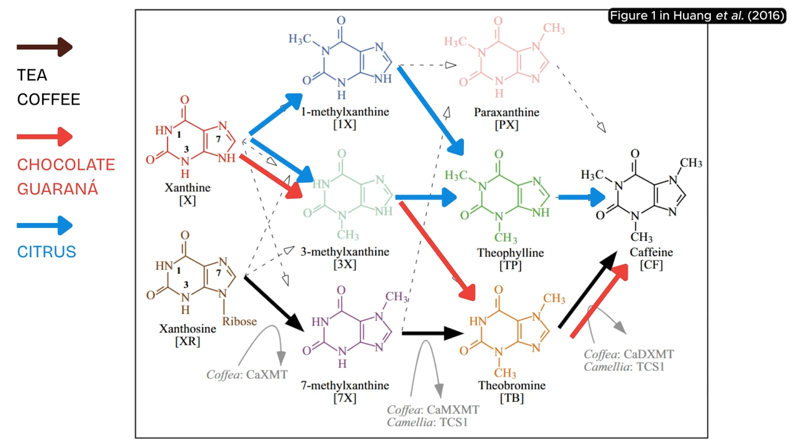

[[botany]]
[[zoology]]
[[biology-organs]]

[Biology - Wikiwand](https://www.wikiwand.com/en/biology)
[Biology Dictionary - Explanations and Examples of Biological Concepts](https://biologydictionary.net/)
[Welcome To Biology Explorer | Biology News | BioExplorer.net](https://www.bioexplorer.net/)

[Atlas Pro - YouTube](https://www.youtube.com/@AtlasPro1)
[Journey to the Microcosmos - YouTube](https://www.youtube.com/@journeytomicro)
[SubAnima - YouTube](https://www.youtube.com/@SubAnima)
[All About Biology - YouTube](https://www.youtube.com/playlist?list=PL05keIMVq9x2tOMNjscs-o5smIMmCRgEg) Clint Explains
[Biology/Genetics - YouTube](https://www.youtube.com/playlist?list=PLybg94GvOJ9HH3IbmPRCfU4knUiBJPq1Z) Professor Dave Explains

CrashCourse
[Biology - YouTube](https://www.youtube.com/playlist?list=PL3EED4C1D684D3ADF)
[Ecology - YouTube](https://www.youtube.com/playlist?list=PL8dPuuaLjXtNdTKZkV_GiIYXpV9w4WxbX)

[養成這幾個習慣，你或許能多活 30 年｜當長壽成為現實，你會選擇永生嗎？｜衰老的真相 3 期合集｜思維實驗室 - YouTube](https://www.youtube.com/watch?v=FPnV4NuHNgo)

atavism: the recurrence of traits of an ancestor in a subsequent generation
vestigial: atrophied, become functionless in the course of evolution

## Origin of Life

[The Origin of Life on Earth - YouTube](https://www.youtube.com/watch?v=TK1E3heBSiI)

[Origin of Life on Earth and Early Evolution | GEO GIRL - YouTube](https://www.youtube.com/watch?v=pegtsXku4A0)
[The Controversial Role of Oxygen in Animal Evolution & Diversification | GEO GIRL - YouTube](https://www.youtube.com/watch?v=nhKYFjNpDLM)

### Early Lifeforms

[[paleontology#Boring Billion]]

[Prokaryote](https://www.wikiwand.com/en/Prokaryote): one cell, no separation, bacteria
[原核生物 - Wikiwand](https://www.wikiwand.com/zh/%E5%8E%9F%E6%A0%B8%E7%94%9F%E7%89%A9)
[Archaea - Wikiwand](https://www.wikiwand.com/en/Archaea)
[古菌 - Wikiwand](https://www.wikiwand.com/zh/%E5%8F%A4%E8%8F%8C)
[Eukaryote](https://www.wikiwand.com/en/Eukaryote): structures within the cell (endosymbiosis, ~2Ga), with nucleus and cell wall/membrane
[真核生物 - Wikiwand](https://www.wikiwand.com/zh/%E7%9C%9F%E6%A0%B8%E7%94%9F%E7%89%A9)

[【鬼谷闲谈】甲藻：什么都往DNA里刻会发生什么？ - YouTube](https://www.youtube.com/watch?v=2MRmadabMKQ)

[Evolution of Eukaryotes- How & Why Endosymbiosis Occurred & When First Eukaryotes Evolved | GEO GIRL - YouTube](https://www.youtube.com/watch?v=yIIQFy_Zsp8)

[Endosymbiosis, Choanoflagellates, and the Origin of Animal Life - YouTube](https://www.youtube.com/watch?v=YpAXmVz6Q-Q)
[The Origin of Multicellular Life: Cell Specialization and Animal Development - YouTube](https://www.youtube.com/watch?v=hAWrxKHY_7I)
[Unicellular Life Part 1: Bacteria - YouTube](https://www.youtube.com/watch?v=EC-U6tv6Wf4)
[Unicellular Life Part 2: Archaea and Protists - YouTube](https://www.youtube.com/watch?v=viJhnEJhj54)

[【鬼谷闲谈】一次改写生命演化的邂逅 - YouTube](https://www.youtube.com/watch?v=4DLxonMKtho) 真核生物 = 古菌+好氧細菌 (mitochondria 線粒體)
[【鬼谷闲谈】以硅质构筑身体的硬核碳基生物 - YouTube](https://www.youtube.com/watch?v=tJShruCM1rg)
[【鬼谷闲谈】迷失的乐园，杀出的黎明，埃迪卡拉纪的太初之战 - YouTube](https://www.youtube.com/watch?v=nCrrrRAywPQ)
[【鬼谷闲谈】纤毛虫：满级单细胞生物是怎样的存在？ - YouTube](https://www.youtube.com/watch?v=hBGDhxuGfms)

[【鬼谷闲谈】阿斯加德古菌：给人类一点小小的神之震撼 - YouTube](https://www.youtube.com/watch?v=pcDE2A8e7Dk)

## What is Life

[我們的使命可能已經結束 | 老高與小茉 Mr & Mrs Gao - YouTube](https://www.youtube.com/watch?v=jXcuLBI8QMc) silicon-based life

[What Is Life? Is Death Real? - YouTube](https://www.youtube.com/watch?v=QOCaacO8wus)

[Origins: The first living thing • Unexplainable - Podcast Addict](https://podcastaddict.com/unexplainable/episode/155049008) three conditions, NASA definition, not virus
[Origins: The meaning of “life” • Unexplainable - Podcast Addict](https://podcastaddict.com/unexplainable/episode/155049009)

## Wallace Line (Biogeographic Boundary)

[Wallace Line - Wikiwand](https://www.wikiwand.com/en/Wallace_Line)

[The Invisible Barrier Keeping Two Worlds Apart - YouTube](https://www.youtube.com/watch?v=QTK_bC00ilg)

[動物們無法穿越的無形屏障，分割出兩個世界的隱形地理線 - YouTube](https://www.youtube.com/watch?v=mQG7EF2bJpU)

## Evolution

[重磅發現！從魚開始進化到人類，演化的奧秘被首次正式揭開了？丨黑毛羊駝 - YouTube](https://www.youtube.com/watch?v=D8wOfJb5-q0)
[聊聊大家關注的那些進化論話題！長頸鹿長脖子之謎，25 年前才出現的、即將引起生態浩劫的新物種！ - YouTube](https://www.youtube.com/watch?v=vX9XX06t9gA)
[How Evolution works - YouTube](https://www.youtube.com/watch?v=hOfRN0KihOU)
[The Whole History of the Earth and Life 【Finished Edition】 - YouTube](https://www.youtube.com/watch?v=NQ4CUw9RcuA)
[The 12 Days of Evolution - Complete Series! - YouTube](https://www.youtube.com/watch?v=c_jyHp3bmEw)
[【鬼谷说】南美洲：演化的另一重世界线 - YouTube](https://www.youtube.com/watch?v=neMqEuHxQMk)
[【震撼】進化論的進化，從 1859 到 2020 | 老高與小茉 Mr & Mrs Gao - YouTube](https://www.youtube.com/watch?v=yNFgOL-7nOw) Darwin and Wallace co-discovered the theory of evolution

[The Forgotten Piece Of Evolutionary Theory (and why we need it back) - YouTube](https://www.youtube.com/watch?v=RzvxcDRS3sI) ❗!important, gene as follower of behavioral innovation

Evolution: Differential survival and reproduction
Epigenetics: acquired gene, genic expression
To categorize organisms based upon similarities and differences in their physical or genetic characteristics

[Ecological niche - Wikiwand](https://www.wikiwand.com/en/Ecological_niche)
[生態位 - Wikiwand](https://www.wikiwand.com/zh/%E7%94%9F%E6%80%81%E4%BD%8D)
Aye-aye in Madagascar and woodpeckers

[Island gigantism - Wikiwand](https://www.wikiwand.com/en/Island_gigantism)
[島嶼巨型化 - Wikiwand](https://www.wikiwand.com/zh/%E5%B3%B6%E5%B6%BC%E5%B7%A8%E5%9E%8B%E5%8C%96)

[Researchers explain why that picture of monkeys turning into humans is wrong](https://thenextweb.com/news/researchers-explain-why-that-picture-of-monkeys-turning-into-humans-is-wrong)

[What is Impossible in Evolution? - YouTube](https://www.youtube.com/watch?v=YkS1U5lfSRw)

[The Mystery of Earth's Disappearing Giants | IN OUR NATURE - YouTube](https://www.youtube.com/watch?v=95HP73Yemxo)
[哺乳动物为啥变成了“哺乳”动物？ - YouTube](https://www.youtube.com/watch?v=mpfMbrq1-Ms)

### Coevolution

Coevolution 協同進化: two or more species reciprocally affect each other's evolution
[Coevolution - Wikiwand](https://www.wikiwand.com/en/Coevolution)
[共同演化 - Wikiwand](https://www.wikiwand.com/zh/%E5%85%B1%E5%90%8C%E6%BC%94%E5%8C%96)

### Convergent Evolution

Convergent evolution 趨同進化: two unrelated animals evolved similar traits
[Convergent evolution - Wikiwand](https://www.wikiwand.com/en/Convergent_evolution)
[趨同演化 - Wikiwand](https://www.wikiwand.com/zh/%E8%B6%8B%E5%90%8C%E6%BC%94%E5%8C%96)

[Convergent Evolution: Would Aliens Really Look Like Us? - YouTube](https://www.youtube.com/watch?v=JSq2Kj9LM_g)

[Convergent evolution - YouTube](https://www.youtube.com/playlist?list=PL7tWEs4arDuyUVR7KwVbstukvl6z_8Aml)
[The convergent evolution of caffeine | Convergent evolution explained - YouTube](https://www.youtube.com/watch?v=4X5rRJaMTuw)

[為什麼說進化的終點是螃蟹？原來，至少有 5 類史前蟲子進化成了螃蟹……|自說自話的總裁 - YouTube](https://www.youtube.com/watch?v=Fu0gTUT_MHk)
[Why Do Things Keep Evolving Into Crabs? - YouTube](https://www.youtube.com/watch?v=wvfR3XLXPvw)

## Phylogeny

> merge with [[#Taxonomy]]?

[Phylogenetic tree - Wikiwand](https://www.wikiwand.com/en/Phylogenetic_tree) = Phylogeny
[What Is Phylogeny? Definition and Examples](https://www.thoughtco.com/what-is-phylogeny-4582303)

A model that traces the evolutionary history of between organisms.
Phylogenic characteristics are used to help establish taxanomic groupings.

Professor Dave Explains
[Phylogeny and the Tree of Life - YouTube](https://www.youtube.com/watch?v=KLMn4XwS8Tw) ❗!important
[Major Divisions of Kingdom Animalia and the Problem With Animal Phyla - YouTube](https://www.youtube.com/watch?v=APkHKOf9rG4&t=2s)

[Evolution & Classification of Life | From Single Celled Bacteria to Humans - YouTube](https://www.youtube.com/watch?v=HpXaiG8L28s) ❗!important

[Evolution and Phylogenetics - YouTube](https://www.youtube.com/playlist?list=PL05keIMVq9x12J4pBn_8IZsL22xQBet2W) Clint Explains

[Phylogenetics - Wikiwand](https://www.wikiwand.com/en/Phylogenetics)
[系統發生學 - Wikiwand](https://www.wikiwand.com/zh/%E7%B3%BB%E7%BB%9F%E5%8F%91%E7%94%9F%E5%AD%A6)

- Ribosomal RNA sequency
- Homology (similarities between organism)
  - Genotype
  - Phenotype

[支序分類學 - Wikiwand](https://www.wikiwand.com/zh/%E6%94%AF%E5%BA%8F%E5%88%86%E9%A1%9E%E5%AD%B8)
[Cladistics - Wikiwand](https://www.wikiwand.com/en/Cladistics) phylogenetic systematics
[What is cladistics? How reliable is it?](http://www.miketaylor.org.uk/dino/faq/s-class/clad/index.html)

[ETE Toolkit - Analysis and Visualization of (phylogenetic) trees](http://etetoolkit.org/)
[ete ncbiquery: Fast and handy queries to the NCBI taxonomy database](http://etetoolkit.org/documentation/ete-ncbiquery/)

## Taxonomy

[生物分類法 - Wikiwand](https://www.wikiwand.com/zh/%E7%94%9F%E7%89%A9%E5%88%86%E9%A1%9E%E6%B3%95)
[生物分類學 - Wikiwand](https://www.wikiwand.com/zh/%E7%94%9F%E7%89%A9%E5%88%86%E9%A1%9E%E5%AD%B8)
[Taxonomy (biology) - Wikiwand](<https://www.wikiwand.com/en/Taxonomy_(biology)>)
[Evolutionary taxonomy - Wikiwand](https://www.wikiwand.com/en/Evolutionary_taxonomy)

[卡爾·林奈 - Wikiwand](https://www.wikiwand.com/zh/%E5%8D%A1%E5%B0%94%C2%B7%E6%9E%97%E5%A5%88)
[二名法 - Wikiwand](https://www.wikiwand.com/zh/%E4%BA%8C%E5%90%8D%E6%B3%95)
[Binomial nomenclature - Wikiwand](https://www.wikiwand.com/en/Binomial_nomenclature)

"Linnean taxonomy is as much an art form as a science."
There is no real definition of "genus".
There's no scientific way to decide whether a given difference in anatomy is sufficient that two species differ because the idea of a genus is so artificial:.

Ranks other than Genus and Species is not necessary in specifying an species

- (Domain 域: Bateria, Eukaryote, Archaea)
- Kingdom 界: Plant, Fungus, Animal
- (Phylum/Division 門)
- Class 綱
- Order 目, -iformes/-ia
- (Superfamily 超科, -oidae)
- (Family 科, -idae)
- (Subfamily 亞科, -inae)
- Genus 屬, -us
- Species 種

中文類可指綱, 目, 亞目, 科

[分類階元 - Wikiwand](https://www.wikiwand.com/zh/%E5%88%86%E7%B1%BB%E9%98%B6%E5%85%83)
[Taxonomic rank - Wikiwand](https://www.wikiwand.com/en/Taxonomic_rank)
[What are classification, taxonomy, phylogeny, systematics and cladistics?](http://www.miketaylor.org.uk/dino/faq/s-class/terms/index.html)
[What do terms like phylum, order and family mean?](http://www.miketaylor.org.uk/dino/faq/s-class/levels/index.html)

[Linnaeus's System of Taxonomic Classification](https://www.thoughtco.com/taxonomy-373415)
[What Is Phylogeny? Definition and Examples](https://www.thoughtco.com/what-is-phylogeny-4582303)
[What Is a Cladogram? Definition and Examples](https://www.thoughtco.com/cladogram-definition-and-examples-4778452)

[並系群 - Wikiwand](https://www.wikiwand.com/zh/%E4%B8%A6%E7%B3%BB%E7%BE%A4)
[Paraphyly - Wikiwand](https://www.wikiwand.com/en/Paraphyly)
[單系群 - Wikiwand](https://www.wikiwand.com/zh/%E5%8D%95%E7%B3%BB%E7%BE%A4)
[Monophyly - Wikiwand](https://www.wikiwand.com/en/Monophyly)
[What do terms like monophyletic, paraphyletic and polyphyletic mean?](http://www.miketaylor.org.uk/dino/faq/s-class/phyletic/index.html)

[國際動物命名規約 - Wikiwand](https://www.wikiwand.com/zh/%E5%9B%BD%E9%99%85%E5%8A%A8%E7%89%A9%E5%91%BD%E5%90%8D%E6%B3%95%E8%A7%84)
[International Code of Zoological Nomenclature - Wikiwand](https://www.wikiwand.com/en/International_Code_of_Zoological_Nomenclature)
[Nomen dubium - Wikiwand](https://www.wikiwand.com/en/Nomen_dubium)

[模式種 - Wikiwand](https://www.wikiwand.com/zh/%E6%A8%A1%E5%BC%8F%E7%A8%AE)
[Type species - Wikiwand](https://www.wikiwand.com/en/Type_species)
[Type (biology) - Wikiwand](<https://www.wikiwand.com/en/Type_(biology)>)

- holotype - the single specimen or illustration that the author(s) clearly indicated to be the nomenclatural type of a name
- lectotype - a specimen or illustration designated from the original material as the nomenclatural type when there was no holotype specified or the holotype has been lost or destroyed
- isotype - a duplicate of the holotype
- syntype - any specimen (or illustration) cited in the original description when there is no holotype, or any one of two or more specimens simultaneously designated as types
- paratype - any specimen (or illustration) cited in the original description that is not the holotype nor an isotype, nor one of the syntypes
- neotype - a specimen or illustration selected to serve as nomenclatural type if no material from the original description is available
- epitype - a specimen or illustration selected to serve as an interpretative type, usually when another kind of type does not show the critical features needed for identification
