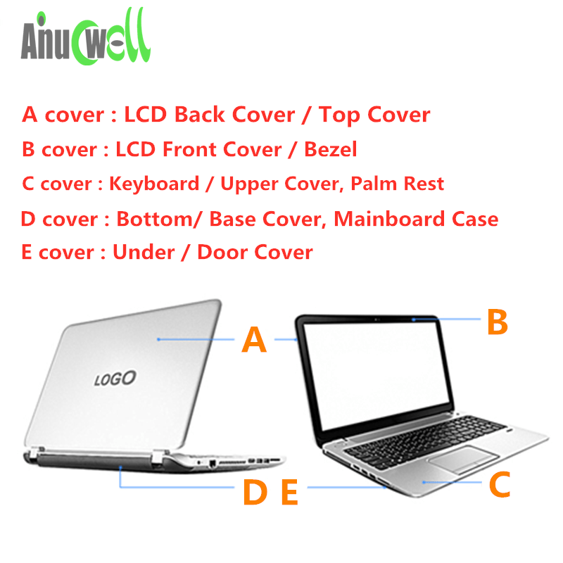

[[computer-laptops-2019]]

[Laptop Mag: Find the Perfect Laptop, Tablet or 2-in-1 for You](https://www.laptopmag.com/)
[Compare Laptops - Latest laptop Comparison by Price, Specification, Features, Performance & Reviews | Gadgets Now](https://www.gadgetsnow.com/compare-laptops)

A: LCD Back Cover
B: Front bezel
C: Palmrest
D: Bottom Case

[Mobile Internet device - Wikiwand](https://www.wikiwand.com/en/Mobile_Internet_device)
[Ultra-mobile PC - Wikiwand](https://www.wikiwand.com/en/Ultra-mobile_PC)
[Ultrabook - Wikiwand](https://www.wikiwand.com/en/Ultrabook)

## Lenovo

[ThinkWiki](https://www.thinkwiki.org/wiki/ThinkWiki)

Lookup spec by product ID
[Lenovo Computer Parts | Genuine Spare Parts | Lenovo Support HK](https://support.lenovo.com/hk/en/parts-lookup)
[Home - Global Support - US](https://support.lenovo.com/us/en/)
[Product Specifications Reference(PSREF)](http://psref.lenovo.com/)

[THINK: A brief history of ThinkPads, from IBM to Lenovo - NotebookCheck.net News](https://www.notebookcheck.net/THINK-A-brief-history-of-ThinkPads-from-IBM-to-Lenovo.418728.0.html)

Install Lenovo Vantage from Microsoft Store to update drivers and view parts

## MacBook

[MacBook Air - Technical Specifications - Apple (HK)](http://www.apple.com/hk/en/macbook-air/specs.html)
[MacBook Neo - Tech Specs - Apple (HK)](https://www.apple.com/hk/en/macbook-neo/specs/)

## Linux Laptops

[Purism - – Librem 14](https://puri.sm/products/librem-14/#tech-specs) 14", 1.4kg
[Entroware Apollo](https://www.entroware.com/store/apollo) 14", 1.3kg
[StarBook Horizon 13.4-inch Linux Laptop – Star Labs®](https://hk.starlabs.systems/pages/starbook-horizon) 13.4", 1.1kg

Or old Lenovo X1C and install Linux on your own

### Framework

[Framework | Order a Framework Laptop 13 with AMD Ryzen™ AI 300 Series](https://frame.work/laptop13)
[Framework | Framework Laptop 13 Pro: Intel Core Ultra 3 & LPCAMM2](https://frame.work/laptop13pro)

[A COMPLETELY Upgradeable Laptop? - YouTube](https://www.youtube.com/watch?v=0rkTgPt3M4k)
[This Is How All Laptops Should Be Made!! - Framework Laptop Teardown - YouTube](https://www.youtube.com/watch?v=QmyAUIo79EU)
[The Framework Laptop is a Risky Gamble... But I Love It. - YouTube](https://www.youtube.com/watch?v=jmgBwMHpP1w)
