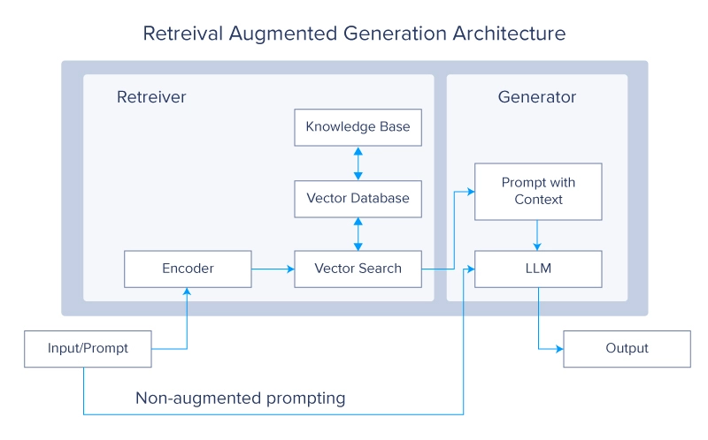

Generative Adversarial Network
Generator and Discriminator

[AI Assistants: Picking the Right Copilot](https://www.itprotoday.com/ai-machine-learning/ai-assistants-picking-the-right-copilot)

[AI Model Names Are So Complex: Here's How I'd Simplify Them](https://www.makeuseof.com/simplifying-ai-model-names/)
[How I Find the Best AI Tools for Any Job](https://www.makeuseof.com/how-find-best-ai-tools-for-any-job/)

[What developers need to know about generative AI | The GitHub Blog](https://github.blog/2023-04-07-what-developers-need-to-know-about-generative-ai/)
[How generative AI is changing the way developers work | The GitHub Blog](https://github.blog/2023-04-14-how-generative-ai-is-changing-the-way-developers-work/)
[Gartner Breaks Down GenAI: Is It Overhyped or a Game-Changer?](https://www.itprotoday.com/artificial-intelligence/gartner-breaks-down-genai-it-overhyped-or-game-changer)
[Generative AI is Everything Everywhere, All at Once | Databricks Blog](https://www.databricks.com/blog/generative-ai-everything-everywhere-all-once)
[4 Ways AI Can Make Working With PDFs Easier](https://www.makeuseof.com/ai-pdfs-working-easier/)

[5 YouTube Channels to Master LLMs - KDnuggets](https://www.kdnuggets.com/5-youtube-channels-to-master-llms)
[Andrej Karpathy - YouTube](https://www.youtube.com/@AndrejKarpathy)
[CodeEmporium - YouTube](https://www.youtube.com/@CodeEmporium)
[Cole Medin - YouTube](https://www.youtube.com/@ColeMedin)
[Dave Ebbelaar - YouTube](https://www.youtube.com/@daveebbelaar)
[Entry Point AI - YouTube](https://www.youtube.com/@EntryPointAI)
[Hung-yi Lee - YouTube](https://www.youtube.com/@HungyiLeeNTU/)
[Krish Naik - YouTube](https://www.youtube.com/@krishnaik06)
[Matthew Berman - YouTube](https://www.youtube.com/@matthew_berman)
[Yannic Kilcher - YouTube](https://www.youtube.com/@YannicKilcher) research paper breakdown
[Prompt Engineering - YouTube](https://www.youtube.com/@engineerprompt)

[Prompt Engineering Guide | Prompt Engineering Guide](https://www.promptingguide.ai/)

[How AI Image Generators Work (Stable Diffusion / Dall-E) - Computerphile - YouTube](https://www.youtube.com/watch?v=1CIpzeNxIhU)
[Encoder Decoder Network - Computerphile - YouTube](https://www.youtube.com/watch?v=1icvxbAoPWc)
[How Generative AI Video Works - Computerphile - YouTube](https://www.youtube.com/watch?v=hJHfZKYUKMw)

[PyTorch Deep Learning Nanodegree: Generative Adversarial Networks](https://medium.com/datadriveninvestor/pytorch-deep-learning-nanodegree-generative-adversarial-networks-bc37e2b50a81)

[Futurepedia - The Largest AI Tools Directory | Home](https://www.futurepedia.io/)
[有好多好多 AI 工具在這裡，超級 AI 資料庫 Futurepedia 是你想找聊天機器人、繪圖 AI 與生產力 AI 的好去處 - 電腦王阿達](https://www.kocpc.com.tw/archives/478606)

[Slide into the Latest Deep Learning Research in the NVIDIA AI Playground | The Official NVIDIA Blog](https://blogs.nvidia.com/blog/2019/03/18/nvidia-ai-playground/)
[Generative Adversarial Networks, an overview](https://www.kdnuggets.com/2018/01/generative-adversarial-networks-overview.html)
[The Rise of Generative Adversarial Networks](https://www.kdnuggets.com/2019/04/rise-generative-adversarial-networks.html)

[Generative Adversarial Networks (GANs) - Computerphile - YouTube](https://www.youtube.com/watch?v=Sw9r8CL98N0)
[Generative adversarial networks: What GANs are and how they've evolved | VentureBeat](https://venturebeat.com/2019/12/26/gan-generative-adversarial-network-explainer-ai-machine-learning/amp/)
[“GANs” vs “ODEs”: the end of mathematical modeling?](https://towardsdatascience.com/gans-vs-odes-the-end-of-mathematical-modeling-ec158f04acb9)
[Generative Adversarial Networks - YouTube](https://www.youtube.com/playlist?list=PLSgGvve8UweFoMyAEFlFiE--JtWect5-T)
[Generative Adversarial Networks - Towards Data Science](https://towardsdatascience.com/generative-adversarial-networks-gans-2231c5943b11)
[Overview of GANs (Generative Adversarial Networks) - Part I](https://towardsdatascience.com/overview-of-gans-generative-adversarial-networks-part-i-ac78ec775e31)
[Generative Adversarial Networks — Part II - Towards Data Science](https://towardsdatascience.com/generative-adversarial-networks-part-ii-6212f7755c1f)
[InfoGAN — Generative Adversarial Networks Part III - Towards Data Science](https://towardsdatascience.com/infogan-generative-adversarial-networks-part-iii-380c0c6712cd)

[A Gentle Introduction to the Progressive Growing GAN](https://machinelearningmastery.com/introduction-to-progressive-growing-generative-adversarial-networks/)

[GauGAN Turns Doodles into Stunning, Realistic Landscapes | NVIDIA Blog](https://blogs.nvidia.com/blog/2019/03/18/gaugan-photorealistic-landscapes-nvidia-research/)
[Nvidia AI turns sketches into photorealistic landscapes in seconds – TechCrunch](https://techcrunch.com/2019/03/18/nvidia-ai-turns-sketches-into-photorealistic-landscapes-in-seconds/amp/)
[Generative Adversarial Networks – Key Milestones and State of the Art](https://www.kdnuggets.com/2019/04/future-generative-adversarial-networks.html)
[Reproducing Japanese Anime Styles With CartoonGAN AI](https://medium.com/syncedreview/reproducing-japanese-anime-styles-with-cartoongan-ai-cf30d583736e)
[A Gentle Introduction to StyleGAN the Style Generative Adversarial Network](https://machinelearningmastery.com/introduction-to-style-generative-adversarial-network-stylegan/)

[Computer evolves to generate baroque music! - YouTube](https://www.youtube.com/watch?v=SacogDL_4JU)
[No Regrets - What Happens to AI Beyond Generative? - Computerphile - YouTube](https://www.youtube.com/watch?v=fN3gdUMB_Yc)
[因为AI焦虑了，我该怎么办？ - YouTube](https://www.youtube.com/watch?v=aVebifutUy0)

[5 Fun Generative AI Projects for Absolute Beginners - KDnuggets](https://www.kdnuggets.com/5-fun-generative-ai-projects-for-absolute-beginners)

[太极AI【终身会员兑换码】使用教程](https://www.yuque.com/disfigured/hwu8v6/txfkgp2n3seb0q5t) I bought "lifetime" license at ¥199, it has image editing and generation

## Google Courses

[Google Cloud Skills Boost](https://www.cloudskillsboost.google/journeys/118)
[Master Gen AI For Free From Google](https://analyticsindiamag.com/master-gen-ai-for-free-from-google/)
[Google 釋出 7 堂完全免費生成式 AI 課程！也有提供給 AI 小白的入門課 - INSIDE](https://www.inside.com.tw/article/31843-Google-7-new-no-cost-generative-AI-training-courses)

[Introduction to Generative AI | Google Cloud Skills Boost](https://www.cloudskillsboost.google/course_templates/536)
[Attention Mechanism | Google Cloud Skills Boost](https://www.cloudskillsboost.google/course_templates/537)
[Encoder-Decoder Architecture | Google Cloud Skills Boost](https://www.cloudskillsboost.google/course_templates/543)
[Introduction to Responsible AI | Google Cloud Skills Boost](https://www.cloudskillsboost.google/course_templates/554)

[Introduction to Large Language Models | Google Cloud Skills Boost](https://www.cloudskillsboost.google/course_templates/539)
[Transformer Models and BERT Model | Google Cloud Skills Boost](https://www.cloudskillsboost.google/course_templates/538)

[Introduction to Image Generation | Google Cloud Skills Boost](https://www.cloudskillsboost.google/course_templates/541)
[Create Image Captioning Models | Google Cloud Skills Boost](https://www.cloudskillsboost.google/course_templates/542)

## Detecting AI/AGC watermarking

[Overview - C2PA](https://c2pa.org/)
[Guidance for Artificial Intelligence and Machine Learning :: C2PA Specifications](https://c2pa.org/specifications/specifications/1.4/ai-ml/ai_ml.html)
[C2PA: Everything you need to know about the C2PA project - SmartFrame](https://smartframe.io/blog/c2pa-everything-you-need-to-know-about-the-c2pa-project/)
[C2PA in DALL·E 3 | OpenAI Help Center](https://help.openai.com/en/articles/8912793-c2pa-in-dall-e-3)

[Detecting AI fingerprints: A guide to watermarking and beyond | Brookings](https://www.brookings.edu/articles/detecting-ai-fingerprints-a-guide-to-watermarking-and-beyond/)
[Generative AI and watermarking](<https://www.europarl.europa.eu/RegData/etudes/BRIE/2023/757583/EPRS_BRI(2023)757583_EN.pdf>) PDF
[AI Watermarking Won't Curb Disinformation | Electronic Frontier Foundation](https://www.eff.org/deeplinks/2024/01/ai-watermarking-wont-curb-disinformation)
[AI Watermarking 101: Tools and Techniques](https://huggingface.co/blog/watermarking)
[How Anyone Can Detect an AI Voice and Avoid Being Fooled](https://www.makeuseof.com/ai-voice-signs/) AI Voice

[Try This "AI or Human?" Test to Challenge Your AI Detection Skills](https://www.makeuseof.com/try-ai-or-human-test-to-challenge-your-ai-detection-skills/)
[Here's How I Check Whether I'm Chatting With a Real Person or AI](https://www.makeuseof.com/chatting-with-real-person-vs-ai/)
[AI Checkers Are Useless, and These 5 Examples Prove Why](https://www.makeuseof.com/ai-checkers-are-useless-examples-prove-why/)
[How I Spot AI-Written Product Reviews Before I Get Scammed](https://www.makeuseof.com/how-spot-ai-written-product-reviews/)
[AI Content Detectors Don’t Work, and That’s a Big Problem](https://www.makeuseof.com/ai-content-detectors-dont-work/)
[How to Identify an AI-Generated Image: 4 Ways](https://www.makeuseof.com/how-to-identify-ai-generated-image/)
[4 Reasons Why AI Checkers Might Flag Your Writing Even If You Don't Use ChatGPT](https://www.makeuseof.com/reasons-why-ai-checkers-might-flag-your-writing/)
[11 Dead Giveaways the Image You’re Seeing Was AI-Generated](https://www.makeuseof.com/ai-image-giveaways/)
[6 Dead Giveaways the Video You’re Watching Is AI-Generated](https://www.makeuseof.com/dead-giveaways-video-is-ai-generated/)
[You're Probably Listening to AI Music Without Realizing—Here's How to Spot It](https://www.makeuseof.com/how-spot-avoid-ai-music-streaming/)

## AI Lies

[When an AI lies – 4sysops](https://4sysops.com/archives/when-an-ai-lies/)

## AI Audio Channel

[Two AI agents on a phone call realize they’re both AI and switch to a superior audio signal ggwave - YouTube](https://www.youtube.com/watch?v=EtNagNezo8w)
[Two AI agents autonomously encrypt their audio chat - YouTube](https://www.youtube.com/watch?v=m59y309_cpg)

## Hallucination

> When you like it it's creativity, when you don't it's hallucination.

[Why language models hallucinate | OpenAI](https://openai.com/index/why-language-models-hallucinate/)
[Why Do Language Models Hallucinate? - KDnuggets](https://www.kdnuggets.com/why-do-language-models-hallucinate)
[OpenAI is pursuing a new way to fight AI 'hallucinations'](https://www.cnbc.com/2023/05/31/openai-is-pursuing-a-new-way-to-fight-ai-hallucinations.html) process supervision as opposed to outcome supervision
hallucinate
[新研究：大模型是「有意識地」一本正經胡說八道嗎？ | TechNews 科技新報](https://technews.tw/2023/06/12/do-large-language-models-know-what-they-do-not-know/)
[[2305.18153] Do Large Language Models Know What They Don't Know?](https://arxiv.org/abs/2305.18153)
[GPT 總愛「一本正經的胡說八道」怎麼辦？OpenAI 稱找到解決 AI「幻覺」方法 | T 客邦](https://www.techbang.com/posts/106813-what-to-do-with-ai-making-up-nonsense-openai-claims-to-find-a)
[為什麼 ChatGPT 總是會「一本正經的胡說八道」？瞭解 GPT 語言模型的 6 個缺點與問題 | T 客邦](https://www.techbang.com/posts/104718-dark-side-of-chatgpt)

[5 Hilarious Times AI Chatbots Went Wild and Hallucinated](https://www.makeuseof.com/best-examples-ai-chatbot-hallucination/)
[What Is AI Hallucination, and How Do You Spot It?](https://www.makeuseof.com/what-is-ai-hallucination-and-how-do-you-spot-it/)
[How to Reduce AI Hallucination With These 6 Prompting Techniques](https://www.makeuseof.com/how-to-reduce-ai-hallucination/)
[Lamini AI's Memory Tuning Achieves 95% Accuracy and Reduces Hallucinations by 90% in Large Language Models - MarkTechPost](https://www.marktechpost.com/2024/06/17/lamini-ais-memory-tuning-achieves-95-accuracy-and-reduces-hallucinations-by-90-in-large-language-models/)
[What are Hallucinations in LLMs and 6 Effective Strategies to Prevent Them - MarkTechPost](https://www.marktechpost.com/2024/12/08/what-are-hallucinations-in-llms-and-6-effective-strategies-to-prevent-them/)

[美律師使用 ChatGPT 寫摘要，被法院揭穿內容全是假 | TechNews 科技新報](https://technews.tw/2023/05/29/lawyer-use-ai-to-write-document-proved-fake/)

## 3D Photograph

[3D Photography using Context-aware Layered Depth Inpainting](https://shihmengli.github.io/3D-Photo-Inpainting/)
[This AI Creates Beautiful 3D Photographs! - YouTube](https://www.youtube.com/watch?v=MrIbQ0pIFOg)
[Turn Your 2D Images Into 3D With These AI Tools](https://www.makeuseof.com/2d-to-3d-image-ai-tools/)

## Monai

[MONAI - Home](https://monai.io/)

[[2307.15208] Generative AI for Medical Imaging: extending the MONAI Framework](https://arxiv.org/abs/2307.15208)
[A New AI Research Introduces MONAI Generative Models: An Open-Source Platform that Allows Researchers and Developers to Easily Train, Evaluate, and Deploy Generative Models - MarkTechPost](https://www.marktechpost.com/2023/08/05/a-new-ai-research-introduces-monai-generative-models-an-open-source-platform-that-allows-researchers-and-developers-to-easily-train-evaluate-and-deploy-generative-models/)

## Text to Image

> using Diffusion Models

[[barcode#Photo QR Code]]

[ARTSIO](https://www.artsio.xyz/)
[NovelAI - The AI Storyteller](https://novelai.net/)
[Ideogram](https://ideogram.ai/)
[Napkin AI - The visual AI for business storytelling](https://www.napkin.ai/)

[The best AI art tutorials: how to use text-to-image generators | Creative Bloq](https://www.creativebloq.com/features/ai-art-tutorials)
[Here's how AI art generators compare | Creative Bloq](https://www.creativebloq.com/news/ai-art-generator-comparison)
[The 12 Best Free AI Art Generators to Create Images From Text](https://www.makeuseof.com/ai-text-to-art-generators/)
[The 10 Best AI Art Styles You Should Try](https://www.makeuseof.com/best-ai-art-styles/)
[The 5 Best Open-Source AI Image Generators](https://www.makeuseof.com/best-open-source-ai-image-generators/)
[5 Free Alternatives to Midjourney](https://www.makeuseof.com/free-midjourney-alternatives-ai-art/)
[Do These AI Generators Really Create Vector Images That Look Crisp at Any Size?](https://www.makeuseof.com/ai-generators-that-create-scalable-vector-images/)
[27 AI Art Prompt Ideas You Should Try](https://www.makeuseof.com/ai-art-prompt-ideas/)
[I Used AI to Colorize Old Photos—Here’s How It Turned Out](https://www.makeuseof.com/colorizing-photos-with-ai/)
[Bored With Studio Ghibli? Try GPT-4o With These 7 AI Art Prompts Instead](https://www.makeuseof.com/chatgpt-ghibli-alternative-ai-prompts/)

[2023 年視覺生成式 AI 年終大回顧！！ - YouTube](https://www.youtube.com/watch?v=9AahFT8Y3lw)
[【生成式AI】淺談圖像生成模型 Diffusion Model 原理 - YouTube](https://www.youtube.com/watch?v=azBugJzmz-o)
[【生成式AI】Stable Diffusion、DALL-E、Imagen 背後共同的套路 - YouTube](https://www.youtube.com/watch?v=JbfcAaBT66U)

[Open source Nano-banana is here! - YouTube](https://www.youtube.com/watch?v=YDJ9TEgcWPU) Qwen-Image

[The REAL Fight Over AI Art - YouTube](https://www.youtube.com/watch?v=NiJeB2NJy1A)

Vox
[AI art, explained - YouTube](https://www.youtube.com/watch?v=SVcsDDABEkM)
[Why AI art struggles with hands - YouTube](https://www.youtube.com/watch?v=24yjRbBah3w)I
[Bonus video: What AI art means for human artists - YouTube](https://www.youtube.com/watch?v=sFBfrZ-N3G4)

[bycloud - YouTube](https://www.youtube.com/@bycloudAI)
[The AI Text2Image Saga - YouTube](https://www.youtube.com/playlist?list=PLW2SPT7gdqw5pyttUXhSVcJUaVgy2rZ2-)
[How AI Image Generators Work (Stable Diffusion / Dall-E) - Computerphile - YouTube](https://www.youtube.com/watch?v=1CIpzeNxIhU)
[AI Generated Images Are Getting Too Real - YouTube](https://www.youtube.com/watch?v=AlSCx-4d51U) Model mixing, LoRA

[Stable Diffusion in Code (AI Image Generation) - Computerphile - YouTube](https://www.youtube.com/watch?v=-lz30by8-sU)
[The Current Absurd State of Generating AI Images - YouTube](https://www.youtube.com/watch?v=-JQDtzSaAuA) 2023-09
[开源AI社区有多爱苹果电脑？ - YouTube](https://www.youtube.com/watch?v=8b5k6f05p-M) Lora LCM improvement on SDXL

[AI 召喚師 - YouTube](https://www.youtube.com/@ai-summoner)

[演算法鬼斧神工，AI 畫作的神來之筆 | TechNews 科技新報](https://technews.tw/2022/05/15/ai-disco-diffusion/)
[打幾個關鍵字 AI 人工智慧就能幫你畫好，而且還是大師級的作品？ | Disco Diffusion 快速上手 - YouTube](https://www.youtube.com/watch?v=SjDIhn_Gmc0)
[「AI 繪畫元年」來了！3 款 AI 繪圖工具：Disco Diffusion、Midjourney、DALL·E 2 有什麼不同？ | T 客邦](https://www.techbang.com/posts/97276-ai-painting)

[Meet 'VALHALLA', a Machine Learning Method That can Hallucinate an Image of Written Words, and Then Use It to Help Translate The Text into Another Language - MarkTechPost](https://www.marktechpost.com/2022/06/10/meet-valhalla-a-machine-learning-method-that-can-hallucinate-an-image-of-written-words-and-then-use-it-to-help-translate-the-text-into-another-language/)

[How to Generate AI Images With Google Bard](https://www.makeuseof.com/google-bard-how-to-generate-ai-images/)

[NVIDIA's new AI eats words, spits out photos and feels borderline magical - SlashGear](https://www.slashgear.com/nvidias-new-ai-eats-words-spits-out-photos-and-feels-borderline-magical-22700255)
[gaugan.org/gaugan2/](http://gaugan.org/gaugan2/) nVidia

### UI Frontend

#### ComfyUI

[Comfy Org](https://www.comfy.org/) node-based UI for diffusion models
[comfyanonymous/ComfyUI: The most powerful and modular diffusion model GUI, api and backend with a graph/nodes interface.](https://github.com/comfyanonymous/ComfyUI)
[Introduction - ComfyUI](https://docs.comfy.org/get_started/introduction)

[ComfyUI - YouTube](https://www.youtube.com/playlist?list=PLIF38owJLhR1EGDY4kOnsEnMyolZgza1x)
[CG Pixel - YouTube](https://www.youtube.com/@cgpixel6745/featured)
[ComfyUI Workflows - Developer Community](https://openart.ai/workflows/home?workflowSort=featured)
[ComfyUI超精简教程，20分钟熟练掌握comfyui，AI绘画喂饭级教程，看完直接成为AIGC大佬！ - YouTube](https://www.youtube.com/watch?v=GT4a9G5Ltig)

#### SwarmUI

[mcmonkeyprojects/SwarmUI: SwarmUI (formerly StableSwarmUI), A Modular Stable Diffusion Web-User-Interface, with an emphasis on making powertools easily accessible, high performance, and extensibility.](https://github.com/mcmonkeyprojects/SwarmUI) UI for diffusion models

[How To Install Swarm UI | Easy Text To Image Installer For Free! - YouTube](https://www.youtube.com/watch?v=e28UAGn8LyE)

#### Gradio

[Gradio](https://www.gradio.app/)
[gradio-app/gradio: Build and share delightful machine learning apps, all in Python. 🌟 Star to support our work!](https://github.com/gradio-app/gradio)

### FLUX.1

> from the original stabilityai team

[Black Forest Labs - Frontier AI Lab](https://blackforestlabs.ai/)
[black-forest-labs (Black Forest Labs)](https://huggingface.co/black-forest-labs) schnell: Apache 2.0, dev: Non-Commercial, , Pro: API
[black-forest-labs/flux: Official inference repo for FLUX.1 models](https://github.com/black-forest-labs/flux)
[This Free Image AI Is Gonna Break the Internet - YouTube](https://www.youtube.com/watch?v=uNjoZ5423tE)
[Using FLUX.1 Locally - KDnuggets](https://www.kdnuggets.com/using-flux-1-locally)

[FLUX.1 AI Image Generator Online: Next-Level Image Creation | getimg.ai](https://getimg.ai/models/flux) hosted
[Flux.1 IMG2IMG + Using LLMs for Prompt Enhancement in ComfyUI! - YouTube](https://www.youtube.com/watch?v=4d5zIBNuMRA)
[最全面最详细的Flux使用说明书：30分钟学会Flux的一切 - YouTube](https://www.youtube.com/watch?v=WCs4ApMC7uU)

### Disco Diffusion

[alembics/disco-diffusion](https://github.com/alembics/disco-diffusion/)
[打三個表情就能畫出世界名畫？大家都在玩的 Disco Diffusion 是什麼](https://tw.news.yahoo.com/%E6%89%93%E4%B8%89%E5%80%8B%E8%A1%A8%E6%83%85%E5%B0%B1%E8%83%BD%E7%95%AB%E5%87%BA%E4%B8%96%E7%95%8C%E5%90%8D%E7%95%AB%EF%BC%9F%E5%A4%A7%E5%AE%B6%E9%83%BD%E5%9C%A8%E7%8E%A9%E7%9A%84-disco-diffusion%E6%98%AF%E4%BB%80%E9%BA%BC-051653183.html)

### DALL-E

[DALL·E 2](https://openai.com/dall-e-2/)
[DALL·E mini - a Hugging Face Space by dalle-mini](https://huggingface.co/spaces/dalle-mini/dalle-mini)
[How DALL-E could power a creative revolution - The Verge](https://www.theverge.com/23162454/openai-dall-e-image-generation-tool-creative-revolution)
[Why The Internet Is Raving About DALL-E Mini, A Free AI Tool That Converts Any Text To Art](https://www.slashgear.com/891949/why-the-internet-is-raving-about-dall-e-mini-a-free-ai-tool-that-converts-any-text-to-art/)
[What Is Outpainting in DALL-E 2 and How Do You Use It?](https://www.makeuseof.com/dall-e-2-outpainting-how-to-use/)
[What Is DALL-E and How Does It Create Images From Text?](https://www.makeuseof.com/what-is-dall-e-ai-image-generator/)
[The 9 Biggest Problems With DALL-E](https://www.makeuseof.com/dall-e-problems/)
[Stable Diffusion: DALL-E 2 For Free, For Everyone! - YouTube](https://www.youtube.com/watch?v=nVhmFski3vg)

[DALL·E 3 | OpenAI](https://openai.com/index/dall-e-3)
[How to Use DALL-E 3 for Free Inside Microsoft Bing](https://www.makeuseof.com/how-use-dalle-3-free-microsoft-bing/)
[Here's How I Use DALL-E 3 to Create the Best AI Images From Text](https://www.makeuseof.com/how-to-use-dall-e-3-for-best-ai-images/)
[DALL-E 3 Now Has Integrated Editing Tools, But They Need Work](https://www.makeuseof.com/how-dalle-3-editing-tools-work/)

[I Used the Same DALL-E Prompts a Year Apart: Here's What Happened](https://www.makeuseof.com/same-ai-art-prompts-one-year-apart/)

### Midjourney

[Midjourney](https://www.midjourney.com/home/)
[Midjourney Quick Start Guide](https://docs.midjourney.com/docs)

[How to Create AI Self-Portraits With Midjourney](https://www.makeuseof.com/how-to-create-ai-self-portraits-midjourney/)
[Midjourney 輸入關鍵字，讓 AI 自動產生出超美圖片（最新 Midjourney V5 效果更好了！） - 電腦王阿達](https://www.kocpc.com.tw/archives/453331)
[開箱 Midjourney AI 算圖工具！想讓 AI 畫出習大大、志祺，有可能嗎？《 好奇七七探索日記 》EP 029 ｜志祺七七 - YouTube](https://www.youtube.com/watch?v=ewl_UmiRPtA)
[The Ultimate Guide to MidJourney V5 | by Henrique Centieiro | Apr, 2023 | Level Up Coding](https://levelup.gitconnected.com/the-ultimate-guide-to-midjourney-v5-828fa563f389)

[How to Create Text in Midjourney Images (and Get Good Results)](https://www.makeuseof.com/how-to-create-text-midjourney-ai-art/)
[How to Use Midjourney to Create AI Art](https://www.makeuseof.com/how-to-use-midjourney-create-ai-art/)
[How to Write Better Midjourney Prompts: The Ultimate Guide](https://www.makeuseof.com/midjourney-write-better-prompts-guide/)

[Midjourney 玩家進階攻略！專家公開 1200 張以上神奇圖片以及參數大全免費開放取用 | T 客邦](https://www.techbang.com/posts/105911-free-ultimate-chatgpt-tips-midjourney-treasure-god-map-1200)
[Midjourney 技巧教學-第一課：入門｜方格子 vocus](https://vocus.cc/article/6422b0f3fd89780001f2a2cf)

### Hugging Face Diffusers

[An Overview of Hugging Face Diffusers - KDnuggets](https://www.kdnuggets.com/an-overview-of-hugging-face-diffusers)

### Stable Diffusion

Better than DALL-E, also open source
[CompVis/stable-diffusion: A latent text-to-image diffusion model](https://github.com/CompVis/stable-diffusion)
[Stable Diffusion - a Hugging Face Space by stabilityai](https://huggingface.co/spaces/stabilityai/stable-diffusion) SD2.1
[Stable Diffusion with 🧨 diffusers - Colaboratory](https://colab.research.google.com/github/huggingface/notebooks/blob/main/diffusers/stable_diffusion.ipynb)
[Google's AI: Stable Diffusion On Steroids! 💪 - YouTube](https://www.youtube.com/watch?v=XW_nO2NMH_g)

[Instructions for installing an optimized version of Stable Diffusion. Use this guide if your GPU has less than the recommended 10GB of VRAM for the 'full' version. · GitHub](https://gist.github.com/cuibonobo/b331ce1dcdfeef2c3f5933a9d6d0fc3d)
[basujindal/stable-diffusion: Optimized Stable Diffusion modified to run on lower GPU VRAM](https://github.com/basujindal/stable-diffusion)

[Stability AI Releases SD3: The Most Powerful, Open-Source Image Generator is Available in HuggingFace - Decrypt](https://decrypt.co/234935/stability-ai-releases-sd3-the-most-powerful-open-source-image-generator-is-available-in-huggingface)
[stabilityai/stable-diffusion-3-medium · Hugging Face](https://huggingface.co/stabilityai/stable-diffusion-3-medium)

[Easy Diffusion v3 | A simple 1-click way to create beautiful images on your computer, by installing Stable Diffusion. No dependencies or technical knowledge required](https://easydiffusion.github.io/)
[Stable Diffusion Can Be Overwhelming: This Text-to-Image AI Is Much More Approachable](https://www.makeuseof.com/easy-diffusion-text-to-image-ai-software-guide/)

[子不語｜方格子 vocus](https://vocus.cc/user/5fb30029fd89780001f90400)
[AI 紀行 - 文章列表｜方格子 vocus](https://vocus.cc/BHRiceAI/home)

[Stable Diffusion教程 - YouTube](https://www.youtube.com/@StableDiffusion1)

[Stable Diffusion Art - tutorials, prompts, resources](https://stable-diffusion-art.com/)
[3 ways to control lighting in Stable Diffusion - Stable Diffusion Art](https://stable-diffusion-art.com/control-lighting/)
[輸入文字便能產生驚豔動畫！Stability AI 推出 Stable Animation SDK 新工具 | TechNews 科技新報](https://technews.tw/2023/05/19/stability-ai-unveils-new-tool-for-generating-animations-with-just-a-text-prompt/)

[AI 繪圖「Stable Diffusion」快速上手，Midjourney 的神級勁敵、開箱即用 | T 客邦](https://www.techbang.com/posts/99486-stable-diffusion-goes-live-for-free)
[Stable Diffusion AI 算圖使用手冊（1-1）：這是什麼黑魔術？ | T 客邦](https://www.techbang.com/posts/105633-stable-diffusion-manual)

### DreamBooth

> methodology for finetuning Stable Diffusion
> learn an object with few (5 - 20) images and 15 minutes of finetuning

[DreamBooth](https://dreambooth.github.io/)
[[2208.12242] DreamBooth: Fine Tuning Text-to-Image Diffusion Models for Subject-Driven Generation](https://arxiv.org/abs/2208.12242)
[google/dreambooth](https://github.com/google/dreambooth)

[DREAMBOOTH Easy Tutorial [Stable Diffusion] - YouTube](https://www.youtube.com/watch?v=tuSlUqmlZuc)
[AI Generated Art Is Getting Out of Hand - YouTube](https://www.youtube.com/watch?v=8NDz0YmSGVU) 2022-10, Waifu Diffusion
[hakurei/waifu-diffusion · Hugging Face](https://huggingface.co/hakurei/waifu-diffusion)
[harubaru/waifu-diffusion: stable diffusion finetuned on weeb stuff](https://github.com/harubaru/waifu-diffusion)

### Imagen

> by Google

[Imagen: Text-to-Image Diffusion Models](https://imagen.research.google/) using Stable Diffusion
[Google 公開最新圖像生成 AI，輸出結果比 OpenAI DALL-E 2 更好 | iThome](https://www.ithome.com.tw/news/151126)
[lucidrains/imagen-pytorch: Implementation of Imagen, Google's Text-to-Image Neural Network, in Pytorch](https://github.com/lucidrains/imagen-pytorch)
[Google’s Imagen AI: Outrageously Good! 🤖 - YouTube](https://www.youtube.com/watch?v=HyOW6fmkgrc)
[What Is Google's Imagen AI? How to Access Imagen 2](https://www.makeuseof.com/what-is-google-imagen-ai)

### ImageFX

> Service based on Imagen

[ImageFX](https://aitestkitchen.withgoogle.com/tools/image-fx)
[How to Use Google's Free AI Generator ImageFX](https://www.makeuseof.com/how-to-use-imagefx-google-ai-generator)
[This Is the Best Free AI Image Generator That No One Talks About](https://www.makeuseof.com/free-ai-image-generator-imagefx/)

### Copilot Image Creator

[Image Creator from Microsoft Designer](https://www.bing.com/images/create)

[How to Use Microsoft's Copilot Image Creator to Generate Unique AI Images](https://www.makeuseof.com/how-use-bing-image-creator-free/)

### Ideogram

[Helping people become more creative.](https://ideogram.ai/)
[Ideogram 1.0, Feb 2024](https://about.ideogram.ai/1.0)

[Ideogram Is A New AI Image Generator That Obliterates the Competition, Outperforming MidJourney and Dall-E 3 - Decrypt](https://decrypt.co/219776/ideogram-is-a-new-ai-image-generator-that-obliterates-the-competition-outperforming-midjourney-and-dall-e-3)

### Consistency Models

[OpenAI 發表的生成圖片模型 Consistency Models 開源了！比 Diffusion 更快更強 | T 客邦](https://www.techbang.com/posts/105469-openais-newly-generated-model-is-open-source-faster-and)

### ControlNet

[ControlNet Revolutionized How We Use AI To Generate Images - YouTube](https://www.youtube.com/watch?v=rCygkyMuSQo) use another image as input for pose
[How ControlNet v1.1 Is Revolutionizing AI Art Even Further - YouTube](https://www.youtube.com/watch?v=15Q6OR0MWVk)

## Image to Image

[ImagetoCartoon | Cartoonizer & Cartoon Avatar Maker Online Free](https://imagetocartoon.com/)
[Ready to live all your cartoon dreams at a time?](https://toonme.com/)

[AnimeGANv2 - a Hugging Face Space by akhaliq](https://huggingface.co/spaces/akhaliq/AnimeGANv2)

[How I generated 1000 random faces for my game in Python](https://itnext.io/how-i-generated-1000-random-faces-for-my-game-in-python-83340079013f)
[janjilecek/faceGenerator: Python random face generator from the article "How I generated 1000 random faces for my game in Python"](https://github.com/janjilecek/faceGenerator)

[naver-ai/c3-gan: Official Pytorch implementation of C3-GAN (Spotlight at ICLR 2022)](https://github.com/naver-ai/c3-gan)

## Text to Video

[The 9 Best AI Video Generators (Text-to-Video)](https://www.makeuseof.com/best-ai-video-generators-text-to-video/)

[AI Image Generator - Create Art, Images & Video | Leonardo AI](https://leonardo.ai/)
[Luma AI | AI Video Generation with Ray2 & Dream Machine | Luma AI](https://lumalabs.ai/)
[KLING AI: Next-Generation AI Creative Studio](https://www.klingai.com/)
[Hailuo AI: Transform Idea to Visual with AI](https://hailuoai.video/)

[25.3k star！让视频创作化繁为简 | 开源免费、一键生成、专业品质，人人都是视频创作达人](https://mp.weixin.qq.com/s?__biz=MzA5NzQ4ODk0Mw==&mid=2652794578&idx=1&sn=eabaa1d70b4748bab5ee6cce6d8e3ad3&poc_token=HKl60WijgQHP7RAYr0qCccWoSaIAngnAFESwHVcx) Open-Sora
[hpcaitech/Open-Sora: Open-Sora: Democratizing Efficient Video Production for All](https://github.com/hpcaitech/Open-Sora)

[The action figure trend is the latest way people are misusing the power of AI – and I wish I could stop doing it | TechRadar](https://www.techradar.com/computing/artificial-intelligence/the-action-figure-trend-is-the-latest-way-people-are-misusing-the-power-of-ai-and-i-wish-i-could-stop-doing-it)

[【漫士科普】人工智能博士生告诉你SORA扩散模型究竟是怎样生成视频的？#ai #sora #openai #chatgpt - YouTube](https://www.youtube.com/watch?v=FMKa4075VZg)
[These 3 Tips Will Drastically Improve Your Sora AI Videos](https://www.makeuseof.com/these-tips-will-drastically-improve-your-sora-ai-videos/)
[I Tried Recreating My Real-Life Videos With Sora: Here’s How It Went](https://www.makeuseof.com/sora-recreating-real-life-videos/)

## Persona

[How to create consistent characters in Leonardo AI (Step By Step) 2025 - YouTube](https://www.youtube.com/watch?v=C7J2ijNqqig)

## Super resolution/Frame interpolation

[Google AI Blog: High Fidelity Image Generation Using Diffusion Models](https://ai.googleblog.com/2021/07/high-fidelity-image-generation-using.html)
[How to Upscale an Image Without Losing Quality: 6 Ways](https://www.makeuseof.com/how-to-upscale-an-image-without-losing-quality/)

[baowenbo/DAIN: Depth-Aware Video Frame Interpolation (CVPR 2019)](https://github.com/baowenbo/DAIN)
[Boosting Stop-Motion to 60 fps using AI - YouTube](https://www.youtube.com/watch?v=sFN9dzw0qH8)
[用 AI 把 24 帧动画重制到超清 60 帧，突破次元壁！丝滑流畅…… - YouTube](https://www.youtube.com/watch?v=lahPKUJEhHU)
[We Remastered My First Video in 4K! - YouTube](https://www.youtube.com/watch?v=TpdapO9QGRo)

## Deep Fake

[Deepfake - Wikiwand](https://www.wikiwand.com/en/Deepfake)
['Deep fakes': How to know what's true in the fake-Obama video era - Science News - ABC News](http://www.abc.net.au/news/science/2018-03-04/deep-fakes-and-obama-videos/9490614)
[3 startups commercializing Deepfakes media manipulation tech](https://www.fastcompany.com/90337767/deepfakes-started-a-war-on-whats-real-these-startups-are-racing-to-commercialize-it)

[DeepFakes Explained - YouTube](https://www.youtube.com/watch?v=7XchCsYtYMQ)
[AI 如何炮制假新闻、假脸、假裸照？万物皆可造假的世界有多危险？How does AI concoct fake news, fake faces, and fake nude photos? - YouTube](https://www.youtube.com/watch?v=VC3qPLFPKN0)

[FakeApp](https://www.fakeapp.org/)
[Face2Face: Real-time Face Capture and Reenactment of RGB Videos (CVPR 2016 Oral) - YouTube](https://www.youtube.com/watch?v=ohmajJTcpNk&t=92s)

[Exploring DeepFakes – Hacker Noon](https://hackernoon.com/exploring-deepfakes-20c9947c22d9)
[deepfakes/faceswap: Non official project based on original /r/Deepfakes thread. Many thanks to him!](https://github.com/deepfakes/faceswap)
[Inside the world of AI that forges beautiful art and terrifying deepfakes - MIT Technology Review](https://www.technologyreview.com/s/612501/inside-the-world-of-ai-that-forges-beautiful-art-and-terrifying-deepfakes/)
[Topic: deepfakes](https://github.com/topics/deepfakes)
[宅男福音 deepfakes 开源了 - AI 前线](https://mp.weixin.qq.com/s/hUcQ1SEZlHp7c-wQ-jlfRg)

[Episode 67 GAN and Deep Fakes, Part 1 | Malicious Life](https://malicious.life/episode/episode-67/)
[Episode 68 Deep Fakes, Part 2: Man Vs. Machine | Malicious Life](https://malicious.life/episode/episode-68/)

### Coalition for Content Provenance and Authenticity (C2PA)

[Overview - C2PA](https://c2pa.org/)
[The future of "truth" on the Internet - YouTube](https://www.youtube.com/watch?v=-Bdb2KOb_zI)

## Audio Generation

[VoCo. Adobe MAX 2016 (Sneak Peeks) | Adobe Creative Cloud - YouTube](https://www.youtube.com/watch?v=I3l4XLZ59iw)
[VoCo: Text-based Insertion and Replacement in Audio Narration - YouTube](https://www.youtube.com/watch?v=RB7upq8nzIU)

[suno-ai/bark: 🔊 Text-Prompted Generative Audio Model](https://github.com/suno-ai/bark)
[Bark: The Ultimate Audio Generation Model - KDnuggets](https://www.kdnuggets.com/2023/05/bark-ultimate-audio-generation-model.html)

[AI Voice Impersonation: How Do We Stop Deepfake Scams?](https://www.itprotoday.com/vulnerabilities-threats/we-re-worried-about-deepfake-voice-scams-how-do-we-protect-employees-)
[How to Create an AI Voice That Sounds Like You With ElevenLabs](https://www.makeuseof.com/how-to-create-an-ai-voice-that-sounds-like-you-with-elevenlabs/)

## Lossless Compression

[A Deep Learning Approach to Data Compression – The Berkeley Artificial Intelligence Research Blog](https://bair.berkeley.edu/blog/2019/09/19/bit-swap/)
[Talk on Bit-Swap (Recursive Bits-Back Coding) at ICML 2019 - YouTube](https://www.youtube.com/watch?v=gR-P41Pis24)

## Large Language Model (LLM)

> currently (2022-) LLM depends on transformer models

[Large language model - Wikiwand](https://www.wikiwand.com/en/Large_language_model)
[The 3 Horizons of LLM Evolution - KDnuggets](https://www.kdnuggets.com/the-3-horizons-of-llm-evolution) LLM -> RAG -> LLM Agent
[Exploring The Impact Of MCP, A2A and Agentic Ai On RAG-Based Applications – SMBtech](https://smbtech.au/thought-leadership/exploring-the-impact-of-mcp-a2a-and-agentic-ai-on-rag-based-applications/)

程序员老王
[AI技术 - YouTube](https://www.youtube.com/playlist?list=PLeYA2mrASg3HpDL09QUoIfQsYzlz-CKyX)
[10分钟讲清楚 Prompt, Agent, MCP 是什么 - YouTube](https://www.youtube.com/watch?v=1UQ8uz4kuIc)
[这就是RAG 一看就懂的个人知识库架构 - YouTube](https://www.youtube.com/watch?v=qMc0v2OUK3s)
[从零写AI RAG 个人知识库 - YouTube](https://www.youtube.com/watch?v=329G_4vJveU)
[AI知识图谱 GraphRAG 是怎么回事？ - YouTube](https://www.youtube.com/watch?v=WoU7XxDafbA) similar to how human learns

[Large Language Models: A Self-Study Roadmap - KDnuggets](https://www.kdnuggets.com/large-language-models-a-self-study-roadmap)
["Catching up on the weird world of LLMs" - Simon Willison (North Bay Python 2023) - YouTube](https://www.youtube.com/watch?v=h8Jth_ijZyY)
[LLM Foundations (LLM Bootcamp) - YouTube](https://www.youtube.com/watch?v=MyFrMFab6bo)
[Stanford CS224N: Natural Language Processing with Deep Learning | 2023 - YouTube](https://www.youtube.com/playlist?list=PLoROMvodv4rMFqRtEuo6SGjY4XbRIVRd4)

[A Hackers' Guide to Language Models - YouTube](https://www.youtube.com/watch?v=jkrNMKz9pWU)

[Large Language Models: A Self-Study Roadmap - KDnuggets](https://www.kdnuggets.com/large-language-models-a-self-study-roadmap)
[Language Models Explained in 5 Minutes - KDnuggets](https://www.kdnuggets.com/language-models-explained-in-5-minutes)
[The Roadmap for Mastering Language Models in 2025 - MachineLearningMastery.com](https://machinelearningmastery.com/the-roadmap-for-mastering-language-models-in-2025/)

[The Hundred-Page Language Models Book by Andriy Burkov](https://www.thelmbook.com/) ❗!important
[The Hundred-Page Language Models Book: A Great Technical Intro to LLMs - KDnuggets](https://www.kdnuggets.com/the-hundred-page-language-models-book)

[Maxime Labonne - Articles](https://mlabonne.github.io/blog/)
[mlabonne/llm-course: Course to get into Large Language Models (LLMs) with roadmaps and Colab notebooks.](https://github.com/mlabonne/llm-course)

Andrej Karpathy
[State of GPT | BRK216HFS - YouTube](https://www.youtube.com/watch?v=bZQun8Y4L2A) ❗!important, LLM in general
[Slides](./_assets/generative-ai/State%20of%20GPT%20-%20Microsoft%20Build%202023%20RD.pdf)
[State of GPT: OpenAI 大神 Andrej Karpathy 揭秘大模型原理和训练全过程 - 华尔街见闻](https://wallstreetcn.com/articles/3689905)
[[1hr Talk] Intro to Large Language Models - YouTube](https://www.youtube.com/watch?v=zjkBMFhNj_g)

[【人工智能】如何仅用初中数学来理解大语言模型原理 | 神经网络 | 嵌入 | 分词器 | ReLU | 自注意力 | 残差连接 | 层归一化 | Dropout | GPT | Transformer - YouTube](https://www.youtube.com/watch?v=NnxMwIWumOc)
[80分鐘快速了解大型語言模型 (5:30 有咒術迴戰雷) - YouTube](https://www.youtube.com/watch?v=wG8-IUtqu-s)
[【漫士科普】GPT是如何工作的？为什么要学习接下一个词？#gpt #chatgpt #openai - YouTube](https://www.youtube.com/watch?v=j5N2j6Ydhao) foundation model, supervised fine-tuning, reinforcement learning with human feedback (RLHF)
[LLM reinforcement learning: What is Essential in 2024 ? | by Wiem Souai | Medium](https://medium.com/@wiem.souai/llm-reinforcement-learning-what-is-essential-in-2024-6b0e2d394e2d)

[不要再做One Hot Encoding！！. Categorical feature的正確開啟方式 | by 倢愷 Oscar | Medium](https://axk51013.medium.com/%E4%B8%8D%E8%A6%81%E5%86%8D%E5%81%9Aone-hot-encoding-b5126d3f8a63)
[【LLM專欄1】如何改進LLM？ - 倢愷 Oscar - Medium](https://axk51013.medium.com/llm%E5%B0%88%E6%AC%841-%E5%A6%82%E4%BD%95%E6%94%B9%E9%80%B2llm-161e7a504658) analyzing why LLM performs badly
[【專欄】ckip-llama-2真的有這麼爛嗎？淺談LLMs的training與data的關係。 | by 倢愷 Oscar | Medium](https://axk51013.medium.com/%E5%B0%88%E6%AC%84-ckip-llama-2%E7%9C%9F%E7%9A%84%E6%9C%89%E9%80%99%E9%BA%BC%E7%88%9B%E5%97%8E-%E6%B7%BA%E8%AB%87llms%E7%9A%84training%E8%88%87data%E7%9A%84%E9%97%9C%E4%BF%82-67a4eb4a5077) on Training data quantity and quality
[【LLM 10大觀念-1】Scaling Law. 迎接2024年：10個必須要搞懂的LLM概念-1 | by 倢愷 Oscar | Medium](https://axk51013.medium.com/llm%E5%B0%88%E6%AC%84-%E8%BF%8E%E6%8E%A52024%E5%B9%B4-10%E5%80%8B%E5%BF%85%E9%A0%88%E8%A6%81%E6%90%9E%E6%87%82%E7%9A%84llm%E6%A6%82%E5%BF%B5-1-scaling-law-5f6a409d35c5)
[【LLM 10大觀念-2】Good Data is All You Need | by 倢愷 Oscar | Medium](https://axk51013.medium.com/llm%E5%B0%88%E6%AC%84-%E8%BF%8E%E6%8E%A52024%E5%B9%B4-10%E5%80%8B%E5%BF%85%E9%A0%88%E8%A6%81%E6%90%9E%E6%87%82%E7%9A%84llm%E6%A6%82%E5%BF%B5-2-good-data-is-all-you-need-1e9e760c016a)

林亦LYi
[从零开始学习大语言模型（一） - YouTube](https://www.youtube.com/watch?v=biMrHwwsK-M)
[不要199！免费教程速通大模型！AI是怎么学会讲人话的？ - YouTube](https://www.youtube.com/watch?v=2YRFaaHrZTI) token, n-gram encoding
[大模型是怎么学会讲人话的？ - YouTube](https://www.youtube.com/watch?v=6-wpuac27Bk)
[美国人的AI理想，要靠中国人来实现？ - YouTube](https://www.youtube.com/watch?v=tKNL19rHlVk) Chinese open source LLM

[5 LLM Tools I Can’t Live Without - KDnuggets](https://www.kdnuggets.com/5-llm-tools-i-cant-live-without)
[facebookresearch/lingua: Meta Lingua: a lean, efficient, and easy-to-hack codebase to research LLMs.](https://github.com/facebookresearch/lingua)

[xiangsx/gpt4free-ts: Providing a free OpenAI GPT-4 API ! This is a replication project for the typescript version of xtekky/gpt4free](https://github.com/xiangsx/gpt4free-ts)
[使用 gpt4free-ts 完全免费白嫖 GPT-4 · 云原生实验室](https://icloudnative.io/posts/completely-free-to-use-gpt4/)

[Machine Learning Observability Course - Arize AI](https://arize.com/blog-course/)

[Introduction to Large Language Models and the Transformer Architecture | by Pradeep Menon | Medium](https://rpradeepmenon.medium.com/introduction-to-large-language-models-and-the-transformer-architecture-534408ed7e61)
[How To Chose Perfect LLM For The Problem Statement Before Finetuning](https://www.labellerr.com/blog/how-to-choose-llm-to-suit-for-use-case/)

[Aviary Explorer](https://aviary.anyscale.com/) compares responses from LLMs
[A New Tool for the Open Source LLM Developer Stack: Aviary - The New Stack](https://thenewstack.io/a-new-tool-for-the-open-source-llm-developer-stack-aviary/)

[Language Models For Software Developers in 17 Minutes - YouTube](https://www.youtube.com/watch?v=tL1zltXuHO8)
[Large language models and the rise of the AI code generators | InfoWorld](https://www.infoworld.com/article/3696970/llms-and-the-rise-of-the-ai-code-generators.html)

[EleutherAI](https://www.eleuther.ai/)
[Announcing GPT-NeoX-20B | EleutherAI Blog](https://blog.eleuther.ai/announcing-20b/) 20 billion parameters

Computerphile
[AI Language Models & Transformers - Computerphile - YouTube](https://www.youtube.com/watch?v=rURRYI66E54)
[GPT3: An Even Bigger Language Model - Computerphile - YouTube](https://www.youtube.com/watch?v=_8yVOC4ciXc)
[ChatGPT with Rob Miles - Computerphile - YouTube](https://www.youtube.com/watch?v=viJt_DXTfwA)
[Ch(e)at GPT? - Computerphile - YouTube](https://www.youtube.com/watch?v=XZJc1p6RE78)
[Glitch Tokens - Computerphile - YouTube](https://www.youtube.com/watch?v=WO2X3oZEJOA)
[Bing Chat Behaving Badly - Computerphile - YouTube](https://www.youtube.com/watch?v=jHwHPyWkShk)

[Better Language Models and Their Implications](https://openai.com/blog/better-language-models/)
[效果惊人的 GPT 2.0 模型：它告诉了我们什么 - 知乎](https://zhuanlan.zhihu.com/p/56865533)
[An AI Wizard of Words | Linux Journal](https://www.linuxjournal.com/content/ai-wizard-words)
[10 Common Misconceptions About Large Language Models - MachineLearningMastery.com](https://machinelearningmastery.com/10-common-misconceptions-about-large-language-models/)

### Models and comparison

[Awesome LLM - Awesome 软件 - OSCHINA - 中文开源技术交流社区](https://www.oschina.net/project/awesome?columnId=51)
[Hannibal046/Awesome-LLM: Awesome-LLM: a curated list of Large Language Model](https://github.com/Hannibal046/Awesome-LLM)
[KennethanCeyer/awesome-llm: Awesome series for Large Language Model(LLM)s](https://github.com/KennethanCeyer/awesome-llm)
[awesome-llm: 可能是最全的开源 LLM （大语言模型）整理](https://gitee.com/oschina/awesome-llm)

[Open LLM Leaderboard - a Hugging Face Space by HuggingFaceH4](https://huggingface.co/spaces/HuggingFaceH4/open_llm_leaderboard)
[Understanding the impact of open-source language models - TechTalks](https://bdtechtalks.com/2023/05/29/open-source-llms-cerebras-gpt/)

[The Big LLM Architecture Comparison](https://magazine.sebastianraschka.com/p/the-big-llm-architecture-comparison) ❗!important

[Large Language Model Category - MarkTechPost](https://www.marktechpost.com/category/technology/artificial-intelligence/large-language-model/)
[7 Popular LLMs Explained in 7 Minutes - KDnuggets](https://www.kdnuggets.com/7-popular-llms-explained-in-7-minutes)
[GPT-3 vs BERT: Comparing LLMs | Exxact Corp.](https://www.exxactcorp.com/blog/deep-learning/gpt-3-vs-bert-llm-comparison)
[Top 7 Small Language Models - KDnuggets](https://www.kdnuggets.com/top-7-small-language-models)

[ELMO, BERT, GPT - YouTube](https://www.youtube.com/watch?v=UYPa347-DdE)

[Jurassic-1 vs GPT-3 vs Everyone Else](https://analyticsindiamag.com/jurassic-1-vs-gpt-3-vs-everyone-else/)
AI21's Jurassic-1 is the largest network (178 billion parameters)
[Turing NLG, GPT-3 & Wu Dao 2.0: The Who’s Who Of Language Models](https://analyticsindiamag.com/turing-nlg-gpt-3-wu-dao-2-0-meet-the-whos-who-of-language-models/)
[Llama 3 vs. GPT-4: Which Is Better?](https://www.makeuseof.com/llama-3-vs-gpt-4-which-is-better/)

### Commentaries

[Swapping LLMs isn’t plug-and-play: Inside the hidden cost of model migration](https://venturebeat.com/ai/swapping-llms-isnt-plug-and-play-inside-the-hidden-cost-of-model-migration)

### Small Language Model (SLM)

[Building Agents for Small Language Models: A Deep Dive into Lightweight AI | Matt Suiche](https://www.msuiche.com/posts/building-agents-for-small-language-models-a-deep-dive-into-lightweight-ai/)

### Local LLM

[苹果 M2 Ultra：干翻英伟达！决战 AI 之巅 - YouTube](https://www.youtube.com/watch?v=UsfmqTb2NVY) The unified memory on Apple SoC fits large transformer models very well
[大模型解决不了英伟达的难题，AI新范式必将出现：专访安克创新CEO阳萌 - YouTube](https://www.youtube.com/watch?v=kMBjzxKYWw4) von Neumann -> unified memory -> 存算一體

[【Fun科技】Intel顯卡逆襲！兩張A770跑32B大模型，能贏RTX4090麼？ - YouTube](https://www.youtube.com/watch?v=eFWJY7F9E-c)
[Feed Your OWN Documents to a Local Large Language Model! - YouTube](https://www.youtube.com/watch?v=fFgyOucIFuk)

[Llama3–70B inference on Intel Core Ultra 5 125H | by Wei Lu | Medium](https://medium.com/@GenerationAI/llama3-70b-inference-on-intel-core-ultra-5-125h-a796560c2c3a)
[Cheap mini runs a 70B LLM 🤯 - YouTube](https://www.youtube.com/watch?v=xyKEQjUzfAk) on Intel Core Ultra 5 125H w/ 96G RAM

[Local AI (LLMs, RAG, more) - YouTube](https://www.youtube.com/playlist?list=PLyrg3m7Ei-MqNM-au_lfjzTsuVVTTx0ke) Cole Medin
[Run ALL Your AI Locally in Minutes (LLMs, RAG, and more) - YouTube](https://www.youtube.com/watch?v=V_0dNE-H2gw)
[ai-agents-masterclass/local-ai-packaged at main · coleam00/ai-agents-masterclass](https://github.com/coleam00/ai-agents-masterclass/tree/main/local-ai-packaged) n8n

[How to Install and Run LLMs Locally on Android Phones - KDnuggets](https://www.kdnuggets.com/install-run-llms-locally-android-phones)

[Running Ollama on AMD iGPU - Robert's blog](https://blog.machinezoo.com/Running_Ollama_on_AMD_iGPU)
[Integrated AMD GPU support · Issue #2637 · ollama/ollama](https://github.com/ollama/ollama/issues/2637)
[AMD integrated graphic on linux kernel 6.9.9+, GTT memory, loading freeze fix by MaciejMogilany · Pull Request #6282 · ollama/ollama](https://github.com/ollama/ollama/pull/6282)

[Creating a Qwen-Powered Lightweight Personal Assistant - MachineLearningMastery.com](https://machinelearningmastery.com/creating-a-qwen-powered-lightweight-personal-assistant/)

[I built a DeepSeek R1 powered VS Code extension… - YouTube](https://www.youtube.com/watch?v=clJCDHml2cA) local deployment
[Using DeepSeek-R1 Locally - KDnuggets](https://www.kdnuggets.com/using-deepseek-r1-locally)
[Run Deepseek R1 at Home on Hardware from $250 to $25,000: From Installation to Questions - YouTube](https://www.youtube.com/watch?v=e-EG3B5Uj78)

[This Free App Lets Me Run AI Chatbots on My Smartphone Without the Internet](https://www.makeuseof.com/pocket-pal-offline-ai/) on mobile phones

#### Ollama

[Ollama](https://ollama.com/)
[ollama/ollama: Get up and running with Llama 3.2, Mistral, Gemma 2, and other large language models.](https://github.com/ollama/ollama)
[ollama/ollama-python: Ollama Python library](https://github.com/ollama/ollama-python)
[Installing LLMs locally using Ollama - Beginner's guide - DEV Community](https://dev.to/jayantaadhikary/installing-llms-locally-using-ollama-beginners-guide-4gbi)

[Remote HTTP access to self-hosted Ollama AI models – 4sysops](https://4sysops.com/archives/remote-http-access-to-self-hosted-ollama-ai-models/) set env `OLLAMA_HOST=0.0.0.0`

[Ollama Explained (blog series). 1. Introduction | by Laurent Kubaski | Medium](https://medium.com/@laurentkubaski/about-ollama-afc7e600a211)

[Ollama Tutorial: Running LLMs Locally Made Super Simple - KDnuggets](https://www.kdnuggets.com/ollama-tutorial-running-llms-locally-made-super-simple) `ollama run`, Python, LangChain
[Neovim Can Write The Code For You - YouTube](https://www.youtube.com/watch?v=7YPufxIMdJo)

[12 Tools to Provide a Web UI for Ollama](https://itsfoss.com/ollama-web-ui-tools/)
[ollama-ui/Makefile at main · ollama-ui/ollama-ui](https://github.com/ollama-ui/ollama-ui/blob/main/Makefile)

[ollama/ollama rocm Tags | Docker Hub](https://hub.docker.com/r/ollama/ollama/tags?name=rocm)
[Step-by-step guide to install AMD ROCm on Ubuntu with RX6600 GPU. Includes setting up Ollama and running Llama 3.1 model. Perfect for machine learning and GPU-heavy tasks!](https://gist.github.com/furaar/ee05a5ef673302a8e653863b6eaedc90) 2024-08
[Playing-with-ROCm/inference/LLM/Run_Ollama_with_AMD_iGPU780M-QuickStart.md at main · alexhegit/Playing-with-ROCm](https://github.com/alexhegit/Playing-with-ROCm/blob/main/inference/LLM/Run_Ollama_with_AMD_iGPU780M-QuickStart.md)

##### Sanity Test

```sh
ollama list
# https://ollama.com/library
ollama pull tinyllama:latest

# interactive REPL
ollama run tinyllama:latest
# cli query
ollama run tinyllama:latest "where was beethoven born?" --verbose
# curl query
curl http://localhost:11434/api/generate -d '{
  "model": "tinyllama",
  "prompt": "where was beethoven born?,
  "stream": false
}'
```

#### Open WebUI

[Open WebUI](https://openwebui.com/)
[open-webui/open-webui: User-friendly AI Interface (Supports Ollama, OpenAI API, ...)](https://github.com/open-webui/open-webui)

#### Cortex

[Homepage - Cortex](https://cortex.so/)
[janhq/cortex.cpp: Local AI API Platform](https://github.com/janhq/cortex.cpp)

[Run Local LLMs with Cortex - KDnuggets](https://www.kdnuggets.com/run-local-llms-with-cortex)

#### AnythingLLM

[AnythingLLM | The all-in-one AI application for everyone](https://anythingllm.com/)
[Mintplex-Labs/anything-llm: The all-in-one Desktop & Docker AI application with built-in RAG, AI agents, and more.](https://github.com/Mintplex-Labs/anything-llm)

[AnythingLLM: The LLM Application You’ve Been Waiting For - KDnuggets](https://www.kdnuggets.com/anythingllm-the-llm-application-youve-been-waiting-for)

#### OpenLLM

[BentoML: Unified Inference Platform](https://bentoml.com/)
[bentoml/OpenLLM: Run any open-source LLMs, such as Llama, Mistral, as OpenAI compatible API endpoint in the cloud.](https://github.com/bentoml/OpenLLM)
[Introducing OpenLLM: Open Source Library for LLMs - KDnuggets](https://www.kdnuggets.com/2023/07/introducing-openllm-open-source-library-llms.html)

### vLLM

> distributed GPU clusters

[vLLM - vLLM](https://docs.vllm.ai/en/latest/index.html)
[Data Parallel Deployment - vLLM](https://docs.vllm.ai/en/latest/serving/data_parallel_deployment.html)

[vllm-project/vllm: A high-throughput and memory-efficient inference and serving engine for LLMs](https://github.com/vllm-project/vllm)

[A Gentle Introduction to vLLM for Serving - KDnuggets](https://www.kdnuggets.com/a-gentle-introduction-to-vllm-for-serving)

### DeepSeek

> open source chain of thought model
> probably trained with synthetic data from other LLMs

[DeepSeek](https://www.deepseek.com/)
[DeepSeek · GitHub](https://github.com/deepseek-ai)
[deepseek-ai/DeepSeek-R1](https://github.com/deepseek-ai/DeepSeek-R1)
[deepseek-ai/DeepSeek-V3](https://github.com/deepseek-ai/DeepSeek-V3)
[dzhng/deep-seek: LLM powered retrieval engine designed to process a ton of sources to collect a comprehensive list of entities.](https://github.com/dzhng/deep-seek)

[DeepSeek stole our tech... says OpenAI - YouTube](https://www.youtube.com/watch?v=hpwoGjpYygI)
[專利情報 ： OpenAI指控DeepSeek侵權--剽竊 v. 創新？ - 科技產業資訊室(iKnow)](https://iknow.stpi.narl.org.tw/Post/Read.aspx?PostID=21521)

[How to Fine-Tune DeepSeek-R1 for Your Custom Dataset (Step-by-Step) - KDnuggets](https://www.kdnuggets.com/how-to-fine-tune-deepseek-r1-custom-dataset) Unsloth

DeepSeek Papers
[[2501.12948] DeepSeek-R1: Incentivizing Reasoning Capability in LLMs via Reinforcement Learning](https://arxiv.org/abs/2501.12948) RL then fine-tuning on V3 model
[[2405.04434] DeepSeek-V2: A Strong, Economical, and Efficient Mixture-of-Experts Language Model](https://arxiv.org/abs/2405.04434)
[[2412.19437] DeepSeek-V3 Technical Report](https://arxiv.org/abs/2412.19437)
[[2412.10302] DeepSeek-VL2: Mixture-of-Experts Vision-Language Models for Advanced Multimodal Understanding](https://arxiv.org/abs/2412.10302)
[[2401.06066] DeepSeekMoE: Towards Ultimate Expert Specialization in Mixture-of-Experts Language Models](https://arxiv.org/abs/2401.06066)
[[2402.03300] DeepSeekMath: Pushing the Limits of Mathematical Reasoning in Open Language Models](https://arxiv.org/abs/2402.03300)

[OpenAI is terrified (there's finally a great open source LLM) - YouTube](https://www.youtube.com/watch?v=by9PUlqtJlM) R1, matching OpenAI o1 performance at 1/30 the price
[I Tried DeepSeek, a New Chinese-Developed Super-Powerful AI Model](https://www.makeuseof.com/what-is-deepseek-ai-chatbot-worth-using/) V3
[DeepSeek is a Game Changer for AI - Computerphile - YouTube](https://www.youtube.com/watch?v=gY4Z-9QlZ64)
[A Slightly Technical Breakdown of DeepSeek-R1 - YouTube](https://www.youtube.com/watch?v=CiS9gDfYZ-w)

### MiniMax

[MiniMax AI ｜ AGI-Powered Foundation Models & Voice/Text/Image/Video Tools](https://www.minimaxi.com/)

[MiniMax-AI/MiniMax-M1: MiniMax-M1, the world's first open-weight, large-scale hybrid-attention reasoning model.](https://github.com/MiniMax-AI/MiniMax-M1)

### Memory Requirements

> 1.2 time model size as a general rule

[LLM System and Hardware Requirements - Running Large Language Models Locally #systemrequirements - YouTube](https://www.youtube.com/watch?v=oaV_8ZSFblg)

[Finetune LLMs on your own consumer hardware using tools from PyTorch and Hugging Face ecosystem | PyTorch](https://pytorch.org/blog/finetune-llms/)

[How long does fine-tuning take, and how much VRAM does it use? (At different model sizes and context lengths, using the latest methods) : r/LocalLLaMA](https://www.reddit.com/r/LocalLLaMA/comments/15hiid1/how_long_does_finetuning_take_and_how_much_vram/?rdt=44163)
[How much VRAM do I need for LLM model fine-tuning? | Modal Blog](https://modal.com/blog/how-much-vram-need-fine-tuning)

### Tokenization

[The Technical User's Introduction to LLM Tokenization](https://christophergs.com/blog/understanding-llm-tokenization)
[LLM Tokenization](https://hundredblocks.github.io/transcription_demo/)
[Tokenizer in LLM. Tokenizer | by Punyakeerthi BL | Medium](https://medium.com/@punya8147_26846/tokenizer-in-llm-060b1a35694b)
[LLM Tokenization | Prompt Engineering Guide](https://www.promptingguide.ai/research/llm-tokenization)
[How to Create a Custom Tokenizer for Non-English Languages with Hugging Face Transformers - KDnuggets](https://www.kdnuggets.com/how-to-create-a-custom-tokenizer-for-non-english-languages-with-hugging-face-transformers)

[facebook/rag-token-nq · Hugging Face](https://huggingface.co/facebook/rag-token-nq)

### On the contrary

[【人工智能】语言究竟是一种交流工具还是思考工具 | MIT论文解读 | 颠覆大语言模型 | 语言和思想之争 | 失语症 | 聋哑儿童 - YouTube](https://www.youtube.com/watch?v=AlJdNDWCP8A)
[【人工智能】大模型到底懂不懂推理？| 苹果发表最新论文 | GSM-Symbolic | GSM8K数据集 | 数学推理的局限性 | 开闭源模型纷纷中招 | 线性化子图匹配 | 模式匹配器 - YouTube](https://www.youtube.com/watch?v=ojndlMzGZZk)

[[2405.19616] Easy Problems That LLMs Get Wrong](https://arxiv.org/abs/2405.19616)
[ChatGPT Still Can't Answer These 4 Easy Questions](https://www.makeuseof.com/easy-questions-chatgpt-cant-answer/)

### Tools

[I Tested 4 Chrome Browser Extension AI Chatbots, and This Is the Best One](https://www.makeuseof.com/best-chrome-ai-chatbot-browser-extension/)

[Sage - Poe](https://poe.com/) integrates multiple LLMs
[Phind: AI search engine](https://www.phind.com/)
[Free AI Writing, PDF, Image, and other Online Tools - TinyWow](https://tinywow.com/)
[Meco: The #1 newsletter aggregator | Declutter your inbox](https://meco.app/)
[Komo](https://komo.ai/)
[Kimi.ai - AI Assistant by Moonshot AI](https://kimi.moonshot.cn/) CoT, large window, handdrawing to latex

[Perplexity](https://www.perplexity.ai/)
[What is Perplexity Pro?](https://www.perplexity.ai/hub/faq/what-is-perplexity-pro)
[Why a Perplexity Pro Subscription Is Absolutely Worth the Money](https://www.makeuseof.com/why-perplexity-pro-subscription-worth-the-money/)
[How to Get the Most From Your New Perplexity Pro Subscription](https://www.makeuseof.com/best-ways-use-perplexity-pro-subscription/)
[I Put Perplexity to the Test Against Google in These 8 Searches: Here’s How It Went](https://www.makeuseof.com/google-vs-perplexity/)

[The 6 Best Download-Free Spelling and Grammar Checkers](https://www.makeuseof.com/best-download-free-spelling-checkers/)
[Free Grammar Checker - LanguageTool](https://languagetool.org/)

[Hamster Ai](https://app.hamsterai.net/home)
[This Is the Best Free All-in-One AI Generator I’ve Used: Here’s Why](https://www.makeuseof.com/best-free-all-in-one-ai-generator/)

[TruLens for LLMs](https://www.trulens.org/)

### Leaderboard/Benchmark/Evaluation

[AI Model & API Providers Analysis | Artificial Analysis](https://artificialanalysis.ai/)
[LiveBench](https://livebench.ai/#/)
[Aider LLM Leaderboards | aider](https://aider.chat/docs/leaderboards/)
[LLM Evaluation doesn't need to be complicated](https://www.philschmid.de/llm-evaluation)

[The Large Language Model (LLM) Index | Sapling](https://sapling.ai/llm/index) ❗!important
[List of Open Sourced Fine-Tuned Large Language Models (LLM) | by Sung Kim | Geek Culture | Medium](https://medium.com/geekculture/list-of-open-sourced-fine-tuned-large-language-models-llm-8d95a2e0dc76)

[Chatbot Arena (formerly LMSYS): Free AI Chat to Compare & Test Best AI Chatbots](https://lmarena.ai/)
[[2403.04132] Chatbot Arena: An Open Platform for Evaluating LLMs by Human Preference](https://arxiv.org/abs/2403.04132)

[LYi 林哥的大模型野榜](https://lyihub.com/)
[测爆我！我们决定让全网白嫖，只为找到最强大模型！ - YouTube](https://www.youtube.com/watch?v=Q6StH5gnYnY)
[图灵测试大逃杀！七大顶级AI伪装人类！谁会更胜一筹？ - YouTube](https://www.youtube.com/watch?v=Ur8MbOj17Gs)

[open-llm-leaderboard (Open LLM Leaderboard)](https://huggingface.co/open-llm-leaderboard)
[Open LLM Leaderboard 2 - a Hugging Face Space by open-llm-leaderboard](https://huggingface.co/spaces/open-llm-leaderboard/open_llm_leaderboard) using Evaluation Harness
[EleutherAI/lm-evaluation-harness: A framework for few-shot evaluation of language models.](https://github.com/EleutherAI/lm-evaluation-harness)
[Evaluate LLMs using Evaluation Harness and Hugging Face TGI/vLLM](https://www.philschmid.de/evaluate-llms-with-lm-eval-and-tgi-vllm)

[Training & Fine-Tuning LLMs: Evaluation - YouTube](https://www.youtube.com/watch?v=CqO8P5xz6fk)

[DeepEval - The Open-Source LLM Evaluation Framework](https://docs.confident-ai.com/)
Can use online or local LLM, different benchmarks

- BIG-Bench Hard
- HellaSwag
- MMLU (Massive Multitask Language Understanding)
- DROP
- TruthfulQA
- HumanEval
- GSM8K

[Evaluations for Retrieval Augmented Generation: TruLens + Milvus - The New Stack](https://thenewstack.io/evaluations-for-retrieval-augmented-generation-trulens-milvus/)

[How to Evaluate LLMs - KDnuggets](https://www.kdnuggets.com/how-to-evaluate-llms)
[A Complete Guide to Model Evaluation Metrics](https://www.statology.org/complete-guide-model-evaluation-metrics/)

[facebookresearch/lingua: Meta Lingua: a lean, efficient, and easy-to-hack codebase to research LLMs.](https://github.com/facebookresearch/lingua)
[lm-sys/FastChat: An open platform for training, serving, and evaluating large language models. Release repo for Vicuna and Chatbot Arena.](https://github.com/lm-sys/FastChat/)

[Advanced LLM Evaluation Platform by datumo](https://datumo.com/en/) redteaming LLM

### Zero-shot Learning/Few-shot Learning/Prompt Engineering

[Your AI is a Smart Intern, Not a Strategist: How to Use Planners to Get World-Class Results - The AI Hat](https://theaihat.com/your-ai-is-a-smart-intern-not-a-strategist-how-to-use-planners-to-get-world-class-results/)
[A Gentle Introduction to Context Engineering in LLMs - KDnuggets](https://www.kdnuggets.com/a-gentle-introduction-to-context-engineering-in-llms)

[Zero-Shot Learning vs. Few-Shot Learning vs. Fine-Tuning: A technical walkthrough using OpenAI's APIs & models](https://labelbox.com/guides/zero-shot-learning-few-shot-learning-fine-tuning/)
[Ensuring Reliable Few-Shot Prompt Selection for LLMs - KDnuggets](https://www.kdnuggets.com/2023/07/ensuring-reliable-fewshot-prompt-selection-llms.html)

[Zero-Shot and Few-Shot Learning with LLMs](https://neptune.ai/blog/zero-shot-and-few-shot-learning-with-llms)
[Strategies For Effective Prompt Engineering](https://neptune.ai/blog/prompt-engineering-strategies)

[[2205.11916] Large Language Models are Zero-Shot Reasoners](https://arxiv.org/abs/2205.11916) prompts like "Let's think step by step" (chain of thought prompts) is useful
[Chain-of-thought prompting - Explained! - YouTube](https://www.youtube.com/watch?v=AFE6x81AP4k)

[Learn Prompting: Your Guide to Communicating with AI](https://learnprompting.org/)
[Most Useful ChatGPT Prompts｜ExplainThis](https://www.explainthis.io/en/chatgpt)

[dair-ai/Prompt-Engineering-Guide: 🐙 Guides, papers, lecture, notebooks and resources for prompt engineering](https://github.com/dair-ai/Prompt-Engineering-Guide)
[The Only Prompting Framework for Every Use - KDnuggets](https://www.kdnuggets.com/the-only-prompting-framework-for-every-use)
[Mastering Prompt Engineering in 2024 - KDnuggets](https://www.kdnuggets.com/mastering-prompt-engineering-in-2024)
[Measuring Prompt Effectiveness: Metrics and Methods - KDnuggets](https://www.kdnuggets.com/measuring-prompt-effectiveness-metrics-and-methods)
[5 LLM Prompting Techniques Every Developer Should Know - KDnuggets](https://www.kdnuggets.com/5-llm-prompting-techniques-every-developer-should-know)

[The Best 5 AI Prompt Generators For Any AI Tool](https://www.makeuseof.com/best-ai-prompt-generators-for-any-ai-tool/)
[Try This AI Prompting Formula and I Guarantee You'll Love the Results](https://www.makeuseof.com/ai-prompting-formula-guaranteed-results/)
[This Chrome Extension Makes ChatGPT Prompting Easy](https://www.makeuseof.com/aiprm-chrome-extension-makes-chatgpt-prompting-easy/)
[I Was Using ChatGPT to Study All Wrong Until This Prompt Fixed It](https://www.makeuseof.com/best-prompt-for-studying-with-chatgpt/)
[I Ran the Same Prompt on Three AI Chatbots, and This One Responded Best](https://www.makeuseof.com/what-best-ai-chatbot-gemini-chatgpt-claude/)
[How I Stop AI Chatbots From Agreeing With Me All the Time](https://www.makeuseof.com/stop-ai-chatbot-agreement/)
[These 6 Prompts Make ChatGPT My Perfect Microlearning Tutor for Any Topic](https://www.makeuseof.com/chatgpt-microlearning-prompts/)
[5 Ways I Get Better Brainstorming Results From ChatGPT](https://www.makeuseof.com/better-brainstorming-with-chatgpt/)
[For the Best ChatGPT Prompts, Always Ask It to Be an Expert](https://www.makeuseof.com/how-get-best-chatgpt-answers-expert-prompts/)
[I Get Perfect Answers From ChatGPT Every Time With These Prompts](https://www.makeuseof.com/get-perfect-answers-from-chatgpt-with-these-prompts/)
R-A-I-N: Role, Aim, Input, and Numeric Target
R-T-F: Role, Task, Format (Tell ChatGPT Exactly What to Do)
R-I-S-E: Role, Input, Steps, and Expectation (Easy Step-by-Step Answers)
F-L-O-W: Function, Level, Output, and Win Metric (Optimize Technical or Creative Outputs)
R-O-S-E: Role, Objective, Steps, and Expected Result
P-I-V-O: Problem, Insight, Voice, and Outcome (Solve Problems With a System)
P-L-A-N: Problem, Limit, Action, and Number (When You Need Short, Actionable Answers)


[Prompt Engineering - YouTube](https://www.youtube.com/@engineerprompt)
[【專欄】如何用ChatGPT打造一個AI產品？ Part2: 基礎Prompt Engineering入門 - 倢愷 Oscar - Medium](https://axk51013.medium.com/%E5%B0%88%E6%AC%84-%E5%A6%82%E4%BD%95%E7%94%A8chatgpt%E6%89%93%E9%80%A0%E4%B8%80%E5%80%8Bai%E7%94%A2%E5%93%81-part2-%E5%9F%BA%E7%A4%8Eprompt-engineering%E5%85%A5%E9%96%80-11d6cc3161ac)

[swyxio/ai-notes: notes for software engineers getting up to speed on new AI developments. Serves as datastore for https://latent.space writing, and product brainstorming, but has cleaned up canonical references under the /Resources folder.](https://github.com/swyxio/ai-notes#top-prompt-engineering-reads)
[microsoft/prompt-engine: A library for helping developers craft prompts for Large Language Models](https://github.com/microsoft/prompt-engine)

[Prompt Engineering 101: Introduction and resources - AI, software, tech, and people. Not in that order. By X](https://amatriain.net/blog/PromptEngineering)
[Prompt Engineering 201: Advanced methods and toolkits - AI, software, tech, and people. Not in that order. By X](https://amatriain.net/blog/prompt201)

[【必看】解放實力！ChatGPT 全能方法＝全知的神 詠唱技巧 論文 功課 報告 文案 - YouTube](https://www.youtube.com/watch?v=oF74vvgq4Kc)
[The Secrets To Making LLMs More Reliable - YouTube](https://www.youtube.com/watch?v=O5rmwjY2lbA) tell it "don't hallucinate"
[lencx/ChatGPT: 🔮 ChatGPT Desktop Application (Mac, Windows and Linux)](https://github.com/lencx/ChatGPT)
[f/awesome-chatgpt-prompts: This repo includes ChatGPT prompt curation to use ChatGPT better.](https://github.com/f/awesome-chatgpt-prompts)
[All ChatGPT Prompts in 1 Article. Create Your Perfect ChatGPT Prompt | by Arslan Mirza | Medium | Level Up Coding](https://levelup.gitconnected.com/all-chatgpt-prompts-in-1-article-2efbacdfa24c)
[不知道怎麼獲得 ChatGPT 更精準、更詳細的回答嗎？35 個萬用公式整理給你 - 電腦王阿達](https://www.kocpc.com.tw/archives/494045)

[prompt-engineering-note — 提示工程笔记](https://islinxu.github.io/prompt-engineering-note/)
[Prompt engineering for AI: what is prompt engineering and how to get good results from AI engines - DEV Community](https://dev.to/github/prompt-engineering-for-ai-what-is-prompt-engineering-and-how-to-get-good-results-from-ai-engines-5ch6)
[微軟官方親自出教學指南，介紹 Prompt 工程中的一些進階玩法 | T 客邦](https://www.techbang.com/posts/106279-microsoft-advanced-promp)
[我的 ChatGPT 怎麼用總是比別人笨？11 個 GPT 提示詞技巧，最佳化你的問題 | T 客邦](https://www.techbang.com/posts/105403-11-tips-to-optimize-chatgpt-prompt-words-so-you-can-get)
[Prompt engineering techniques with Azure OpenAI - Azure OpenAI Service | Microsoft Learn](https://learn.microsoft.com/en-us/azure/ai-services/openai/concepts/advanced-prompt-engineering)
[Best Practices for Prompt Engineering | by Dmytro Nikolaiev (Dimid) | Towards Data Science](https://towardsdatascience.com/summarising-best-practices-for-prompt-engineering-c5e86c483af4)
[如何讓 ChatGPT 產出更精確的答案 — 淺談 Prompt Engineering (一)｜方格子 vocus](https://vocus.cc/article/6463933cfd89780001772ad3)
[如何讓 ChatGPT 產出更精確的答案 — 淺談 Prompt Engineering (二)｜方格子 vocus](https://vocus.cc/article/64639456fd897800017741e2)

### Context Engineering

[Context Engineering - What it is, and techniques to consider — LlamaIndex - Build Knowledge Assistants over your Enterprise Data](https://www.llamaindex.ai/blog/context-engineering-what-it-is-and-techniques-to-consider)
[The rise of "context engineering"](https://blog.langchain.com/the-rise-of-context-engineering/)
[The New Skill in AI is Not Prompting, It's Context Engineering](https://www.philschmid.de/context-engineering)
[Context Engineering for Agents](https://rlancemartin.github.io/2025/06/23/context_engineering/)

[AI 提示词工程 上下文工程 15分钟弄懂！ - YouTube](https://www.youtube.com/watch?v=-8Ygq9AVWZ8)
[【人工智能】什么是上下文工程Context Engineering | 上下文Context | Agent的缺点 | 提示词工程 | RAG | MCP | 写入 | 选取 | 压缩 | 隔离 - YouTube](https://www.youtube.com/watch?v=0J20wMjfuEc)
[【人工智能】RAG已死，上下文工程永存 | Chroma CEO Jeff Huber | 从炼金术到工程学 | 上下文腐烂 | 开发者体验 | 独特产品哲学 | 上下文质量更重要 | 两阶段检索 - YouTube](https://www.youtube.com/watch?v=L-9_A84twpw)

### Fine-tuning LLM

[Prompt Engineering, RAG, and Fine-tuning: Benefits and When to Use - YouTube](https://www.youtube.com/watch?v=YVWxbHJakgg) ❗!important
[RAG vs Fine Tuning - YouTube](https://www.youtube.com/watch?v=R2_Lx0pZGxk)
[When to Go Out and When to Stay In: RAG vs. Fine-tuning - KDnuggets](https://www.kdnuggets.com/go-out-stay-in-rag-vs-fine-tuning)
[Top 5 Tips for Fine-Tuning LLMs - KDnuggets](https://www.kdnuggets.com/top-5-tips-fine-tuning-llms)

[Everything you need to know about Fine-tuning and Merging LLMs: Maxime Labonne - YouTube](https://www.youtube.com/watch?v=uLrOI65XbDw)
[LoRA - Explained! - YouTube](https://www.youtube.com/watch?v=Bq9zqTJDsjg)
[LLM (Parameter Efficient) Fine Tuning - Explained! - YouTube](https://www.youtube.com/watch?v=HcVtpLAGMXo)
[LoRA & QLoRA Fine-tuning Explained In-Depth - YouTube](https://www.youtube.com/watch?v=t1caDsMzWBk)
[😕LoRA vs Dreambooth vs Textual Inversion vs Hypernetworks - YouTube](https://www.youtube.com/watch?v=dVjMiJsuR5o) on the context of text-to-image

[The Best Strategies for Fine-Tuning Large Language Models - KDnuggets](https://www.kdnuggets.com/the-best-strategies-for-fine-tuning-large-language-models)
[Top 5 Tips for Fine-Tuning LLMs - KDnuggets](https://www.kdnuggets.com/top-5-tips-fine-tuning-llms)
[How to Fine-Tune BERT for Sentiment Analysis with Hugging Face Transformers - KDnuggets](https://www.kdnuggets.com/how-to-fine-tune-bert-sentiment-analysis-hugging-face-transformers)
[Top Five Tips and Tricks for LLM Fine-Tuning and Inference](https://www.intel.com/content/www/us/en/developer/articles/technical/top-tricks-for-llm-fine-tuning-and-inference.html)
[Fine-tune Embedding models for Retrieval Augmented Generation (RAG)](https://www.philschmid.de/fine-tune-embedding-model-for-rag)

[Finetuning LLM - YouTube](https://www.youtube.com/playlist?list=PLZoTAELRMXVN9VbAx5I2VvloTtYmlApe3) Krish Naik
[EASIEST Way to Fine-Tune a LLM and Use It With Ollama - YouTube](https://www.youtube.com/watch?v=pxhkDaKzBaY)
[EASIEST Way to Fine-Tune LLAMA-3.2 and Run it in Ollama - YouTube](https://www.youtube.com/watch?v=YZW3pkIR-YE)

[[2406.17642] Banishing LLM Hallucinations Requires Rethinking Generalization](https://arxiv.org/abs/2406.17642)
[Introducing Lamini Memory Tuning: 95% LLM Accuracy, 10x Fewer Hallucinations | Lamini - Enterprise LLM Platform](https://www.lamini.ai/blog/lamini-memory-tuning)
[Lamini AI's Memory Tuning Achieves 95% Accuracy and Reduces Hallucinations by 90% in Large Language Models - MarkTechPost](https://www.marktechpost.com/2024/06/17/lamini-ais-memory-tuning-achieves-95-accuracy-and-reduces-hallucinations-by-90-in-large-language-models/)

[Paper page - LoFT: Parameter-Efficient Fine-Tuning for Long-tailed Semi-Supervised Learning in Open-World Scenarios](https://huggingface.co/papers/2509.09926)

[Fine-Tuning GPT-4o - KDnuggets](https://www.kdnuggets.com/fine-tuning-gpt-4o)

#### Supervised Finetuning (SFT)/Instruction Tuning

[mlabonne/llm-datasets: High-quality datasets, tools, and concepts for LLM fine-tuning.](https://github.com/mlabonne/llm-datasets)

[Maxime Labonne - Fine-tune Llama 3.1 Ultra-Efficiently with Unsloth](https://mlabonne.github.io/blog/posts/2024-07-29_Finetune_Llama31.html)
[【LLM 10大觀念-3】快速建造自己個instruction tuning dataset | by 倢愷 Oscar | Medium](https://axk51013.medium.com/llm-10%E5%A4%A7%E8%A7%80%E5%BF%B5-3-%E5%BF%AB%E9%80%9F%E5%BB%BA%E9%80%A0%E8%87%AA%E5%B7%B1%E5%80%8Binstruction-tuning-dataset-ab391eba61e5)

#### Reinforcement Learning with Human Feedback (RLHF)

[[1909.08593] Fine-Tuning Language Models from Human Preferences](https://arxiv.org/abs/1909.08593)
[Anthropic/hh-rlhf · Datasets at Hugging Face](https://huggingface.co/datasets/Anthropic/hh-rlhf/viewer/default/train)

[Maxime Labonne - Fine-tune Mistral-7b with Direct Preference Optimization](https://mlabonne.github.io/blog/posts/Fine_tune_Mistral_7b_with_DPO.html)

#### Unsloth

> better than LoRa
> finetuning as a service?

[Unsloth AI | Open Source Fine-Tuning for LLMs](https://unsloth.ai/)
[unslothai/unsloth: Finetune Llama 3.2, Mistral, Phi & Gemma LLMs 2-5x faster with 80% less memory](https://github.com/unslothai/unsloth)

[Fine-tuning Llama 3.2 Using Unsloth - KDnuggets](https://www.kdnuggets.com/fine-tuning-llama-using-unsloth)
[Windows下中文微调Llama3，单卡8G显存只需5分钟，模型可接入GPT4All、Ollama，实现CPU推理聊天，附Colab一键训练脚本。 - YouTube](https://www.youtube.com/watch?v=LPmI-Ok5fUc)
[Unsloth, what's the catch? Seems too good to be true. : r/LocalLLaMA](https://www.reddit.com/r/LocalLLaMA/comments/1ar7e4m/unsloth_whats_the_catch_seems_too_good_to_be_true/)

#### Low-Rank Adaptation (LoRA)

> Parameter-Efficient Fine-Tuning (PEFT): updates a small subset of a model's parameters while keeping the rest frozen

[[2106.09685] LoRA: Low-Rank Adaptation of Large Language Models](https://arxiv.org/abs/2106.09685)
[microsoft/LoRA: Code for loralib, an implementation of "LoRA: Low-Rank Adaptation of Large Language Models"](https://github.com/microsoft/LoRA)
[[2305.14314] QLoRA: Efficient Finetuning of Quantized LLMs](https://arxiv.org/abs/2305.14314)

[Efficiently fine-tune Llama 3 with PyTorch FSDP and Q-Lora](https://www.philschmid.de/fsdp-qlora-llama3)

[Practical Tips for Finetuning LLMs Using LoRA (Low-Rank Adaptation)](https://magazine.sebastianraschka.com/p/practical-tips-for-finetuning-llms)
[Understanding LLM Fine Tuning with LoRA (Low-Rank Adaptation)](https://www.run.ai/guides/generative-ai/lora-fine-tuning)
[【LLM專欄】All about Lora. LLM最重要技術之一，一篇文章深入淺出Lora的方方面面 | by 倢愷 Oscar | Medium](https://axk51013.medium.com/llm%E5%B0%88%E6%AC%84-all-about-lora-5bc7e447c234)
[LoRA是什么？| 5分钟讲清楚LoRA的工作原理 - YouTube](https://www.youtube.com/watch?v=jDkV_Ror5Ds)

[huggingface/peft: 🤗 PEFT: State-of-the-art Parameter-Efficient Fine-Tuning.](https://github.com/huggingface/peft)
[mlx-examples/llms/mlx_lm/LORA.md at main · ml-explore/mlx-examples · GitHub](https://github.com/ml-explore/mlx-examples/blob/main/llms/mlx_lm/LORA.md)

#### Group Relative Policy Optimization (GRPO)

[WTF is GRPO?!? - KDnuggets](https://www.kdnuggets.com/wtf-is-grpo)

### Quantization

[Maxime Labonne - Introduction to Weight Quantization](https://mlabonne.github.io/blog/posts/Introduction_to_Weight_Quantization.html) ❗!important

GGUF: GPT-Generated Unified Format
QAT: Quantization Aware Training
GPTQ: Generalized Post-Training Quantization
AWQ: Activation-Aware Weight Quantization

[LLM Quantization | GPTQ | QAT | AWQ | GGUF | GGML | PTQ | by Siddharth vij | Medium](https://medium.com/@siddharth.vij10/llm-quantization-gptq-qat-awq-gguf-ggml-ptq-2e172cd1b3b5)
[大语言模型量化方法对比：GPTQ、GGUF、AWQ-腾讯云开发者社区-腾讯云](https://cloud.tencent.com/developer/article/2361027)
[LLM Quantization: Quantize Model with GPTQ, AWQ and Bitsandbytes | Towards AI](https://pub.towardsai.net/llm-quantisation-quantise-hugging-face-model-with-gptq-awq-and-bitsandbytes-a4ad45cd8b48)
[Exploring Bits-and-Bytes, AWQ, GPTQ, EXL2, and GGUF Quantization Techniques with Practical Examples | by kirouane Ayoub | GoPenAI](https://blog.gopenai.com/exploring-bits-and-bytes-awq-gptq-exl2-and-gguf-quantization-techniques-with-practical-examples-74d590063d34)

### Distillation

[Using DistilBERT for Resource-Efficient Natural Language Processing - KDnuggets](https://www.kdnuggets.com/distilbert-resource-efficient-natural-language-processing)

### Transformers

> replace the convolution layers in CNN with pairwise attention layers

[Transformer (machine learning model) - Wikiwand](<https://www.wikiwand.com/en/Transformer%20(machine%20learning%20model)>)
[Transformers — transformers documentation](https://huggingface.co/transformers/)
[Write With Transformer](https://transformer.huggingface.co/)
[[1706.03762] Attention Is All You Need](https://arxiv.org/abs/1706.03762) Google paper in 2017
[machine learning - Computational Complexity of Self-Attention in the Transformer Model - Stack Overflow](https://stackoverflow.com/questions/65703260/computational-complexity-of-self-attention-in-the-transformer-model)

[WTF is a Transformer? - KDnuggets](https://www.kdnuggets.com/wtf-is-a-transformer)
[How do Transformers work?. A bit of Transformer history | by DhanushKumar_idk | Sep, 2023 | Medium](https://medium.com/@danushidk507/how-do-transformers-work-23efb5077755)
[Illustrated Guide to Transformers- Step by Step Explanation | by Michael Phi | Towards Data Science](https://towardsdatascience.com/illustrated-guide-to-transformers-step-by-step-explanation-f74876522bc0)
[How to Use Transformer-based NLP Models | Towards Data Science](https://towardsdatascience.com/how-to-use-transformer-based-nlp-models-a42adbc292e5)
[Machine Learning’s Obsession with Kids’ TV Show Characters | by Catherine Yeo | Towards Data Science](https://towardsdatascience.com/machine-learnings-obsession-with-kids-tv-show-characters-728edfb43b3c)
[Understanding Transformers in NLP: State-of-the-Art Models](https://www.analyticsvidhya.com/blog/2019/06/understanding-transformers-nlp-state-of-the-art-models/)
[A Complete Learning Path To Transformers (Guide To 23 Architectures)](https://analyticsindiamag.com/a-complete-learning-path-to-transformers/)
[NLP with Transformers: Introduction | C. B. Ozer | Medium](https://cbarkinozer.medium.com/nlp-with-transformers-introduction-part-1-e80684de43b2)
[Navigating Transformers: A Comprehensive Exploration of Encoder-Only and Decoder-Only Models, Right Shift, and Beyond | by Amirhossein Abaskohi | Medium](https://medium.com/@amirhossein.abaskohi/navigating-transformers-a-comprehensive-exploration-of-encoder-only-and-decoder-only-models-right-a0b46bdf6abe)

[Transformer Neural Networks Derived from Scratch #SoME3 - YouTube](https://www.youtube.com/watch?v=kWLed8o5M2Y&t=3s) from CNN to transformers, how CNNs are not efficient for NLP
[I Visualised Attention in Transformers - YouTube](https://www.youtube.com/watch?v=RNF0FvRjGZk) ❗!important, explains how Q (query), K (key), V (value) works
[The Narrated Transformer Language Model - YouTube](https://www.youtube.com/watch?v=-QH8fRhqFHM)
[Transformer Neural Networks, ChatGPT's foundation, Clearly Explained!!! - YouTube](https://www.youtube.com/watch?v=zxQyTK8quyY)
[What are Transformer Neural Networks? - YouTube](https://www.youtube.com/watch?v=XSSTuhyAmnI)
[Attention is all you need (Transformer) - Model explanation (including math), Inference and Training - YouTube](https://www.youtube.com/watch?v=bCz4OMemCcA)
[Illustrated Guide to Transformers Neural Network: A step by step explanation - YouTube](https://www.youtube.com/watch?v=4Bdc55j80l8)

[Transformers, the tech behind LLMs | Deep Learning Chapter 5 - YouTube](https://www.youtube.com/watch?v=wjZofJX0v4M)
[Attention in transformers, visually explained | Chapter 6, Deep Learning - YouTube](https://www.youtube.com/watch?v=eMlx5fFNoYc)

[Introduction - Hugging Face NLP Course](https://huggingface.co/learn/nlp-course/)
[🤗 Transformers](https://huggingface.co/docs/transformers/index)
[huggingface/transformers: 🤗 Transformers: State-of-the-art Machine Learning for Pytorch, TensorFlow, and JAX.](https://github.com/huggingface/transformers)
[Language Models For Software Developers in 17 Minutes - YouTube](https://www.youtube.com/watch?v=tL1zltXuHO8)

[T5 Text-to-Text Transformer: A Brief Paper Analysis | by Parth Chokhra | Medium](https://parthplc.medium.com/t5-text-to-text-transformer-a-brief-paper-analysis-e4bba797bd68)

[OpenAI Introduces Sparse Transformers for Deep Learning of Longer Sequences](https://www.infoq.com/news/2019/05/openai-sparse-transformers/)
Transformers (formerly known as `pytorch-transformers` and `pytorch-pretrained-bert`) provides general-purpose architectures (BERT, GPT-2, RoBERTa, XLM, DistilBert, XLNet…) for Natural Language Understanding (NLU) and Natural Language Generation (NLG) with over 32+ pretrained models in 100+ languages and deep interoperability between TensorFlow 2.0 and PyTorch.

[Transformer - YouTube](https://www.youtube.com/watch?v=ugWDIIOHtPA)
[AI Language Models & Transformers - Computerphile - YouTube](https://www.youtube.com/watch?v=rURRYI66E54)
[Transformer论文逐段精读 - YouTube](https://www.youtube.com/watch?v=nzqlFIcCSWQ)

[youtube/Transformers at main · Me163/youtube](https://github.com/Me163/youtube/tree/main/Transformers)

#### Internals

[The Illustrated Transformer – Jay Alammar – Visualizing machine learning one concept at a time.](https://jalammar.github.io/illustrated-transformer/) ❗!important
[How to Visualize Model Internals and Attention in Hugging Face Transformers - KDnuggets](https://www.kdnuggets.com/how-to-visualize-model-internals-and-attention-in-hugging-face-transformers)
[How much information do LLMs really memorize? Now we know, thanks to Meta, Google, Nvidia and Cornell | VentureBeat](https://venturebeat.com/ai/how-much-information-do-llms-really-memorize-now-we-know-thanks-to-meta-google-nvidia-and-cornell/)

### Reasoning AI/Chain of Thoughts (CoT)

[Understanding Reasoning LLMs - by Sebastian Raschka, PhD](https://magazine.sebastianraschka.com/p/understanding-reasoning-llms)
[Reasoning vs. Non-Reasoning AI Models: What's the Difference?](https://www.makeuseof.com/reasoning-vs-non-reasoning-ai-models/)
[How I Know When to Use ChatGPT Search vs. ChatGPT Reasoning](https://www.makeuseof.com/chatgpt-search-vs-chatgpt-reasoning/)
[Do Reasoning Models Really Need Transformers?: Researchers from TogetherAI, Cornell, Geneva, and Princeton Introduce M1—A Hybrid Mamba-Based AI that Matches SOTA Performance at 3x Inference Speed - MarkTechPost](https://www.marktechpost.com/2025/04/17/do-reasoning-models-really-need-transformers-researchers-from-togetherai-cornell-geneva-and-princeton-introduce-m1-a-hybrid-mamba-based-ai-that-matches-sota-performance-at-3x-inference-sp/)

[Understanding Reasoning LLMs - by Sebastian Raschka, PhD](https://magazine.sebastianraschka.com/p/understanding-reasoning-llms)

### Mamba

[Mamba: Linear-Time Sequence Modelling with Selective State Spaces, Albert Gu, Tri Dao, 2023](https://doi.org/10.48550/arXiv.2312.00752)
[state-spaces/s4: Structured state space sequence models](https://github.com/state-spaces/s4)
[state-spaces/mamba](https://github.com/state-spaces/mamba)

[[2403.11144] Is Mamba Effective for Time Series Forecasting?](https://arxiv.org/abs/2403.11144)

[How does Mamba handle irregularly sampled data?](https://www.phind.com/search?cache=oa92c98xz94bbjcyntztmimr)

[Mamba Explained](https://thegradient.pub/mamba-explained/)
[Mamba: Linear-Time Sequence Modeling with Selective State Spaces | by 鴕鳥 CHIH-HSUAN LI | Medium](https://medium.com/@chs.li.work/mamba-linear-time-sequence-modeling-with-selective-state-spaces-2978842ca461)
[Attention is not Exactly What you Need. Introducing Mamba!](https://www.linkedin.com/pulse/attention-exactly-what-you-need-introducing-mamba-yash-sharma-anuof)

[Zamba 2 is a Hybrid Mamba + Transformers Model (Fully Tested) - YouTube](https://www.youtube.com/watch?v=WNWRMbwh0xM)

### Vector Embeddings

[[database#Vector Database]]

[Vectoring Words (Word Embeddings) - Computerphile - YouTube](https://www.youtube.com/watch?v=gQddtTdmG_8)

[Vector Similarity Search: From Basics to Production](https://mlops.community/vector-similarity-search-from-basics-to-production/)
[Three Pitfalls To Avoid With Embeddings](https://mlops.community/three-pitfalls-to-avoid-with-embeddings/)

[How vector similarity search works](https://labelbox.com/blog/how-vector-similarity-search-works/)
[Leveraging Vector Embeddings and Similarity Search to Supplement ChatGPT’s Training Data - DEV Community](https://dev.to/chroline/leveraging-vector-embeddings-and-similarity-search-to-supplement-chatgpts-training-data-3ip4)

[Getting Started With Embeddings Is Easier Than You Think - Arize AI](https://arize.com/blog/getting-started-with-embeddings-is-easier-than-you-think/)

[Implementing Vector Search from Scratch: A Step-by-Step Tutorial - MachineLearningMastery.com](https://machinelearningmastery.com/implementing-vector-search-from-scratch-a-step-by-step-tutorial/)
[Feature Engineering with LLM Embeddings: Enhancing Scikit-learn Models - MachineLearningMastery.com](https://machinelearningmastery.com/feature-engineering-with-llm-embeddings-enhancing-scikit-learn-models/) Embeddings + Random forest

[An Introduction to Speculative Decoding for Reducing Latency in AI Inference | NVIDIA Technical Blog](https://developer.nvidia.com/blog/an-introduction-to-speculative-decoding-for-reducing-latency-in-ai-inference/)

### Retrieval Augmented Generation (RAG)

[[2005.11401] Retrieval-Augmented Generation for Knowledge-Intensive NLP Tasks](https://arxiv.org/abs/2005.11401) ❗!important
[Retrieval Augmented Generation (RAG) | Prompt Engineering Guide](https://www.promptingguide.ai/techniques/rag)
[Retrieval Augmented Generation (RAG) for LLMs | Prompt Engineering Guide](https://www.promptingguide.ai/research/rag)



[Build production-ready RAG apps in minutes - Writer](https://writer.com/engineering/rag-tool/)

[How RAG Makes LLMs Smarter | Exxact Blog](https://www.exxactcorp.com/blog/deep-learning/how-retrieval-augment-generation-makes-llms-smarter-than-before)
[When to Finetune vs Use RAG for LLMs | Exxact Blog](https://www.exxactcorp.com/blog/deep-learning/finetune-vs-use-rag-for-llms)

[Understanding RAG Part I: Why It's Needed - MachineLearningMastery.com](https://machinelearningmastery.com/understanding-rag-part-i-why-its-needed/)
[Understanding RAG Part II: How Classic RAG Works - MachineLearningMastery.com](https://machinelearningmastery.com/understanding-rag-part-ii-how-classic-rag-works/)
[Understanding RAG III: Fusion Retrieval and Reranking - MachineLearningMastery.com](https://machinelearningmastery.com/understanding-rag-iii-fusion-retrieval-and-reranking/)
[Understanding RAG Part VI: Effective Retrieval Optimization - MachineLearningMastery.com](https://machinelearningmastery.com/understanding-rag-part-vi-effective-retrieval-optimization/)
[Understanding RAG Part V: Managing Context Length - MachineLearningMastery.com](https://machinelearningmastery.com/understanding-rag-part-v-managing-context-length/)

[Optimizing RAG with Embedding Tuning - KDnuggets](https://www.kdnuggets.com/optimizing-rag-with-embedding-tuning)
[How to Implement a Basic Reranking System in RAG - KDnuggets](https://www.kdnuggets.com/how-to-implement-a-basic-reranking-system-in-rag)
[Building a RAG Application Using LlamaIndex - KDnuggets](https://www.kdnuggets.com/building-a-rag-application-using-llamaindex)
[Multimodal RAG Implementation with Hugging Face - KDnuggets](https://www.kdnuggets.com/multimodal-rag-implementation-hugging-face)
[Why You Need RAG to Stay Relevant as a Data Scientist - KDnuggets](https://www.kdnuggets.com/why-you-need-rag-to-stay-relevant-as-a-data-scientist)
[5 Fun RAG Projects for Absolute Beginners - KDnuggets](https://www.kdnuggets.com/5-fun-rag-projects-for-absolute-beginners)
[Optimizing RAG with Embedding Tuning - KDnuggets](https://www.kdnuggets.com/optimizing-rag-with-embedding-tuning)

[RAG from Scratch without any Frameworks - YouTube](https://www.youtube.com/watch?v=bmduzd1oY7U)
[How To Improve the Performance of a RAG Model | Exxact Blog](https://www.exxactcorp.com/blog/deep-learning/how-to-improve-the-performance-of-a-rag-model)
[From RAG to Knowledge Assistants - YouTube](https://www.youtube.com/watch?v=F3wzKiJcX1E)

[Let's Build a RAG-Powered Research Paper Assistant - MachineLearningMastery.com](https://machinelearningmastery.com/lets-build-a-rag-powered-research-paper-assistant/)
[5 Python Libraries to Build an Optimized RAG System - MachineLearningMastery.com](https://machinelearningmastery.com/5-python-libraries-build-optimized-rag-system/)
[5 Advanced RAG Architectures Beyond Traditional Methods - MachineLearningMastery.com](https://machinelearningmastery.com/5-advanced-rag-architectures-beyond-traditional-methods/)

[Build high-performance RAG using just PostgreSQL (Full Tutorial) - YouTube](https://www.youtube.com/watch?v=hAdEuDBN57g) with pgvectorscale
[daveebbelaar/pgvectorscale-rag-solution at setup](https://github.com/daveebbelaar/pgvectorscale-rag-solution/tree/setup)

[LightRAG](https://lightrag.github.io/)
[HKUDS/LightRAG: "LightRAG: Simple and Fast Retrieval-Augmented Generation"](https://github.com/HKUDS/LightRAG)
[Local LightRAG: A GraphRAG Alternative but Fully Local with Ollama - YouTube](https://www.youtube.com/watch?v=g21royNJ4fw)
[LightRAG: A More Efficient Solution than GraphRAG for RAG Systems? - YouTube](https://www.youtube.com/watch?v=oageL-1I0GE)
[LightRAG - A simple and fast RAG that beats GraphRAG? (paper explained) - YouTube](https://www.youtube.com/watch?v=5EmRZcJIfnw)

[Welcome - GraphRAG](https://microsoft.github.io/graphrag/)
[microsoft/graphrag: A modular graph-based Retrieval-Augmented Generation (RAG) system](https://github.com/microsoft/graphrag)
[Graph RAG: Improving RAG with Knowledge Graphs - YouTube](https://www.youtube.com/watch?v=vX3A96_F3FU)
[Local GraphRAG with LLaMa 3.1 - LangChain, Ollama & Neo4j - YouTube](https://www.youtube.com/watch?v=nkbyD4joa0A)
[Building a Graph RAG System: A Step-by-Step Approach - MachineLearningMastery.com](https://machinelearningmastery.com/building-graph-rag-system-step-by-step-approach/)

[infiniflow/ragflow: RAGFlow is an open-source RAG (Retrieval-Augmented Generation) engine based on deep document understanding.](https://github.com/infiniflow/ragflow) Raptor + Self-RAG
[RAGFlow：知识库终极引擎 - YouTube](https://www.youtube.com/watch?v=9x-9-r2ifig)

[This AI Paper Outlines the Three Development Paradigms of RAG in the Era of LLMs: Naive RAG, Advanced RAG, and Modular RAG - MarkTechPost](https://www.marktechpost.com/2023/12/29/this-ai-paper-outlines-the-three-development-paradigms-of-rag-in-the-era-of-llms-naive-rag-advanced-rag-and-modular-rag/) ❗!important
[Retrieval Augmented Generation: Where Information Retrieval Meets Text Generation - KDnuggets](https://www.kdnuggets.com/retrieval-augmented-generation-where-information-retrieval-meets-text-generation)
[How Retrieval Augment Generation Makes LLMs Smarter - KDnuggets](https://www.kdnuggets.com/how-retrieval-augment-generation-makes-llms-smarter)
[RAG: How to Talk to Your Data. Comprehensive guide on how to analyse… | by Mariya Mansurova | Towards Data Science](https://towardsdatascience.com/rag-how-to-talk-to-your-data-eaf5469b83b0)
[Retrieval Augmented Generation (RAG) | Prompt Engineering Guide](https://www.promptingguide.ai/techniques/rag)
[Retrieval Augmented Generation (RAG) for LLMs | Prompt Engineering Guide](https://www.promptingguide.ai/research/rag)
[What is retrieval-augmented generation? | IBM Research Blog](https://research.ibm.com/blog/retrieval-augmented-generation-RAG)
[A Simple Guide To Retrieval Augmented Generation Language Models — Smashing Magazine](https://www.smashingmagazine.com/2024/01/guide-retrieval-augmented-generation-language-models/)
[RAG 是什麼？就像是大型語言模型的「小抄」 - INSIDE](https://www.inside.com.tw/article/33991-what_is_rag)
[Sam Partee on Retrieval Augmented Generation (RAG) - InfoQ](https://www.infoq.com/podcasts/retrieval-augmented-generation/)
[Enhancing the Accuracy of Large Language Models with Corrective Retrieval Augmented Generation (CRAG) - MarkTechPost](https://www.marktechpost.com/2024/02/03/enhancing-the-accuracy-of-large-language-models-with-corrective-retrieval-augmented-generation-crag/)

[Why RAG (Retrieval Augmented Generation) will Become a Cornerstone of System Design Using LLM Capabilities | by Anthony Alcaraz | Artificial Intelligence in Plain English](https://ai.plainenglish.io/why-rag-retrieval-augmented-generation-will-become-a-cornerstone-of-system-design-using-llm-719657fbfebe)
[5 Bottlenecks Impacting RAG Pipeline Efficiency in Production - The New Stack](https://thenewstack.io/5-bottlenecks-impacting-rag-pipeline-efficiency-in-production/)

[Retrieval Augmented Generation LlamaIndex & LangChain Course](https://learn.activeloop.ai/courses/rag)
[Retrieval-Augmented Generation (RAG): From Theory to LangChain Implementation | by Leonie Monigatti | Towards Data Science](https://towardsdatascience.com/retrieval-augmented-generation-rag-from-theory-to-langchain-implementation-4e9bd5f6a4f2)
[No-code retrieval augmented generation (RAG) with LlamaIndex and ChatGPT - TechTalks](https://bdtechtalks.com/2023/11/22/rag-chatgpt-llamaindex/)
[Retrieval Augmented Generation (RAG) Inference Engines with LangChain on CPUs | by Eduardo Alvarez | Towards Data Science](https://towardsdatascience.com/retrieval-augmented-generation-rag-inference-engines-with-langchain-on-cpus-d5d55f398502)
[The Power of Retrieval Augmented Generation: A Comparison between Base and RAG LLMs with Llama2 | Towards Data Science](https://towardsdatascience.com/the-power-of-retrieval-augmented-generation-a-comparison-between-base-and-rag-llms-with-llama2-368865762c0d)
[Meet RAGatouille: A Machine Learning Library to Train and Use SOTA Retrieval Model, ColBERT, in Just a Few Lines of Code - MarkTechPost](https://www.marktechpost.com/2024/02/04/meet-ragatouille-a-machine-learning-library-to-train-and-use-sota-retrieval-model-colbert-in-just-a-few-lines-of-code/)

[postgresml/korvus: Korvus is a search SDK that unifies the entire RAG pipeline in a single database query. Built on top of Postgres with bindings for Python, JavaScript, Rust and C.](https://github.com/postgresml/korvus)
[Korvus: An All-in-One Open-Source RAG (Retrieval-Augmented Generation) Pipeline Built for Postgres - MarkTechPost](https://www.marktechpost.com/2024/07/13/korvus-an-all-in-one-open-source-rag-retrieval-augmented-generation-pipeline-built-for-postgres/)

[Goodbye Python, Hello Rust: Building a RAG CLI Application with Orca](https://huggingface.co/blog/santiagomed/building-a-rag-cli-application-application)
[LLMWare Launches RAG-Specialized 7B Parameter LLMs: Production-Grade Fine-Tuned Models for Enterprise Workflows Involving Complex Business Documents - MarkTechPost](https://www.marktechpost.com/2023/11/17/llmware-launches-rag-specialized-7b-parameter-llms-production-grade-fine-tuned-models-for-enterprise-workflows-involving-complex-business-documents/)

[动手学RAG（汽车知识问答） - YouTube](https://www.youtube.com/playlist?list=PLx3f6wnFuyDjtBrzQzJ9LUG0HSrSvUzs3)

#### Open WebUI

> formerly Ollama WebUI

[Open WebUI](https://openwebui.com/)
[open-webui/open-webui: User-friendly WebUI for LLMs (Formerly Ollama WebUI)](https://github.com/open-webui/open-webui)

[RAG with Open WebUI-Guide, Tips, and Demo - YouTube](https://www.youtube.com/watch?v=W0nAZiFMnYw)
[Open WebUI, Ollama, GPT-4o, RAG, Tool Use, Agent-Mastering Building Your Own AI - YouTube](https://www.youtube.com/live/B6gG729hjAA)

### Agentic System

> LangGraph of [[#LangChain]]
> [[business-tools#n8n]]

[Introducing Our Agent Leaderboard on Hugging Face - Galileo AI](https://www.galileo.ai/blog/agent-leaderboard)
[Taxonomy of Failure Mode in Agentic AI Systems](https://cdn-dynmedia-1.microsoft.com/is/content/microsoftcorp/microsoft/final/en-us/microsoft-brand/documents/Taxonomy-of-Failure-Mode-in-Agentic-AI-Systems-Whitepaper.pdf)
[Why LLMs Aren’t Enough: The Rise of Agentic AI](https://www.educative.io/courses/advanced-model-context-protocol/why-llms-arent-enough-the-rise-of-agentic-ai)

[5 No-Cost Learning Resources for LLM Agents - KDnuggets](https://www.kdnuggets.com/5-no-cost-learning-resources-for-llm-agents)
[Agentic AI: A Self-Study Roadmap - KDnuggets](https://www.kdnuggets.com/agentic-ai-a-self-study-roadmap)
[AI Agents in Analytics Workflows: Too Early or Already Behind? - KDnuggets](https://www.kdnuggets.com/ai-agents-in-analytics-workflows-too-early-or-already-behind)
[A practical guide to building agents](https://cdn.openai.com/business-guides-and-resources/a-practical-guide-to-building-agents.pdf) PDF

[Minusx | What makes Claude Code so damn good (and how to recreate that magic in your agent)!?](https://minusx.ai/blog/decoding-claude-code/)

[Sleeper Agents: Training Deceptive LLMs that Persist Through Safety Training \ Anthropic](https://www.anthropic.com/research/sleeper-agents-training-deceptive-llms-that-persist-through-safety-training)
[AI Sleeper Agents: How Anthropic Trains and Catches Them - Video — LessWrong](https://www.lesswrong.com/posts/ozkv7xJkCjurdesBA/ai-sleeper-agents-how-anthropic-trains-and-catches-them)
[AI Sleeper Agents: How Anthropic Trains and Catches Them - YouTube](https://www.youtube.com/watch?v=Z3WMt_ncgUI)

[Why Agent Frameworks Will Fail (and what to use instead) - YouTube](https://www.youtube.com/watch?v=KY8n96Erp5Q)
Use pipeline instead of agents
[How to Build an Agent - Amp](https://ampcode.com/how-to-build-an-agent)

[Agents - OpenAI API](https://platform.openai.com/docs/guides/agents)
[OpenAI Agents SDK](https://openai.github.io/openai-agents-python/)
[openai/openai-agents-python: A lightweight, powerful framework for multi-agent workflows](https://github.com/openai/openai-agents-python)
[Agentic AI Engineering: Complete 4-Hour Workshop feat. MCP, CrewAI and OpenAI Agents SDK - YouTube](https://www.youtube.com/watch?v=LSk5KaEGVk4)

[AutoGPT](https://agpt.co/)
[Significant-Gravitas/AutoGPT: AutoGPT is the vision of accessible AI for everyone, to use and to build on. Our mission is to provide the tools, so that you can focus on what matters.](https://github.com/Significant-Gravitas/AutoGPT)
[AutoGPT教學懶人包｜下載、安裝方式及實測　自主分析功能更強大](https://www.hk01.com/%E5%AF%A6%E7%94%A8%E6%95%99%E5%AD%B8/889954/)

[KaibanJS](https://www.kaibanjs.com/)

[microsoft/ai-agents-for-beginners: 12 Lessons to Get Started Building AI Agents](https://github.com/microsoft/ai-agents-for-beginners)

[AI Agents Masterclass - YouTube](https://www.youtube.com/playlist?list=PLyrg3m7Ei-MpsdEA6eKN1k2gJpuhllNTi) Cole Medin
[coleam00/ai-agents-masterclass: Follow along with my AI Agents Masterclass videos! All of the code I create and use in this series on YouTube will be here for you to use and even build on top of!](https://github.com/coleam00/ai-agents-masterclass)

[Agentic AI Engineering: Complete 4-Hour Workshop feat. MCP, CrewAI and OpenAI Agents SDK - YouTube](https://www.youtube.com/watch?v=LSk5KaEGVk4)
[ed-donner/action: Repo to accompany Jon Krohn and Ed Donner's workshop on Agentic AI in Action at ODSC East](https://github.com/ed-donner/action)
[Agentic AI Hands-On in Python: A Video Tutorial - KDnuggets](https://www.kdnuggets.com/agentic-ai-hands-on-in-python-a-video-tutorial)
[Sleeper Agents: Training Deceptive LLMs that Persist Through Safety Training \ Anthropic](https://www.anthropic.com/research/sleeper-agents-training-deceptive-llms-that-persist-through-safety-training)

[我让六个AI合租，居然出了个海王？ - YouTube](https://www.youtube.com/watch?v=n_ItIpBB5zM)

#### SnitchBench

[SnitchBench](https://snitchbench.t3.gg/)
[Is Claude 4 a snitch? I made a benchmark to figure it out - YouTube](https://www.youtube.com/watch?v=RzPSs6bLrms)

[How often do LLMs snitch? Recreating Theo’s SnitchBench with LLM](https://simonwillison.net/2025/May/31/snitchbench-with-llm/)

#### Web scraping

> see [[web-browsers-automation#AI Web Scraping]]

#### Model Context Protocol (MCP)

> for data retrieval

[Model Context Protocol](https://modelcontextprotocol.io/)
[Model Context Protocol · GitHub](https://github.com/modelcontextprotocol)
[10 GitHub Repositories for Mastering Agents and MCPs - KDnuggets](https://www.kdnuggets.com/10-github-repositories-for-mastering-agents-and-mcps)

[Introduction to MCP: The Ultimate Guide to Model Context Protocol for AI Assistants - MarkTechPost](https://www.marktechpost.com/2025/04/03/introduction-to-mcp-the-ultimate-guide-to-model-context-protocol-for-ai-assistants/)
[Introducing the Model Context Protocol \ Anthropic](https://www.anthropic.com/news/model-context-protocol)
[MCP: An (Accidentally) Universal Plugin System](https://worksonmymachine.ai/p/mcp-an-accidentally-universal-plugin)
[MCP是啥？技术原理是什么？一个视频搞懂MCP的一切。Windows系统配置MCP，Cursor,Cline 使用MCP - YouTube](https://www.youtube.com/watch?v=McNRkd5CxFY)
[抓包分析了MCP通信过程，直接惊呆了！ - YouTube](https://www.youtube.com/watch?v=IjISe8ThHvY)
[聊聊MCP：AI大一统要来了？ - YouTube](https://www.youtube.com/watch?v=hsooOhxJ7Nc)
[99% of Developers Don't Get MCP - YouTube](https://www.youtube.com/watch?v=rCBSQxQr9Xg)

[What is Anthropic’s Model Context Protocol (MCP)? What is an MCP server? – 4sysops](https://4sysops.com/archives/what-is-anthropics-model-context-protocol-mcp-what-is-an-mcp-server/)
[Comparing AI models for MCP server usage – 4sysops](https://4sysops.com/archives/comparing-ai-models-for-mcp-server-usage/)

[10 Awesome MCP Servers - KDnuggets](https://www.kdnuggets.com/10-awesome-mcp-servers)
[Top 7 MCP Clients for AI Tooling - KDnuggets](https://www.kdnuggets.com/top-7-mcp-clients-for-ai-tooling)
[punkpeye/awesome-mcp-servers: A collection of MCP servers.](https://github.com/punkpeye/awesome-mcp-servers)
[Smithery - Model Context Protocol Registry](https://smithery.ai/)
[github-mcp-server is now available in public preview - GitHub Changelog](https://github.blog/changelog/2025-04-04-github-mcp-server-public-preview/)
[github/github-mcp-server: GitHub's official MCP Server](https://github.com/github/github-mcp-server)

[Welcome to FastMCP 2.0! - FastMCP](https://gofastmcp.com/getting-started/welcome)
[jlowin/fastmcp: 🚀 The fast, Pythonic way to build MCP servers and clients](https://github.com/jlowin/fastmcp)

[you need to learn MCP RIGHT NOW!! (Model Context Protocol) - YouTube](https://www.youtube.com/watch?v=GuTcle5edjk)
[theNetworkChuck/docker-mcp-tutorial: Complete tutorial materials for building MCP servers with Docker - from NetworkChuck's video](https://github.com/theNetworkChuck/docker-mcp-tutorial)

[Building A Simple MCP Server - KDnuggets](https://www.kdnuggets.com/building-a-simple-mcp-server)
[How to Build an MCP Server with Gradio](https://huggingface.co/blog/gradio-mcp)

[Cline - AI Autonomous Coding Agent for VS Code](https://cline.bot/)
[cline/cline: Autonomous coding agent right in your IDE, capable of creating/editing files, executing commands, using the browser, and more with your permission every step of the way.](https://github.com/cline/cline)

[Agentgateway – kgateway](https://kgateway.dev/docs/main/agentgateway/) from kgateway
[Solo.io Donates Kagent to CNCF, Introduces MCP Gateway - The New Stack](https://thenewstack.io/solo-io-donates-kagent-to-cncf-introduces-mcp-gateway/)

[MCP Vulnerabilities Every Developer Should Know - Composio](https://composio.dev/blog/mcp-vulnerabilities-every-developer-should-know)

#### Agent2Agent (A2A)

[Announcing the Agent2Agent Protocol (A2A) - Google Developers Blog](https://developers.googleblog.com/en/a2a-a-new-era-of-agent-interoperability/)
[Agent2Agent Protocol (A2A)](https://google.github.io/A2A/)
[google/A2A: An open protocol enabling communication and interoperability between opaque agentic applications.](https://github.com/google/A2A)

[What is The Agent2Agent Protocol (A2A) and Why You Must Learn It Now](https://huggingface.co/blog/lynn-mikami/agent2agent)
[What is Google’s Agent2Agent (A2A) protocol? – 4sysops](https://4sysops.com/archives/what-is-googles-agent2agent-a2a-protocol/)

#### Transformers Agents

[Agents & Tools](https://huggingface.co/docs/transformers/en/main_classes/agent)
[License to Call: Introducing Transformers Agents 2.0](https://huggingface.co/blog/agents)

[Introducing Transformers Agents 2.0 | by Amanatullah | Medium](https://medium.com/@amanatulla1606/introducing-transformers-agents-2-0-14a5601ade0b)
[🤗 Hugging Face Transformers Agent | LangChain comparisons - YouTube](https://www.youtube.com/watch?v=rn4eIxuxx2g)

#### Universal Tool Calling Protocol (UTCP)

[Introduction | Universal Tool Calling Protocol (UTCP)](https://www.utcp.io/)
[Universal Tool Calling Protocol](https://github.com/universal-tool-calling-protocol)

[Understanding the Universal Tool Calling Protocol (UTCP) - MarkTechPost](https://www.marktechpost.com/2025/09/21/understanding-the-universal-tool-calling-protocol-utcp/)

#### Semantic Router

[Semantic Router | Aurelio AI](https://www.aurelio.ai/semantic-router)
[aurelio-labs/semantic-router: Superfast AI decision making and intelligent processing of multi-modal data.](https://github.com/aurelio-labs/semantic-router)

#### OpenRouter

[OpenRouter](https://openrouter.ai/)

[OpenRouter: A Unified Interface for LLMs - KDnuggets](https://www.kdnuggets.com/openrouter-a-unified-interface-for-llms)

#### Agentic RAG

[Agentic RAG vs. Traditional RAG: Which Improves AI Capabilities More?](https://www.itprotoday.com/ai-machine-learning/agentic-rag-vs-traditional-rag-which-enhances-ai-capabilities-more-)
[Agentic RAG: Make Chatting with Docs Smarter - YouTube](https://www.youtube.com/watch?v=QQAkXHRJcZg) with Transformer Agents

[How to Implement Agentic RAG Using LangChain: Part 1 - KDnuggets](https://www.kdnuggets.com/how-to-implement-agentic-rag-using-langchain-part-1)
[How to Implement Agentic RAG Using LangChain: Part 2 - KDnuggets](https://www.kdnuggets.com/implement-agentic-rag-using-langchain-part-2)

[infiniflow/ragflow: RAGFlow is a leading open-source Retrieval-Augmented Generation (RAG) engine that fuses cutting-edge RAG with Agent capabilities to create a superior context layer for LLMs](https://github.com/infiniflow/ragflow)

[DeepSearcher深度解读：Agentic RAG的出现，传统RAG的黄昏](https://mp.weixin.qq.com/s?mid=2247508404&sn=341a2dddd094cb4710816a6e466ce72e&idx=1&__biz=MzUzMDI5OTA5NQ==&scene=169&subscene=200&sessionid=1745371311&flutter_pos=2&clicktime=1745372136&enterid=1745372136&poc_token=HLt70WijyEQaj9DCz1MMvorCUTviilQzNEMuJ8u6)

#### AIOps

[Introducing smolagents: simple agents that write actions in code.](https://huggingface.co/blog/smolagents)
[smolagents](https://huggingface.co/docs/smolagents/index)
[huggingface/smolagents: 🤗 smolagents: a barebones library for agents. Agents write python code to call tools and orchestrate other agents.](https://github.com/huggingface/smolagents)

#### Manus/OpenManus

[Manus](https://manus.im/) general AI agent
[两款开源版manus很强么？本地部署教程+对比实测 - YouTube](https://www.youtube.com/watch?v=7JJuQ_HVG6c)

[OpenManus Online - AI Agent as a Service](https://openmanus.org/)
[mannaandpoem/OpenManus: No fortress, purely open ground. OpenManus is Coming.](https://github.com/mannaandpoem/OpenManus)

#### CAMEL-AI/OWL

[CAMEL-AI Finding the Scaling Laws of Agents](https://www.camel-ai.org/)
[camel-ai/camel: 🐫 CAMEL: Finding the Scaling Law of Agents. The first and the best multi-agent framework. https://www.camel-ai.org](https://github.com/camel-ai/camel)

[camel-ai/owl: 🦉 OWL: Optimized Workforce Learning for General Multi-Agent Assistance in Real-World Task Automation](https://github.com/camel-ai/owl)

### fabric

[danielmiessler/fabric: fabric is an open-source framework for augmenting humans using AI. It provides a modular framework for solving specific problems using a crowdsourced set of AI prompts that can be used anywhere.](https://github.com/danielmiessler/fabric)

[Hack your life (with demos) and get Superpowers! - YouTube](https://www.youtube.com/watch?v=vF-MQmVxnCs)

### Translation

[How Large Language Models Mimic the Human Translation Process - Slator](https://slator.com/how-large-language-models-mimic-human-translation-process/)
[Google Explores How Large Language Models Actually Translate - Slator](https://slator.com/google-explores-how-large-language-models-actually-translate/)

### LangChain

[Introduction | 🦜️🔗 LangChain](https://python.langchain.com/docs/introduction/)
[Conceptual guide | 🦜️🔗 LangChain](https://python.langchain.com/docs/concepts/)
[langchain-ai/langchain: 🦜🔗 Build context-aware reasoning applications](https://github.com/langchain-ai/langchain)

[LangGraph](https://langchain-ai.github.io/langgraph/)
[langchain-ai/langgraph: Build resilient language agents as graphs.](https://github.com/langchain-ai/langgraph)

[Getting The Most From The LangChain Ecosystem - KDnuggets](https://www.kdnuggets.com/getting-the-most-from-the-langchain-ecosystem) ❗!important

[LangChain: The Trendiest Web Framework of 2023, Thanks to AI - The New Stack](https://thenewstack.io/langchain-the-trendiest-web-framework-of-2023-thanks-to-ai/)
[Unlocking the potential of large language models: Elastic's first code contribution to LangChain | Elastic Blog](https://www.elastic.co/blog/large-language-models-elastic-code-langchain)
[The Problem With LangChain | Max Woolf's Blog](https://minimaxir.com/2023/07/langchain-problem/)
[LangChain 101 Course (updated 2024 with LCEL). LangChain 101 course sessions. All code… | by Ivan Reznikov | Medium | Medium](https://medium.com/@ivanreznikov/langchain-101-course-updated-668f7b41d6cb)

[LangChain - YouTube](https://www.youtube.com/playlist?list=PLyrg3m7Ei-MpiX11VkL5NzH4cDoRtuxno) Cole Medin
[Fresh And Updated Langchain Series- Understanding Langchain Ecosystem - YouTube](https://www.youtube.com/watch?v=KmQOlg5YfU0) Krish Naik

Streamlit
[LangChain tutorial #1: Build an LLM-powered app in 18 lines of code](https://blog.streamlit.io/langchain-tutorial-1-build-an-llm-powered-app-in-18-lines-of-code/)
[LangChain tutorial #2: Build a blog outline generator app in 25 lines of code](https://blog.streamlit.io/langchain-tutorial-2-build-a-blog-outline-generator-app-in-25-lines-of-code/)
[LangChain tutorial #3: Build a Text Summarization app](https://blog.streamlit.io/langchain-tutorial-3-build-a-text-summarization-app/)
[LangChain tutorial #4: Build an Ask the Doc app](https://blog.streamlit.io/langchain-tutorial-4-build-an-ask-the-doc-app/)
[LangChain tutorial #5: Build an Ask the Data app](https://blog.streamlit.io/langchain-tutorial-5-build-an-ask-the-data-app/)
[How in-app feedback can increase your chatbot’s performance](https://blog.streamlit.io/how-in-app-feedback-can-increase-your-chatbots-performance/)
[Chat with pandas DataFrames using LLMs](https://blog.streamlit.io/chat-with-pandas-dataframes-using-llms/)

[Understanding the Langchain Framework | by Mehul Gupta | Data Science in your pocket | Sep, 2023 | Medium](https://medium.com/data-science-in-your-pocket/understanding-the-langchain-framework-2bd57d177dbe)
[Breaking the Language Model Barriers with LangChain 🦜️🔗 | by Jayita Bhattacharyya | May, 2023 | Medium](https://itsjb13.medium.com/breaking-the-language-model-barriers-with-langchain-%EF%B8%8F-4976f450742)

[LangChain + Vectara: better together](https://blog.langchain.dev/langchain-vectara-better-together/)
[One-Stop Framework Building Applications with LLMs](https://www.analyticsvidhya.com/blog/2023/05/one-stop-framework-building-applications-with-llms/)
[LangChain is the Android to OpenAI’s iOS](https://analyticsindiamag.com/langchain-is-the-android-to-openais-ios/)
[Unleashing the Power of LLM for Enterprise Applications with LangChain](https://analyticsindiamag.com/unleashing-the-power-of-llm-for-enterprise-applications-with-langchain/)

[Langchain with fastapi stream example · GitHub](https://gist.github.com/ninely/88485b2e265d852d3feb8bd115065b1a)

[Hugging Face + Langchain in 5 mins | Access 200k+ FREE AI models for your AI apps - YouTube](https://www.youtube.com/watch?v=_j7JEDWuqLE)
[Integration Tutorial: How to use LangChain with Apify scrapers - YouTube](https://www.youtube.com/watch?v=zcfeiVdiGJg)

### LlamaIndex

[LlamaIndex, Data Framework for LLM Applications](https://www.llamaindex.ai/)
[LlamaIndex - LlamaIndex](https://docs.llamaindex.ai/en/stable/)
[run-llama/llama_index: LlamaIndex is a data framework for your LLM applications](https://github.com/run-llama/llama_index) Optimized for building retrieval augmented generation

[Llama Hub](https://llamahub.ai/)

[chatbot - Differences between Langchain & LlamaIndex - Stack Overflow](https://stackoverflow.com/questions/76990736/differences-between-langchain-llamaindex)
[LangChain vs LlamaIndex: A Detailed Comparison | DataCamp](https://www.datacamp.com/blog/langchain-vs-llamaindex)
[LangChain vs. LlamaIndex. Main differences - Addepto](https://addepto.com/blog/langchain-vs-llamaindex-main-differences/)
[LangChain vs LlamaIndex: Choose the Best Framework for Your AI Applications](https://myscale.com/blog/llamaindex-vs-langchain-detailed-comparison/)
[Let's talk about LlamaIndex and LangChain | Superwise ML Observability](https://superwise.ai/blog/lets-talk-about-llamaindex-and-langchain/)
[LlamaIndex vs LangChain - Choose the best framework](https://datasciencedojo.com/blog/llamaindex-vs-langchain/)
[LangChain vs. LlamaIndex: A Comprehensive Comparison for Retrieval-Augmented Generation (RAG) | by Tamanna | Oct, 2024 | Medium](https://medium.com/@tam.tamanna18/langchain-vs-llamaindex-a-comprehensive-comparison-for-retrieval-augmented-generation-rag-0adc119363fe)

### Hyena

[Hyena 可達到與 GPT-4 同等的準確性，但使用的算力少 100 倍 | T 客邦](https://www.techbang.com/posts/106376-hyena-gpt4-power)

### BERT/Gemini

> BERT is rebranded as `Gemini`

[BERT Explained: State of the art language model for NLP](https://towardsdatascience.com/bert-explained-state-of-the-art-language-model-for-nlp-f8b21a9b6270)
[The Illustrated BERT, ELMo, and co. (How NLP Cracked Transfer Learning) – Jay Alammar – Visualizing machine learning one concept at a time.](https://jalammar.github.io/illustrated-bert/)
[An In-Depth Tutorial to AllenNLP (From Basics to ELMo and BERT) | Machine Learning Explained](http://mlexplained.com/2019/01/30/an-in-depth-tutorial-to-allennlp-from-basics-to-elmo-and-bert/)
[Paper Dissected: "BERT: Pre-training of Deep Bidirectional Transformers for Language Understanding" Explained | Machine Learning Explained](http://mlexplained.com/2019/01/07/paper-dissected-bert-pre-training-of-deep-bidirectional-transformers-for-language-understanding-explained/)
[从 Word Embedding 到 Bert 模型—自然语言处理中的预训练技术发展史 - 知乎](https://zhuanlan.zhihu.com/p/49271699)
[Demystifying BERT: The Groundbreaking NLP Framework](https://www.analyticsvidhya.com/blog/2019/09/demystifying-bert-groundbreaking-nlp-framework/)
[google-research/bert: TensorFlow code and pre-trained models for BERT](https://github.com/google-research/bert)
[Simple BERT using TensorFlow 2.0 - Towards Data Science](https://towardsdatascience.com/simple-bert-using-tensorflow-2-0-132cb19e9b22)
[Facebook Open-Sources RoBERTa: an Improved Natural Language Processing Model](https://www.infoq.com/news/2019/09/facebook-roberta-nlp/)
[Google Open-Sources ALBERT Natural Language Model](https://www.infoq.com/news/2020/01/google-albert-ai-nlp/)
[Rust Artificial Intelligence (The Simple Way) - YouTube](https://www.youtube.com/watch?v=StMP7g-0wK4) `rust-bert`
[Practical AI | BERT: one NLP model to rule them all](https://practicalai.fm/22)

### Bard

[Open-Source Bard API is Here](https://analyticsindiamag.com/open-source-bard-api-is-here/)
[Google Bard AI 聊天機器人全球開放， 9 種案例應用的測試筆記](https://www.playpcesor.com/2023/05/google-bard-ai-9.html?m=1)

### Claude

[Anthropic \ Claude 2](https://www.anthropic.com/index/claude-2)
free, accept larger amounts of tokens (100k vs 8k for GPT4)

[ChatGPT 最大競爭對手 Claude 2 全面升級！功能強大且完全免費，值得一試的三個理由 - 第 1 頁 - The News Lens 關鍵評論網](https://www.thenewslens.com/article/189723)

[Introducing the next generation of Claude \ Anthropic](https://www.anthropic.com/news/claude-3-family) Claude 3, 200k context window
[What Is Claude 3 and What Can You Do With It?](https://www.makeuseof.com/what-is-claude-3/)
[4 Reasons to Start Using Claude 3 Instead of ChatGPT](https://www.makeuseof.com/reasons-use-claude-3-instead-of-chatgpt/)

### PalM

[Google’s Generative AI Platform Is Now Available To Everyone](https://www.forbes.com/sites/janakirammsv/2023/06/09/googles-generative-ai-platform-is-now-available-to-everyone/?sh=5dbfe8c07b92)
[I built a fullstack PaLM AI app in just 2 minutes - YouTube](https://www.youtube.com/watch?v=shWEfRlmb6g)

### Dolly

[全球首個完全開源的大語言模型 Dolly，性能堪比 GPT3.5！ | T 客邦](https://www.techbang.com/posts/105519-open-source-dolly-gpt)

### StableLM

[Stability AI Launches the First of its StableLM Suite of Language Models — Stability AI](https://stability.ai/blog/stability-ai-launches-the-first-of-its-stablelm-suite-of-language-models)
[來自 Stable Diffusion 背後公司的「開源版 ChatGPT」， StableLM 想讓人人都能做自己的 GPT | T 客邦](https://www.techbang.com/posts/105659-open-source-chatgpt-is-coming-this-ai-mapping-artifact-team)

### Mistral AI

> The best 7B, Apache 2.0

[Mistral AI | Open source models](https://mistral.ai/)

### Llama

[facebookresearch/llama: Inference code for LLaMA models](https://github.com/facebookresearch/llama)
[Introducing LLaMA: A foundational, 65-billion-parameter language model](https://ai.facebook.com/blog/large-language-model-llama-meta-ai/)

[[1506.05869] A Neural Conversational Model](https://arxiv.org/abs/1506.05869)

[Is AI really getting dumber? Llama2 vs GPT-4 - YouTube](https://www.youtube.com/watch?v=DXWwCggFROk)

[LLaMA 3: Meta’s Most Powerful Open-Source Model Yet - KDnuggets](https://www.kdnuggets.com/llama-3-metas-most-powerful-open-source-model-yet)
[The Easiest Way of Running Llama 3 Locally - KDnuggets](https://www.kdnuggets.com/easiest-way-of-running-llama-3-locally) `Ollama`
[Using Llama 3.2 Locally - KDnuggets](https://www.kdnuggets.com/using-llama-3-2-locally) `Msty`
[Llama, Llama, Llama: 3 Simple Steps to Local RAG with Your Content - KDnuggets](https://www.kdnuggets.com/3-simple-steps-to-local-rag-with-your-content) `Ollama`+`LlamaIndex`
[Use (Almost) Any Language Model Locally with Ollama and Hugging Face Hub - KDnuggets](https://www.kdnuggets.com/use-almost-any-language-model-locally-with-ollama-and-hugging-face-hub)
[Build a chatbot with custom data sources, powered by LlamaIndex](https://blog.streamlit.io/build-a-chatbot-with-custom-data-sources-powered-by-llamaindex/)
[EASILY Train Llama 3 and Upload to Ollama.com (Must Know) - YouTube](https://www.youtube.com/watch?v=V6LDl3Vjq-A)

[Meta’s LLaMA Leaked to the Public, Thanks To 4chan](https://analyticsindiamag.com/metas-llama-leaked-to-the-public-thanks-to-4chan/)
[Leaked LLaMA Unveils the Power of Open Source](https://analyticsindiamag.com/leaked-llama-unveils-the-power-of-open-source/)

#### Ecosystem

[Llama Hub](https://llama-hub-ui.vercel.app/)

[Ollama](https://ollama.com/)
[Msty - Using AI Models made Simple and Easy](https://msty.app/)

[[2312.06674] Llama Guard: LLM-based Input-Output Safeguard for Human-AI Conversations](https://arxiv.org/abs/2312.06674)

[ggerganov/llama.cpp: Port of Facebook's LLaMA model in C/C++](https://github.com/ggerganov/llama.cpp)
[LLaMA CPP Gets a Power-up With CUDA Acceleration](https://analyticsindiamag.com/llama-cpp-gets-a-power-up-with-cuda-acceleration/)
[How to run LLMs on PC at home using Llama.cpp • The Register](https://www.theregister.com/2025/08/24/llama_cpp_hands_on/)

[sahil280114/codealpaca](https://github.com/sahil280114/codealpaca) for code generation like GitHub CoPilot
[lxe/simple-llm-finetuner: Simple UI for LLM Model Finetuning](https://github.com/lxe/simple-llm-finetuner)

[Gorilla](https://shishirpatil.github.io/gorilla/)

#### Alpaca

> fine tuned LLaMa by Stanford with training and inference cost of only $600

[Alpaca](https://crfm.stanford.edu/alpaca/)
[Stanford CRFM](https://crfm.stanford.edu/2023/03/13/alpaca.html)
[tatsu-lab/stanford_alpaca: Code and documentation to train Stanford's Alpaca models, and generate the data.](https://github.com/tatsu-lab/stanford_alpaca)

#### Vicuna

[Vicuna: An Open-Source Chatbot Impressing GPT-4 with 90%\* ChatGPT Quality | LMSYS Org](https://lmsys.org/blog/2023-03-30-vicuna/)

[開源才是未來！300 美元打造的「平價版 ChatGPT」小羊駝真厲害，功力逼近 GPT 3.5 還單卡、手機都能跑 | T 客邦](https://www.techbang.com/posts/105165-300-replaced-chatgpt-and-stanfords-13-billion-parameter)

### Hugging Face

[Everything You Need to Know About the Hugging Face Model Hub and Community - MachineLearningMastery.com](https://machinelearningmastery.com/everything-you-need-to-know-about-the-hugging-face-model-hub-and-community/)

[OpenAI 和 Google 都怕這張「開源笑臉」！作為 AI 界 Github 的 Hugging Face 推進了 AI 的「民主化」 | T 客邦](https://www.techbang.com/posts/106333-what-openai-and-google-are-most-afraid-of-is-an-open-source)
[The Falcon has landed in the Hugging Face ecosystem](https://huggingface.co/blog/falcon)
[Falcon 180B open-source language model outperforms GPT-3.5 and Llama 2](https://the-decoder.com/falcon-180b-open-source-language-model-outperforms-gpt-3-5-and-llama-2/)

[An introduction to Hugging Face transformers and pipelines](https://blog.apify.com/how-to-use-hugging-face-transformers-pipelines/)

### GPT

[GPT-4 vs. GPT-4o vs. GPT-4o Mini: What's the Difference?](https://www.makeuseof.com/gpt-4-vs-gpt-4-turbo-vs-gpt-4o-whats-the-difference/)

OpenAI's GPT-3 was the largest network (175 billion parameters)
OpenAI is bought by Microsoft in 2019
[Practical AI | OpenAI's new "dangerous" GPT-2 language model](https://practicalai.fm/32)
[GPT-3: the gigantic artificial intelligence - Je suis un dev](https://www.jesuisundev.com/en/gpt-3-the-gigantic-artificial-intelligence/)

[Unicorn AI - Computerphile - YouTube](https://www.youtube.com/watch?v=89A4jGvaaKk)
[More GPT-2, the 'writer' of Unicorn AI - Computerphile - YouTube](https://www.youtube.com/watch?v=p-6F4rhRYLQ)

GPT2
[I taught an AI to make pasta - YouTube](https://www.youtube.com/watch?v=Y_NvR5dIaOY)
[Demo – InferKit](https://app.inferkit.com/demo)
[Train a GPT-2 Text-Generating Model w/ GPU - Colaboratory](https://colab.research.google.com/drive/1VLG8e7YSEwypxU-noRNhsv5dW4NfTGce)

[5 Ways to Access GPT-4 for Free](https://www.makeuseof.com/ways-access-gpt-4-free/)

### ChatGPT

[xx025/carrot: Free ChatGPT Site List 这儿为你准备了众多免费好用的 ChatGPT 镜像站点，当前 100+站点](https://github.com/xx025/carrot)
[ChatGPT 歷史溯源：從 1950 年代講起，談聊天機器人的前世今生 | T 客邦](https://www.techbang.com/posts/104525-chatgpt-ai-robot)

ChatGPT was based on GPT4
[【震撼】chatGPT，一切才剛剛開始，我們要做好準備了 | 老高與小茉 Mr & Mrs Gao - YouTube](https://www.youtube.com/watch?v=7uljoeHgN4g)
[一口气搞清楚 ChatGPT - YouTube](https://www.youtube.com/watch?v=zNRvAMJOfAI)
[ChatGPT 参加北京高考，能考上哪个大学？你能比它分数更高吗？ - YouTube](https://www.youtube.com/watch?v=GEXa2yrAucM)
[ChatGPT 诞生记：先捞钱，再谈理想｜ OpenAI 翻身史 - YouTube](https://www.youtube.com/watch?v=-7Zp1evdNFU)
[詳解 ChatGPT 是怎麼變「聰明」？ AI 其實跟你打字預測輸入一樣，這是真智慧還是假智慧？Google 在 AI 戰中大翻車！ - YouTube](https://www.youtube.com/watch?v=sL1BNTU-4PI)
[ChatGPT 如何一本正经地胡说八道？它是怎么变身“懂王”的？【柴司 Chaico】How does ChatGPT talk nonsense seriously? - YouTube](https://www.youtube.com/watch?v=Sn3SCeoLs-c)

[How to Use the ChatGPT API](https://www.makeuseof.com/chatgpt-api-complete-guide/)
[10 Custom GPTs That Actually Make ChatGPT Better](https://www.makeuseof.com/custom-gpts-that-make-chat-gpt-better/)
[GPT-4 vs. GPT-4 Turbo vs. GPT-4o: What's the Difference](https://www.makeuseof.com/gpt-4-vs-gpt-4-turbo-vs-gpt-4o-whats-the-difference/)
[The 6 Best ChatGPT Features You Must Try](https://www.makeuseof.com/best-chatgpt-features-you-must-try/)

[深度体验 GPT-4 加持的 ChatGPT，两个字：逆天-36 氪](https://36kr.com/p/2172595355021831)
[人工智能 | ChatGPT & AIGC - YouTube](https://www.youtube.com/playlist?list=PLRrgAx8r-7EkINd3dC6R7AfsCMCN6D2kZ)

[阿里版 ChatGPT 来了，这次我们让 GPT4 当了裁判！【差评君】 - YouTube](https://www.youtube.com/watch?v%3DTMS9tayajrU)
[InstructGPT 论文精读【论文精读】 - YouTube](https://www.youtube.com/watch?v=zfIGAwD1jOQ)

#### Auto-GPT

[Significant-Gravitas/Auto-GPT: An experimental open-source attempt to make GPT-4 fully autonomous.](https://github.com/Significant-Gravitas/Auto-GPT)

[What is Auto-GPT? Everything to know about the next powerful AI tool | ZDNET](https://www.zdnet.com/article/what-is-auto-gpt-everything-to-know-about-the-next-powerful-ai-tool/)
[Install AutoGPT Locally 🤖 Step-By-Step Tutorial - YouTube](https://www.youtube.com/watch?v=m6TwUf0seS8)
[AutoGPT Tutorial - More Exciting Than ChatGPT - YouTube](https://www.youtube.com/watch?v=FeIIaJUN-4A)

[AGI 新纪元：微软 JARVIS 与 Auto-GPT 揭秘，未来智能之门已开 | 回到 Axton - YouTube](https://www.youtube.com/watch?v=-zNSMGScT-U)

### Qwen

[Qwen](https://qwenlm.github.io/)

[Introducing Qwen1.5 | Qwen](https://qwenlm.github.io/blog/qwen1.5/)
[Code with CodeQwen1.5 | Qwen](https://qwenlm.github.io/blog/codeqwen1.5/)
[Qwen/Qwen1.5-32B-Chat · Hugging Face](https://huggingface.co/Qwen/Qwen1.5-32B-Chat)

### Colossal-AI

[ColossalAI/applications/ChatGPT at main · hpcaitech/ColossalAI](https://github.com/hpcaitech/ColossalAI/tree/main/applications/ChatGPT)
[Replicate ChatGPT Training Quickly and Affordable with Open Source Colossal-AI](https://www.hpc-ai.tech/blog/colossal-ai-chatgpt)

### EleutherAI

[EleutherAI](https://www.eleuther.ai/)
[EleutherAI](https://github.com/orgs/EleutherAI/repositories?type=source)

## AI Summary

[ChatPDF - Chat with any PDF!](https://www.chatpdf.com/)
[ChatPDF 是什麼？免費 ChatGPT 學習神器！無需註冊登記即可試用](https://www.hk01.com/%E6%95%B8%E7%A2%BC%E7%94%9F%E6%B4%BB/892616/)

[【ChatGPT 教學】一鍵秒殺冗長 YouTube 影片、文章 Perplexity AI 配合 Copilot 速效生成摘要 - ezone.hk - 教學評測 - 應用秘技 - D230605](https://ezone.ulifestyle.com.hk/article/3537989/)

[Kimi.ai - 帮你看更大的世界](https://kimi.moonshot.cn/)

## For Coding

[[github#Copilot]]

[StarCoder: A State-of-the-Art LLM for Code](https://huggingface.co/blog/starcoder)

## Variational Autoencoders (VAEs)

[what is Variational Autoencoder](https://www.phind.com/search?cache=r8iarqxqihla8mjrp6b4lieg)
[How do VAEs compare to other machine learning models, such as neural networks, for anomaly detection?](https://www.phind.com/search?cache=fm5on661fcju7mphnj0e3cpw)

[Understanding Variational Autoencoders (VAEs) | by Joseph Rocca | Towards Data Science](https://towardsdatascience.com/understanding-variational-autoencoders-vaes-f70510919f73)
[Variational AutoEncoders - GeeksforGeeks](https://www.geeksforgeeks.org/variational-autoencoders/)
[Comparison of AutoEncoders vs. Variational Autoencoders | by Abhishek Shah | Medium](https://medium.com/@jwbtmf/comparison-of-autoencoders-vs-variational-autoencoders-7993442bb377)
[Why is VAE (variational autoencoder) better for anomaly detection than AE (autoencoder) for image data? - Quora](https://www.quora.com/Why-is-VAE-variational-autoencoder-better-for-anomaly-detection-than-AE-autoencoder-for-image-data)

[Unsupervised Anomaly Detection in Multivariate Time Series through Transformer-based Variational Autoencoder, Zhang et al., 2021](https://doi.org/10.1109/CCDC52312.2021.9601669)
[Uncovering Anomalies with Variational Autoencoders (VAE): A Deep Dive into the World of Unsupervised Learning | by Will Badr | Towards Data Science](https://towardsdatascience.com/uncovering-anomalies-with-variational-autoencoders-vae-a-deep-dive-into-the-world-of-1b2bce47e2e9)
[Hands-on Anomaly Detection with Variational Autoencoders | by Alon Agmon | Towards Data Science](https://towardsdatascience.com/hands-on-anomaly-detection-with-variational-autoencoders-d4044672acd5)

[[2012.06260] Comparison of Anomaly Detectors: Context Matters](https://arxiv.org/abs/2012.06260)
[GAN vs VAE: Anomaly Detection with Deep Learning](https://www.linkedin.com/advice/3/what-advantages-disadvantages-gan-vae-anomaly-detection)
[Generative Models for Anomaly Detection: Enhancing Efficiency with VAEs and GANs](https://www.linkedin.com/pulse/generative-models-anomaly-detection-enhancing-efficiency-vaes-mudtc)
[anomaly detection - Difference: Replicator Neural Network vs. Autoencoder - Data Science Stack Exchange](https://datascience.stackexchange.com/questions/12219/difference-replicator-neural-network-vs-autoencoder)

[How can Variational Autoencoders (VAEs) be used in anomaly detection? | 5 Answers from Research papers](https://typeset.io/questions/how-can-variational-autoencoders-vaes-be-used-in-anomaly-3mdwpc4jnw)
[How are variational autoencoders used for anomaly detection in time-series data? | 5 Answers from Research papers](https://typeset.io/questions/how-are-variational-autoencoders-used-for-anomaly-detection-3d4nabmtw3)
["How are variational autoencoders used for anomaly detection in financial time-series data? | 5 Answers from Research papers](https://typeset.io/questions/how-are-variational-autoencoders-used-for-anomaly-detection-2rznq8002v)
