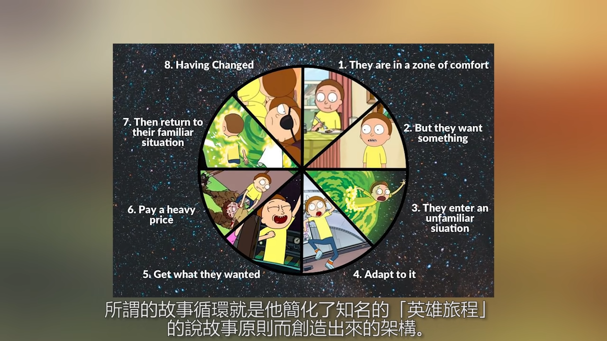

[BBC Learning English - Learn English, learning English, English videos, grammar, pronunciation, vocabulary, exams. Everything you need to help you learn English.](http://www.bbc.co.uk/learningenglish/)
[Learn English - Grammar, Vocabulary, Speaking, Exercises, Lessons.](https://www.myenglishpages.com/)
[Learn The 43 Sounds of American English Pronunciation — Pronuncian: American English Pronunciation](https://pronuncian.com/sounds)
[English As A Second Language - 7 E S L](https://7esl.com/)

[工業中英用語翻譯 -《中英對照》](http://www.aua.com.tw/translations/?f=zh-TW)

[Alliterative - YouTube](https://www.youtube.com/@Alliterative)
[British Education - YouTube](https://www.youtube.com/@britisheducation)
[CrazyEnglish - YouTube](https://www.youtube.com/@Crazy-English)
[English with Lucy - YouTube](https://www.youtube.com/@EnglishwithLucy)
[Rachel's English - YouTube](https://www.youtube.com/@rachelsenglish)
[RobWords - YouTube](https://www.youtube.com/@RobWords)
[Tom's Language Files - YouTube](https://www.youtube.com/playlist?list=PL96C35uN7xGLDEnHuhD7CTZES3KXFnwm0)
[wordsoftheworld - YouTube](https://www.youtube.com/@wordsoftheworld)
[哥倫布 Columbus - YouTube](https://www.youtube.com/@TheLittleColumbus)
[英文閱讀法-旋元佑 - YouTube](https://www.youtube.com/playlist?list=PLhvhy0dgLGeAFzCnlnd3sAp8drXZk4x4h)
[英语兔 - YouTube](https://www.youtube.com/@yingyutu)
[阿滴英文 - YouTube](https://www.youtube.com/@rayduenglish/playlists)
[英文學習技巧 - YouTube](https://www.youtube.com/playlist?list=PLG47EBGFEJNblUqd5nm2joeKlnRuKbY5H) 阿滴英文

[For Karen Chung's Courses and more](http://homepage.ntu.edu.tw/~karchung/)
[Mini-conversations: texts and audio](http://homepage.ntu.edu.tw/~karchung/miniconversations/MC.htm)
[戒掉爛英文文章列表｜商周](https://www.businessweekly.com.tw/OpinionArticle?DocNo=0000000004)

[Netspeak – Search for Words](http://www.netspeak.org/#examples)
[128 Words to Use Instead of "Very"](http://www.proofreadingservices.com/pages/very)

[John McWhorter on the Evolution of Language and Words on the Move | EconTalk | Library of Economics and Liberty](http://www.econtalk.org/archives/2017/08/john_mcwhorter.html)

[Separated by a Common Language](https://separatedbyacommonlanguage.blogspot.com/) Observations on British and American English by an American linguist in the UK
[Comparison of American and British English - Wikiwand](https://www.wikiwand.com/en/Comparison_of_American_and_British_English)

[The English Notes 英語學習筆記](http://the-english-notes.blogspot.com/)

[所有有關 ”家事 ”的英文 | Yahoo 知識+](https://hk.answers.yahoo.com/question/index?qid=20050823000012KK02832)
[蔬菜的英文名稱 (Common Chinese vegetable name in English) - 博學軒英語學習城 - udn 城市](http://city.udn.com/66782/4890552)
[金庸武俠小說重要詞彙英文翻譯 - 王琮瑋's ePortfolio](http://lms.ctl.cyut.edu.tw/9522040/doc/19528)

[口譯員的小秘密 遇到「翻譯不了的笑話」竟然會這麼做！ - YouTube](https://www.youtube.com/watch?v=dhlYd3oFd1E)

[VoiceTube《看影片學英語》70,000 部英文學習影片，每天更新](https://tw.voicetube.com)
[Learning a language? Speak it like you’re playing a video game | Marianna Pascal | TEDxPenangRoad - YouTube](https://www.youtube.com/watch?v=Ge7c7otG2mk) being able to communicate with low level of English
[如何用「回音法」學好英文口說 | 史嘉琳 Karen Chung | TEDxNTUST - YouTube](https://www.youtube.com/watch?v=sQEWEPIHLzQ)

## Adjectives

Order of multiple adjectives:

- order of number
- opinion
- size
- age
- shape
- color
- origin
- material
- purpose
- proper adjectives (European, Euclidean)

## Dict

[English Dictionary, Thesaurus, & grammar help | Oxford Dictionaries](https://en.oxforddictionaries.com/)
[Dictionary, Encyclopedia and Thesaurus - The Free Dictionary](http://www.thefreedictionary.com/)
[Thesaurus.plus - Online Thesaurus Dictionary of the English language](https://thesaurus.plus/)

## Abbreviations

[Abbreviations | Oxford Dictionaries](https://en.oxforddictionaries.com/grammar/spelling/abbreviations)
[Acronym vs. Abbreviation vs. Initialism | Reader's Digest](https://www.rd.com/article/acronym-vs-abbreviation-whats-the-difference/)

Acronyms are words formed from the initial letters of other words and pronounced as they are spelled, not as separate letters. NATO, NASA, ...

Initialisms are abbreviations which consist of the initial (i.e. first) letters of words and which are pronounced as separate letters when they are spoken. UK, USA, ...

Contractions are abbreviations in which letters from the middle of the word are omitted. Full stop is not needed for contractions with same endings of the original word (hrs, Mr, Dr). Dr, Ltd.

## Etymologies

[Etymology - Wikiwand](https://www.wikiwand.com/en/Etymology)

[Online Etymology Dictionary | Origin, history and meaning of English words](https://www.etymonline.com/)
[Word origins | OxfordWords blog](https://blog.oxforddictionaries.com/category/word-origins/)
[Mashed Radish – everyday etymology](https://mashedradish.com/)
[Glossophilia](http://www.glossophilia.org/)
[The Allusionist](http://www.theallusionist.org/)

## History of English

[History of the English language - Wikiwand](https://www.wikiwand.com/en/History_of_the_English_language)

English evolved from Proto-Indo-European language

Stems are created with several observed rules:

- Vowel Shifts
- Consonant Shifts
  g k h, d t s, u v w, m n l r, b p m f v
- [Verner's law - Wikiwand](https://www.wikiwand.com/en/Verner%27s_law)
- [Grimm's law - Wikiwand](https://www.wikiwand.com/en/Grimm%27s_law)
  Consonant Shifts for proto-germanic language
- [Grassmann's law - Wikiwand](https://www.wikiwand.com/en/Grassmann%27s_law)

[Language Evolution: How One Language Became Five Languages](https://www.wondriumdaily.com/language-evolution-one-language-became-five-languages/)
[Proto-Germanic and Germanic: Consonant Shifts and Vowel Changes](https://www.wondriumdaily.com/proto-germanic-and-germanic-consonant-shifts-and-vowel-changes/)
[The Great Vowel Shift: How We Know Language Now](https://www.wondriumdaily.com/the-great-vowel-shift-how-we-know-language-now/)
[The Processes of Sound Change](https://www.wondriumdaily.com/the-processes-of-sound-change/)

[The Latin words you don't know you're using - YouTube](https://www.youtube.com/watch?v=Lf9Q68DZlok)

- 0 AD Roman Times imported military Latin words
- 500 AD Anglo-Saxons imported religious Latin words and a new alphabet
- 1066 Norman Conquest imported many Latino-French words
  the Normans are descendent of Vikings living in Normandy, also influenced by Frank (a West Germanic language)
- 1485 The Renaissance imported more Latin words
- 1760 Industrial Revolution imported more Latin words

[Is English just badly pronounced French? - YouTube](https://www.youtube.com/watch?v=TUL29y0vJ8Q)
English originates from the [Angles](http://www.emersonkent.com/tribes_and_peoples/angles.htm) from Germany, hence Angle-lish. [Anglo-Saxons](https://www.wikiwand.com/en/Anglo-Saxons) arrived England in the 5th century. They unified England in the [Norman Conquest](https://www.wikiwand.com/en/Norman_conquest_of_England) lead by [William the Conqueror](https://www.wikiwand.com/en/William_the_Conqueror) in 1066. This is when the Old English became the Middle English.

[Is English really a Germanic language? - YouTube](https://www.youtube.com/watch?v=PCE4C9GvqI0)
English is mostly West Germanic, Viking's (Danes) conquest around 793 also bring in Old Norse (North Germanic) language to English
Proto-Germanic language undergone consonant shift under Grimm's law
Verbs do not have future tense
Number counts to twelve

This is the reason why the name of the animal and its meat are different. The animal is Anglelish, the meat is French.
French is used in in government, administration and the elites.

[ENGLISH. - YouTube](https://www.youtube.com/watch?v=atI-JPGcF-k)
[Tribes and Peoples in History A-C](http://www.emersonkent.com/tribes_and_peoples_in_history.htm)
[Why is English spelling so complicated? - YouTube](https://www.youtube.com/watch?v=VF5MGLRlXVw)

[CAPS Unlock - the history behind uppercase & lowercase letters - YouTube](https://www.youtube.com/watch?v=zO6r_Hqi0Ak)

[Audiobooks | The History of English Podcast](https://historyofenglishpodcast.com/audiobooks/)

## Vocabulary

[颠覆你对英语词汇的认知! - YouTube](https://www.youtube.com/watch?v=iyltEHRi39I)
[背单词秘诀: "格林定律"? - YouTube](https://www.youtube.com/watch?v=QmGSshmtitE)
[5 天就能記住 1 萬個單詞的方法，老師為什麽不教？用结果说话，因为结果不会骗人一套高效背单词的方法，单词记忆法。快速提高中考高考英语，四级六级考研雅思托福词汇量 - YouTube](https://www.youtube.com/watch?v=AFgZbU3AhlY) the order he gave was wrong,he used the modern English word as root, e.g.lun derived from moon, but the fact is the other way round
[Peaceful Night - YouTube](https://www.youtube.com/@peacefulnight)

sam sem sim syn sy sym syl: same
vit vis vid wis wit: seeing
ang eng ac ank ack anch: acute

## Morse code

> Morse code is Huffman coding before Huffman coding exists

[Morse code - Wikiwand](https://www.wikiwand.com/en/Morse%20code)

[Hello Morse | Experiments with Google](https://experiments.withgoogle.com/collection/morse)
[Morse - Learn](https://morse.withgoogle.com/learn/)
[Morse code on Gboard - Android Accessibility Help](https://support.google.com/accessibility/android/answer/9011881)
[如果听到这个声音一定要注意！教你看懂摩斯电码 - YouTube](https://www.youtube.com/watch?v=TZxwZiUPsgg)
[摩尔斯电码竟然可以用来降维打击，这是怎么回事？【科学火箭叔】 - YouTube](https://www.youtube.com/watch?v=g7rCtXcBF10)

[calvindn/morse-node: Morse code encoder / decoder.](https://github.com/calvindn/morse-node)
[neocotic/mor.js: Pure JavaScript library for encoding/decoding Morse code messages](https://github.com/neocotic/mor.js)

## Peculiarities

If you want to fixed some wrongdoing, do you want the amend the act or stick with it?

[Allusionist 17: Fix part I — The Allusionist](http://www.theallusionist.org/allusionist/fix-i)
[Allusionist 18: Fix part II — The Allusionist](http://www.theallusionist.org/allusionist/fix-ii)

[What are the trickiest rules in English grammar pertaining to commonly used words? - Quora](https://www.quora.com/English-Grammar/What-are-the-trickiest-rules-in-English-grammar-pertaining-to-commonly-used-words) collocation

Contranym: a word with two opposite meanings, e.g. sanction (which can mean both ‘a penalty for disobeying a law’ and ‘official permission or approval for an action’).
[Auto-antonym - Wikiwand](https://www.wikiwand.com/en/Auto-antonym)
[75 Contronyms (Words with Contradictory Meanings)](https://www.dailywritingtips.com/75-contronyms-words-with-contradictory-meanings/)

[One Sentence With 7 Meanings Unlocks a Mystery of Human Speech | WIRED](https://www.wired.com/story/one-sentence-with-7-meanings-unlocks-a-mystery-of-human-speech/)
["I never said she stole my money" has 7 Different Meanings - Fact-inator](http://factinator.com/i-never-said-she-stole-my-money/)

RobWords
[This ruined English spelling - YouTube](https://www.youtube.com/watch?v=fmL6FClRC_s) The Great Vowel Shift (~15-18th century, coinciding with the transition ofj Middle English to Modern English and Gutenberg's printing press technology)
[The invention that broke English spelling - YouTube](https://www.youtube.com/watch?v=Syp1DVQgN_g) Gutenberg's printing press forces English words to have a spelling
[The weirdest things about English - YouTube](https://www.youtube.com/watch?v=6lhxxiqqlQY)
[Words we've ruined. - YouTube](https://www.youtube.com/watch?v=CVbCY51iz1k) skunked/bleached words
[Thorough, thought, cough, furlough... Why so many ways of pronouncing OUGH in English? - YouTube](https://www.youtube.com/watch?v=JkdcYYduUeM)

[The english language is a giant meme.. - YouTube](https://www.youtube.com/watch?v=65CFesU4KVQ)

## Readability

[Flesch–Kincaid readability tests - Wikipedia, the free encyclopedia](http://en.wikipedia.org/wiki/Flesch%E2%80%93Kincaid_readability_tests)

- Flesch Reading Ease Score (FRES)
- Flesch–Kincaid Grade Level Score

[Readability handbook: Get started with ReadablePro – readable.io](https://readable.io/readability-handbook/)
[Write Better Stories with this Python Tool - Towards Data Science](https://towardsdatascience.com/write-better-stories-with-this-python-tool-ad1371158822)

[What makes writing more readable?](https://pudding.cool/2022/02/plain/)
[Plain language - Wikiwand](https://www.wikiwand.com/en/Plain_language)
[Basic English - Wikiwand](https://www.wikiwand.com/en/Basic_English)

## Learning

[English Language Centre Study Zone: Welcome!](https://web2.uvcs.uvic.ca/courses/elc/studyzone/)
[ELC Study Zone: All Grammar Topics](https://web2.uvcs.uvic.ca/courses/elc/studyzone/grammar.htm)

[Learn English Online | British Council](http://learnenglish.britishcouncil.org/)
[Online courses from British Council](https://www.futurelearn.com/partners/british-council)

[Vocabulary tester](http://readability.mackayst.com/vtest)

[What works the best when learning a new language? - Quora](http://www.quora.com/What-works-the-best-when-learning-a-new-language)

### Grammar

[Grammar | Lexico](https://www.lexico.com/en/grammar) = Oxford Dictionaries
[Grammarist - English grammar, usage, and style blog](http://grammarist.com/)
[Learning English Online - GrammarBank](https://www.grammarbank.com/)
[English Grammar | British Council](http://learnenglish.britishcouncil.org/grammar)
[Grammar Archives - Thesaurus.com](https://www.thesaurus.com/e/grammar/)

[Grammar Checker | Grammarly](https://www.grammarly.com/)
[Open source alternatives to Grammarly for word processing | Opensource.com](https://opensource.com/article/20/3/open-source-writing-tools)

[DeepL Translate: The world's most accurate translator](https://www.deepl.com/en/translator)
[DeepL Write: AI-powered writing companion](https://www.deepl.com/write)

[语法 - YouTube](https://www.youtube.com/playlist?list=PLiRHe7F8P0-0ykWSiVY9Ia431TB-HzQm0) 英语兔
[一个视频说清整个英语语法体系(重塑你的语法认知框架) - YouTube](https://www.youtube.com/watch?v=is7vn5URVcc) !important
[非谓语动词详解: 不定式, 动名词, 现在分词, 过去分词 - YouTube](https://www.youtube.com/watch?v=LhbZ4TAjgUo)
[英语"虚拟语气"就是这么简单(看完就懂!) - YouTube](https://www.youtube.com/watch?v=-Skm12wNLa8)
[英语核心语法概念 | 英语兔](https://www.yingyutu.com/hxyf)
[英语介词攻略 (看完就懂) - YouTube](https://www.youtube.com/watch?v=VcZglLpFlRs)

[阿滴教文法 - YouTube](https://www.youtube.com/playlist?list=PLG47EBGFEJNZ7X_-UAd0S3gU5igZxbjws) 阿滴英文
[英文文法 Grammar - YouTube](https://www.youtube.com/playlist?list=PLRSK1pOZNZyZgPZFtCaUbHau8AvSxDoH2) 瑪姬英文 English with Maggie
[不用背規則!? 這支影片會讓你對英文文法改觀! feat. 旋元佑老師 - YouTube](https://www.youtube.com/watch?v=bou9Ij7jRUE)
[English Tenses - Grammar Lessons - YouTube](https://www.youtube.com/playlist?list=PLD_5T89Ssbn0I5-Sxx7NM62gd-DBRmADa)

[English Grammar: What are the trickiest rules in English grammar pertaining to commonly used words? - Quora](http://www.quora.com/English-Grammar/What-are-the-trickiest-rules-in-English-grammar-pertaining-to-commonly-used-words/answer/Daniel-Mokrauer-Madden/comment/1941285)
[Dear Pedants: Your Fave Grammar Rule is Probably Fake | JSTOR Daily](http://daily.jstor.org/grammar-rule-is-probably-fake/)
[Grammar rules you can stop sticking to - YouTube](https://www.youtube.com/watch?v=BccyQaNKXz8)

Facts, generalizations and rules:

- use simple present tense
- use plurals

Part of speech
Phrases
Clauses (main and subordinate)
Connectives can be conjunctions, prepositions or adverbs.

### Tense

Tense is a combination of time and aspect (<https://youtu.be/is7vn5URVcc?t=1065>).
[英语语法: 16 种时态终极详解 - YouTube](https://www.youtube.com/watch?v=P5FrIGgyNSc)
[12 時態懶人包！簡單式/進行式/完成式/完成進行式全部一起搞懂！英文文法大解析！ - YouTube](https://www.youtube.com/watch?v=tw9KEQLokjo)

| Time                                      | Aspect             |
| ----------------------------------------- | ------------------ |
| Present                                   | (Non-specific)     |
| Past                                      | Perfect            |
| Future                                    | Continuous         |
| Past Future (from some point in the past) | Perfect Continuous |

I am taking/I am going to take: schedule
I will take: recent decision

Preset
Present Perfect: WHAT happened before affecting now
Present Perfect Continuous: WHAT happened before affecting now, _may_ imply change
Past: TIME, need to specify TIME
Past Continuous: EVENT during other past ACTION, need to specify TIME
Past Perfect: WHAT before a past TIME affecting the past TIME, need to specify the past TIME
Future Perfect: WHAT before a future TIME affecting the future TIME, need to specify the future TIME
Perfect Continuous: continuous to a certain point a in time, can be replaced by Perfect tense if the time period is included

[Participles | Lexico](https://www.lexico.com/en/grammar/participles)
[Past Participle | Definition of Past Participle by Lexico](https://www.lexico.com/en/definition/past_participle)
form of verb used for perfect and passive tenses
[Bored 還是 Boring? 10分鐘搞懂「分詞形容詞」 ft. 瑀熙【阿滴文法家教班】 - YouTube](https://www.youtube.com/watch?v=H5boqo2XfPo)

[Verb Tenses Chart - GrammarBank](https://www.grammarbank.com/verb-tenses.html)
[What Are Active And Passive Verbs? | Lexico](https://www.lexico.com/en/grammar/active-and-passive-verbs)

### Prepositions

[TO 跟 FOR 用法差在哪？要怎麼選？ - YouTube](https://www.youtube.com/watch?v=Hzl-Twy159w)

### Style

[The Elements of Style](http://www.crockford.com/wrrrld/style.html)
[3 shell scripts: Kill weasel words, avoid the passive, eliminate duplicates](http://matt.might.net/articles/shell-scripts-for-passive-voice-weasel-words-duplicates/)
[btford/write-good](https://github.com/btford/write-good)

[How to use a semicolon - Emma Bryce - YouTube](https://www.youtube.com/watch?v=th-zyfvwDdI)

[Linguistics, Style and Writing in the 21st Century - with Steven Pinker - YouTube](https://www.youtube.com/watch?v=OV5J6BfToSw)
[The Sense of Style: The Thinking Person's Guide to Writing in the 21st Century - Kindle edition by Pinker, Steven. Reference Kindle eBooks @ Amazon.com.](https://www.amazon.com/Sense-Style-Thinking-Persons-Writing-ebook/dp/B00INIYG74/)pho
[Steven Pinker: Linguistics as a Window to Understanding the Brain | Big Think - YouTube](https://www.youtube.com/watch?v=Q-B_ONJIEcE))

- language is an app that turns a web of thought (the sematic web) into a string of words
- classic style
  let the reader see what the writer understands about the reality
  reader and writer are equal
  style is conversational
  better to be clear and possibly wrong, than muddy and "not even wrong"
  narrative: agents perform actions that affect objects; avoids normalization/zombie nouns (turning verbs into nouns)
  empathize with your reader
- contemplative style
- oracular style
- practical style
- postmodern/self-conscious style
  used by academics
  escape being convicted of philosophical naivete about his enterprise

### Punctuation

[Punctuation | Lexico](https://www.lexico.com/en/grammar/punctuation)

[What Are Inverted Commas? | Lexico](https://www.lexico.com/en/grammar/inverted-commas-quotation-marks)

General rule: "1, 2 and 3"

[What is the Oxford Comma (or Serial Comma)? | Grammarly](https://www.grammarly.com/blog/what-is-the-oxford-comma-and-why-do-people-care-so-much-about-it/)
Oxford comma (helps in case where there is an "and" in the last item and disambiguates non-defining relative clause):
"apple, orange, fish and chips" vs "apple, orange, fish, and chips" (Oxford comma)

Hyphen for words
en-dash for numbers, need space in between
em-dash used like colon to introduce list, or comma to separate out indefinite relative clause (no space in between)

[What Is an En Dash and When to Use It? Thesaurus.com](https://www.thesaurus.com/e/grammar/how-do-i-use-an-en-dash/)
[What Is An Em Dash And How Do You Use It? | Thesaurus.com](https://www.thesaurus.com/e/grammar/em-dash/)
[Em Dash: When Should I Use It? | Grammarly](https://www.grammarly.com/blog/why-you-should-love-the-em-dash/)
[How To Use An Em Dash (—) | Lexico](https://www.lexico.com/grammar/dash-and-em-dash)

### 五大句型

[五大句型及動詞種類介紹 - YouTube](https://www.youtube.com/watch?v=5AC6wet6vB8)

[一次搞懂英文的「五大句型」（7 分鐘懶人包） - YouTube](https://www.youtube.com/watch?v=HboNGK7ipKQ)
[5 分鐘搞懂「及物動詞」跟「不及物動詞」！ - YouTube](https://www.youtube.com/watch?v=dNJZTvTqKb4)

1. S + V
   Peter cooked.
2. S + V + O
   Peter cooked a steak.
3. S + V + IO (Indirect Object) + DO (Direct Object)
   Peter cooked Mary a steak.
4. S + V + C (Complement)
   Peter is happy.
5. S + V + O + OC (Object Complement)
   Peter makes Mary happy.
   Peter considers Mary a good friend.

## IELTS

[IELTS - The International English Language Testing System | Take IELTS](https://takeielts.britishcouncil.org/)
[IELTS Exam Library | IELTS Online Tests](https://ieltsonlinetests.com/ielts-exam-library)

## Doge Grammar

[Doge (meme) - Wikiwand](<https://www.wikiwand.com/en/Doge_(meme)>)

[A Linguist Explains the Grammar of Doge. Wow. - The Toast](http://the-toast.net/2014/02/06/linguist-explains-grammar-doge-wow/)
[How to speak Doge – Scientific Scribbles](https://blogs.unimelb.edu.au/sciencecommunication/2016/10/22/how-to-speak-doge/)
[The Curious Linguistics of the Doge in the Internet | The League of Nerds](http://asktheleagueofnerds.com/doge/)

## Euphemism

[Doublespeak - Wikiwand](https://www.wikiwand.com/en/Doublespeak)
[DoubleSpeak, How to Lie without Lying - YouTube](https://www.youtube.com/watch?v=qP07oyFTRXc)

## Story Writing

[Hero's journey - Wikiwand](https://www.wikiwand.com/en/Hero%27s_journey)
[Hero's Journey 101: Definition and Step-by-Step Guide (With Checklist!)](https://blog.reedsy.com/heros-journey/)
[The Hero's Journey - Mythic Structure of Joseph Campbell's Monomyth](http://www.movieoutline.com/articles/the-hero-journey-mythic-structure-of-joseph-campbell-monomyth.html)
[The Stages of the Hero's Journey](https://www.tlu.ee/~rajaleid/montaazh/Hero%27s%20Journey%20Arch.pdf)

[Hello Future Me - YouTube](https://www.youtube.com/@HelloFutureMe)

## On Writing Technical report

[Writing help | Oxford Dictionaries](https://en.oxforddictionaries.com/grammar/writing-help)
[How to Make Writing a Lot Easier | Forge](https://forge.medium.com/how-to-write-10-000-words-a-week-a7c63d97ea79)

4W: Who, Why, What, When
4C: Clear, Concise, Constructive, Correct

1. intro
2. purpose
3. content
4. conclusion

be quantitative (use figures, with decent source)

favor active over passive voice, except for:

- concealing the subject (confidential, don't know or don't want to specify)
- things are done passively (e.g.: authenticate)
- the done-to is the focus of the sentence

[Advice for Technical Writing | CSS-Tricks](https://css-tricks.com/advice-for-technical-writing/)
[The developer's guide to content creation with Stephanie Morillo (Changelog Interviews #382)](https://changelog.com/podcast/382)

## Phonics

[Phonemic Chart - English with Lucy](https://englishwithlucy.com/phonemic-chart/)

[音标 - YouTube](https://www.youtube.com/playlist?list=PLiRHe7F8P0-2wRRzK6nzriMTXyfRwKEG6) 英语兔
[英语最重要的音标体系(DJ, KK, 韦氏, AHD...) - YouTube](https://www.youtube.com/watch?v=vRnRZ4umJxw)

[English phonology - Wikiwand](https://www.wikiwand.com/en/English_phonology)
[DJ 音標 - Wikiwand](https://www.wikiwand.com/zh/DJ%E9%9F%B3%E6%A8%99) adopts IPA for received pronunciation
[KK 音標 - Wikiwand](https://www.wikiwand.com/zh/KK%E9%9F%B3%E6%A8%99) adopts IPA for American English
[International Phonetic Alphabet - Wikiwand](https://www.wikiwand.com/en/International_Phonetic_Alphabet)

[Why Are A, E, I, O, U, And Y Called "Vowels"? - Dictionary.com](https://www.dictionary.com/e/vowels/)
[The 44 Phonemes in English](https://www.dyslexia-reading-well.com/44-phonemes-in-english.html)
[The 44 Sounds of English](https://www.dvusd.org/cms/lib/AZ01901092/Centricity/Domain/3795/Sound_Spelling_Chart.pdf) PDF
[How Many Vowel Sounds Does English Have?](https://www.babbel.com/en/magazine/english-vowel-sounds)
[Oral English: Easy Ways to Pronounce the 24 English Consonants and 20 English Vowels](https://www.tammysenglishblog.com/2019/04/oral-english-easy-way-to-pronounce-24.html)

[你有被說中嗎？10 個有「中央母音省略」的字！（Schwa Elision) - YouTube](https://www.youtube.com/watch?v=8A-kREVTnHE)

[语音技巧 - YouTube](https://www.youtube.com/playlist?list=PLiRHe7F8P0-2Ll7FFuXyDDuODk3sEX5VP) 英语兔

[Basic Spelling Rules Explained - Dictionary.com](https://www.dictionary.com/e/spelling-rules/)

[Harvard sentences - Wikiwand](https://www.wikiwand.com/en/Harvard_sentences)
[https://www.cs.columbia.edu/~hgs/audio/harvard.html](https://www.cs.columbia.edu/~hgs/audio/harvard.html)
[www.cs.cmu.edu/afs/cs.cmu.edu/project/fgdata/OldFiles/Recorder.app/utterances/Type1/harvsents.txt](http://www.cs.cmu.edu/afs/cs.cmu.edu/project/fgdata/OldFiles/Recorder.app/utterances/Type1/harvsents.txt)

[小马外语 - 化学工业出版社有限公司](http://qr.cip.com.cn/html/qrcode/xiaoma/more/more.html)
[图解小学生英语音标入门](http://qr.cip.com.cn/html/qrcode/xiaoma/38877/38877.html)
[图解英语音标速记 1000 小学单词](http://qr.cip.com.cn/html/qrcode/xiaoma/36546/36546.html)
[图解自然拼读速记 1000 小学单词](http://qr.cip.com.cn/html/qrcode/xiaoma/36548/36548.html)

## Ambigrams

Writings that is the same right-side up and upside down or normal and reflected in a mirror.

[Write Words - Make Magic - YouTube](https://www.youtube.com/@WriteWordsMakeMagic) English
