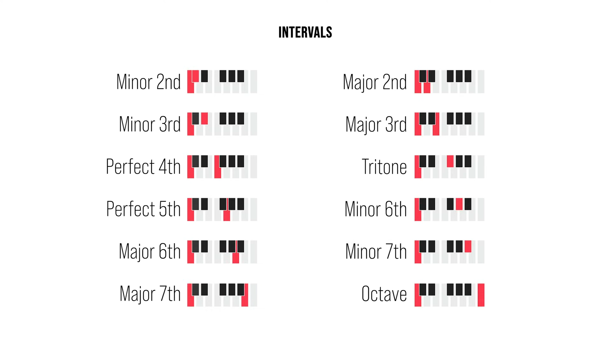

[Music theory - Wikiwand](https://www.wikiwand.com/en/Music_theory)
[樂理 - Wikiwand](https://www.wikiwand.com/zh/%E6%A8%82%E7%90%86)

[musictheory.net - Lessons](http://www.musictheory.net/lessons) ❗!important
[How Music Works : Overview : How Music Works](http://www.howmusicworks.org/)
[Musical U: Become More Musical](https://www.musical-u.com/)
[1. Music Theory Fundamentals -- LearnMusicTheory.net](http://learnmusictheory.net/lmtnet/fundamentals/)
[Thomann Online Guides - Thomann UK](https://www.thomann.de/gb/onlineexpert.html)

[音樂家的無聊人生 Musician Seacow - YouTube](https://www.youtube.com/@musicianseacow)
[笑哈哈 LOL - YouTube](https://www.youtube.com/channel/UCl42iEuQpjTWzzheHM5SOgg)
[薛汀哲 - YouTube](https://www.youtube.com/@user-fl1pi9od2x)
[Animenz Piano Sheets - YouTube](https://www.youtube.com/user/Animenzzz)
[Chloe's Music Classroom - YouTube](https://www.youtube.com/channel/UCgimPr3oAwVX_jRhVj44SNQ)
[叨叨冯聊音乐 - YouTube](https://www.youtube.com/@daodaofeng)

[Brad Harrison Music - YouTube](https://www.youtube.com/@BradHarrison)
[Classical Covers - YouTube](https://www.youtube.com/@ClassicalCovers)
[Montechait - YouTube](https://www.youtube.com/@Montechait)
[David Bennett Piano - YouTube](https://www.youtube.com/@DavidBennettPiano)
[Matthew Cawood - YouTube](https://www.youtube.com/@matticawood)
[Tantacrul - YouTube](https://www.youtube.com/@Tantacrul)

[NiceChord (好和弦) - YouTube](https://www.youtube.com/@nicechordwiwi)
[五線譜：一次搞懂所有你該知道的、基本的事情。 - YouTube](https://www.youtube.com/watch?v=qkt5X_4FJBY)
[NiceChord 好和弦 - 不可不知的基礎樂理 - YouTube](https://www.youtube.com/playlist?list=PLmVjZfPp5kiNVtlRBphjzBUIH_Xa15h08)
[NiceChord 好和弦 - 調式基礎 - YouTube](https://www.youtube.com/playlist?list=PLmVjZfPp5kiOBXB0O5366xQC0jyHCM6-B)
[NiceChord 好和弦 - 音律的故事系列 - YouTube](https://www.youtube.com/playlist?list=PLmVjZfPp5kiMijHD7EEsNLV96uAOocDvD)

[Sonata - Wikiwand](https://www.wikiwand.com/en/Sonata)
[奏鳴曲 - Wikiwand](https://www.wikiwand.com/zh/%E5%A5%8F%E9%B8%A3%E6%9B%B2)
[Cantata - Wikiwand](https://www.wikiwand.com/en/Cantata)
[清唱套曲 - Wikiwand](https://www.wikiwand.com/zh/%E6%B8%85%E5%94%B1%E5%A5%97%E6%9B%B2)

[The Music Theory Iceberg Explained - YouTube](https://www.youtube.com/watch?v=NmeogiNhdHI)
[Music theory concepts ranked by importance - YouTube](https://www.youtube.com/watch?v=ItsMmqTOgKo)
[Complete Piano Theory Course: Chords, Intervals, Scales & More! - YouTube](https://www.youtube.com/watch?v=Ud9CpGOG1GE)
[Music Theory ~ Review Video (AP and Undergraduate) - YouTube](https://www.youtube.com/watch?v=QAGUWiVC1ys)
[Music Theory videos - YouTube](https://www.youtube.com/playlist?list=PLDaNGknQ_wTh3eXyjB0smdEYSvqa-wJ1_) Brad Harrison Music
[Music Theory For Producers (This Is All You Need) - YouTube](https://www.youtube.com/watch?v=KlAqx_8_7vU)
[music theory is easy. - YouTube](https://www.youtube.com/watch?v=OtBqDgOsW1c)
[Music theory you actually need, none of the sh\*t you don’t - YouTube](https://www.youtube.com/watch?v=2NWp7tC-9Hk)

[samuraiguitarist - YouTube](https://www.youtube.com/@samuraiguitarist)
[MUSIC THEORY for guitar - YouTube](https://www.youtube.com/watch?v=o-qNepGpI3U)

[Pianote - YouTube](https://www.youtube.com/@PianoteOfficial)
[A Beginner's Guide To Music Theory (Everything You Need To Know) - YouTube](https://www.youtube.com/watch?v=6CFP9DF706s)
[Beginner Piano Lessons - YouTube](https://www.youtube.com/playlist?list=PLfM8ivjJ-rKXL-qnJ3UPEjOHfOtLRjlIH)
[Play Any Song By Ear in 3 Simple Steps (Piano Lesson) - YouTube](https://www.youtube.com/watch?v=bKFRBmG0aTQ)

Melodic intervals: play notes sequentially
Harmonic intervals: play notes simultaneously

[ANDREW HUANG - YouTube](https://www.youtube.com/channel/UCdcemy56JtVTrsFIOoqvV8g)
[Learn music theory in half an hour. - YouTube](https://www.youtube.com/watch?v=rgaTLrZGlk0)

[音乐常识补充（一）](https://www.douban.com/note/322287138/)

[Benedetti's Puzzle (mathematically impossible music) - YouTube](https://www.youtube.com/watch?v=TYhPAbsIqA8)
[Benedetti's Puzzle SOLVED (response to Adam Neely) - YouTube](https://www.youtube.com/watch?v=wUwC4syOX1s)

[[音樂辭典] 不囉唆的音樂名詞查詢器 by NiceChord](https://nicechord.com/terms/)
[Why do we use Italian words in music notation? - Classic FM](http://www.classicfm.com/discover-music/music-theory/why-italian-words-in-music-notation/)

- forte
- rallentando
- canto

[自然音階 - Wikiwand](https://www.wikiwand.com/zh/%E8%87%AA%E7%84%B6%E9%9F%B3%E9%98%B6)
[半音階如何改變世界? 從莫札特、蕭邦、到華格納 - YouTube](https://www.youtube.com/watch?v=QTVIAxtSrCI)
[史上最精彩的歌劇「崔斯坦與伊索德」，如何用「半音階」描繪慾望? - YouTube](https://www.youtube.com/watch?v=80V6gPZuqfo)

[專家帶你聽懂音樂！挑戰同一首歌彈出 18 種「情緒」｜科普長知識｜ GQ Taiwan - YouTube](https://www.youtube.com/watch?v=kVqDM3U0L10)
[钢琴笑了！火爆全球的《鱿鱼游戏》恐怖 BGM 怎么弹？ - YouTube](https://youtu.be/BEd3aluF7ts?t=257) 34, 17 陰森恐佈

[零门槛音乐科普 - YouTube](https://www.youtube.com/playlist?list=PLQq7J6Cy_RKERRtnVBu_upLUm8pTVDEb7)
[如何快速分辨歌曲的风格？10 分钟让你学会！你能通过片尾的测试吗？ - YouTube](https://www.youtube.com/watch?v=STZuJbAfr-g)
[零基础自弹自唱入门指南！10 分钟学会给流行歌曲配和弦、配伴奏！ - YouTube](https://www.youtube.com/watch?v=cLESaZyDKlU)

[如何自己在家裡訓練音感？ - YouTube](https://www.youtube.com/watch?v=2ueyqx4rDCM)
[管弦樂器懶人包：一部影片就認識最常見的管弦樂團樂器！ - YouTube](https://www.youtube.com/watch?v=7ZDGgmN8atM)

[為什麼手碰到喇叭線會有「Bb」的音高？ - YouTube](https://www.youtube.com/watch?v=piVOMDyYZb4)

## Notes/Scale

[Modes: What are they and how do I use them? - Classic FM](https://www.classicfm.com/discover-music/latest/guide-to-musical-modes/)

[Music And Measure Theory - YouTube](https://www.youtube.com/watch?v=cyW5z-M2yzw)

[Why are there 12 different notes? - YouTube](https://www.youtube.com/watch?v=NgW3zUWVWnI) ❗!important
Just Intonation (using overtone's ratios, only work for the starting note) => Pythagorean Tuning (Perfect fifths, rounding error) => Equal temperament
[Understanding Musical Scales: Pentatonic, Diatonic, Chromatic - YouTube](https://www.youtube.com/watch?v=sfLn0DIfCdI) ❗!important

David Bennett Piano
[Why is there no B# or E# note on the piano? - YouTube](https://www.youtube.com/watch?v=lN54Y73LlLo)
[Why pianos and guitars aren’t really in tune (just intonation vs 12TET) - YouTube](https://www.youtube.com/watch?v=7JhVcGtT8z4)

Pentatonic Scale: 12356 on C major, only full steps, one of the oldest scale

[Musical Scales and Modes - Online Piano & Music Notes](https://pulse.berklee.edu/?id=4&lesson=73)

### 音名/唱名

[音名 - Wikiwand](https://www.wikiwand.com/zh/%E9%9F%B3%E5%90%8D)
[Key signature names and translations - Wikiwand](https://www.wikiwand.com/en/Key_signature_names_and_translations)
[Solfège - Wikiwand](https://www.wikiwand.com/en/Solf%C3%A8ge)
[唱名 - Wikiwand](https://www.wikiwand.com/zh/%E5%94%B1%E5%90%8D)
音名 corresponds to a note at specific frequency
唱名 is am alias given to the n-th note in the scale

|      |     |     |     |     |     |     |     |
| ---- | --- | --- | --- | --- | --- | --- | --- |
| 音名 | C   | D   | E   | F   | G   | A   | B   |
| 唱名 | do  | re  | mi  | fa  | sol | la  | ti  |
|      | 宮  | 商  | 角  |     | 徵  | 羽  |     |

For chromatic scale:
Do, Di, Re, Ri, Mi, Fa, Fi, Sol, Si, La, Li, Ti

[为什么 do re mi fa so la si 是 CDEFGAB 而不是 ABCDEFG？](https://www.douban.com/note/214307171/)
[Why C?: The Convoluted History of Note Names - YouTube](https://www.youtube.com/watch?v=NRDwrKMan_Q)

### Harmonic series

[The most mind-blowing concept in music (Harmonic Series) - YouTube](https://www.youtube.com/watch?v=Wx_kugSemfY) also on tuning and temperament
[Harmonic series (music) - Wikiwand](<https://www.wikiwand.com/en/Harmonic_series_(music)>)
All notes we hear are mixture of harmonic series of the fundamental tone (first harmonic)
Different strength of the harmonics is the cause of timbre in different instruments
This is how digital synthesizers mimics different instruments

### Math and Music

```katex
$$
f = \frac{V}{\lambda} = \frac{1}{2L}\sqrt{\frac{T}{\rho}}
$$
```

where:

- $L$ is the length of string
- $T$ is tension of string
- $\rho$ is density of string

[Guitar Mathematics | Passy's World of Mathematics](http://passyworldofmathematics.com/guitar-mathematics/)
[From Math to Music - A Mathematical Approach to Learning The Fretboard](http://www.guitarnoise.com/lesson/from-math-to-music/)

[kennethreitz/pytheory: Music Theory for Humans.](https://github.com/kennethreitz/pytheory)

[A = 432Hz - YouTube](https://www.youtube.com/watch?v=EKTZ151yLnk)
[Scientific pitch - Wikiwand](https://www.wikiwand.com/en/Scientific_pitch)
[【漫士】音乐动听的背后，藏着怎样的数学密码？ - YouTube](https://www.youtube.com/watch?v=86y0gZnxuWE)

[Piano key frequencies - Wikiwand](https://www.wikiwand.com/en/Piano_key_frequencies)

### Just intonation

[Just intonation - Wikiwand](https://www.wikiwand.com/en/Just_intonation) based on rational ratio of base frequency (harmonic series)
[纯律 - Wikiwand](https://www.wikiwand.com/zh/%E7%BA%AF%E5%BE%8B)

### Intervals

[Interval (music) - Wikiwand](<https://www.wikiwand.com/en/Interval_(music)>)
[The Ultimate Guide to Interval Ear Training](https://www.musical-u.com/learn/ultimate-guide-to-interval-ear-training/)
[Stichting Huygens-Fokker: List of intervals](https://www.huygens-fokker.org/docs/intervals.html)

The distance between notes is called interval, counted in steps (whole, W) and half-steps (H) (in British: tone (T) and semitone (S)).
A cent is 1/100 of a semitone.

Remember to include the start note when counting:

- C and D has an interval of a 2nd (1 tone)
- C and G has an interval of a 5th (3.5 tone)

[Songs that will help you identify ascending intervals - YouTube](https://www.youtube.com/watch?v=PhDIm_2qS5s)
[Ear Training and Sight Singing: The Superpower you get from Music School - YouTube](https://www.youtube.com/watch?v=Ed2VUq9cu1I)



Interval is highly related to solfège
Minor 2nd (half step), Jaws
Major 2nd, do-re
Major 3rd, doorbell, do-mi
Perfect 4th, Wagner's Bridal Chorus, Star Wars, do-fa
Tritone, The Simpsons (The Sim)
Perfect 5th, Superman

[Perfect fifth - Wikiwand](https://www.wikiwand.com/en/Perfect_fifth) 纯五度, 7 semitones, 3:2 ratio
Perfect forth, 4:3 ratio

### Tuning

[Musical tuning - Wikiwand](https://www.wikiwand.com/en/Musical%20tuning#Tuning_systems)
[Musical temperament - Wikiwand](https://www.wikiwand.com/en/Musical_temperament) compromises on the pure intervals of just intonation for instrument tuning

[重制版：音乐也有科学道理吗？Do、Re、Mi...都是如何确定的？李永乐老师讲音律 - YouTube](https://www.youtube.com/watch?v=v5QlocAclXY)
frequency (pitch) rations 2:1, 3:2, 4:3 sound good to human
doubling the frequency is called an octave, there are several ways to create notes (scale) within an octave
ISO picked 440Hz as the frequency of middle A

[Noyce Guitars: Technotes: Equal Temperament & Guitar Tuning](http://www.noyceguitars.com/Technotes/Articles/T4.html)
[Testing 432 Hz Frequencies (and temperaments) - YouTube](https://www.youtube.com/watch?v=ghUs-84NAAU)

Other attempts to fix Pythagorean Tuning
[Meantone temperament - Wikiwand](https://www.wikiwand.com/en/Meantone_temperament)
[Well temperament - Wikiwand](https://www.wikiwand.com/en/articles/Well%20temperament)

### 五度相生法/Pythagorean tuning

[五度相生律 - Wikiwand](https://www.wikiwand.com/zh/%E4%BA%94%E5%BA%A6%E7%9B%B8%E7%94%9F%E5%BE%8B)
[Pythagorean tun ing - Wikiwand](https://www.wikiwand.com/en/Pythagorean_tuning)
based on ratio of 3:2 ("pure" perfect fifths)

[How Pythagoras Broke Music (and how we kind of fixed it) - YouTube](https://www.youtube.com/watch?v=EdYzqLgMmgk)
[Pythagorean Tuning - YouTube](https://www.youtube.com/watch?v=jFHa3is2ibw)

- start with base note (220Hz)
- multiply by fifths (\* 3/2)
- lower by an octave is if it is higher than one (\* 1/2)
- requires the Pythagoras comma for correction every 12 notes (7 octaves)

[中國五聲音階 - Wikiwand](https://www.wikiwand.com/zh/%E4%B8%AD%E5%9C%8B%E4%BA%94%E8%81%B2%E9%9F%B3%E9%9A%8E)
宮商角徵羽 Do Re Mi Sol La

### 三分損益法

[十二律 - Wikiwand](https://www.wikiwand.com/zh/%E5%8D%81%E4%BA%8C%E5%BE%8B) 管仲
[Shí-èr-lǜ - Wikiwand](https://www.wikiwand.com/en/Sh%C3%AD-%C3%A8r-l%C7%9C)

[三分损益法\_百度百科](https://baike.baidu.com/item/%E4%B8%89%E5%88%86%E6%8D%9F%E7%9B%8A%E6%B3%95)
[三分損益\_古音律的形成與宮商角徵羽 - YouTube](https://www.youtube.com/watch?v=JkSL5mtrGI4)

### 十二平均律/Equal temperament/Chromatic Scale

Geometric mean, keeping ratios of neighbor notes constant (one semitone)
This is more instrument friendly

Chromatic Scale: All 12 piano keys from C to C (an octave)
C C♯/D♭ D D♯/E♭ E F F♯/G♭ G G♯/A♭ A A♯/B♭ B/C♭ C
[Chromatic scale - Wikiwand](https://www.wikiwand.com/en/Chromatic_scale)

[Equal temperament - Wikiwand](https://www.wikiwand.com/en/Equal_temperament)
[十二平均律 - Wikiwand](https://www.wikiwand.com/zh/%E5%8D%81%E4%BA%8C%E5%B9%B3%E5%9D%87%E5%BE%8B) 朱載堉
[Why Does Music Only Use 12 Different Notes? - YouTube](https://www.youtube.com/watch?v=lvmzgVtZtUQ)
[Why It's Impossible to Tune a Piano - YouTube](https://www.youtube.com/watch?v=1Hqm0dYKUx4)

### Major and Minor Scale

A Scale begins and ends with the same note, with a regular pattern of steps.

Major Scale: TTSTTTS 全全半全全全半
C Major: C D E F G A B C (all white keys)
C is the **keynote**/**tonic** of the scale
C is 1st degree, D is 2nd degree...

Minor Scale: TSTTSTT 全半全全半全全
A Major: A B C D E F G A (all white keys)

Relative Major and Minor: the scales uses exactly the same notes (thus having the same number of sharp and flats), but different tonic.

#### Mnemonic

Refer to the number of sharps and flats to add in the Circle of fifths
[Circle of fifths - Wikiwand](https://www.wikiwand.com/en/Circle_of_fifths)
[The Circle of Fifths Explained | LedgerNote](https://ledgernote.com/columns/music-theory/circle-of-fifths-explained/)
[The Ultimate Guide to the Circle of Fifths - Musical U](https://www.musical-u.com/learn/how-to-use-circle-fifths/)
[樂理教學：調號怎麼看？如何快速記住調號？ - Susanna Leung Piano Studio](https://www.susannaleungpiano.com/%E6%A8%82%E7%90%86%E6%95%99%E5%AD%B8%EF%BC%9A%E8%AA%BF%E8%99%9F%E6%80%8E%E9%BA%BC%E7%9C%8B%EF%BC%9F%E5%A6%82%E4%BD%95%E5%BF%AB%E9%80%9F%E8%A8%98%E4%BD%8F%E8%AA%BF%E8%99%9F%EF%BC%9F/)

[Circle of Fifths: Everything You Need to Know - YouTube](https://www.youtube.com/watch?v=O43EBVnwNvo)
[The Circle of Fifths vs Fourths - YouTube](https://www.youtube.com/watch?v=gT0Fawqrs8w)

[一部影片之內，真的完全搞懂「五度圈」！（Circle of Fifths） - YouTube](https://www.youtube.com/watch?v=EyF7EBnmdEs)


1234567
CDEFGAB

Number of flats in Major scale:
Fat Boy Eat All Day (flat major except F)
Flats to add: 7362514 (ref numpad, reverse of the below)
B♭, E♭, A♭, D♭, G♭, C♭/B, F♭

Number of sharps in Major scale:
Go Down And Eat Breakfast
Sharps to add: 4152637 (ref numpad, reverse of the above)
F♯, C♯, G♯, D♯, A♯, E♯/F, B♯

### Chord

[Chord (music) - Wikiwand](<https://www.wikiwand.com/en/Chord_(music)>)
[What Are Major Scale Diatonic Chords? | StudyBass](https://www.studybass.com/lessons/harmony/what-are-major-scale-diatonic-chords/)
[Music Theory Fundamentals—Major, Minor, and Diminished Chords - YouTube](https://www.youtube.com/watch?v=Ymkp56PfQmo)

The 1st, 3rd, 5th notes on a scale is called a triad.
The 1st and 5th notes of major chord and minor chord are always the same (perfect fifth = 3.5 tones).
D major chord: D F♯ A (not G♭)
D minor chord: D F A
D augmented: D F A♭ (not G♯)
D diminished: D F♯ A♯ (not G♭)

Major chord: root + 4 + 3 (Semitone)
Minor chord: root + 3 + 4 (Semitone)
Augmented chord: root + 4 + 4 (Semitone)
Diminished chord: root + 3 + 3 (Semitone)

The lowest note us called the root of the chord
On piano the left hand can play the first and third note of the chord triad one octave lower

Harmonic Analysis uses Roman numerals to denote whether a chord is major/minor
I ii iii IV V vi vii I

On C major:
1 2m 3m 4 5 6m 7dim
m: minor
dim: diminish minor

We can add variance to the chord, e.g: adding the 7th note, adding flats/sharps to the notes of the chord

[How To Make Your #chords Sound Beautiful - YouTube](https://www.youtube.com/watch?v=ypJvzT3w_WY)
[Why is this weird chord so great? - YouTube](https://www.youtube.com/watch?v=zbu1wnkTJjY) 1,3,5,9,#11,13 = C major triad + D major triad

Inversion: play the notes from different octaves
First inversion: move the root note one octave higher
Second inversion: move the root note of First inversion to one octave higher

#### 萬能 chord/Pop Progression

Major progression:
I V vi IV
1 5 6m 4
C G Am F
[5 Levels Of The 1-5-6-4 (Piano Lesson) - YouTube](https://www.youtube.com/watch?v=5Uc_ZaQl7_w)

Minor progression:
vi IV I V
6m 4 1 5
Am F C G

1 6m 4 5

Minor Canon
6 5 4 3 2 1 7 3
Major Canon
1 7 6 5 4 3 2 5

[薛之谦许嵩流行歌串烧，好听！ - YouTube](httpis://www.youtube.com/watch?v=L2Vc4bclD4I) 4536251

[你的歌单绝对有一首 15634125！！！爷青回~ - YouTube](https://www.youtube.com/watch?v=FkhFqVPS3iY)
[学会这个和弦，轻松弹奏一百首流行歌！ - YouTube](https://www.youtube.com/watch?v=dOhWZN7Gq38) 15634125

[教你用这四个数字随便弹，一出手就是古风味！ - YouTube](https://www.youtube.com/watch?v=i7MfuTjLh4A) 4566 chord + 12356
[6415 万能和弦歌曲大串烧！瞬间让多少人变成了音痴？ - YouTube](https://www.youtube.com/watch?v=tOohMgZoQfA)

[原來 66% 的流行歌，都是用這 3 種和弦進行？ [2019 流行歌和弦大調查] - YouTube](https://www.youtube.com/watch?v=zL_14UGziy4)
[「卡農」和聲進行，以及為什麼很多流行歌的旋律都很像 - YouTube](https://www.youtube.com/watch?v=wU3jriu1wAE)

## Rhythm

Gives the general "feel" of the music
Often expressed by drum kit

Time signature 4/4: 4 (top) quarter note (bottom) in a measure (bar)
[Understanding Time Signatures in Music ⏰ (Essential Tips for Musicians) - YouTube](https://www.youtube.com/watch?v=VJDCD5hJii4)
[97% of pop is in 4/4... let’s look at the 3% that's not - YouTube](https://www.youtube.com/watch?v=AcAUcbwI8QE)

semibreve (whole note): fly fly
minim (half note): ant ant
crotchet (quarter note): spi-der spi-der
quavers (eighth note): cat-er-pil-lar cat-er-pil-lar
semiquavers (sixteenth note)

1+2+ (one and two and three and four and)
1e+a2e+a (one e and uh two e and uh)

[Fundamentals of Rhythm for Electronic Music - YouTube](https://www.youtube.com/watch?v=JE3QM_9sljI)
[Chrome Music Lab - Rhythm](https://musiclab.chromeexperiments.com/Rhythm/)

[Reminder of rhythms🎶 - YouTube](https://www.youtube.com/shorts/9VSnf86_7mM)
[How to Play Ties and Slurs on the Piano? What is the difference? - YouTube](https://www.youtube.com/watch?v=xoq0fgoHc4U)
[How to play Triplets & Duplets on the Piano | Tutorial & Music Theory - YouTube](https://www.youtube.com/watch?v=kODNajKkzLE)

slur?
valid: `((3:2:2 D2D)`
invalid: `((3 D2D)`

[Staccato - Wikiwand](https://www.wikiwand.com/en/Staccato)
[斷奏 - Wikiwand](https://www.wikiwand.com/zh/%E8%B7%B3%E9%9F%B3) 斷音

[EVERY Time Signature EXPLAINED (using Nintendo Music) - YouTube](https://www.youtube.com/watch?v=0g00Pd8Xfu4)
[What's the difference between 3/4 and 6/8 time? - YouTube](https://www.youtube.com/watch?v=N4q2kBe82-o)

[18 Rhythms you should know - YouTube](https://www.youtube.com/watch?v=ZROR_E5bFEI)
[7 Rhythms you should know - YouTube](https://www.youtube.com/watch?v=fyVFC9JI_Pw)
[#drums | Master Odd Time Signature Drum Beats | Essential Grooves for Every Drummer 🥁🔥| Lesson 23 - YouTube](https://www.youtube.com/watch?v=YPiiugHCt2A)
[Analyzing 20 Genres And Their Unique Drum Patterns - YouTube](https://www.youtube.com/watch?v=wzwkW8K11y4)

Polyrhythm https://youtu.be/fyVFC9JI_Pw?t=481
3:2 Nice cup of tea
4:3 Pass the god damn butter
5:4 I'm looking for a home to buy

## Tempo (speed)

[Tempo - Wikiwand](https://www.wikiwand.com/en/Tempo)
duration of beat (crotchet, quarter note), in M.M. (Maclzel's Metronome)

- presto
- vivace
- allegretto
- moderato
- andante
- lento

## Dynamics (loudness)

- pianissimo (pp): very quite
- piano (p): quite
- mezzo piano (mp): fairly quite
- mezzo forte (mf): fairly loud
- forte (f): strong and loud
- fortissimo (ff): very loud
- crescendo (cres./cresc.): gradually getting louder
- diminuendo (dim.): gradually getting quieter

## Music Notation/Score/譜

[Musical notation - Wikiwand](https://www.wikiwand.com/en/Musical_notation)
[List of musical symbols - Wikiwand](https://www.wikiwand.com/en/List_of_musical_symbols)
[How to read music - Tim Hansen - YouTube](https://www.youtube.com/watch?v=ZN41d7Txcq0&t=22s)
[How to Read Notes The EASY Way You Weren’t Taught - YouTube](https://www.youtube.com/watch?v=PyOKefHURsg)

2nd interval: consecutive
3rd interval: line-line, space-space (skip/jump)
4th interval: line-space, space-line (leap)
5th interval: further line-line, space-space
6th interval: line-space, space-line
7th interval: further line-line, space-space

Treble Clef Spaces (bottom up): F A C E
Treble Clef Lines (bottom up): E G B D F
Every Good Burger Deserves Fries
Every Good Band Deserves Fans

Bass Clef Spaces (bottom up): A C E G
All Cows Eat Grass
Bass Clef Lines (bottom up): G B D F A
Good Burger Deserves Fries Always

Accidental marks (Sharp, Flat and Natural) affect all notes following it in that bar

[Ear Training and Sight Singing: The Superpower you get from Music School - YouTube](https://www.youtube.com/watch?v=Ed2VUq9cu1I)

[50 Music Symbols Explained in 15 Minutes! - YouTube](https://www.youtube.com/watch?v=dae8vhHuPFE)
[Notation Must Die: The Battle For How We Read Music - YouTube](https://www.youtube.com/watch?v=Eq3bUFgEcb4)

[Scientific pitch notation - Wikiwand](https://www.wikiwand.com/en/Scientific_pitch_notation)

[Intonation (music) - Wikiwand](<https://www.wikiwand.com/en/Intonation_(music)>)
[Repeat Signs and Symbols in Sheet Music - navigating the musical 'map'](https://musiker.com.au/blogs/blog-musiker/posts/6945460/repeat-signs-and-symbols-in-sheet-music)

[music21: a Toolkit for Computer-Aided Musicology](https://web.mit.edu/music21/)

### Clefs

Clefs are symbols to denote how high or low the music is going to sound

- Treble
- Soprano
- Mezzo soprano
- Alto
- Tenor
- Baritone
- Bass

### abc notation

[abc | home](http://abcnotation.com/) a text-based music notation system and the de facto standard for folk and traditional music. It can be used to generate MIDI and score.
[ABC notation - Wikiwand](https://www.wikiwand.com/en/ABC_notation)
[abc:standard:v2.1 [abc wiki]](https://abcnotation.com/wiki/abc:standard:v2.1)
[abc:standard:v2.2 [abc wiki]](http://abcnotation.com/wiki/abc:standard:v2.2)

[An ABC primer](https://trillian.mit.edu/~jc/music/abc/doc/ABCprimer.html)
[ABC (musical notation) - Just Solve the File Format Problem](<http://justsolve.archiveteam.org/wiki/ABC_(musical_notation)>)
[abc | learning](http://abcnotation.com/learn)
[abc | examples](https://abcnotation.com/examples)
[Making Music with Abc 2.pdf](https://abcplus.sourceforge.net/abcplus_en.html)

[6 of the best – a guide to abc software « abc notation blog](http://abcnotation.com/blog/2017/11/12/6-of-the-best-a-guide-to-abc-software/)

#### Editor

online
[abcjs: Quick Editor](https://editor.drawthedots.com/)
[ABC edit with abc2svg](http://moinejf.free.fr/js/edit-1.xhtml)

[jwdj/EasyABC: EasyABC](https://github.com/jwdj/EasyABC)

[ABC Music Notation - Visual Studio Marketplace](https://marketplace.visualstudio.com/items?itemName=softaware.abc-music) can produce warning
[ABC Tools - Visual Studio Marketplace](https://marketplace.visualstudio.com/items?itemName=ishiharaf.abc-tools) with play

#### Library

[abcweb](https://wim.vree.org/js/)

[abcjs](https://github.com/abcjs-music) GitHub org

[paulrosen/abcjs: javascript for rendering abc music notation](https://github.com/paulrosen/abcjs)
[abcjs: Table of Contents](https://paulrosen.github.io/abcjs/examples/toc.html)

[abcjs](https://abcjs.net/)
[abcjs demo](https://abcjs.net/abcjs-editor.html)
[Draw The Dots: Tune Editor](http://drawthedots.com/)

[abcm2ps/abc2svg documentation](http://moinejf.free.fr/abcm2ps-doc/index.html)
[abc2svg: Documentation](https://chiselapp.com/user/moinejf/repository/abc2svg/doc/trunk/README.md)
[methf/abc2ps: LGPL fork of the original utility to generate Postscript from abc music notation. Written by Michael Methfessel.](https://github.com/methf/abc2ps)

#### Tips and Tricks

[abc:standard:v2.2 Use of fields within the tune body](https://abcnotation.com/wiki/abc:standard:v2.2#use_of_fields_within_the_tune_body) use `[]` or `\{field}`

```abc
E2E EFE|E2E EFG|[M:9/8] A2G F2E D2|]
\L:1/4\\K:Bb\"Eb"e4|
```

### LilyPond

[LilyPond – Music notation for everyone](https://lilypond.org/)
[LilyPond / LilyPond · GitLab](https://gitlab.com/lilypond/lilypond)

### MusicXML

[MusicXML for Exchanging Digital Sheet Music](https://www.musicxml.com/)
[MusicXML - Wikiwand](https://www.wikiwand.com/en/MusicXML)
[MusicXML 3.0 Specification](https://www.musicxml.com/for-developers/)

## Midi

[The problem with midi « abc notation blog](http://abcnotation.com/blog/2013/04/10/the-problem-with-midi/#more-667)
[What Happened to MIDI? | Nostalgia Nerd - YouTube](https://www.youtube.com/watch?v=QV4p3nDtRmw)

## Apps

[10 Applications Every Linux Using Musician Should Know About](https://fossbytes.com/best-applications-linux-for-musician/)
[Hydrogen](http://hydrogen-music.org/) MIDI consumer
MIDI to mp3/ogg

[How I Designed a Free Music Font for 5 Million Musicians (MuseScore 3.6) - YouTube](https://www.youtube.com/watch?v=XGo4PJd1lng)
[MuseScoreFonts/Leland: A SMuFL-compliant OpenType music font](https://github.com/MuseScoreFonts/Leland)

```sh
timidity file.mid -Ow -o - | lame - file.mp3
timidity file.mid -Ow -o - | lame - file.ogg
```

[[web-audio]]
[[creative-coding#Sonic Pi]]

[pippi](https://pippi.world/)
[luvsound/pippi: computer music with python](https://github.com/luvsound/pippi)

[Woyten/tune: Make xenharmonic music and create synthesizer tuning files for microtonal scales.](https://github.com/Woyten/tune)
[tune/tune-cli at master · Woyten/tune](https://github.com/Woyten/tune/tree/master/tune-cli)

[surge-synthesizer/tuning-workbench-synth: A simple JUCE synth which uses our tuning-library](https://github.com/surge-synthesizer/tuning-workbench-synth)

[ambv/fm-demo: FM synthesis in Python from scratch, accompanying my PyCon US 2021 talk](https://github.com/ambv/fm-demo)
[TALK / Łukasz Langa / Generate buzz with realtime FM audio synthesis - YouTube](https://www.youtube.com/watch?v=eKEjkB2bXK4)

[miniaudio - A single file audio playback and capture library.](https://miniaud.io/)
[mackron/miniaudio: Single file audio playback and capture library written in C.](https://github.com/mackron/miniaudio)
[miniaudio · PyPI](https://pypi.org/project/miniaudio/)

### MuseScore

[Free music composition and notation software | MuseScore](http://musescore.org/en)
[Plugins | MuseScore](https://musescore.org/en/plugins)

[musescore/MuseScore: MuseScore is an open source and free music notation software. For support, contribution, bug reports, visit MuseScore.org. Fork and make pull requests!](https://github.com/musescore/MuseScore)
[How We Made MuseScore 4 - Music App Design is Challenging! - YouTube](https://www.youtube.com/watch?v=Qct6LKbneKQ)

[Add Jianpu numbers as text (lyrics): 五线谱->简谱 | MuseScore](https://musescore.org/en/project/add-jianpu-numbers-text-lyrics-wuxianpu-jianpu)

### Online

[Chrome Piano](https://chromewebstore.google.com/detail/chrome-piano/pjafcgbpdclmdeiipolenjgkikeldljl/)
[Chrome Music Lab](https://musiclab.chromeexperiments.com/)

## Music Scores/Sheets

[Noteflight - Online Music Notation Software](https://www.noteflight.com/)

[Open Music Score](http://openmusicscore.org/)
[Classical Sheet Music - Music-Scores.com](https://www.music-scores.com/)
[DuskPiano Sheet Music - Google Drive](https://drive.google.com/drive/folders/16cZuNND9a55-8TgTUwIG4DMf4DbkL4bd)
[IMSLP: Free Sheet Music PDF Download](https://imslp.org/wiki/Main_Page)
[樂譜交流 - 香港討論區 Discuss.com.hk - 香討．香港 No.1](https://www.discuss.com.hk/forumdisplay.php?fid=409)
[91 譜 - 即時轉調的吉他譜](https://www.91pu.com.tw/)
[Tunes - ABC Music Notation](https://abcmusicnotation.weebly.com/tunes.html)
[Musescore.com | The world's largest free sheet music catalog and community](https://musescore.com/) subscription

[Easy Music](https://easymusic.altervista.org/)

[The Green Notes - YouTube](https://www.youtube.com/@TheGreenNotes)
[RAT DANCING MEME SONG - EASY Piano Tutorial - YouTube](https://www.youtube.com/watch?v=ka11PGJ1K9A)

[Astronomia (Coffin Dance) - Easy Piano Tutorial - YouTube](https://www.youtube.com/watch?v=Cp2cy8rg_ZE)
[Vicetone & Tony Igy - Astronomia - YouTube](https://www.youtube.com/watch?v=iLBBRuVDOo4)

[Dolmetsch Online - Manuscript/Staff/Music paper/Papier à musique](http://www.dolmetsch.com/manuscriptpaper.htm)
[Digimon - Butter-Fly (Piano Cover) [SHEET MUSIC] - YouTube](https://www.youtube.com/watch?v=CCG2jnOqaQ4)
[Frozen - Let It Go (Piano Cover) [SHEET MUSIC] - YouTube](https://www.youtube.com/watch?v=jjoR4Obv7NA)
[Pirates of the Caribbean - He's A Pirate (Piano Cover) - YouTube](https://www.youtube.com/watch?v=6efNg4HMMSo)

[Bongo Cat](https://bongo.cat/)
[Bongo Cat - YouTube](https://www.youtube.com/@BongoCat)
[Externalizable/bongo.cat Song Submissions · Discussions · GitHub](https://github.com/Externalizable/bongo.cat/discussions/categories/song-submissions)

## How Music Works / David Byrne

pentatonic notes
black notes on piano

## Videos

[Music Theory Series - YouTube](https://www.youtube.com/playlist?list=PLGxiyRm2uEmrva7ZDuOD1IGNrDB9suuHj)
[Music And Measure Theory - YouTube](https://www.youtube.com/watch?v=cyW5z-M2yzw)

[How Music Works with Howard Goodall 01 Melody Full Show - YouTube](https://www.youtube.com/watch?v=U-P55m37hWk) ><
[Howard Goodall How Music Works 2 Rhythm - YouTube](https://www.youtube.com/watch?v=UxytoEGcxdc)
[Howard Goodall How Music Works 3 Harmony - YouTube](https://www.youtube.com/watch?v=HteU3bDKrsM)
[Howard Goodall How Music Works 4 Bass - YouTube](https://www.youtube.com/watch?v=gZP5ACEtcv0)

[BBC Howard Goodall's Story of Music 1of6 The Age of Discovery - YouTube](https://www.youtube.com/watch?v=I0Y6NPahlDE)
[BBC Howard Goodall's Story of Music 2of6 The Age of Invention - YouTube](https://www.youtube.com/watch?v=qMxsE8wawVA)
[BBC Howard Goodall's Story of Music 3of6 The Age of Elegance and Sensibility - YouTube](https://www.youtube.com/watch?v=_LW99I55Q9Y) ><
[BBC Howard Goodall's Story of Music 4of6 The Age of Tragedy - YouTube](https://www.youtube.com/watch?v=MvzXcxyyhc0)
[BBC Howard Goodall's Story of Music 5of6 The Age of Rebellion - YouTube](https://www.youtube.com/watch?v=UxzvVGlVZqE)
[BBC Howard Goodall's Story of Music 6of6 The Popular Age - YouTube](https://www.youtube.com/watch?v=iWwNZjvafo8)

[Howard Goodall's Story of Music Learning Zone Episode 1 - YouTube](https://www.youtube.com/watch?v=GPSHZsGE67c)
[Howard Goodall's Story of Music Learning Zone Episode 2 - YouTube](https://www.youtube.com/watch?v=jbDc_EJ98BM)

[Why does Mario music sound "Fun"? - YouTube](https://www.youtube.com/watch?v=vVwEeiyPfFg)
[Why the DUCKTALES Theme Song is Stuck in Your Head Right Now... || NerdSync - YouTube](https://www.youtube.com/watch?v=2lQVG7Gf7I4)

## Game Music

[8-bit Music Theory - YouTube](https://www.youtube.com/@8bitMusicTheory)

Pianote
[Piano Teachers REACT to The Legend Of Zelda's Soundtrack #legendofzelda - YouTube](https://www.youtube.com/watch?v=eAVSJmPA604)
[Top 20 Video Game Songs 🎮 (ft. Jemma Heigis) - YouTube](https://www.youtube.com/watch?v=sknqbJjsh7c)

## Classical Music

[Classic FM - The World's Greatest Music](http://www.classicfm.com/)
[The transformative power of classical music | Benjamin Zander - YouTube](https://www.youtube.com/watch?v=r9LCwI5iErE)
[Gramophone – classical music magazine, podcast and reviews | Gramophone](https://www.gramophone.co.uk/)

[AVROTROS Klassiek - YouTube](https://www.youtube.com/channel/UC2UIXt4VQnhQ-VZM4P1bUMQ)
[Akademia Filmu i Telewizji - YouTube](https://www.youtube.com/channel/UCCk4w8DxIhtTvBjKwNLB1cA)
[Voices of Music - YouTube](https://www.youtube.com/channel/UC9qItJ2Gs8Xfu6y_ERKNsxw)
[Alejandro Sanz - YouTube](https://www.youtube.com/user/percu1/videos)

[EP.38 ｜古典系列 - 為何現代人還要聽歌劇？聊聊欣賞歌劇的發展歷史 - YouTube](https://www.youtube.com/watch?v=HX920DeiXZs)

### 1812 Overture

[The 1812 Overture: the hit that Tchaikovsky hated - Classic FM](http://www.classicfm.com/composers/tchaikovsky/guides/1812-hated-hit/)
[How to tell a story with music: a brief narrative analysis of the 1812 overture](https://blog.jungsoo.kim/tchaikovsky-1812/)
[Tchaikovsky's 1812 Overture: the complete guide | Gramophone](https://www.gramophone.co.uk/features/article/tchaikovsky-s-1812-overture-the-complete-guide)

## Instruments

[Can't Help Falling In Love on a Kalimba - YouTube](https://www.youtube.com/watch?v=kd7KC3PaEaA)

### Piano

[好和弦的《學鋼琴完全指南》！想學鋼琴嗎？看這部就好～ - YouTube](https://www.youtube.com/watch?v=esljyLyIj7Q)
[好和弦的「鋼琴視譜」完全指南！讓你秒讀五線譜的完整訓練課程～ - YouTube](https://www.youtube.com/watch?v=aB6q7P3AAkc)
[在鋼琴上輕鬆地「飛來飛去」！厲害的人都在用的移位絕招～ - YouTube](https://www.youtube.com/watch?v=xaoWExqN-ZI)

[小晖钢琴 - YouTube](https://www.youtube.com/@%E5%B0%8F%E6%99%96%E9%92%A2%E7%90%B4)
[钢琴保姆级教程，虽然很变态但可以光速学会钢琴.....#钢琴 #piano #youtube - YouTube](https://www.youtube.com/watch?v=pYxYWRmFw0M) 即興伴奏
[钢琴基础入门 - YouTube](https://www.youtube.com/playlist?list=PLxjrHRMh-_3yxajQm5-Z7lybECAbfbP4a)
[成人如何学钢琴？偷偷看完让你少走99%的弯路！#piano - YouTube](https://www.youtube.com/watch?v=iIP2h2FuJoM)

[崔松钢琴 - YouTube](https://www.youtube.com/@%E5%B4%94%E6%9D%BE)
[学钢琴先看完这一集，五线谱到实操弹琴都讲清楚了！学不会来骂我！ - YouTube](https://www.youtube.com/watch?v=30FrYGqtwYQ)

### Kazoo 卡祖笛

[卡祖笛 - Wikiwand](https://www.wikiwand.com/zh-hk/%E5%8D%A1%E7%A5%96%E7%AC%9B)

[♪Your Music 愉耳樂器 ♪ 卡祖笛是什麼？？｜ kazzo ｜英國 Clarke ｜ Dunlop 塑膠｜ woodman 實木 卡祖笛 實測 - YouTube](https://www.youtube.com/watch?v=-T8VX9E5ABw)
[LOL 樂器開箱|| 卡祖笛 - YouTube](https://www.youtube.com/watch?v=oaZYUc64T6Y)

### Recorder

[Sarah Jeffery / Team Recorder - YouTube](https://www.youtube.com/@Team_Recorder)

[why you were forced to learn the recorder in school - YouTube](https://www.youtube.com/watch?v=zyZY1dq5BFc)
[why you were forced to learn recorder in school: PRO recorder player reacts to Answer in Progress - YouTube](https://www.youtube.com/watch?v=OSyCrTWfG9I)

### Guitar

[Guitar Fretboard: Master the Notes on the Neck](https://www.ubisoft.com/en-us/game/rocksmith/plus/news-updates/2Qdrcji7gE9pOhUvcBiqFC/guitar-fretboard-master-the-notes-on-the-neck)
[Only Guitar Music Theory You Need in 5 Minutes](https://www.yourguitarsage.com/blog/only-guitar-music-theory-you-need-in-5-minutes)

[The 7 Best Websites to Find Guitar Chords for Songs](https://www.makeuseof.com/tag/top-5-websites-find-guitar-chords-songs/)

[小聰學結他 - YouTube](https://www.youtube.com/@%E5%B0%8F%E8%81%B0%E5%AD%B8%E7%B5%90%E4%BB%96)

### Ukulele

[Juju ukulele beginner tablatures](http://tabs.revolunet.com/)
[revolunet/opentablatures: some tablatures for ukulele beginner](https://github.com/revolunet/opentablatures)

### Percussion

[The Encyclopedia of Pitched Percussion - Video Essay - YouTube](https://www.youtube.com/watch?v=6ikARx35U5A)
[打鼓比你想的複雜！專業鼓手示範 13 個難度級別的鼓技｜科普長知識｜ GQ Taiwan - YouTube](https://www.youtube.com/watch?v=aKHgDLm2f0o) Drum Kit

### Acapella

[MayTree - YouTube](https://www.youtube.com/channel/UC3mY2SKYhPjqImtBBXsR6_Q)
[Game & Effect - YouTube](https://www.youtube.com/playlist?list%3DPLbBB3PoKeXGTVgHKlEsktiQFq5bwPYOHc)

[SenzaACappella - YouTube](https://www.youtube.com/%40SenzaACappella)

### Motor speaker

[Legend of Zelda theme on hard drive speaker - YouTube](https://www.youtube.com/watch?v=QwZ4ZsDj_S4)
[Twist 'Em Out on hard drive speaker - YouTube](https://www.youtube.com/watch?v=keL-5T1BSCU)
[New York, New York on hard drive speaker - YouTube](https://www.youtube.com/watch?v=A6OR27bH0qE)
[Darude - Sandstorm on hard drive speaker - YouTube](https://www.youtube.com/watch?v=juE7NcCYz3Q)

[Motor Sound Generator: 4 Steps (with Pictures)](https://www.instructables.com/Motor-Sound-generator/)
[Music With Servo Motor: 3 Steps](https://www.instructables.com/Music-With-Servo-Motor/)
[【社长说 29】这些神仙制造的朋克乐器有多硬核 - YouTube](https://www.youtube.com/watch?v=mmP-XUSrLPw)
