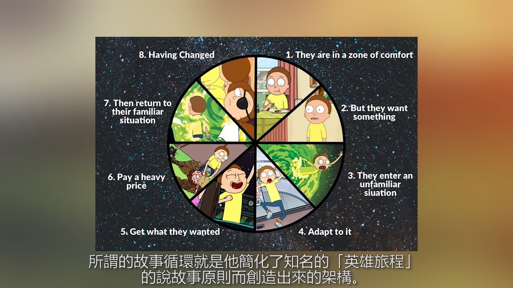

> split to lang specific posts

[The Language Realm - Your Free Resource for language and Translation Services](http://www.languagerealm.com/)
[Free Language Courses | Language Transfer](https://www.languagetransfer.org/home)
[The Hardest Language To Spell - YouTube](https://www.youtube.com/watch?v=btn0-Vce5ug)
[7 Tricks To Learn Any Language In 7 Days (From The Superpolyglot Twins Who Did It) - Babbel.com](https://www.babbel.com/en/magazine/learn-any-language-in-your-hometown)
[Langfocus - YouTube](https://www.youtube.com/channel/UCNhX3WQEkraW3VHPyup8jkQ)
[人類語言最大謎團，你能解開它嗎？| 老高與小茉 Mr & Mrs Gao - YouTube](https://www.youtube.com/watch?v=L0oV08bJpfg)

[What makes a language... a language? - Martin Hilpert - YouTube](https://www.youtube.com/watch?v=_Z_FOtfKyfo)
A language is a dialect with an army and a navy. - Max Weinreich
[Dialect vs. Accent: What’s the difference?](https://blog.duolingo.com/dialect-vs-accent-definition/?utm_source=duonews&utm_medium=EN)
[K Klein - YouTube](https://www.youtube.com/@kklein)

[語之奧秘](http://languagemystery.blogspot.com/)

[學習英語有訣竅！左腦訓練先「唸」後理解字詞更有效 - The News Lens 關鍵評論網](https://www.thenewslens.com/article/74565)
[How interpreters juggle two languages at once - Ewandro Magalhaes - YouTube](https://www.youtube.com/watch?v=cXNTArhA0Jg)
[5 Languages That Could Change the Way You See the World](https://getpocket.com/explore/item/5-languages-that-could-change-the-way-you-see-the-world)

[Learning a language? Speak it like you’re playing a video game | Marianna Pascal | TEDxPenangRoad - YouTube](https://www.youtube.com/watch?v=Ge7c7otG2mk) don't feel judged, focus on the communication

[The Fastest Way to Learn a New Language: The Video Game Map Theory - YouTube](https://www.youtube.com/watch?v=3i1lNJPY-4Q)

- learn the most common 1000 word/phrases
- start speaking early

[[esperanto]]

[Linguistics - YouTube](https://www.youtube.com/playlist?list=PL8dPuuaLjXtP5mp25nStsuDzk2blncJDW)
[The Linguistics Iceberg Explained - YouTube](https://www.youtube.com/watch?v=GFz6KqZurFY)

## Humor

[【一席香港】Vivek《笑自己 自己笑 ≫ - YouTube](https://youtu.be/KXC-yYkPYGI?t=553) Vivek teaches you how to be humor
[The Skill of Humor | Andrew Tarvin | TEDxTAMU - YouTube](https://www.youtube.com/watch?v=MdZAMSyn_As)

[阿滴英文｜秒懂美式幽默! 台灣與美國幽默感差在哪裡? feat. 博恩站起來 - YouTube](https://www.youtube.com/watch?v=e0rHV76uTPg)
[Stand up, Brian! 博恩站起來！ - YouTube](https://www.youtube.com/channel/UCUGlE8lf5qH--_XlsabI2XQ)

[You are absolutely fluent in English if you can understand these - YouTube](https://www.youtube.com/watch?v=c6T9QEvczHc)

Bill Burr
Louis C.K.
Russell Peters
Chris Rock
Kevin Hart
Tim Minhcin, with songs
Anthony Jeselnik, black humor
Amy Schumer
Sarah Silverman
Wanda Skyes

## Reverse Talk

[Kurt Quinn - YouTube](https://www.youtube.com/user/kurtTHEquinn)
[TALKING BACKWARDS (Backwards Banter Brain Testing) - Smarter Every Day 168 - YouTube](https://www.youtube.com/watch?v=L5cAnxNVWkw)

[⏪！吧「戲遊帶倒」玩來起一](https://nicechord.com/post/reversed-audio/)

## Rhetoric

[Rhetoric - Wikiwand](https://omni.wikiwand.com/en/Rhetoric) the art of persuasion
[修辞学 - Wikiwand](https://omni.wikiwand.com/zh/%E4%BF%AE%E8%BE%9E%E5%AD%A6)

- Logos: Logic/Reason
- Pathos: Appeal to emotion
- Ethos: Credibility/Trustworthiness

## Typing

[Learn Touch Typing Free - TypingClub](https://www.typingclub.com/)
[Typespeed: Typing Speed Testing Game for Ubuntu Linux](https://www.hecticgeek.com/typespeed-typing-game-ubuntu-linux/)

## English

[wordsoftheworld - YouTube](https://www.youtube.com/channel/UC-YO7JkqlrBsgMGiAlqQ7Tg)
[BBC Learning English - Learn English, learning English, English videos, grammar, pronunciation, vocabulary, exams. Everything you need to help you learn English.](http://www.bbc.co.uk/learningenglish/)
[Learn English - Grammar, Vocabulary, Speaking, Exercises, Lessons.](https://www.myenglishpages.com/)
[Learn The 43 Sounds of American English Pronunciation — Pronuncian: American English Pronunciation](https://pronuncian.com/sounds)
[English As A Second Language - 7 E S L](https://7esl.com/)
[Alliterative - YouTube](https://www.youtube.com/user/Alliterative)

[工業中英用語翻譯 -《中英對照》](http://www.aua.com.tw/translations/?f=zh-TW)

[English with Lucy - YouTube](https://www.youtube.com/@EnglishwithLucy)
[Rachel's English - YouTube](https://www.youtube.com/@rachelsenglish)
[英语兔 - YouTube](https://www.youtube.com/@yingyutu)
[阿滴英文 - YouTube](https://www.youtube.com/channel/UCeo3JwE3HezUWFdVcehQk9Q/playlists)
[英文學習技巧 - YouTube](https://www.youtube.com/playlist?list=PLG47EBGFEJNblUqd5nm2joeKlnRuKbY5H) 阿滴英文
[英文閱讀法-旋元佑 - YouTube](https://www.youtube.com/playlist?list=PLhvhy0dgLGeAFzCnlnd3sAp8drXZk4x4h)
[Tom's Language Files - YouTube](https://www.youtube.com/playlist?list=PL96C35uN7xGLDEnHuhD7CTZES3KXFnwm0)
[哥倫布 Columbus - YouTube](https://www.youtube.com/@TheLittleColumbus)
[CrazyEnglish - YouTube](https://www.youtube.com/@Crazy-English)

[For Karen Chung's Courses and more](http://homepage.ntu.edu.tw/~karchung/)
[Mini-conversations: texts and audio](http://homepage.ntu.edu.tw/~karchung/miniconversations/MC.htm)
[戒掉爛英文文章列表｜商周](https://www.businessweekly.com.tw/OpinionArticle?DocNo=0000000004)

[Netspeak – Search for Words](http://www.netspeak.org/#examples)
[128 Words to Use Instead of "Very"](http://www.proofreadingservices.com/pages/very)

[John McWhorter on the Evolution of Language and Words on the Move | EconTalk | Library of Economics and Liberty](http://www.econtalk.org/archives/2017/08/john_mcwhorter.html)

[Separated by a Common Language](https://separatedbyacommonlanguage.blogspot.com/) Observations on British and American English by an American linguist in the UK
[Comparison of American and British English - Wikiwand](https://omni.wikiwand.com/en/Comparison_of_American_and_British_English)

[The English Notes 英語學習筆記](http://the-english-notes.blogspot.com/)

[所有有關 ”家事 ”的英文 | Yahoo 知識+](https://hk.answers.yahoo.com/question/index?qid=20050823000012KK02832)
[蔬菜的英文名稱 (Common Chinese vegetable name in English) - 博學軒英語學習城 - udn 城市](http://city.udn.com/66782/4890552)
[金庸武俠小說重要詞彙英文翻譯 - 王琮瑋's ePortfolio](http://lms.ctl.cyut.edu.tw/9522040/doc/19528)

[口譯員的小秘密 遇到「翻譯不了的笑話」竟然會這麼做！ - YouTube](https://www.youtube.com/watch?v=dhlYd3oFd1E)

[VoiceTube《看影片學英語》70,000 部英文學習影片，每天更新](https://tw.voicetube.com)
[Learning a language? Speak it like you’re playing a video game | Marianna Pascal | TEDxPenangRoad - YouTube](https://www.youtube.com/watch?v=Ge7c7otG2mk) being able to communicate with low level of English
[如何用「回音法」學好英文口說 | 史嘉琳 Karen Chung | TEDxNTUST - YouTube](https://www.youtube.com/watch?v=sQEWEPIHLzQ)

### Adjectives

Order of multiple adjectives:

- order of number
- opinion
- size
- age
- shape
- color
- origin
- material
- purpose
- proper adjectives (European, Euclidean)

### Dict

[English Dictionary, Thesaurus, & grammar help | Oxford Dictionaries](https://en.oxforddictionaries.com/)
[Dictionary, Encyclopedia and Thesaurus - The Free Dictionary](http://www.thefreedictionary.com/)
[Thesaurus.plus - Online Thesaurus Dictionary of the English language](https://thesaurus.plus/)

### Abbreviations

[Abbreviations | Oxford Dictionaries](https://en.oxforddictionaries.com/grammar/spelling/abbreviations)
[Acronym vs. Abbreviation vs. Initialism | Reader's Digest](https://www.rd.com/article/acronym-vs-abbreviation-whats-the-difference/)

Acronyms are words formed from the initial letters of other words and pronounced as they are spelled, not as separate letters. NATO, NASA, ...

Initialisms are abbreviations which consist of the initial (i.e. first) letters of words and which are pronounced as separate letters when they are spoken. UK, USA, ...

Contractions are abbreviations in which letters from the middle of the word are omitted. Full stop is not needed for contractions with same endings of the original word (hrs, Mr, Dr). Dr, Ltd.

### Etymologies

[Etymology - Wikiwand](https://omni.wikiwand.com/en/Etymology)

[Online Etymology Dictionary | Origin, history and meaning of English words](https://www.etymonline.com/)
[Word origins | OxfordWords blog](https://blog.oxforddictionaries.com/category/word-origins/)
[Mashed Radish – everyday etymology](https://mashedradish.com/)
[Glossophilia](http://www.glossophilia.org/)
[The Allusionist](http://www.theallusionist.org/)

### History of English

[History of the English language - Wikiwand](http://omni.wikiwand.com/en/History_of_the_English_language)
[Tracing English as far back as possible - YouTube](https://www.youtube.com/watch?v=IeAx3QZ7eRs)

English evolved from Proto-Indo-European language

Stems are created with several observed rules:

- Vowel Shifts
- Consonant Shifts
  g k h, d t s, u v w, m n l r, b p m f v
- [Verner's law - Wikiwand](https://omni.wikiwand.com/en/Verner%27s_law)
- [Grimm's law - Wikiwand](https://omni.wikiwand.com/en/Grimm%27s_law)
- [Grassmann's law - Wikiwand](https://omni.wikiwand.com/en/Grassmann%27s_law)

[Language Evolution: How One Language Became Five Languages](https://www.wondriumdaily.com/language-evolution-one-language-became-five-languages/)
[Proto-Germanic and Germanic: Consonant Shifts and Vowel Changes](https://www.wondriumdaily.com/proto-germanic-and-germanic-consonant-shifts-and-vowel-changes/)
[The Great Vowel Shift: How We Know Language Now](https://www.wondriumdaily.com/the-great-vowel-shift-how-we-know-language-now/)
[The Processes of Sound Change](https://www.wondriumdaily.com/the-processes-of-sound-change/)

English originates from the [Angles](http://www.emersonkent.com/tribes_and_peoples/angles.htm) from Germany, hence Angle-lish. [Anglo-Saxons](https://omni.wikiwand.com/en/Anglo-Saxons) arrived England in the 5th century. They unified England in the [Norman Conquest](https://omni.wikiwand.com/en/Norman_conquest_of_England) lead by [William the Conqueror](https://omni.wikiwand.com/en/William_the_Conqueror) in 1066.

This is the reason why the name of the animal and its meat are different. The animal is Anglelish, the meat is French.

[ENGLISH. - YouTube](https://www.youtube.com/watch?v=atI-JPGcF-k)
[Tribes and Peoples in History A-C](http://www.emersonkent.com/tribes_and_peoples_in_history.htm)
[Why is English spelling so complicated? - YouTube](https://www.youtube.com/watch?v=VF5MGLRlXVw)

[CAPS Unlock - the history behind uppercase & lowercase letters - YouTube](https://www.youtube.com/watch?v=zO6r_Hqi0Ak)

[Audiobooks | The History of English Podcast](https://historyofenglishpodcast.com/audiobooks/)

### Vocabulary

[颠覆你对英语词汇的认知! - YouTube](https://www.youtube.com/watch?v=iyltEHRi39I)
[背单词秘诀: "格林定律"? - YouTube](https://www.youtube.com/watch?v=QmGSshmtitE)
[5 天就能記住 1 萬個單詞的方法，老師為什麽不教？用结果说话，因为结果不会骗人一套高效背单词的方法，单词记忆法。快速提高中考高考英语，四级六级考研雅思托福词汇量 - YouTube](https://www.youtube.com/watch?v=AFgZbU3AhlY) the order he gave was wrong,he used the modern English word as root, e.g.lun derived from moon, but the fact is the other way round
[Peaceful Night - YouTube](https://www.youtube.com/@peacefulnight)

sam sem sim syn sy sym syl: same
vit vis vid wis wit: seeing
ang eng ac ank ack anch: acute

### Morse code

> Morse code is Huffman coding before Huffman coding exists

[Morse code - Wikiwand](https://omni.wikiwand.com/en/Morse%20code)

[Hello Morse | Experiments with Google](https://experiments.withgoogle.com/collection/morse)
[Morse - Learn](https://morse.withgoogle.com/learn/)
[Morse code on Gboard - Android Accessibility Help](https://support.google.com/accessibility/android/answer/9011881)
[如果听到这个声音一定要注意！教你看懂摩斯电码 - YouTube](https://www.youtube.com/watch?v=TZxwZiUPsgg)
[摩尔斯电码竟然可以用来降维打击，这是怎么回事？【科学火箭叔】 - YouTube](https://www.youtube.com/watch?v=g7rCtXcBF10)

[calvindn/morse-node: Morse code encoder / decoder.](https://github.com/calvindn/morse-node)
[neocotic/mor.js: Pure JavaScript library for encoding/decoding Morse code messages](https://github.com/neocotic/mor.js)

### Peculiarities

If you want to fixed some wrongdoing, do you want the amend the act or stick with it?

[Allusionist 17: Fix part I — The Allusionist](http://www.theallusionist.org/allusionist/fix-i)
[Allusionist 18: Fix part II — The Allusionist](http://www.theallusionist.org/allusionist/fix-ii)

[What are the trickiest rules in English grammar pertaining to commonly used words? - Quora](https://www.quora.com/English-Grammar/What-are-the-trickiest-rules-in-English-grammar-pertaining-to-commonly-used-words) collocation

Contranym: a word with two opposite meanings, e.g. sanction (which can mean both ‘a penalty for disobeying a law’ and ‘official permission or approval for an action’).
[Auto-antonym - Wikiwand](https://omni.wikiwand.com/en/Auto-antonym)
[75 Contronyms (Words with Contradictory Meanings)](https://www.dailywritingtips.com/75-contronyms-words-with-contradictory-meanings/)

[One Sentence With 7 Meanings Unlocks a Mystery of Human Speech | WIRED](https://www.wired.com/story/one-sentence-with-7-meanings-unlocks-a-mystery-of-human-speech/)
["I never said she stole my money" has 7 Different Meanings - Fact-inator](http://factinator.com/i-never-said-she-stole-my-money/)

[The english language is a giant meme.. - YouTube](https://www.youtube.com/watch?v=65CFesU4KVQ)

[RobWords - YouTube](https://www.youtube.com/@RobWords)
[This ruined English spelling - YouTube](https://www.youtube.com/watch?v=fmL6FClRC_s) The Great Vowel Shift (~15-18th century, coinciding with the transition ofj Middle English to Modern English and Gutenberg's printing press technology)
[The invention that broke English spelling - YouTube](https://www.youtube.com/watch?v=Syp1DVQgN_g) Gutenberg's printing press forces English words to have a spelling
[The weirdest things about English - YouTube](https://www.youtube.com/watch?v=6lhxxiqqlQY)
[Why we should go back to writing in runes - YouTube](https://www.youtube.com/watch?v=4npuVmGxXuk)

### Readability

[Flesch–Kincaid readability tests - Wikipedia, the free encyclopedia](http://en.wikipedia.org/wiki/Flesch%E2%80%93Kincaid_readability_tests)

- Flesch Reading Ease Score (FRES)
- Flesch–Kincaid Grade Level Score

[Readability handbook: Get started with ReadablePro – readable.io](https://readable.io/readability-handbook/)
[Write Better Stories with this Python Tool - Towards Data Science](https://towardsdatascience.com/write-better-stories-with-this-python-tool-ad1371158822)

[What makes writing more readable?](https://pudding.cool/2022/02/plain/)
[Plain language - Wikiwand](https://omni.wikiwand.com/en/Plain_language)
[Basic English - Wikiwand](https://omni.wikiwand.com/en/Basic_English)

### Learning

[English Language Centre Study Zone: Welcome!](https://web2.uvcs.uvic.ca/courses/elc/studyzone/)
[ELC Study Zone: All Grammar Topics](https://web2.uvcs.uvic.ca/courses/elc/studyzone/grammar.htm)

[Learn English Online | British Council](http://learnenglish.britishcouncil.org/)
[Online courses from British Council](https://www.futurelearn.com/partners/british-council)

[Vocabulary tester](http://readability.mackayst.com/vtest)

[What works the best when learning a new language? - Quora](http://www.quora.com/What-works-the-best-when-learning-a-new-language)

#### Grammar

[Grammar | Lexico](https://www.lexico.com/en/grammar) = Oxford Dictionaries
[Grammarist - English grammar, usage, and style blog](http://grammarist.com/)
[Learning English Online - GrammarBank](https://www.grammarbank.com/)
[English Grammar | British Council](http://learnenglish.britishcouncil.org/grammar)
[Grammar Archives - Thesaurus.com](https://www.thesaurus.com/e/grammar/)

[Grammar Checker | Grammarly](https://www.grammarly.com/)
[Open source alternatives to Grammarly for word processing | Opensource.com](https://opensource.com/article/20/3/open-source-writing-tools)

[DeepL Translate: The world's most accurate translator](https://www.deepl.com/en/translator)
[DeepL Write: AI-powered writing companion](https://www.deepl.com/write)

[语法 - YouTube](https://www.youtube.com/playlist?list=PLiRHe7F8P0-0ykWSiVY9Ia431TB-HzQm0) 英语兔
[一个视频说清整个英语语法体系(重塑你的语法认知框架) - YouTube](https://www.youtube.com/watch?v=is7vn5URVcc) !important
[非谓语动词详解: 不定式, 动名词, 现在分词, 过去分词 - YouTube](https://www.youtube.com/watch?v=LhbZ4TAjgUo)
[英语"虚拟语气"就是这么简单(看完就懂!) - YouTube](https://www.youtube.com/watch?v=-Skm12wNLa8)
[英语核心语法概念 | 英语兔](https://www.yingyutu.com/hxyf)
[英语介词攻略 (看完就懂) - YouTube](https://www.youtube.com/watch?v=VcZglLpFlRs)

[阿滴教文法 - YouTube](https://www.youtube.com/playlist?list=PLG47EBGFEJNZ7X_-UAd0S3gU5igZxbjws) 阿滴英文
[英文文法 Grammar - YouTube](https://www.youtube.com/playlist?list=PLRSK1pOZNZyZgPZFtCaUbHau8AvSxDoH2) 瑪姬英文 English with Maggie
[不用背規則!? 這支影片會讓你對英文文法改觀! feat. 旋元佑老師 - YouTube](https://www.youtube.com/watch?v=bou9Ij7jRUE)

[English Grammar: What are the trickiest rules in English grammar pertaining to commonly used words? - Quora](http://www.quora.com/English-Grammar/What-are-the-trickiest-rules-in-English-grammar-pertaining-to-commonly-used-words/answer/Daniel-Mokrauer-Madden/comment/1941285)
[Dear Pedants: Your Fave Grammar Rule is Probably Fake | JSTOR Daily](http://daily.jstor.org/grammar-rule-is-probably-fake/)

Facts, generalizations and rules:

- use simple present tense
- use plurals

Part of speech
Phrases
Clauses (main and subordinate)
Connectives can be conjunctions, prepositions or adverbs.

#### Tense

Tense is a combination of time and aspect (<https://youtu.be/is7vn5URVcc?t=1065>).
[英语语法: 16 种时态终极详解 - YouTube](https://www.youtube.com/watch?v=P5FrIGgyNSc)
[12 時態懶人包！簡單式/進行式/完成式/完成進行式全部一起搞懂！英文文法大解析！ - YouTube](https://www.youtube.com/watch?v=tw9KEQLokjo)

| Time                                      | Aspect             |
| ----------------------------------------- | ------------------ |
| Present                                   | (Non-specific)     |
| Past                                      | Perfect            |
| Future                                    | Continuous         |
| Past Future (from some point in the past) | Perfect Continuous |

I am taking/I am going to take: schedule
I will take: recent decision

Preset
Present Perfect: WHAT happened before affecting now
Present Perfect Continuous: WHAT happened before affecting now, _may_ imply change
Past: TIME, need to specify TIME
Past Continuous: EVENT during other past ACTION, need to specify TIME
Past Perfect: WHAT before a past TIME affecting the past TIME, need to specify the past TIME
Future Perfect: WHAT before a future TIME affecting the future TIME, need to specify the future TIME
Perfect Continuous: continuous to a certain point a in time, can be replaced by Perfect tense if the time period is included

[Participles | Lexico](https://www.lexico.com/en/grammar/participles)
[Past Participle | Definition of Past Participle by Lexico](https://www.lexico.com/en/definition/past_participle)
form of verb used for perfect and passive tenses

[Verb Tenses Chart - GrammarBank](https://www.grammarbank.com/verb-tenses.html)
[What Are Active And Passive Verbs? | Lexico](https://www.lexico.com/en/grammar/active-and-passive-verbs)

#### Prepositions

[TO 跟 FOR 用法差在哪？要怎麼選？ - YouTube](https://www.youtube.com/watch?v=Hzl-Twy159w)

#### Style

[The Elements of Style](http://www.crockford.com/wrrrld/style.html)
[3 shell scripts: Kill weasel words, avoid the passive, eliminate duplicates](http://matt.might.net/articles/shell-scripts-for-passive-voice-weasel-words-duplicates/)
[btford/write-good](https://github.com/btford/write-good)

[How to use a semicolon - Emma Bryce - YouTube](https://www.youtube.com/watch?v=th-zyfvwDdI)

[Linguistics, Style and Writing in the 21st Century - with Steven Pinker - YouTube](https://www.youtube.com/watch?v=OV5J6BfToSw)
[The Sense of Style: The Thinking Person's Guide to Writing in the 21st Century - Kindle edition by Pinker, Steven. Reference Kindle eBooks @ Amazon.com.](https://www.amazon.com/Sense-Style-Thinking-Persons-Writing-ebook/dp/B00INIYG74/)pho
[Steven Pinker: Linguistics as a Window to Understanding the Brain | Big Think - YouTube](https://www.youtube.com/watch?v=Q-B_ONJIEcE))

- language is an app that turns a web of thought (the sematic web) into a string of words
- classic style
  let the reader see what the writer understands about the reality
  reader and writer are equal
  style is conversational
  better to be clear and possibly wrong, than muddy and "not even wrong"
  narrative: agents perform actions that affect objects; avoids normalization/zombie nouns (turning verbs into nouns)
  empathize with your reader
- contemplative style
- oracular style
- practical style
- postmodern/self-conscious style
  used by academics
  escape being convicted of philosophical naivete about his enterprise

#### Punctuation

[Punctuation | Lexico](https://www.lexico.com/en/grammar/punctuation)

[What Are Inverted Commas? | Lexico](https://www.lexico.com/en/grammar/inverted-commas-quotation-marks)

General rule: "1, 2 and 3"

[What is the Oxford Comma (or Serial Comma)? | Grammarly](https://www.grammarly.com/blog/what-is-the-oxford-comma-and-why-do-people-care-so-much-about-it/)
Oxford comma (helps in case where there is an "and" in the last item and disambiguates non-defining relative clause):
"apple, orange, fish and chips" vs "apple, orange, fish, and chips" (Oxford comma)

Hyphen for words
en-dash for numbers, need space in between
em-dash used like colon to introduce list, or comma to separate out indefinite relative clause (no space in between)

[What Is an En Dash and When to Use It? Thesaurus.com](https://www.thesaurus.com/e/grammar/how-do-i-use-an-en-dash/)
[What Is An Em Dash And How Do You Use It? | Thesaurus.com](https://www.thesaurus.com/e/grammar/em-dash/)
[Em Dash: When Should I Use It? | Grammarly](https://www.grammarly.com/blog/why-you-should-love-the-em-dash/)
[How To Use An Em Dash (—) | Lexico](https://www.lexico.com/grammar/dash-and-em-dash)

#### 五大句型

[五大句型及動詞種類介紹 - YouTube](https://www.youtube.com/watch?v=5AC6wet6vB8)

[一次搞懂英文的「五大句型」（7 分鐘懶人包） - YouTube](https://www.youtube.com/watch?v=HboNGK7ipKQ)
[5 分鐘搞懂「及物動詞」跟「不及物動詞」！ - YouTube](https://www.youtube.com/watch?v=dNJZTvTqKb4)

1. S + V
   Peter cooked.
2. S + V + O
   Peter cooked a steak.
3. S + V + IO (Indirect Object) + DO (Direct Object)
   Peter cooked Mary a steak.
4. S + V + C (Complement)
   Peter is happy.
5. S + V + O + OC (Object Complement)
   Peter makes Mary happy.
   Peter considers Mary a good friend.

### IELTS

[IELTS - The International English Language Testing System | Take IELTS](https://takeielts.britishcouncil.org/)
[IELTS Exam Library | IELTS Online Tests](https://ieltsonlinetests.com/ielts-exam-library)

### Doge Grammar

[Doge (meme) - Wikiwand](<https://omni.wikiwand.com/en/Doge_(meme)>)

[A Linguist Explains the Grammar of Doge. Wow. - The Toast](http://the-toast.net/2014/02/06/linguist-explains-grammar-doge-wow/)
[How to speak Doge – Scientific Scribbles](https://blogs.unimelb.edu.au/sciencecommunication/2016/10/22/how-to-speak-doge/)
[The Curious Linguistics of the Doge in the Internet | The League of Nerds](http://asktheleagueofnerds.com/doge/)

### Euphemism

[Doublespeak - Wikiwand](https://omni.wikiwand.com/en/Doublespeak)
[DoubleSpeak, How to Lie without Lying - YouTube](https://www.youtube.com/watch?v=qP07oyFTRXc)

### Story Writing

[Hero's journey - Wikiwand](https://omni.wikiwand.com/en/Hero%27s_journey)
[Hero's Journey 101: Definition and Step-by-Step Guide (With Checklist!)](https://blog.reedsy.com/heros-journey/)
[The Hero's Journey - Mythic Structure of Joseph Campbell's Monomyth](http://www.movieoutline.com/articles/the-hero-journey-mythic-structure-of-joseph-campbell-monomyth.html)
[The Stages of the Hero's Journey](https://www.tlu.ee/~rajaleid/montaazh/Hero%27s%20Journey%20Arch.pdf)

[Hello Future Me - YouTube](https://www.youtube.com/channel/UCFQMO-YL87u-6Rt8hIVsRjA)

### On Writing Technical report

[Writing help | Oxford Dictionaries](https://en.oxforddictionaries.com/grammar/writing-help)
[How to Make Writing a Lot Easier | Forge](https://forge.medium.com/how-to-write-10-000-words-a-week-a7c63d97ea79)

4W: Who, Why, What, When
4C: Clear, Concise, Constructive, Correct

1. intro
2. purpose
3. content
4. conclusion

be quantitative (use figures, with decent source)

favor active over passive voice, except for:

- concealing the subject (confidential, don't know or don't want to specify)
- things are done passively (e.g.: authenticate)
- the done-to is the focus of the sentence

[Advice for Technical Writing | CSS-Tricks](https://css-tricks.com/advice-for-technical-writing/)
[The developer's guide to content creation with Stephanie Morillo (The Changelog #382) |> Changelog](https://changelog.com/podcast/382)

### Phonics

[Phonemic Chart - English with Lucy](https://englishwithlucy.com/phonemic-chart/)

[音标 - YouTube](https://www.youtube.com/playlist?list=PLiRHe7F8P0-2wRRzK6nzriMTXyfRwKEG6) 英语兔
[英语最重要的音标体系(DJ, KK, 韦氏, AHD...) - YouTube](https://www.youtube.com/watch?v=vRnRZ4umJxw)

[English phonology - Wikiwand](https://omni.wikiwand.com/en/English_phonology)
[DJ 音標 - Wikiwand](https://omni.wikiwand.com/zh/DJ%E9%9F%B3%E6%A8%99) adopts IPA for received pronunciation
[KK 音標 - Wikiwand](https://omni.wikiwand.com/zh/KK%E9%9F%B3%E6%A8%99) adopts IPA for American English
[International Phonetic Alphabet - Wikiwand](https://omni.wikiwand.com/en/International_Phonetic_Alphabet)

[Why Are A, E, I, O, U, And Y Called "Vowels"? - Dictionary.com](https://www.dictionary.com/e/vowels/)
[The 44 Phonemes in English](https://www.dyslexia-reading-well.com/44-phonemes-in-english.html)
[The 44 Sounds of English](https://www.dvusd.org/cms/lib/AZ01901092/Centricity/Domain/3795/Sound_Spelling_Chart.pdf) PDF
[How Many Vowel Sounds Does English Have?](https://www.babbel.com/en/magazine/english-vowel-sounds)
[Oral English: Easy Ways to Pronounce the 24 English Consonants and 20 English Vowels](https://www.tammysenglishblog.com/2019/04/oral-english-easy-way-to-pronounce-24.html)

[你有被說中嗎？10 個有「中央母音省略」的字！（Schwa Elision) - YouTube](https://www.youtube.com/watch?v=8A-kREVTnHE)

[语音技巧 - YouTube](https://www.youtube.com/playlist?list=PLiRHe7F8P0-2Ll7FFuXyDDuODk3sEX5VP) 英语兔

[Basic Spelling Rules Explained - Dictionary.com](https://www.dictionary.com/e/spelling-rules/)

[Harvard sentences - Wikiwand](https://omni.wikiwand.com/en/Harvard_sentences)
[https://www.cs.columbia.edu/~hgs/audio/harvard.html](https://www.cs.columbia.edu/~hgs/audio/harvard.html)
[www.cs.cmu.edu/afs/cs.cmu.edu/project/fgdata/OldFiles/Recorder.app/utterances/Type1/harvsents.txt](http://www.cs.cmu.edu/afs/cs.cmu.edu/project/fgdata/OldFiles/Recorder.app/utterances/Type1/harvsents.txt)

[小马外语 - 化学工业出版社有限公司](http://qr.cip.com.cn/html/qrcode/xiaoma/more/more.html)
[图解小学生英语音标入门](http://qr.cip.com.cn/html/qrcode/xiaoma/38877/38877.html)
[图解英语音标速记 1000 小学单词](http://qr.cip.com.cn/html/qrcode/xiaoma/36546/36546.html)
[图解自然拼读速记 1000 小学单词](http://qr.cip.com.cn/html/qrcode/xiaoma/36548/36548.html)

### Ambigrams

Writings that is the same right-side up and upside down or normal and reflected in a mirror.

[Write Words - Make Magic - YouTube](https://www.youtube.com/@WriteWordsMakeMagic) English

## Chinese

[粵語文化傳播協會](http://www.cantoneseculture.com/page_Headline/index.aspx)
[ShaoLan: Learn to read Chinese ... with ease! | Talk Video | TED.com](http://www.ted.com/talks/shaolan_learn_to_read_chinese_with_ease)

[Mandarin Chinese Pinyin Chart with Audio - Yabla Chinese](https://chinese.yabla.com/chinese-pinyin-chart.php)
[Learn Mandarin Chinese Pronunciation with Tone Pair Audio | Yabla Chinese](https://chinese.yabla.com/chinese-tones-learn-the-right-way-with-tone-pairs.php)
[Pinyin - Wikiwand](https://omni.wikiwand.com/en/Pinyin)
[When do Chinese Tones Change? | Chinese Tone Guide - YouTube](https://www.youtube.com/watch?v=vl0eHgPP8Ms)

[hapi](https://xyne.archlinux.ca/projects/hapi/) annotating Mandarin Chinese with phonetics (pinyin, zhuyin, etc.) and colors by tone

[ABCs of Chinese - YouTube](https://www.youtube.com/channel/UC3KmSR_bllwxv0V1vO-nQDA)
[汉字密码 - YouTube](https://www.youtube.com/playlist?list=PLBsaUodNhf0_GnXrvXLreKDCvZ3Dd8nMr)

[金庸版本的奇妙世界 @YLib Blog](http://blog.ylib.com/butterfly)

[沉魚落雁，閉月羞花\_百度百科](https://baike.baidu.hk/item/%E6%B2%89%E9%AD%9A%E8%90%BD%E9%9B%81%EF%BC%8C%E9%96%89%E6%9C%88%E7%BE%9E%E8%8A%B1/2992058)

沉魚: 春秋戰國西施
落雁: 東漢王昭君
閉月: 三國貂蟬
羞花: 唐楊貴妃

### 輸入法

[#MM ｜後生仔就唔識打倉頡 要靠拼音輸入法？1978 年倉頡輸入法由台灣人設計誕生 加速中文電腦普及程度 曾協助倉頡研發者：最終大家會放棄鍵盤輸入，語音輸入才是主流｜#Weekly_pedia #4K - YouTube](https://www.youtube.com/watch?v=I2qRVZLl8EI)

[Online Jyutping Input Method 網上粵拼輸入法](http://www.jyutping.com/)

[倉頡輸入法 - Wikiwand](https://omni.wikiwand.com/zh/%E5%80%89%E9%A0%A1%E8%BC%B8%E5%85%A5%E6%B3%95)
[倉頡輸入法](https://www.fed.cuhk.edu.hk/readwrite/typing/)
[【快速學倉頡】真正 10 分鐘完美 KO 倉頡輸入法（涵蓋所有字形，用盡 26 個字母！） - YouTube](https://www.youtube.com/watch?v=ZKOjwgIdM3k)

[五筆字型輸入法 - Wikiwand](https://omni.wikiwand.com/zh/%E4%BA%94%E7%AC%94%E5%AD%97%E5%9E%8B%E8%BE%93%E5%85%A5%E6%B3%95)
[The Wubi Effect | Radiolab | WNYC Studios](https://www.wnycstudios.org/podcasts/radiolab/articles/wubi-effect)

[行易有限公司 :: 嘸蝦米輸入法](https://boshiamy.com/)
[行易有限公司 :: 嘸蝦米輸入法](https://boshiamy.com/cai.php)
[為什麼公司的前輩們打字都那麼快？ 來談談那些年他們一起練過的嘸蝦米輸入法 ~ - YouTube](https://www.youtube.com/watch?v=fLrjzLPw5BE)

### 注音

[注音符號 - Wikiwand](https://omni.wikiwand.com/zh/%E6%B3%A8%E9%9F%B3%E7%AC%A6%E8%99%9F)
[EP 232 「注音符號」是怎麼來的？為什麼全世界只有台灣用注音？｜志祺七七 Podcast - YouTube](https://www.youtube.com/watch?v=1WKi-XhkrsE)

### 拼音

[汉语拼音 - Wikiwand](https://omni.wikiwand.com/zh/%E6%B1%89%E8%AF%AD%E6%8B%BC%E9%9F%B3)
[拼音（拼读音节的过程）\_百度百科](https://baike.baidu.com/item/%E6%8B%BC%E9%9F%B3/322252)

[香港政府粵語拼音 - Wikiwand](https://omni.wikiwand.com/zh/%E9%A6%99%E6%B8%AF%E6%94%BF%E5%BA%9C%E7%B2%B5%E8%AA%9E%E6%8B%BC%E9%9F%B3)
[香港語言學學會粵語拼音方案 - Wikiwand](https://omni.wikiwand.com/zh/%E9%A6%99%E6%B8%AF%E8%AA%9E%E8%A8%80%E5%AD%B8%E5%AD%B8%E6%9C%83%E7%B2%B5%E8%AA%9E%E6%8B%BC%E9%9F%B3%E6%96%B9%E6%A1%88)

[臺灣語言音標方案 - Wikiwand](https://omni.wikiwand.com/zh/%E8%87%BA%E7%81%A3%E8%AA%9E%E8%A8%80%E9%9F%B3%E6%A8%99%E6%96%B9%E6%A1%88)
[臺語通用拼音 - Wikiwand](https://omni.wikiwand.com/zh/%E8%87%BA%E8%AA%9E%E9%80%9A%E7%94%A8%E6%8B%BC%E9%9F%B3)

### Dict

[汉典 zdic.net](http://www.zdic.net/)
[在线翻译*英语在线翻译*在线词典--查查在线翻译](http://www.ichacha.net/)
[Linguee | 中英词典](http://cn.linguee.com/中文-英语)
[Chinese English Dictionary with Pinyin, Strokes, & Audio - Yabla Chinese](https://chinese.yabla.com/chinese-english-pinyin-dictionary.php) write in stroke
[MDBG Chinese Dictionary](https://www.mdbg.net/chinese/dictionary) write in stroke

[教育部《成語典》2020 [進階版]](https://dict.idioms.moe.edu.tw/search.jsp)
[漢語多功能字庫 Multi-function Chinese Character Database](https://humanum.arts.cuhk.edu.hk/Lexis/lexi-mf/)

[網上普通話字典 | 普通話網](https://www.putonghuaweb.com/dict)
[普通話全文翻譯字典 | 普通話網](https://www.putonghuaweb.com/translateDict)

### Cantonese

[粵典 | 粵典 words.hk](https://words.hk/)
[粵語審音配詞字庫](https://humanum.arts.cuhk.edu.hk/Lexis/lexi-can/) replaced by 漢語多功能字庫

[廣州話《九聲六調》相聲 (卓樂、尚明輝、鄧世昌) - YouTube](https://www.youtube.com/watch?v=cf8YN5S_37Y) ❗!important
[Learn Fun Cantonese - Nine Tones & Six Modes / 涼粉廣東話 - 九聲六調 - YouTube](https://www.youtube.com/watch?v=yTbZ_dwAntQ)
[用粵語學寫詩 ⑶ 粵音九調 - YouTube](https://www.youtube.com/watch?v=1r23biw79OM)
[How to read Nine "Tones" of Cantonese? （粵語九聲調） - YouTube](https://www.youtube.com/watch?v=xdxT1OEAbvg)
[廣東話教學（粵語教學）——九聲六調口訣（下集）（點講廣東話） - YouTube](https://www.youtube.com/watch?v=Uo5lJlBnzAg)
[Learn Fun Cantonese - Nine Tones & Six Modes / 涼粉廣東話 - 九聲六調 - YouTube](https://www.youtube.com/watch?v=yTbZ_dwAntQ)
[(57) 大家一起來學廣東話 - Posts](https://www.facebook.com/cantoneseclublearn/posts/294937433997891)
[这也许是最有效的零基础粤语(广东话)教程了 - YouTube](https://www.youtube.com/watch?v=2xqNxqY0yw4) content is okay, but saying that Cantonese is a variant of Mandarin is completely off, and promoting 懶音 is not okay
1 陰平 2 陰上 3 陰去
4 陽平 5 陽上 6 陽去
7 陰入 8 中入 8 陽入
<https://www.youtube.com/watch?v=xdxT1OEAbvg&t=509>
1 so, 2 so^, 3 mi,
4 do, 5 mi^, 6 mi,
7 so, 8 mi, 9 re
平, 去聲為音高, 可維持發音; 上聲為音程; 上聲收音急促, 入聲尾音為 t,k,p, 音調實為 1、3、6
康熙字典《分四声法》：平聲平道莫低昂，上聲高呼猛烈強，去聲分明哀遠道，入聲短促急收藏

<https://www.youtube.com/watch?v=cf8YN5S_37Y&t=1177>
冤枉嘅唔會耐不責罰
諸位聽完以後七八日
都睇怕憑語調識切入
翻炒過能領悟得確實

[鏗鏘集：廣東話 - YouTube](https://www.youtube.com/watch?v=m8tczONnK1k)
[香港故事-本土 plus+：口噏噏 粵語有秘笈 - YouTube](https://www.youtube.com/watch?v=4BW_J7reuv4)

[1 個單字變出 40 個意思!? 有系統分析神奇的粵語語氣助詞!(繁體中文字幕) - YouTube](https://www.youtube.com/watch?v=GCzw1KXQd5M)

[殿下在香港－香港在世界 (Hong Kong in the World) - YouTube](https://www.youtube.com/channel/UChJQlg1b_cOttPX3SiIh5gA)

[熱血時報 | 粵語九聲訣](http://www.passiontimes.hk/article/03-18-2014/11264)
詩史試時市是色洩蝕
蕃茄醬牛腩麵不吃辣
雞仔要同你哋織隻襪
齋睇貨唔買做乜拆盒
匿喺處刨網路的確宅
香港靠誰領導出窄局
巴打嘅神獸漫的確絕

番茄醬牛腩面逼客食
三九四零五二七八六
三碗半牛腩麵一百碟
朝早过嚟你度执块\*肉
虾仔个头里便塞夹实
獅虎豹猴馬象
香港腳唔美麗

普通话:
陰平, 陽平, 上聲, 去聲
一平, 二升, 三曲, 四降
<https://youtu.be/2xqNxqY0yw4?t=556> Cantonese vs Mandarin 聲調
1 -> 1；2 -> 3；3 -> 2；4 -> 3
<https://youtu.be/2xqNXqY0yw4?t=493>
<https://www.youtube.com/watch?v=xdxT1OEAbvg&t=402>

[反切原理簡介 | 陳凱文 | 香港獨立媒體網](http://www.inmediahk.net/node/1025466)
上字取聲母，下字取韻母；上字辨陰陽，下字辨平仄

[The Complete Guide to Learn Cantonese 【廣東話學習指南】](https://cantolounge.com/complete-guide-learn-cantonese/)
[廣東話教學網](https://www.facebook.com/notes/192869230848313/)
[中文字元資料頁：粵語拼盤](http://input.foruto.com/ccc/jyt/index.htm)
[粵語字各種打字法及解釋大全（2007 賀歲版）](http://www.cantonese.asia/attachments/school/canchars.htm)
[老師不教的 99 個粵音字](http://www.cantonese.sheik.co.uk/phorum/read.php?1,60919,60952)
[粵講粵 o 岩一分鐘](http://rthk9.rthk.hk/elearning/bettercantonese/listenpro.htm)
[廣東話生活雜記: 粵語淵源 jyut6 jyu5 jyun1 jyun4](https://lovelifecantonese.blogspot.hk/2018/03/jyut6-jyu5-jyun1-jyun4.html)

## Japanese

[elearning 日語自遊行](http://www.rthk.org.hk/elearning/gogojapan/pronoun.html) 五十音
[Hiragana - Wikiwand](https://omni.wikiwand.com/en/Hiragana) 平仮名
[Katakana - Wikiwand](https://omni.wikiwand.com/en/Katakana) 片仮名
つ is used as の before 奈良時代

[何必日語 - YouTube](https://www.youtube.com/channel/UCZ5Wn4ss81cVKSk74Duv2BA)
[Yunaty 日本語 - YouTube](https://www.youtube.com/channel/UCeKUWJFqZa7rR4G_NLnV_9g)
[Amber.L - YouTube](https://www.youtube.com/channel/UChoW8T205pVdvex0e5wHi2Q)
[秋山燿平 - YouTube](https://www.youtube.com/c/YoheiAkiyama)
[抓尼先生 / 學日文 & 日本大小事 - YouTube](https://www.youtube.com/@johnysensei)
[Elsaの放送 - YouTube](https://www.youtube.com/@ElsaJapanese)
[TKB日文 - YouTube](https://www.youtube.com/playlist?list=PLb64h4LM_5_npLO3yyfVhp5z3oS1hnryP)

[Learn Japanese with JapanesePod101.com - YouTube](https://www.youtube.com/@JapanesePod10尸尸)
[Introduction to Japanese - YouTube](https://www.youtube.com/playlist?list=PLPSfPyOOcp3SyG326n_7q10fJgq-GloTa)

[【學基礎日語五十音】全部完整日文 50 音不要龍捲風速成速記慢慢學 - YouTube](https://www.youtube.com/watch?v=rJSv48e7nUw)
[為什麼日文中的「か」聽起來像「ga」？日本人讓你徹底弄明白！ - YouTube](https://www.youtube.com/watch?v=WOscODPNytM)

[日文 | MagicLen](http://magiclen.org/category/major-artical/social-life/natural-language/japanese/)
[線上日語教室](http://www.linguist.com.tw/JAPClass/default.htm)
[免費學日文網站-免費日語學習-線上自學日語-LearnJapanese.Aiyori.org 免費日本語教室](http://www.learnjapanese.aiyori.org/index.html)
[日文| 東大前日文學校| 日文免費教材・資源 FREE JAPANESE RESOURCES | 線上 日文 學習](http://www.todaimae-japanese.com/)
[達鎂日語教室--免費日語學習 日語學習網 線上日語教學 學習日語](http://www.perfect168.com.tw/japanese/)
[日语在线翻译,在线日语工具集\_小楠日语](http://o-oo.net.cn/)
[沪江日语-沪江旗下日语学习资讯网站*日语等级考试*日语入门到精通](http://jp.hjenglish.com/)
[福娘童話集 -世界と日本の童話・昔話集-](http://hukumusume.com/DOUWA/)
[Learn Japanese Online The Easy And Fun Way](https://www.nihongomaster.com/)

[日文這樣輕鬆學，利用網站資源、隨身 App 變身日語達人 - Qooah](http://qooah.com/2014/03/20/learn-japanese-from-web-and-apps-for-free-of-charge/)
[日本語の勉強 @ 紫熊部屋 :: 痞客邦 PIXNET ::](http://murasakikuma.pixnet.net/blog/category/2133142)

[That Japanese Man Yuta - YouTube](https://www.youtube.com/channel/UCn7LyBvG5LEBXK9I4W5dGdA)
[Why Do Japanese Still Use Kanji? Complicated Writing System... - YouTube](https://www.youtube.com/watch?v=O27TgLW6pCU)
[Kanji Story - How Japan Overloaded Chinese Characters - YouTube](https://www.youtube.com/watch?v=CF3MRMBjd20)
弓
音讀 onyomi ku, kyu
訓讀 kunyomi yumi, yu, tarashi
名乘 nanori place name

稻妻 inazuma
古時日本人相信閃電會令稻子成熟, 而當時"妻"字是沒有男女之分, 所以"稻妻"意思就是"稻子的老公"

[夏洛特先生【PTK 是什麼？わたし明明就應該唸 WATASI 為甚麼大家都唸 WADASI？】 - YouTube](https://www.youtube.com/watch?v=RSVzBza6rTs)
PTK 音變: PTK 行在第二三音節會發生音變, 清音 -> 不送氣清音
ka ~> ga; ta ~> da; pa ~> ba

[日文沒有髒話？好孩子不要看的日文髒話教學｜深日本 第 24 集｜好倫｜ - YouTube](https://www.youtube.com/watch?v=TBVywz2zTfA)
[深日本# 71 ▶ 日本人到底生了什麼病？｜好倫｜ - YouTube](https://www.youtube.com/watch?v=TCpcQUMOXLA) 集體主義影響語文

[【超簡單】日語聲調的規則 - YouTube](https://www.youtube.com/watch?v=loWGAbvYUiI)
[【會話篇】日語的聲調重音 - YouTube](https://www.youtube.com/watch?v=PInYR7ZBRAQ)
[【日文發音】這樣發音才像日本人！｜日文發音技巧 - YouTube](https://www.youtube.com/watch?v=Hd4s7mcGEdY)

### 動詞變化

[活用 (日語) - Wikiwand](<https://omni.wikiwand.com/zh/%E6%B4%BB%E7%94%A8_(%E6%97%A5%E8%AA%9E)>)

- 未然形（第一變化）：後接「〜ない」、「〜う（よう）」（表示「意志」）
- 連用形（第二變化）：後接丁寧語「～ます」、過去式「〜た」、希望「〜たい」、中止形「～て」
- 終止形（第三變化）：辞書形, 原形, 放在句子結尾。例、明日行く。
- 連体形（第四變化）：接在名詞前方，用來修飾名詞。例、明日行く人。（中譯：明天要去的人）
- 仮定形（第五變化）：接「〜ば」，表示假定。例、明日行けば分かる。（中譯：明天去了的話，就知道）
- 命令形（第六變化）：表示命令。例、行け！（中譯：去吧！）

[自學日文動詞變化 五段動詞的七種變化未然形連用形終止形連體形假定行命令形意志形 - YouTube](https://www.youtube.com/watch?v=VSEpxaHY_CU) ❗!important, 用xx型比用第N變化好
[自學日語動詞變化 上下段動詞的七種變化形態 - YouTube](https://www.youtube.com/watch?v=x8wMjDiKqz0)

[我們該學好的是日文，而不是日文專有名詞！-社群貼文-王可樂日語](https://colanekojp.com.tw/classroom_detail/57) 「王可樂日語」 V.S. 「學術派」

[【日文文法基礎7】 動詞的活用形有幾種？](https://hkotakujapanese.com/%E6%97%A5%E6%96%87%E6%96%87%E6%B3%95%E5%9F%BA%E7%A4%8E7-%E5%8B%95%E8%A9%9E%E7%9A%84%E6%B4%BB%E7%94%A8%E5%BD%A2%E6%9C%89%E5%B9%BE%E7%A8%AE%EF%BC%9F/)
[日文動詞變化一次搞懂｜Amber.L-日文文法](https://www.lemonstera.com/doc/5e9232c6f24efdc03f7266f4a393e199)
[日文動詞變化筆記(3套公式、7個型態、音變與常用18種變化) | MagicLen](https://magiclen.org/jp-lang-verb/)

### 萬葉假名

> 用漢字表示日文的書寫系統, 古名常用 "夜露死苦", "愛羅武勇", "阿離我拓", "阿里加都宇姑左伊馬須", "陀異守鬼", "魔苦怒奈流怒"

[萬葉假名 - Wikiwand](https://omni.wikiwand.com/zh/%E8%90%AC%E8%91%89%E5%81%87%E5%90%8D)
[深日本#11 ▶ 你說的中文，大部份來自日文【和制漢語】｜好倫 - YouTube](https://www.youtube.com/watch?v=-pg1EYuLTME)
[日語入門學習五十音圖之假名的含義來源 - 每日頭條](https://kknews.cc/culture/3e2bea.html)
[萬葉假名：萬葉假名(日文:萬葉仮名 まんようがな)是假名的一種，主要用作上一 -華人百科](https://www.itsfun.com.tw/%E8%90%AC%E8%91%89%E5%81%87%E5%90%8D/wiki-5352427-9369107)
[別忘了！我是日本人 👩‍🏫🌸 #5 神奈川暴走族上線 🔥 日本趣味漢字考試？！我就是路本人爹斯 🔥 ｜阿部瑪利亞 Maria Abe - YouTube](https://www.youtube.com/watch?v=hPnxVC5o018)

### IME

[3DS 汉字输入法](http://3ds.tgbus.com/ime.shtml)
[汉字转换片假名*假名转换器*小楠日语](http://o-oo.net.cn/hiragana/)
[在线日文键盘*日语在线输入法*在线日语输入\_小楠日语](http://o-oo.net.cn/keyboard/)

### Dict

[goo 国語辞書](https://dictionary.goo.ne.jp/jn/)
[日语汉字读音在线速查-aKanjiDict](http://akanjidict.org/mq.php)
[Kanji Romaji Hiragana Convert](http://nihongo.j-talk.com/)
[Japanese Kanji Dictionary](http://www.saiga-jp.com/kanji_dictionary.html)
[RomajiDesu - Japanese dictionary and translator](http://www.romajidesu.com/)
[沪江小 D 日语在线翻译](http://dict.hjenglish.com/jp/jc/)

[Jisho.org: Japanese Dictionary](http://jisho.org/)
[WWWJDIC: Word Search](http://nihongo.monash.edu/cgi-bin/wwwjdic?1C)

[標註日文假名工具](https://www.jcinfo.net/zh-hant/tools/kana)
[jensechu/kanji: Customizable Kanji character charts that are easily printable to help practice writing.](https://github.com/jensechu/kanji)

[Name 變換君 - 快速將你的名字翻譯並轉換成日文名字，包括日文漢字、片假名、平假名](http://namehenkan.com/tw)
[google/horenso: 探しやすいコードで漢字直接入力](https://github.com/google/horenso)

## Korean

[沪江韩语-沪江旗下韩语学习资讯网站*韩语入门*在线学韩语](http://kr.hujiang.com/)
[네이버 중국어사전 (NAVER 韩中词典)](http://cndic.naver.com/)
[訓民正音 - Wikiwand](http://omni.wikiwand.com/zh/訓民正音)

[Learn to Read Korean in 5 Minutes (seriously) - YouTube](https://www.youtube.com/watch?v=TE4eplsFSms)

## Sign language

[Sign language - Wikiwand](https://omni.wikiwand.com/en/Sign_language)
[手語 - Wikiwand](https://omni.wikiwand.com/zh/%E6%89%8B%E8%AA%9E)

[比中指也是手語嗎？手語可以國際通用？｜志祺七七 - YouTube](https://www.youtube.com/watch?v=a5MLK9RXzrA)

→ 與聽障者相處方式：[https://bit.ly/3JDcfO8](https://bit.ly/3JDcfO8)
→ 手語介紹---手語及台灣手語介紹：[https://bit.ly/3sRmCaV](https://bit.ly/3sRmCaV)
→A Silent Minority: Deaf Education in Spain, 1550–1835：[https://amzn.to/3Hvy93T](https://amzn.to/3Hvy93T)
→「手語」是怎麼發明出來的？被放棄了兩千年後，聽障人士才終於「看見」聲音：[https://bit.ly/3EJfaAZ](https://bit.ly/3EJfaAZ)
→Spreadthesign：[https://bit.ly/334KFIx](https://bit.ly/334KFIx)
→ 台灣手語線上辭典：[https://bit.ly/31uJ12I](https://bit.ly/31uJ12I)
→【語言 S4E10】台灣手語也有南北差異？！原來台灣手語這麼有趣：[https://bit.ly/3sZkb6v](https://bit.ly/3sZkb6v)
→ 國際手語(IS)是否為一種語言？：[http://taslifamily.org/?p=4826](http://taslifamily.org/?p=4826)
→ 電腦為聾啞者發聲 打破語言溝通隔閡：[https://bit.ly/3sZLEoG](https://bit.ly/3sZLEoG)
→『翻譯』和『老師』就是不一樣：[http://taslifamily.org/?p=1556](http://taslifamily.org/?p=1556)
→【投書】手語翻譯好厲害？看見你身邊的「聾人文化」：[https://bit.ly/3JUghBZ](https://bit.ly/3JUghBZ)

[香港手語瀏覽器 - 香港中文大學 手語及聾人研究中心 HKSL Browser - CSLDS, CUHK](http://www.cslds.org/hkslbrowser/)
[手語培訓課程|香港聾人福利促進會](https://www.deaf.org.hk/ch/sl_cou.php)
[香港手語詞彙 Hong Kong Sign Vocabulary - YouTube](https://www.youtube.com/playlist?list=PLQE-DkF-ghx0toLhvQXcoKmUoyb7Em3ua)
[HKSL Classroom - YouTube](https://www.youtube.com/channel/UCbTHHvSv0nVx3W7rJigU7Og)
[HKSL From Deaf star - YouTube](https://www.youtube.com/channel/UCvpDm8qD1HKDGMoz6ntzg7Q)

[SignTube - YouTube](https://www.youtube.com/c/SignTube) 台灣手語
[TSL](http://lngproc.ccu.edu.tw/TSL/)

## Indo-European/Proto-Indo-European Language

[Indo-European languages - Wikiwand](http://omni.wikiwand.com/en/Indo-European_languages)
[Proto-Indo-European language - Wikiwand](http://omni.wikiwand.com/en/Proto-Indo-European_language)
[Proto-Indo-European phonology - Wikiwand](https://omni.wikiwand.com/en/Proto-Indo-European_phonology)

[The Indo-European language, pt. 1 (Linguistics) - Podcast](http://www.cmpod.net/ancient-indo-european-language-pt-1/)
[The Indo-European Language, Pt. 2: Linguistics & Genetics](http://www.cmpod.net/indo-european-language-pt-2-linguistics-genetics/)
[Evolution of the Indo-European Languages - Ancient Civilizations DOCUMENTARY - YouTube](https://www.youtube.com/watch?v=VpXgMdvLUXw)

## Fallacies

[Logical fallacy - RationalWiki](http://rationalwiki.org/wiki/Logical_fallacy)
[Category:Fallacious arguments - RationalWiki](http://rationalwiki.org/wiki/Category:Fallacious_arguments)
[List of cognitive biases - Wikiwand](https://omni.wikiwand.com/en/List_of_cognitive_biases)
[Category:Cognitive biases - Wikipedia, the free encyclopedia](https://en.wikipedia.org/wiki/Category:Cognitive_biases)
[Cognitive bias cheat sheet](https://betterhumans.coach.me/cognitive-bias-cheat-sheet-55a472476b18#.luav9hnu2)
[Every Logical Fallacy Explained in 11 Minutes - YouTube](https://www.youtube.com/watch?v=pCg-SNOteQQ)

[RationalWiki](http://rationalwiki.org/wiki/Main_Page)

[李天命的思考藝術（最終定本） - 李天命 - Google Books](https://books.google.com.hk/books?id=DeutAAAAQBAJ)

[Why incompetent people think they're amazing - David Dunning - YouTube](https://www.youtube.com/watch?v=pOLmD_WVY-E) Dunning-Kruger effect

[Why you think you're right -- even if you're wrong | Julia Galef - YouTube](https://www.youtube.com/watch?v=w4RLfVxTGH4)
Motivated Reasoning (soldier mindset):
Trying to make some ideas win and others lose; the drive to attack or defend ideas; 輸打贏要
Scout mindset:
Trying to get an accurate picture of reality, even when that's unpleasant or inconvenient (against ones believe and prejudice)

### XY problem

The XY problem is asking about your _attempted solution_ (Y) rather than your _actual problem_ (X).

[XyProblem - Greg's Wiki](https://mywiki.wooledge.org/XyProblem)
[What is the XY problem? - Meta Stack Exchange](https://meta.stackexchange.com/questions/66377/what-is-the-xy-problem)

### Bayesian Trap

[[math#Bayes Theorem]]

[The Bayesian Trap - YouTube](https://www.youtube.com/watch?v=R13BD8qKeTg&t=564s)
[Your brain is not a Bayes net (and why that matters) - YouTube](https://www.youtube.com/watch?v=cFv5DvrLDCg)

### Attribution Error

Magical thinking that leads to superstition

[13 Common (But Silly) Superstitions](http://www.livescience.com/14141-13-common-silly-superstitions.html)
[Cargo cult - Wikiwand](https://omni.wikiwand.com/en/Cargo_cult)

#### The Five Monkeys Experiment

[The Famous 'Social Experiment': 5 Monkeys and a Ladder](http://www.wisdompills.com/2014/05/28/the-famous-social-experiment-5-monkeys-a-ladder/)
[5 Monkeys, Bananas, Ladder, Water. Why do we comply with daft rules in organisations? – What's the PONT](https://whatsthepont.com/2015/03/14/5-monkeys-bananas-ladder-water-why-do-we-comply-with-daft-rules-in-organisations/)

[What Monkeys Can Teach Us About Human Behavior: From Facts to Fiction | Psychology Today](https://www.psychologytoday.com/blog/games-primates-play/201203/what-monkeys-can-teach-us-about-human-behavior-facts-fiction)
[The Five Monkeys Experiment (with a new lesson) - John Stepper's Blog](http://johnstepper.com/2013/10/26/the-five-monkeys-experiment-with-a-new-lesson/)
[The Five Monkeys Experiment Obviously Never Happened](http://www.throwcase.com/2014/12/21/that-five-monkeys-and-a-banana-story-is-rubbish/)

## Language Learning

[How to learn any language in six months | Chris Lonsdale | TEDxLingnanUniversity - YouTube](https://www.youtube.com/watch?v=d0yGdNEWdn0)
[5 techniques to speak any language | Sid Efromovich | TEDxUpperEastSide - YouTube](https://www.youtube.com/watch?v=-WLHr1_EVtQ)
[Breaking the language barrier | Tim Doner | TEDxTeen 2014 - YouTube](https://www.youtube.com/watch?v=xNmf-G81Irs)
[Hacking language learning: Benny Lewis at TEDxWarsaw - YouTube](https://www.youtube.com/watch?v=0x2_kWRB8-A)
[如何停止翻譯？用英文思考的真相 🧠 語言學觀點分析 // Chen Lily - YouTube](https://www.youtube.com/watch?v=WxYnyqgO77M) proceduralize language knowledge and rules
