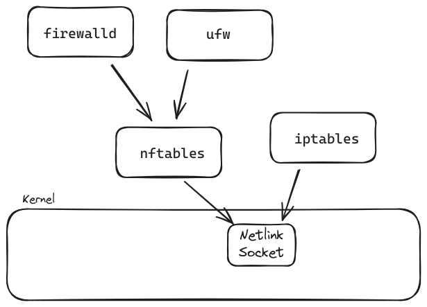

[Computer Networks From Scratch](https://www.networksfromscratch.com/)

[POV: I'm on my third coffee and you just asked me how the internet works - YouTube](https://www.youtube.com/watch?v=jjKFXlFNR4E)

[Here comes 5Gbps networking over standard cables | Ars Technica UK](http://arstechnica.co.uk/gadgets/2016/09/5gbps-ethernet-standard-details-8023bz/)

[科普文：详解音视频直播中的低延时](https://mp.weixin.qq.com/s?__biz=MzUxMzcxMzE5Ng==&mid=2247488746&idx=1&sn=f4e7471c1886347d663f81f97399cd3e&chksm=f951a1a9ce2628bf7d6b48d6a9ca2647cd3d7eb45a335f997ecbfb962c5832b368918fa13d0c&scene=27#wechat_redirect)

[Ethernet (50th Birthday) - Computerphile - YouTube](https://www.youtube.com/watch?v=TkOVgkcrvbg)
[Networking: RJ45, DAC, or Fiber – Which Is Best in Your Rack? - YouTube](https://www.youtube.com/watch?v=dmHdhSzfwHQ)

[Ten Windows 10 network commands everyone one should know - TechRepublic](https://www.techrepublic.com/article/ten-windows-10-network-commands-everyone-one-should-know/)

## OSI Model

[OSI model - Wikiwand](https://www.wikiwand.com/en/OSI_model)
[The OSI model explained: How to understand (and remember) the 7 layer network model | Network World](https://www.networkworld.com/article/3239677/lan-wan/the-osi-model-explained-how-to-understand-and-remember-the-7-layer-network-model.html)
[The OSI Model – The 7 Layers of Networking Explained in Plain English](https://www.freecodecamp.org/news/osi-model-networking-layers-explained-in-plain-english/)

[What Is Layer-2 and Why Do We Need It? « ipSpace.net by @ioshints](http://blog.ipspace.net/2015/04/what-is-layer-2-and-why-do-we-need-it.html)
[IP addresses & routing - Julia Evans](https://jvns.ca/blog/2018/07/24/ip-addresses-routing/)

[VXLAN Mikrotik - RouterOS v7 - YouTube](https://www.youtube.com/watch?v=Ia1YWqgwXRI) Layer 2 over Layer 3 network

[Bridging and Routing: is there a difference? « ipSpace.net by @ioshints](http://blog.ipspace.net/2010/07/bridging-and-routing-is-there.html)
[Bridging and Routing, Part II « ipSpace.net by @ioshints](http://blog.ipspace.net/2010/07/bridging-and-routing-part-ii.html)
[小白成神之路，网络知识看这一期足矣！软路由 桥接 端口转发 旁路由 单臂路由 IPv4 IPv6 DDNS - YouTube](https://www.youtube.com/watch?v=8J0Up8B7YkU)

[Lecture OSI and TCP/IP Models - YouTube](https://www.youtube.com/watch?v=Pje0l5r7_lk)
[The OSI Model Demystified - YouTube](https://www.youtube.com/watch?v=HEEnLZV2wGI)

## Course/Video

[Viatto - YouTube](https://www.youtube.com/@KeepingITSimple)
[David Bombal - YouTube](https://www.youtube.com/@davidbombal)
[Chris Greer - YouTube](https://www.youtube.com/@ChrisGreer)

[Computer Networks: Crash Course Computer Science #28 - YouTube](https://www.youtube.com/watch?v=3QhU9jd03a0)
[The Internet: Crash Course Computer Science #29 - YouTube](https://www.youtube.com/watch?v=AEaKrq3SpW8)
[The World Wide Web: Crash Course Computer Science #30 - YouTube](https://www.youtube.com/watch?v=guvsH5OFizE)
[Your Ultimate Guide To Computer Networking in 2019](https://www.potatopirates.game/ultimate-computer-network-guide)

[FREE CCNA 200-301 // Complete Course // NetworkChuck 2023 - YouTube](https://www.youtube.com/playlist?list=PLIhvC56v63IJVXv0GJcl9vO5Z6znCVb1P) ❗!important
[CompTIA Network+ N10-007 Training Course - YouTube](https://www.youtube.com/playlist?list=PLG49S3nxzAnmpdmX7RoTOyuNJQAb-r-gd)
[Video Notes: Tanenbaum, Wetherall Computer Networks 5e](http://media.pearsoncmg.com/ph/streaming/esm/tanenbaum5e_videonotes/tanenbaum_videoNotes.html)

## Netbox

[NetBox Documentation](https://docs.netbox.dev/en/stable/)
[netbox-community/netbox-docker: 🐳 Docker Image of NetBox](https://github.com/netbox-community/netbox-docker)

[Home | NetBox](https://demo.netbox.dev/)

[i HATE network documentation....but NetBox might help // ft. Jeremy Cioara - YouTube](https://www.youtube.com/watch?v=9z1_14YSaDY)
[NetBox - Open Source Network Design and Mapping Software from homelab to network engineers. - YouTube](https://www.youtube.com/watch?v=sHvMyRHA7sY)

## LAN cable

[你根本不懂网线！双绞线 超五类 Cat5e 六类 Cat6 七类 Cat7 八类 Cat8.1 看这一期就够了哦～ - YouTube](https://www.youtube.com/watch?v=E3whld0N3d8)

[Category 5 cable - Wikiwand](https://www.wikiwand.com/en/Category_5_cable)
[Category 6 cable - Wikiwand](https://www.wikiwand.com/en/Category_6_cable)

[拉 Cat.6A 網路線｜網路線有什麼差別?｜簡易測試 WiFi6 速度居然差這麼多!!｜ 10Gbps 區網【水電爸爸】 - YouTube](https://www.youtube.com/watch?v=sUbcXGAuaXQ)
[Cat 6 vs Cat 7. What is the difference - YouTube](https://www.youtube.com/watch?v=f2bILsfu8NM)

[CAT 8 vs CAT 7 Ethernet Cables - Is there a difference? - YouTube](https://www.youtube.com/watch?v=JEMIGSOTwe0)

| Cat5e   | Cat6         | Cat6A         | Cat7         | Cat8         |
| ------- | ------------ | ------------- | ------------ | ------------ |
| 125MHz  | 250MHz       | 500MHz        | 600MHz       | 2000MHz      |
| 2.5Gbps | 10Gbps (55m) | 10Gbps (100m) | 40Gbps (10m) | 40Gbps (30m) |

Cat7 has double shielding to prevent RF interference and crosstalk

[2.5gbit is AWESOME, but it WON'T make your Internet faster... - YouTube](https://www.youtube.com/watch?v=iBbcgqnFdIw) uses Cat.5e cables

[We just leveled up HARDCORE - YouTube](https://www.youtube.com/watch?v=EdR2cujwke4) fiber

## IP and Subnet

[IPv4 - Wikiwand](https://www.wikiwand.com/en/IPv4)
IPv4 address are written in [dot-decimal notation](https://www.wikiwand.com/en/Dot-decimal_notation): `192.0.2.128`

[IPv6 - Wikiwand](https://www.wikiwand.com/en/IPv6) [IPv6 address - Wikiwand](https://www.wikiwand.com/en/IPv6_address#/Special_addresses) IPv4-mapped IPv6 address:`::ffff:192.0.2.128`or`::ffff:c000:0280`
[wojtekka/6tunnel: Tunnelling for application that don't speak IPv6](https://github.com/wojtekka/6tunnel)
[DS-Lite – IPv4 over IPv6 and NAT | Citrix Blogs](https://www.citrix.com/blogs/2012/03/22/ds-lite-%E2%80%93-ipv4-over-ipv6-and-nat/)

[IPv6 keeps getting hacked on Windows - YouTube](https://www.youtube.com/watch?v=Z_QlUyYlUCg)
[IPv6 from scratch - the very basics of IPv6 - YouTube](https://www.youtube.com/watch?v=oItwDXraK1M)
[cheat-sheets/ipv6.md at main · onemarcfifty/cheat-sheets](https://github.com/onemarcfifty/cheat-sheets/blob/main/networking/ipv6.md)

[RFC 1918 - Address Allocation for Private Internets](https://datatracker.ietf.org/doc/html/rfc1918)
[Reserved IP addresses - Wikiwand](https://www.wikiwand.com/en/Reserved_IP_addresses)
Private IP: not used for routing in internet, use behind NAT
Loopback IP: managed by OS, virtual network interface
Link-local: in absence of DHCP or static address, not routing

[Classful network - Wikiwand](https://www.wikiwand.com/en/Classful_network)
[ExamPointers.com - Online IPv4 Subnet Mask Calculator](http://ccna.exampointers.com/subnet.phtml)
[CIDR Utility Tool | IP Address Guide](http://www.ipaddressguide.com/cidr)
[mhausenblas/cidrchk: CLI tool for CIDR range operations (check, generate)](https://github.com/mhausenblas/cidrchk)
[IP Calculator / IP Subnetting](http://jodies.de/ipcalc)
[kjokjo/ipcalc](https://github.com/kjokjo/ipcalc)

[RFC 4632 - Classless Inter-domain Routing (CIDR): The Internet Address Assignment and Aggregation Plan](https://datatracker.ietf.org/doc/html/rfc4632)
[Classless Inter-Domain Routing - Wikiwand](https://www.wikiwand.com/en/Classless_Inter-Domain_Routing)
[What is CIDR Notation?](http://whatismyipaddress.com/cidr)
[What is CIDR (Classless Inter-Domain Routing or supernetting)? - Definition from WhatIs.com](http://searchnetworking.techtarget.com/definition/CIDR)

## VLAN

[Subnets vs VLANs - YouTube](https://www.youtube.com/watch?v=6_giEv20En0)
[How to structure networks with VLANs - YouTube](https://www.youtube.com/watch?v=lhrlrvVZnII)

[Network Virtual LANs (VLANs), Explained Simply (VLANs, Part 1) - YouTube](https://www.youtube.com/watch?v=C81pyQaJgj8)
[VLANs - Configuring Three Ethernet Switches (VLANs, Part 2) - YouTube](https://www.youtube.com/watch?v=84B0iCqah_c)

[Setting up VLANs in pfSense - YouTube](https://www.youtube.com/watch?v=rHE6MCL4Gz8)
[What is a VLAN??? - How to setup VLANs in your Home Network and WHY YOU NEED THEM - YouTube](https://www.youtube.com/watch?v=XdqP14NclZ0)

## DHCP

[RFC 1541 - Dynamic Host Configuration Protocol](https://datatracker.ietf.org/doc/html/rfc1541)
[RFC 2136 - Dynamic Updates in the Domain Name System (DNS UPDATE)](https://datatracker.ietf.org/doc/html/rfc2136)

[Why DHCP's days might be numbered | Network World](https://www.networkworld.com/article/3297800/internet/why-dhcps-days-might-be-numbered.html)
[Do DHCP and DNS Servers Communicate? (With wireshark) - YouTube](https://www.youtube.com/watch?v=FYcO4ZshG8Q)
[How DHCP Works // DHCP EXPLAINED - YouTube](https://www.youtube.com/watch?v=Cy0M54GSpBg)

## Routing

[What is Routing, Dynamic Routing Protocols and OSPF?? - YouTube](https://www.youtube.com/watch?v=f9FDNCTFfeY)

[Dynamic Routing using OSPF - YouTube](https://www.youtube.com/watch?v=N_K1ROvqMMA)
[Dynamic routing | FortiGate / FortiOS 6.0.0 | Fortinet Document Library](https://docs.fortinet.com/document/fortigate/6.0.0/handbook/73754/dynamic-routing)

[Why was Facebook down for five hours? - YouTube](https://www.youtube.com/watch?v=-wMU8vmfaYo) DNS, BGP
[What is BGP? | BGP routing explained | Cloudflare](https://www.cloudflare.com/learning/security/glossary/what-is-bgp/)
[Hurricane Electric BGP Toolkit](https://bgp.he.net/) IP range lookup

[Routing vs. Forwarding vs. Switching | Baeldung on Computer Science](https://www.baeldung.com/cs/routing-vs-forwarding-vs-switching)

[Configuring Multiple Default Routes in Linux | Darien Kindlund's Blog](https://kindlund.wordpress.com/2007/11/19/configuring-multiple-default-routes-in-linux/)
[Two Default Gateways on One System - Thomas-Krenn-Wiki](https://www.thomas-krenn.com/en/wiki/Two_Default_Gateways_on_One_System)
[LiNUX Horizon - Linux Advanced Routing mini HOWTO](http://www.linuxhorizon.ro/iproute2.html)
[How To Add Route on Linux – devconnected](https://devconnected.com/how-to-add-route-on-linux/)

[linux - Is it possible to have multiple default gateways for outbound connections? - Unix & Linux Stack Exchange](https://unix.stackexchange.com/questions/345862/is-it-possible-to-have-multiple-default-gateways-for-outbound-connections)
`ip route add` commands can be added with `post-up` directive to `/etc/network/interfaces`

```sh
# show routing tables, 4 by defaults
cat /etc/iproute2/rt_tables
# show rules on specific routing table
ip route show table 255
ip route show table 254  # main route
ip route show  # same as above

cat /etc/iptables/iptables.rules
```

[linux - What is the difference between "route" and "ip route"? - Server Fault](https://serverfault.com/questions/523388/what-is-the-difference-between-route-and-ip-route)

[Making Sense of Windows Routing Tables](http://techgenix.com/Making-Sense-Windows-Routing-Tables/)

## Network Interface

### Interface Name

[NetworkInterfaceNames - Debian Wiki](https://wiki.debian.org/NetworkInterfaceNames)
[networking - Explanation of 70-persistent-net.rules script - Ask Ubuntu](https://askubuntu.com/questions/505421/explanation-of-70-persistent-net-rules-script)

### Interface Bonding

[Linux Bonding, LLDP, and MAC Flapping - Packet Pushers](https://packetpushers.net/linux-bonding-lldp-and-mac-flapping/)

## Netlink

[Netlink - Wikiwand](https://www.wikiwand.com/en/Netlink)
[Introduction to Netlink — The Linux Kernel documentation](https://www.kernel.org/doc/html/next/userspace-api/netlink/intro.html)

## TCP

[How TCP Sockets Work](https://eklitzke.org/how-tcp-sockets-work)
[Nagle's algorithm - Wikiwand](https://www.wikiwand.com/en/Nagle%27s_algorithm)

Chris Greer
[How TCP Works - YouTube](https://www.youtube.com/playlist?list=PLW8bTPfXNGdAZIKv-y9v_XLXtEqrPtntm)
[Sharkfest Sessions - YouTube](https://www.youtube.com/playlist?list=PLW8bTPfXNGdDL00uA4rcR76dfF7CwXyTo)
[How TCP really works // Three-way handshake // TCP/IP Deep Dive - YouTube](https://www.youtube.com/watch?v=rmFX1V49K8U)
[Troubleshooting slow networks with Wireshark // wireshark filters // Wireshark performance - YouTube](https://www.youtube.com/watch?v=aEss3CG49iI)

David Bombal
[Wireshark - YouTube](https://www.youtube.com/playlist?list=PLhfrWIlLOoKMO9-7NxYN3TxCdcDecwOtj)

[TCP vs UDP Crash Course - YouTube](https://www.youtube.com/watch?v=qqRYkcta6IE)

TCP states
Disconnected but still holding socket
[What Is a Listening Port? | It Still Works](https://itstillworks.com/listening-port-8721837.html)

[MultiPath TCP - Linux Kernel implementation : Main - Home Page browse](https://www.multipath-tcp.org/)
[Multipath TCP Support Is Working Its Upstream - First Bits Landing With Linux 5.6 - Phoronix](https://www.phoronix.com/scan.php?page=news_item&px=Linux-5.6-Starts-Multipath-TCP)

[TCP 的那些事儿（上） | | 酷 壳 - CoolShell](https://coolshell.cn/articles/11564.html)
[TCP 的那些事儿（下） | | 酷 壳 - CoolShell](https://coolshell.cn/articles/11609.html)

[Beej's Guide to Network Programming](https://beej.us/guide/bgnet/) BSD sockets API
[99% of Developers Don't Get Sockets - YouTube](https://www.youtube.com/watch?v=D26sUZ6DHNQ)

## Reliable UDP

[draft-ietf-sigtran-reliable-udp-00 - RELIABLE UDP PROTOCOL](https://datatracker.ietf.org/doc/html/draft-ietf-sigtran-reliable-udp-00)

[怎么让不可靠的 UDP 可靠？](https://mp.weixin.qq.com/s?__biz=MzIwMzg1ODcwMw==&mid=2247487188&idx=1&sn=2e1280a6a672d66b4f87c036a6c44ca6&chksm=96c9b8b4a1be31a2aca62731912f594f380bf3b4326797a2a013c54e7789095bf5721b5f55f1#rd)
[Reliable UDP (RUDP): The Next Big Streaming Protocol? - Streaming Media Magazine](<http://www.streamingmedia.com/Articles/Editorial/Featured-Articles/Reliable-UDP-(RUDP)-The-Next-Big-Streaming-Protocol-85316.aspx>)

## Wireshark

Wireshark can open many dump formats (e.g. `.cap`/`.pcap` from `tcpdump`)

[Wireshark · Go Deep.](https://www.wireshark.org/)
[Track Down Network Problems With Wireshark | PCWorld](http://www.pcworld.com/article/186871/track_down_network_problems_with_wireshark.html)

Chris Greer
[Wireshark with Chris Greer - YouTube](https://www.youtube.com/playlist?list=PLhfrWIlLOoKO8522T1OAhR5Bb2mD6Qy_l)
[How to Use Wireshark - YouTube](https://www.youtube.com/playlist?list=PLW8bTPfXNGdA_TprronpuNh7Ei8imYppX)
[Wireshark for Cybersecurity and Threat Hunting - YouTube](https://www.youtube.com/playlist?list=PLW8bTPfXNGdAY3AfCNtm12Ogzryfs7Ket)
[Wireshark Masterclass - YouTube](https://www.youtube.com/playlist?list=PLW8bTPfXNGdC5Co0VnBK1yVzAwSSphzpJ)

[gcla/termshark: A terminal UI for tshark, inspired by Wireshark](https://github.com/gcla/termshark)

[IETF-OPSAWG-WG/draft-ietf-opsawg-pcap: PCAP next generation file format specification](https://github.com/IETF-OPSAWG-WG/draft-ietf-opsawg-pcap) `.pcapng`

## Anycast

> or "Addressing methods"?

[Anycast - Wikiwand](https://www.wikiwand.com/en/Anycast)
[A Brief Primer on Anycast](https://blog.cloudflare.com/a-brief-anycast-primer/)
[Load Balancing without Load Balancers](https://blog.cloudflare.com/cloudflares-architecture-eliminating-single-p/)
[What is Anycast and How it works](http://www.slashroot.in/what-anycast-and-how-it-works)

## Router

[[router]]

## RDMA

InfiBand
Fabrics: A local-area RDMA network is usually referred to as a fabric.
[RDMA over Converged Ethernet - Wikiwand](https://www.wikiwand.com/en/RDMA_over_Converged_Ethernet) RoCE, replaces
[基於融合以太網的 RDMA - Wikiwand](https://www.wikiwand.com/zh-hk/%E5%9F%BA%E4%BA%8E%E8%9E%8D%E5%90%88%E4%BB%A5%E5%A4%AA%E7%BD%91%E7%9A%84RDMA)
[Remote direct memory access - Wikiwand](https://www.wikiwand.com/en/Remote_direct_memory_access)
[远程直接内存访问 - Wikiwand](https://www.wikiwand.com/zh/%E8%BF%9C%E7%A8%8B%E7%9B%B4%E6%8E%A5%E5%86%85%E5%AD%98%E8%AE%BF%E9%97%AE)

[RoCE 101: RDMA over Converged Ethernet - YouTube](https://www.youtube.com/watch?v=os9llKRFYvs)
[NVMe over Fabrics Demystified - YouTube](https://www.youtube.com/watch?v=ywh2N6cl_8M)
[RDMA 技术详解（一）：RDMA 概述 - 知乎](https://zhuanlan.zhihu.com/p/55142557)
[RDMA 技术博客\_MasterT-J 的博客-CSDN 博客](https://blog.csdn.net/qq_21125183/category_7711389.html)

## SDN

[SDN dilemma: Linux kernel networking vs. kernel bypass | InfoWorld](http://www.infoworld.com/article/3189664/networking/sdn-dilemma-linux-kernel-networking-vs-kernel-bypass.html)
[What’s the difference between SDN and NFV? | Network World](http://www.networkworld.com/article/3206709/lan-wan/what-s-the-difference-between-sdn-and-nfv.html)

[What Is SD-WAN & Why You Should Care ? – codeburst](https://codeburst.io/sd-wan-for-business-a-new-wan-is-here-6fe8e198df4d)

## VPN

[[vpn]]

## NAT Transversal

[[ssh#SSH Tunneling]]

[Expose server behind NAT with WireGuard and a VPS](https://golb.hplar.ch/2019/01/expose-server-vpn.html)

[tinc](http://tinc-vpn.org/) strategies adopted by Nebula

[VPN.net – Hamachi by LogMeIn](https://www.vpn.net/)

[Localtunnel ~ Expose yourself to the world](https://localtunnel.github.io/www/) HTTP only?

[File transfer between any computers | Zack Scholl](https://schollz.com/blog/croc6/)
[schollz/croc: Easily and securely send things from one computer to another](https://github.com/schollz/croc)
[howeyc/crocgui: GUI for croc](https://github.com/howeyc/crocgui)

[RFC 8489: Session Traversal Utilities for NAT (STUN)](https://datatracker.ietf.org/doc/html/rfc8489)
[RFC 8445: Interactive Connectivity Establishment (ICE): A Protocol for Network Address Translator (NAT) Traversal](https://datatracker.ietf.org/doc/html/rfc8445)
[RFC 8863 - Interactive Connectivity Establishment Patiently Awaiting Connectivity (ICE PAC)](https://datatracker.ietf.org/doc/html/rfc8863)

### inlets

[inlets: Cloud Native Tunnel](https://docs.inlets.dev/#/)
[inlets/inlets-archived: Cloud Native Tunnel, now inlets PRO](https://github.com/inlets/inlets-archived)
[inlets/inlets-pro: Secure HTTP and TCP tunnels that just work](https://github.com/inlets/inlets-pro) client requires license

### bore

[ekzhang/bore: 🕳 bore is a simple CLI tool for making tunnels to localhost](https://github.com/ekzhang/bore)

### ngrok

[ngrok - secure introspectable tunnels to localhost](https://ngrok.com/)
[Test Your Webhooks Locally with ngrok - Twilio](https://www.twilio.com/blog/2013/10/test-your-webhooks-locally-with-ngrok.html)
[6 awesome reasons to use ngrok when testing webhooks - Twilio](https://www.twilio.com/blog/2015/09/6-awesome-reasons-to-use-ngrok-when-testing-webhooks.html)
[How to Use ngrok: Easily Share Your Local Server [Step-by-Step] - SitePoint](https://www.sitepoint.com/use-ngrok-test-local-site/)

### pgrok

[pgrok/pgrok: Poor man's ngrok - a multi-tenant HTTP reverse tunnel solution through SSH remote port forwarding](https://github.com/pgrok/pgrok)

### Cloudflare Tunnel

[A Boring Announcement: Free Tunnels for Everyone](https://blog.cloudflare.com/tunnel-for-everyone/)
[Cloudflare Tunnel | Secure Tunneling Software | Cloudflare](https://www.cloudflare.com/products/tunnel/)
[Share development environments · Cloudflare for Teams documentation](https://developers.cloudflare.com/cloudflare-one/tutorials/share-new-site)
[A free Argo Tunnel for your next project](https://blog.cloudflare.com/a-free-argo-tunnel-for-your-next-project/)

### telebit

[Telebit™ Cloud](https://telebit.cloud/)

## Cloudflare Warp

[Introducing Warp: Fixing Mobile Internet Performance and Security](https://blog.cloudflare.com/1111-warp-better-vpn/)
[WARP is here (sorry it took so long)](https://blog.cloudflare.com/announcing-warp-plus/)
[The Technical Challenges of Building Cloudflare WARP](https://blog.cloudflare.com/warp-technical-challenges/)

[What is Cloudflare's WARP VPN and should you use it? | Android Central](https://www.androidcentral.com/what-cloudflares-warp-and-should-you-use-it)
[Cloudflare 1.1.1.1 with Warp review: faster web browsing, but not a real VPN | WIRED UK](https://www.wired.co.uk/article/cloudflare-1111-with-warp)
[Cloudflare Finally Launches Warp, But It's Not a Mobile VPN | News & Opinion | PCMag.com](https://www.pcmag.com/news/370979/cloudflare-finally-launches-warp-but-its-not-a-mobile-vpn)

## Proxy

[[cyber-security#proxychains]]

[The Ultimate Guide to HTTP vs. SOCKS Proxies in 2023](https://research.aimultiple.com/http-vs-socks-proxy/)

[10 Free Proxy Servers for Anonymous Web Browsing](https://www.fossmint.com/free-proxy-for-anonymous-web-browsing/)
[Прокси сервера бесплатно, бесплатный proxy list online, анонимные http, ssl, socks прокси, free proxy list](https://spys.one/)

## Firewall

[9 Best Next-Generation Firewall (NGFW) Solutions for 2023](https://www.esecurityplanet.com/products/top-ngfw/)
[OpenWRT vs pfSense: Best Open Source Firewall Solution - Virtualization Howto](https://www.virtualizationhowto.com/2023/05/openwrt-vs-pfsense-best-open-source-firewall-solution/)

[Open Port Check Tool - Test Port Forwarding on Your Router](https://www.yougetsignal.com/tools/open-ports/)
[Build a Firewall that tells Hackers to Try Harder - YouTube](https://www.youtube.com/watch?v=YihZtioFD4o)

[pfSense® - World's Most Trusted Open Source Firewall](https://www.pfsense.org/)
[your home router SUCKS!! (use pfSense instead) - YouTube](https://www.youtube.com/watch?v=lUzSsX4T4WQ)

[OPNsense® a true open source security platform and more - OPNsense® is a true open source firewall and more](https://opnsense.org/)
[HOW TO SETUP OPNsense: From First Boot to Fully Functional (with IPv6!) - YouTube](https://www.youtube.com/watch?v=Yb7JdIFriKI)
[pfSense vs OPNsense](https://teklager.se/en/pfsense-vs-opnsense/)
[pfSense® 与 OPNsense® 技术比较 | 鐵血男兒的 BLOG](https://pfschina.org/wp/?p=28)



### iptables

[iptables - ArchWiki](https://wiki.archlinux.org/title/Iptables)
[iptables - Debian Wiki](https://wiki.debian.org/iptables)
[An IPTABLES Primer | Daniel Miessler](https://danielmiessler.com/study/iptables/)
[How To Configure iptables Firewall In Linux - LinuxAndUbuntu - Linux News | Apps Reviews | Linux Tutorials HowTo](http://www.linuxandubuntu.com/home/how-to-configure-iptables-firewall-in-linux)

[Viewing all iptables rules - Unix & Linux Stack Exchange](https://unix.stackexchange.com/questions/205867/viewing-all-iptables-rules)
[how to query iptables](https://www.phind.com/search?cache=cz5j3ek642nnzmkom9ycqa0b)

### netfilter/nftables (`nft`)

> successor of iptables

[nftables - ArchWiki](https://wiki.archlinux.org/title/Nftables)
[nftables wiki](https://wiki.nftables.org/wiki-nftables/index.php/Main_Page)

[netfilter/iptables project homepage - The netfilter.org project](https://nftables.org/)
[netfilter/iptables project homepage - The netfilter.org "nftables" project](https://netfilter.org/projects/nftables/)
[netfilter/iptables project homepage - Documentation about the netfilter/iptables project](http://netfilter.org/documentation/)

[google/nftables: This repository contains a Go module to interact with Linux nftables (the iptables successor).](https://github.com/google/nftables/)

[Traffic Rules » Linux Magazine](http://www.linux-magazine.com/Issues/2019/226/Nftables)
[Why you will love nftables – To Linux and beyond !](https://home.regit.org/2014/01/why-you-will-love-nftables/)
[ungleich blog - IPtables vs. nftables](https://digitalglarus.ch/en-us/cms/blog/2018/08/19/iptables-vs-nftables/)
[Why you will love nftables – To Linux and beyond !](https://home.regit.org/2014/01/why-you-will-love-nftables/)

### Firewalld

> enabled in EndeavourOS by default
> uses nftables by default

[Firewalld - ArchWiki](https://wiki.archlinux.org/title/Firewalld)
[Configure a Firewall with Firewalld (Create and List Rules) | Linode Docs](https://www.linode.com/docs/guides/introduction-to-firewalld-on-centos/)

```sh
firewall-cmd --get-active-zones

# list zone rules
firewall-cmd --info-zone=home
firewall-cmd --info-zone=public

# change zone
firewall-cmd --zone=home --change-interface=wlan0
```

### Uncomplicated Firewall (`ufw`)

[Uncomplicated Firewall - Wikiwand](https://www.wikiwand.com/en/Uncomplicated_Firewall) Manages `iptables`/`nftables` rules, available in Ubuntu
[UncomplicatedFirewall - Ubuntu Wiki](https://wiki.ubuntu.com/UncomplicatedFirewall)
[Uncomplicated Firewall - ArchWiki](https://wiki.archlinux.org/title/Uncomplicated_Firewall)
[ufw: program for managing a netfilter firewall | ufw System Administration | Man Pages | ManKier](https://www.mankier.com/8/ufw)
[Linux UFW (Uncomplicated Firewall) Configuration Made Easy](https://www.itprotoday.com/linux-os/linux-ufw-uncomplicated-firewall-configuration-made-easy)
[How to Set Up a Firewall with UFW on Ubuntu 20.04 | Linuxize](https://linuxize.com/post/how-to-setup-a-firewall-with-ufw-on-ubuntu-20-04/)
[How to Set Up UFW Firewall on Ubuntu 24.04 LTS in 5 Minutes - nixCraft](https://www.cyberciti.biz/faq/how-to-set-up-ufw-firewall-on-ubuntu-24-04-lts-in-5-minutes/)
[UFW Essentials: Common Firewall Rules and Commands | DigitalOcean](https://www.digitalocean.com/community/tutorials/ufw-essentials-common-firewall-rules-and-commands)
[How to Configure a Firewall with UFW](https://www.linode.com/docs/security/firewalls/configure-firewall-with-ufw/)
[Using Firewall With UFW in Ubuntu Linux [Beginner's Guide]](https://itsfoss.com/ufw-ubuntu/)
[How to work with your firewall (UFW - Uncomplicated Firewall)](https://webdock.io/en/docs/how-guides/security-guides/how-work-your-firewall-ufw-uncomplicated-firewall)

```sh
ufw status
ufw show added

ufw allow PORT
ufw allow PORT1:PORT2/tcp

ufw delete allow PORT
```

### GFW

[DuyaoSS-机场测速和简介](https://www.duyaoss.com/)
[逗比根据地 - 世界那么逗，我想出去看看](https://doubibackup.com/)
[翻墙全解析 硬核翻墙系列视频 系统学习翻墙技术原理 一切关于翻墙你需要知道的 - YouTube](https://www.youtube.com/playlist?list=PLqybz7NWybwUgR-S6m78tfd-lV4sBvGFG)❗!important

[中国防火墙究竟是怎么运作的？为什么我说防火墙才是最辱华的东西？中共是如何通过言论管控来削弱地方政府力量的？史上对中国防火墙最透彻的一次探讨 | 互联网防火墙 | 翻墙 | 愚民政策 | 言论自由 - YouTube](https://www.youtube.com/watch?v=i8Iiv9yFTdM)
[【我翻牆不違法】一句話，揭開中國翻牆背後沒人敢講的真相！| 張內咸脫口秀 - YouTube](https://www.youtube.com/watch?v=KqvPzPwQem0) 2025翻牆不違法

#### Soft Router

> offload VPN channel from router

[[#Firewall]]

[Your Router Sucks. Build Your Own Instead! - YouTube](https://www.youtube.com/watch?v=_IzyJTcnPu8)

[家用软路由有必要吗？科学上网必须要软路由？软路由科学上网是智商税？！ - YouTube](https://www.youtube.com/watch?v=ilcXa6D6Kjw)
[入门软路由？一篇就够了！真正给小白看的软路由入门指南 - YouTube](https://www.youtube.com/watch?v=iuvTfaid_zc)
[翻墙软件 路由器 软路由硬件翻墙 和网关模式翻墙等多种翻墙方式的利弊和特点 你更适合哪一种？【硬核翻墙系列】第三期 - YouTube](https://www.youtube.com/watch?v=f9ohvZyQrmY)
[只要 400？轻松跑满千兆的一线大厂软路由还能放进弱电箱 - YouTube](https://www.youtube.com/watch?v=6Ka73dXWFe4)
[我依然推荐用linux网关取代openwrt旁路由，稳定、便宜、兼容性拉满。 - YouTube](https://www.youtube.com/watch?v=DqubruPMmhU)

[国伟R86S G系 2.5G多网口N5105N6005万兆双光口wifi6千兆工控主机-淘宝网](https://item.taobao.com/item.htm?id=685359555622)

[Home - sing-box](https://sing-box.sagernet.org/)
[SagerNet/sing-box: The universal proxy platform](https://github.com/SagerNet/sing-box)

[opusb/tpclash2](https://github.com/opusb/tpclash2)

## BPF/eBPF

> [[microservice#Service mesh]]  
> [[docker#Cilium]]
> eBPF should have been called "Kernel Script"

[BPF · Linux kernel code execution engine](https://facebookmicrosites.github.io/bpf/)
[Berkeley Packet Filter - Wikiwand](https://www.wikiwand.com/en/Berkeley_Packet_Filter)

[The eBPF stack](https://ebpf.io/)
[EBPF - Wikiwand](https://www.wikiwand.com/en/EBPF)
[Dive into BPF: a list of reading material](https://qmonnet.github.io/whirl-offload/2016/09/01/dive-into-bpf/)
[A Gentle Introduction to eBPF](https://www.infoq.com/articles/gentle-linux-ebpf-introduction/)

[The BSD packet filter | Proceedings of the USENIX Winter 1993 Conference Proceedings on USENIX Winter 1993 Conference Proceedings](https://dl.acm.org/doi/10.5555/1267303.1267305)

[A thorough introduction to eBPF [LWN.net]](https://lwn.net/Articles/740157/)
[BPF comes to firewalls [LWN.net]](https://lwn.net/Articles/747551/)
[An intro to using eBPF to filter packets in the Linux kernel | Opensource.com](https://opensource.com/article/17/9/intro-ebpf)
[What is eBPF? - DEV Community](https://dev.to/deepeshaburse/what-is-ebpf-2bkb)
[bpfilter » ADMIN Magazine](http://www.admin-magazine.com/Archive/2019/50/Bpfilter-offers-a-new-approach-to-packet-filtering-in-Linux)
[Primer: How XDP and eBPF Speed Network Traffic via the Linux Kernel – The New Stack](https://thenewstack.io/primer-how-xdp-and-ebpf-speed-network-traffic-via-the-linux-kernel/)
[Why is the kernel community replacing iptables with BPF? — Cilium](https://cilium.io/blog/2018/04/17/why-is-the-kernel-community-replacing-iptables/)

[Linux eBPF Tracing Tools](https://brendangregg.com/ebpf.html)
[eBPF: One Small Step](http://www.brendangregg.com/blog/2015-05-15/ebpf-one-small-step.html)
[Linux BPF Superpowers](http://www.brendangregg.com/blog/2016-03-05/linux-bpf-superpowers.html)

[Exploring eBPF for Windows: Opportunities and Limitations](https://www.itprotoday.com/microsoft-windows/exploring-ebpf-for-windows-opportunities-and-limitations)

### Beyond Networking

[Kernelless Kernel Programming (eBPF) - Computerphile - YouTube](https://www.youtube.com/watch?v=J_EehoXLbIU)

[How io_uring and eBPF Will Revolutionize Programming in Linux – The New Stack](https://thenewstack.io/how-io_uring-and-ebpf-will-revolutionize-programming-in-linux/)
[BPF For Observability: Getting Started Quickly | Linux Journal](https://www.linuxjournal.com/content/bpf-observability-getting-started-quickly)
[Exploring the Pros and Cons of eBPF: Is It the Right Tool for You? | ITPro Today: IT News, How-Tos, Trends, Case Studies, Career Tips, More](https://www.itprotoday.com/it-operations-and-management/when-not-use-ebpf-observability-and-security)
[Learn eBPF Tracing: Tutorial and Examples](http://www.brendangregg.com/blog/2019-01-01/learn-ebpf-tracing.html)

[eBPF Benefits for IT Operations Teams Seeking Better Observability](https://www.itprotoday.com/it-operations-and-management/how-ebpf-benefits-it-operations-teams-seeking-improve-observability)
[How eBPF Will Revolutionize Container Monitoring](https://www.itprotoday.com/containerization/how-ebpf-will-revolutionize-container-monitoring)
[How eBPF Enhances Linux Security and Monitoring](https://www.itprotoday.com/linux-os/securing-linux-systems-with-ebpf-the-future-of-in-kernel-observability-and-security)
[Introduction To Writing eBPF Programs for Linux Security](https://www.itprotoday.com/linux-os/introduction-to-writing-ebpf-programs-for-linux-security)

### Also on Windows

[microsoft/ebpf-for-windows: eBPF implementation that runs on top of Windows](https://github.com/Microsoft/ebpf-for-windows)
[Microsoft at Work to Bring eBPF to Windows](https://www.infoq.com/news/2021/05/microsoft-ebpf-windows/)

[iovisor/ubpf: Userspace eBPF VM](https://github.com/iovisor/ubpf)

### Tools

[zoidbergwill/awesome-ebpf](https://github.com/zoidbergwill/awesome-ebpf)
[pratyushanand/learn-bpf](https://github.com/pratyushanand/learn-bpf)

[trailofbits/linuxevents: A sample PoC for container-aware exec events for osquery](https://github.com/trailofbits/linuxevents)
[trailofbits/ebpf-verifier: Harness for the Linux kernel eBPF verifier](https://github.com/trailofbits/ebpf-verifier)
[trailofbits/ebpfpub: ebpfpub is a generic function tracing library for Linux that supports tracepoints, kprobes and uprobes.](https://github.com/trailofbits/ebpfpub)
[trailofbits/ebpfault: A BPF-based syscall fault injector](https://github.com/trailofbits/ebpfault)
[trailofbits/btfparse: A C++ library that parses debug information encoded in BTF format](https://github.com/trailofbits/btfparse)
[trailofbits/ebpf-common: Various utilities useful for developers writing BPF tools](https://github.com/trailofbits/ebpf-common)

[BumbleBee](https://bumblebee.io/EN) [solo-io/bumblebee: Get eBPF programs running from the cloud to the kernel in 1 line of bash](https://github.com/solo-io/bumblebee)
[Solo BumbleBee makes Linux eBPF programming easier | ZDNet](https://www.zdnet.com/article/solo-bumblebee-makes-linux-ebpf-programming-easier/)

[iovisor/bcc: BCC - Tools for BPF-based Linux IO analysis, networking, monitoring, and more](https://github.com/iovisor/bcc)
[bcc/tutorial.md at master · iovisor/bcc](https://github.com/iovisor/bcc/blob/master/docs/tutorial.md)
[bcc/tutorial_bcc_python_developer.md at master · iovisor/bcc](https://github.com/iovisor/bcc/blob/master/docs/tutorial_bcc_python_developer.md)
[bcc/reference_guide.md at master · iovisor/bcc](https://github.com/iovisor/bcc/blob/master/docs/reference_guide.md)

[dylandreimerink/edb: An eBPF program debugger](https://github.com/dylandreimerink/edb)

[Linux eBPF Tracing Tools](http://www.brendangregg.com/ebpf.html)
[Virtual filesystems in Linux: Why we need them and how they work | Opensource.com](https://opensource.com/article/19/3/virtual-filesystems-linux) tracing kernel with eBPF

[bpftrace/bpftrace: High-level tracing language for Linux eBPF](https://github.com/bpftrace/bpftrace)
[An introduction to bpftrace for Linux | Opensource.com](https://opensource.com/article/19/8/introduction-bpftrace)
[bpftrace (DTrace 2.0) for Linux 2018](http://www.brendangregg.com/blog/2018-10-08/dtrace-for-linux-2018.html)

[aquasecurity/tracee: Linux Runtime Security and Forensics using eBPF](https://github.com/aquasecurity/tracee)
[Container Security with Liz Rice: DevOps and Docker Live Show (Ep 69) - YouTube](https://www.youtube.com/watch?v=UMtyHmu3_Do)

## Windows Filtering Platform (WFP)

> Windows' eBPF

[About Windows Filtering Platform - Win32 apps | Microsoft Learn](https://learn.microsoft.com/en-us/windows/win32/fwp/about-windows-filtering-platform)

[Guided tour inside WinDefender’s network inspection driver](https://blog.quarkslab.com/guided-tour-inside-windefenders-network-inspection-driver.html)

## GeoIP

[GeoIPLookup: Geolocation from the CLI » KBeezie](http://kbeezie.com/geoiplookup-command-line/)

[python-geoip — python-geoip](https://pythonhosted.org/python-geoip/) also downloads MaxMind database
[MaxMind GeoIP2 Python API — geoip2 documentation](https://geoip2.readthedocs.io/en/latest/)

## FTP

[Active FTP vs. Passive FTP, a Definitive Explanation](http://slacksite.com/other/ftp.html)

```sh
curl -T uploadfile -u user:passwd ftp://ftp.upload.com/
# upload as
curl -T uploadfile -u user:passwd ftp://ftp.upload.com/myfile
```

## Speed test

[How to Test Internet Connection Speed From the Terminal](https://www.maketecheasier.com/test-internet-connection-speed-from-terminal/)

[Speedtest by Ookla - The Global Broadband Speed Test](http://www.speedtest.net/run) with region selection
[Internet Speed Test | Fast.com](https://fast.com/en/)by Netflix

[OFCA Broadband Performance Test](http://speedtest.ofca.gov.hk/) web version requires Flash

## Physical layer

[How do internet cables distinguish between no data being sent and 0 bits being sent? - Quora](https://www.quora.com/How-do-internet-cables-distinguish-between-no-data-being-sent-and-0-bits-being-sent)

[Physical layer: signals, waves and transmission types - ICTShore.com](https://www.ictshore.com/free-ccna-course/physical-layer-signals/)
[Phase-locked loop - Wikiwand](https://www.wikiwand.com/en/Phase-locked_loop)
[Unipolar encoding - Wikiwand](https://www.wikiwand.com/en/Unipolar_encoding)

## NTP/PTP

[Network Time Protocol - Wikiwand](https://www.wikiwand.com/en/Network%20Time%20Protocol)

[Precision Time Protocol - Wikiwand](https://www.wikiwand.com/en/Precision_Time_Protocol)
[How works the Precision Time Protocol (PTP)?](https://www.bodet-time.com/products/time-server/articles-and-resources/1774-how-works-the-precision-time-protocol-ptp.html)
[PTP: Timing accuracy and precision for the future of computing](https://engineering.fb.com/2022/11/21/production-engineering/future-computing-ptp/)
[How Precision Time Protocol is being deployed at Meta](https://engineering.fb.com/2022/11/21/production-engineering/precision-time-protocol-at-meta/)

## Homeplug

[HomePlug - Wikiwand](https://www.wikiwand.com/en/HomePlug)
[一學就會！活用 Homeplug 電力貓解決大單位 WI-FI 死角問題的實戰攻略 - by Upsangel](https://upsangel.com/router-2/weak-wifi-homeplug-powerline-solution/)
[電力網路可以取代實體網路?｜實測 → 電力網路 V.S 實體網路｜電力線網路實用嗎？【弱電通】 - YouTube](https://www.youtube.com/watch?v=pV_vEpAJsVk)

[TL-WPA8630 KIT | AV1300 Gigabit Powerline ac Wi-Fi Kit | TP-Link Hong Kong](https://www.tp-link.com/hk/home-networking/powerline/tl-wpa8630-kit/)
[TL-PA8010P KIT | AV1200 Gigabit 電力線網路橋接器雙包組(Kit) | TP-Link 香港地區](https://www.tp-link.com/zh-hk/home-networking/powerline/tl-pa8010p-kit/)

## Scaling

[Dropbox traffic infrastructure: Edge network – Dropbox Tech Blog](https://blogs.dropbox.com/tech/2018/10/dropbox-traffic-infrastructure-edge-network/amp/)
[Optimizing web servers for high throughput and low latency | Dropbox Tech Blog](https://blogs.dropbox.com/tech/2017/09/optimizing-web-servers-for-high-throughput-and-low-latency/)

---

## TODO

[10 Most important open source networking projects | Network World](http://www.networkworld.com/article/3203369/lan-wan/10-most-important-open-source-networking-projects.html)

There's an open source insurgence happening in the networking industry.

Increasing demands on the network to scale to unprecedented levels and at the same time become more customized to specific use cases has led to the emergence of open source projects to support them.

**MORE AT NETWORK WORLD**: [Top 7 Linux IoT projects](http://www.networkworld.com/article/3200272/internet-of-things/the-top-7-linux-iot-projects.html)

In many cases networking vendors are using these open source projects as the basis for enterprise networking products. In other cases, they are the core underlying technology for some of the largest networks in the world.

"Network transformation is moving into a phase of production-ready deployments," says Arpit Joshipura, general manager of networking at the Linux Foundation. "As that happens, we believe there's a major disruption happening in open source networking, and it's becoming a fundamental building block for next-generation IT and next-gen networks for carriers."

Here are 10 of the most important open source projects in the networking industry.

**CORD**

The idea behind the Central Office Re-architected as a Data Center (CORD) project is that central offices of telecommunications and service provider environments typically include myriad hardware and software for controlling many different aspects of networks. CORD aims to create a software-defined operating platform for central offices that uses commodity servers, white box switches and open source software.

[More information on CORD](http://opencord.org/)

**FD.io**

FD.io stands for Fast Data -- input/output, and it's an open source project made up of various open source libraries all with the goal of accelerating data efficiency in networking. FD.io focuses on ensuring open source networking deployments have the highest throughput, lowest latency and most efficient IO services. There are a handful of focus areas for FD.io, including a Vector Packet Processing (VPP) project donated by Cisco, and others focused on hardware acceleration, programmability and integration with other systems. FD.io components are typically used in conjunction with other projects such as OpenDaylight, OpenNFV, and OpenStack. The components are designed to work on a variety of generic hardware, including x86, ARM and PowerPC. Platinum members of the FD.io project include Cisco, Ericsson and Intel.

[More information on FD.io](https://fd.io/)

**Mano**

Mano is meant to be an open source software project for management and orchestration of software-defined networks and network function virtualization. It focuses on core areas such as supporting multi-site deployments, onboarding of NFVs, virtual network funcntions packaging, upgrading and installations on an SDN, creating development environments, service modeling and being platform-aware. The European Telecommunications Standards Institute (ETSI) houses the project.

[More information on ETSI open source Mano](https://osm.etsi.org/)

**ONAP**

The Open Networking Automation Platform, or ONAP, is the combination of two projects: ECOMP, which was donated by AT&T, and the Open-O Orchestration platform. ONAP is primarily targeted at providing an open source automation and orchestration platform for service providers, particularly telecommunication vendors, to run SDNs and offer virtual network functions. ONAP's more than 10 million lines of code include processes for onboarding networks and network functions, orchestration, control, inventory and maintaining policy across the network.

[More information on ONAP](https://www.onap.org/)

**ONOS**

The Open Networking Operating System (ONOS) describes itself as an open source carrier-grade software defined networking (SDN) operating system. It's geared at service providers who are looking for an open source operating system on which to build or run their SDN software.

[More information about ONOS](http://onosproject.org/)

**OpenDaylight**

Founded in 2013, this modular open source software defined networking (SDN) controller is housed within the Linux Foundation. It is fundamentally a series of software packages that users can use bits and parts of -- or the whole thing -- to create software controllers for their virtual networks. Many vendorss use or support the open source code in their commercial SDN controllers, including Brocade, HPE, Ericsson, Serro and Inocybe. The OpenDaylight Foundation, which manages the development of the source code for the Linux Foundation, says there are 27 OpenDaylight User Groups around the world.

[More information about OpenDaylight](https://www.opendaylight.org/)

**OpenFlow**

OpenFlow is credited with being the first standard communications protocol in the software defined networking market. Developed at Stanford University, the communications standards in OpenFlow dictate how the control plane can communicate with the forwarding data plane in SDN environments. While OpenFlow itself is not an open source project, the standards developed by OpenFlow and its organizer the Open Networking Foundation are some of the most important standards in the SDN market. Vendors including Alcatlel-Lucent, Arista, Brocade, Big Switch Networks, Ciena, Cisco, Cumulus, Dell, Ericsson, Extreme Networks, HPE, Huawei, Juniper, Pica8 and many others support OpenFlow standards in at least some of their routers and switches.

[More information about OpenFlow](https://www.opennetworking.org/sdn-resources/openflow)

**OpenNFV**

Network Functions Virtualization (NFV) is the idea of replacing networking applications that used to be in dedicated hardware, such as load balancers and firewalls, and implementing them as software. OpenNFV's goal is to create open source NFV components. OpenNFV has created a reference NFV platform for companies to build and deploy NFV components on, with a goal of providing system-level integration. OpenNFV has primarily been used by service providers and telecommunication vendors. AT&T, Cisco, Dell, Ericsson, HPE, Huawei, IBM, Intel, Juniper, Red Hat and SUSE are among the 53 member companies of the OpenNFV project, which is housed within the Linux Foundation.

[More information about OpenNFV](https://www.opnfv.org/)

**OpenSwitch**

OpenSwitch is a modular, Linux-based open source network operating system (NOS) hosted in the Linux Foundation. It is a software platform that provides Layer 2 and 3 capabilities. It's meant to run inside hardware, such as switches and routers, that are designed using specifications from the Open Compute Project. Premier members of the OpenSwitch project include Barefoot Networks, Broadcom, Cavium, Dell EMC, Extreme Networks, Hewlett Packard Enterprise, Mellanox and Snaproute.

[More information on OpenSwitch](http://www.openswitch.net/use/usehome)

**OpenvSwitch**

OpenvSwitch, also known as OVS, is a multi-layer open source virtual switch distributed with an Apache license. OpenvSwitch can be used as a virtual, or software implementation of a networking switch in a networking environment. OVS is used to connect virtual machines within a host or virtual machines across hosts. It also supports common networking protocols, such as OpenFlow as well as standard spanning tree architectures, VLAN tagging and port mirroring.

[More information about OpenvSwitch](http://openvswitch.org/)
