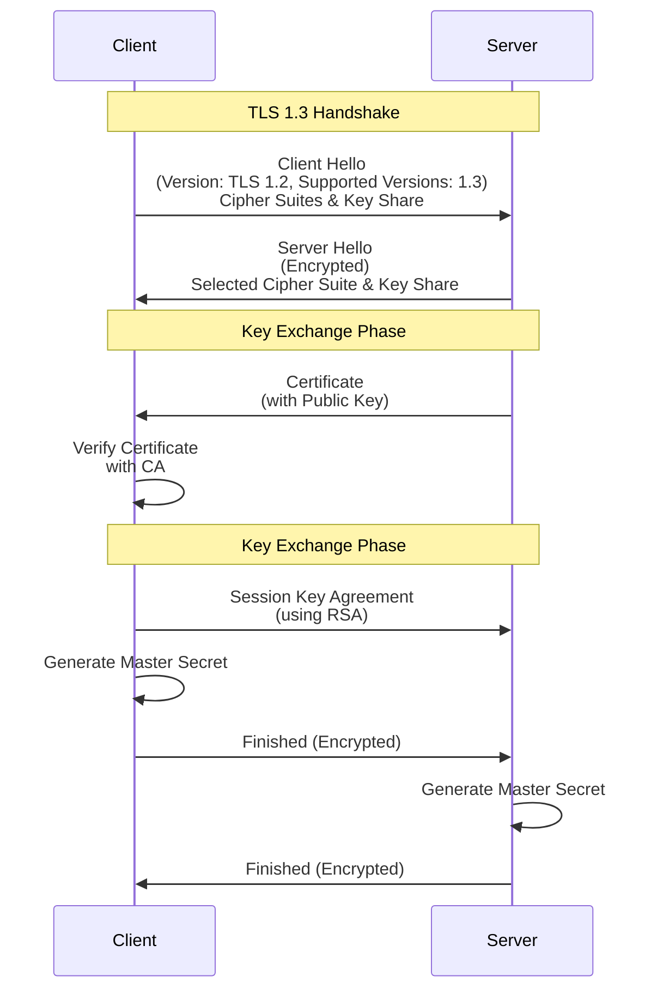

[[x-509#PKI]]
[[ssl-tls-free-certs]]

[Transport Layer Security](http://www.wikiwand.com/en/Transport_Layer_Security) (TLS) and its predecessor, [Secure Sockets Layer](https://www.digicert.com/ssl.htm) (SSL), are cryptographic protocols designed to provide communications security over a computer network.

[What is SSL (Secure Sockets Layer)? | Cloudflare](https://www.cloudflare.com/learning/ssl/what-is-ssl/)
[What is Transport Layer Security (TLS)? | Cloudflare](https://www.cloudflare.com/learning/ssl/transport-layer-security-tls/)
[Creating Secure Web Apps: What Every Developer Needs to Know About HTTPS Today | Heroku](https://www.heroku.com/tech-sessions/creating-secure-web-apps)
[SSL: Secure Sockets Layer](https://www.cs.cornell.edu/courses/cs5430/2015sp/notes/ssl.php) from SSL to TLS 1.2
[Exploring HTTPS With Python – Real Python](https://realpython.com/python-https/)
[What are SSL/TLS Certificates? Why do we Need them? and How do they Work? - YouTube](https://www.youtube.com/watch?v=r1nJT63BFQ0)

[Transport Layer Security (TLS) - Computerphile - YouTube](https://www.youtube.com/watch?v=0TLDTodL7Lc)

[HTTPS: an awesome, secure tale (pt 1) | by Omer Goldberg | Bits and Pieces](https://blog.bitsrc.io/https-an-awesome-secure-tale-pt-1-32d2ba5ac0c1)

[ESNI: A Privacy-Protecting Upgrade to HTTPS | Electronic Frontier Foundation](https://www.eff.org/deeplinks/2018/09/esni-privacy-protecting-upgrade-https)
[Server Name Indication - Wikiwand](https://www.wikiwand.com/en/Server_Name_Indication) multi-tenants on the same IP

[Cloudflare now uses post-quantum cryptography to talk to your origin server](https://blog.cloudflare.com/post-quantum-to-origins/)

Toolkits:

- [[openssl]]
- [[openssl#Alternate Implementations]]

[HTTPS Is Easy!](https://httpsiseasy.com/)
[Is TLS Fast Yet?](https://istlsfastyet.com/)
[ImperialViolet - Overclocking SSL](https://www.imperialviolet.org/2010/06/25/overclocking-ssl.html) HTTPS is fast since 2010
[ImperialViolet - Public key pinning](https://www.imperialviolet.org/2011/05/04/pinning.html)
[Survival Guide - TLS/SSL and SSL (X.509) Certificates (CA-signed and Self-Signed)](http://www.zytrax.com/tech/survival/ssl.html)
[Rolling out Public Key Pinning with HPKP Reporting — Google Web Updates](https://developers.google.com/web/updates/2015/09/HPKP-reporting-with-chrome-46)
[SSL: it’s hard to do right | The Recompiler](https://recompilermag.com/issues/issue-1/ssl-its-hard-to-do-right/)
[Nick Craver - HTTPS on Stack Overflow: The End of a Long Road](https://nickcraver.com/blog/2017/05/22/https-on-stack-overflow/)
[Networking 101: Transport Layer Security (TLS) - High Performance Browser Networking (O'Reilly)](https://hpbn.co/transport-layer-security-tls/)

[How the NSA (may have) put a backdoor in RSA’s cryptography: A technical primer | Ars Technica](http://arstechnica.com/security/2014/01/how-the-nsa-may-have-put-a-backdoor-in-rsas-cryptography-a-technical-primer/)
[Critics slam SSL authority for minting certificate for impersonating sites | Ars Technica](http://arstechnica.com/business/2012/02/critics-slam-ssl-authority-for-minting-cert-used-to-impersonate-sites/)
[Web served, part 2: Securing things with SSL/TLS | Ars Technica](http://arstechnica.com/information-technology/2012/11/securing-your-web-server-with-ssltls/)

[Deploying HTTPS: The Green Lock and Beyond (Chrome Dev Summit 2015) - YouTube](https://www.youtube.com/watch?v=9WuP4KcDBpI)
[Mythbusting HTTPS: Squashing security’s urban legends - Google I/O 2016 - YouTube](https://www.youtube.com/watch?v=YMfW1bfyGSY)

## Standards

TLS 1.0 = SSL 3.1 (1999)
TLS 1.1 = SSL 3.2 (2006)
TLS 1.2 = SSL 3.3 (2008)
TLS 1.3 = SSL 3.4 (2018)

[Transport Layer Security (tls)](https://datatracker.ietf.org/wg/tls/documents/)

[RFC 8446 - The Transport Layer Security (TLS) Protocol Version 1.3](https://datatracker.ietf.org/doc/html/rfc8446)
[RFC 9147 - The Datagram Transport Layer Security (DTLS) Protocol Version 1.3](https://datatracker.ietf.org/doc/html/rfc9147/)
[RFC 6101 - The Secure Sockets Layer (SSL) Protocol Version 3.0](https://datatracker.ietf.org/doc/html/rfc6101)
[Transport Layer Security (TLS) Parameters](https://www.iana.org/assignments/tls-parameters/tls-parameters.xhtml)
[draft-ietf-tls-rfc8446bis-12](https://datatracker.ietf.org/doc/html/draft-ietf-tls-rfc8446bis/) update
[draft-ietf-tls-rfc9147bis-00](https://datatracker.ietf.org/doc/html/draft-ietf-tls-rfc9147bis/) update

TLS v1.3

- allow client's guessing of keyshares to reduce one round trip
- reduces supported ciphers, uses only AEAD Algorithms  
  [draft-irtf-cfrg-aead-properties-09 - Properties of AEAD Algorithms](https://datatracker.ietf.org/doc/html/draft-irtf-cfrg-aead-properties/)  
  [Authenticated Encryption with Associated Data (AEAD)  |  Tink  |  Google for Developers](https://developers.google.com/tink/aead)  
  [Authenticated encryption — Cryptography documentation](https://cryptography.io/en/latest/hazmat/primitives/aead/)
- Encrypt-Then-MAC by default
- The client and the server then exchange two keys: one for the encryption and another for the verification
- advertise itself as 1.2 since revision 22 to increase adoption and avoid ossification in middlebox
- [A Cryptographic Analysis of the TLS 1.3 Handshake Protocol](https://eprint.iacr.org/2020/1044)

[RFC 7301 - Transport Layer Security (TLS) Application-Layer Protocol Negotiation Extension](https://datatracker.ietf.org/doc/html/rfc7301) ALPN, allows applications to use the existing, secure communications links
[RFC 7918 - Transport Layer Security (TLS) False Start](https://datatracker.ietf.org/doc/html/rfc7918)
[RFC 7925 - Transport Layer Security (TLS) / Datagram Transport Layer Security (DTLS) Profiles for the Internet of Things](https://datatracker.ietf.org/doc/html/rfc7925)
[RFC 8449 - Record Size Limit Extension for TLS](https://datatracker.ietf.org/doc/html/rfc8449)
[RFC 9325 - Recommendations for Secure Use of Transport Layer Security (TLS) and Datagram Transport Layer Security (DTLS)](https://datatracker.ietf.org/doc/html/rfc9325)
[draft-ietf-tls-keylogfile-03](https://datatracker.ietf.org/doc/html/draft-ietf-tls-keylogfile/) `SSLKEYLOGFILE`
[draft-ietf-tls-extended-key-update-04 - Extended Key Update for Transport Layer Security (TLS) 1.3](https://datatracker.ietf.org/doc/html/draft-ietf-tls-extended-key-update/)
[draft-ietf-tls-ctls-10](https://datatracker.ietf.org/doc/html/draft-ietf-tls-ctls/) expired draft

[Transport Layer Security, TLS 1.2 and 1.3 (Explained by Example) - YouTube](https://www.youtube.com/watch?v=AlE5X1NlHgg)
[Understanding TLS 1.2 and TLS 1.3  | Encryption Consulting](https://www.encryptionconsulting.com/tls-1-2-and-tls-1-3/)
[A Detailed Look at RFC 8446 (a.k.a. TLS 1.3)](https://blog.cloudflare.com/rfc-8446-aka-tls-1-3/)
[Why TLS 1.3 is a Huge Improvement | Venafi](https://venafi.com/blog/why-tls-13-huge-improvement/)
[TLS 1.3 » ADMIN Magazine](http://www.admin-magazine.com/Articles/TLS-1.3-and-the-return-of-common-sense)
[A Detailed Look at RFC 8446 (a.k.a. TLS 1.3)](https://blog.cloudflare.com/rfc-8446-aka-tls-1-3/) ❗!important

[RFC 8701 - Applying Generate Random Extensions And Sustain Extensibility (GREASE) to TLS Extensibility](https://datatracker.ietf.org/doc/rfc8701/) to help identify [protocol ossification](https://www.wikiwand.com/en/articles/Protocol_ossification) in middlebox
[tldr.fail](https://tldr.fail/) middlebox fails to handle large ClientHello

### Handshake

[TLS Handshake Explained - Computerphile - YouTube](https://www.youtube.com/watch?v=86cQJ0MMses)
[The SSL/TLS Handshake: an Overview – SSL Information and FAQ](https://info.ssl.com/tls-handshake/)
[File:Ssl handshake with two way authentication with certificates.png - Wikimedia Commons](https://commons.wikimedia.org/wiki/File:Ssl_handshake_with_two_way_authentication_with_certificates.png)
[TLS Handshake For Secure Communications Over The Internet](https://www.encryptionconsulting.com/what-is-a-tls-handshake-and-how-does-it-work/)
[SSH Handshake – Why Abhinav?](https://yabhinav.github.io/security/openssh-handshake-overview/)
[What is a TLS Handshake and How Does it Work? | Venafi](https://venafi.com/blog/how-does-a-tls-handshake-work/) 0-RTT

[What happens in a TLS handshake? | SSL handshake | Cloudflare](https://www.cloudflare.com/learning/ssl/what-happens-in-a-tls-handshake/)
[What is a session key? | Session keys and TLS handshakes | Cloudflare](https://www.cloudflare.com/learning/ssl/what-is-a-session-key/)

SessionTicket replaces SessionID for session resumption in [RFC 5077 - Transport Layer Security (TLS) Session Resumption without Server-Side State](https://datatracker.ietf.org/doc/html/rfc5077)
a.k.a. session caching, stateless resumption
Session data is encrypted with a secret key known only by the server

[Good-bye ESNI, hello ECH!](https://blog.cloudflare.com/encrypted-client-hello/) Encrypted Client Hello, replaces Encrypted SNI
[Decoding TLS Encrypted Client Hello extension | Thibaut Probst](https://thibautprobst.fr/en/posts/ech/)

Command Line Fanatic
[How SSL Certificates Use Digital Signatures](https://commandlinefanatic.com/cgi-bin/showarticle.cgi?article=art012)
[A Walkthrough of a TLS 1.3 Handshake](https://commandlinefanatic.com/cgi-bin/showarticle.cgi?article=art080)
[The TLS Handshake at a High Level](https://commandlinefanatic.com/cgi-bin/showarticle.cgi?article=art057) TLS v1.2, Diffie Hellman protocol, MAC, PKI
[A walk-through of an SSL handshake](https://commandlinefanatic.com/cgi-bin/showarticle.cgi?article=art059)
[A walk-through of an SSL key exchange](https://commandlinefanatic.com/cgi-bin/showarticle.cgi?article=art060)
[A walk-through of an SSL Certificate Exchange](https://commandlinefanatic.com/cgi-bin/showarticle.cgi?article=art061)

### Packet Dump

[The Illustrated TLS 1.3 Connection: Every Byte Explained](https://tls13.xargs.org/) ❗!important
[The Illustrated QUIC Connection: Every Byte Explained](https://quic.xargs.org/) ❗!important

[Wireshark - YouTube](https://www.youtube.com/playlist?list=PLhfrWIlLOoKMO9-7NxYN3TxCdcDecwOtj) TLS/QUIC decryption with Wireshark and SSL key logs
[Decrypt SSL with Wireshark - HTTPS Decryption: Step-by-Step Guide](https://www.comparitech.com/net-admin/decrypt-ssl-with-wireshark/)
[HTTPS Decryption with Wireshark // Website TLS Decryption - YouTube](https://www.youtube.com/watch?v=GMNOT1aZmD8)
[Decrypting TLS, HTTP/2 and QUIC with Wireshark - YouTube](https://www.youtube.com/watch?v=yodDbgoCnLM)
[pan-unit42/wireshark-tutorial-decrypting-HTTPS-traffic](https://github.com/pan-unit42/wireshark-tutorial-decrypting-HTTPS-traffic)

## SSL Striping

[Performing & Preventing SSL Stripping: A Plain-English Primer](https://blog.cloudflare.com/performing-preventing-ssl-stripping-a-plain-english-primer/) 2017-10

[RFC 6797 - HTTP Strict Transport Security (HSTS)](https://datatracker.ietf.org/doc/html/rfc6797)
[HSTS Preload List Submission](https://hstspreload.org/)

[More Tricks for Defeating SSL Moxie Marlinspike Black Hat - USA - 2009 - YouTube](https://www.youtube.com/watch?v=X5oXcXrQDqE) Cert Basic Constraints, HTTP redirect, MITM with null character in Common Name, Defeating OCSP with try again
[moxie0/sslstrip: A tool for exploiting Moxie Marlinspike's SSL "stripping" attack.](https://github.com/moxie0/sslstrip)

[OFFENSIVE: Exploiting DNS Servers Changes by Leonardo Nve - YouTube](https://www.youtube.com/watch?v=Q3siIqS9LVA)

## Ciphers

[Ciphersuite Info](https://ciphersuite.info/)
[An Introduction to Cipher Suites | Encryption Consulting](https://www.encryptionconsulting.com/ssl-cipher-suites/)

[Security/Server Side TLS - MozillaWiki](https://wiki.mozilla.org/Security/Server_Side_TLS#Recommended_Ciphersuite)
[Generate Mozilla Security Recommended Web Server Configuration Files](https://mozilla.github.io/server-side-tls/ssl-config-generator/)

[RFC 7919 - Negotiated Finite Field Diffie-Hellman Ephemeral Parameters for Transport Layer Security (TLS)](https://datatracker.ietf.org/doc/html/rfc7919) "Supported Groups Registry"

[RFC 8998 - ShangMi (SM) Cipher Suites for TLS 1.3](https://datatracker.ietf.org/doc/html/rfc8998)
[国密SSL协议是什么？与标准TLS协议的区别- 沃通SSL证书!](https://www.wosign.com/FAQ/faq_2019062501.htm)

`TLS_DHE_RSA_AES256_SHA256`

DHE: key exchange (Ephemeral Diffie-Hellman)
RSA: authentication
AES256: data encryption
SHA256: MAC

`TLS_ECDHE_ECDSA_WITH_AES_256_GCM_SHA384`

ECDHE: key exchange (Ephemeral Elliptic Curve Diffie-Hellman)
RSA: authentication
AES_256_GCM: data encryption
SHA384: MAC

`TLS_AES_256_GCM_SHA384` (TLS 1.3)

ECDHE (implicit): key exchange
RSA: authentication
AES_256_GCM: data encryption
SHA384: MAC

## HSTS

> always use HTTPS

[HTTP Strict Transport Security - Wikiwand](http://www.wikiwand.com/en/HTTP_Strict_Transport_Security)
[HSTS Preload List Submission](https://hstspreload.appspot.com/)

## Certificate Transparency

[Introducing Certificate Transparency and Nimbus](https://blog.cloudflare.com/introducing-certificate-transparency-and-nimbus/)

[RFC 9162 - Certificate Transparency Version 2.0](https://datatracker.ietf.org/doc/html/rfc9162)
[Certificate Transparency - Wikiwand](https://www.wikiwand.com/en/articles/Certificate_Transparency)

CT deprecates HPKP
[RFC 7469 - Public Key Pinning Extension for HTTP](https://datatracker.ietf.org/doc/html/rfc7469)
[HTTP Public Key Pinning - Wikiwand](https://www.wikiwand.com/en/articles/HTTP_Public_Key_Pinning)

## Mutual TLS/mTLS

[A Kubernetes engineer's guide to mTLS](https://buoyant.io/mtls-guide/)
[Mutual TLS | The Backend Engineering Show - YouTube](https://www.youtube.com/watch?v=KwpV-ICpkc4)

[The Cloudflare mTLS vulnerability - A Deep Dive Analysis - YouTube](https://www.youtube.com/watch?v=xsLqf1Qomn0)
[mTLS: When certificate authentication is done wrong - The GitHub Blog](https://github.blog/security/vulnerability-research/mtls-when-certificate-authentication-is-done-wrong/)

## SSL checkers

[Best SSL Testing Tools for your Website - Grace Themes](https://gracethemes.com/best-ssl-testing-tools-for-your-website/amp/)
[Online Tool to Test SSL, TLS and Latest Vulnerability - Geekflare](https://geekflare.com/ssl-test-certificate/)
[How to discover TLS configurations | by Be Tech! with Santander | Be Tech! with Santander | Medium](https://medium.com/be-tech-with-santander/how-to-discover-tls-configurations-3d106e7b2d95)
[SSL/TLS Protocols Security Guidelines | HKCERT](https://www.hkcert.org/security-guideline/ssltls-protocols-security-guidelines) 2016

[/bin/bash based SSL/TLS tester: testssl.sh](https://testssl.sh/) offline tool
[crt.sh | Certificate Search](https://crt.sh/)
[Qualys SSL Labs](https://www.ssllabs.com/)
[Free SSL Checker Tool - Check SSL Certificate](https://www.thesslstore.com/ssltools/ssl-checker.php)
[SSL Certificate Checker - Diagnostic Tool | DigiCert.com](https://www.digicert.com/help/)
[SSL Security Test | Scan Web and Email Server SSL TLS STARTTLS Encryption](https://www.immuniweb.com/ssl/)
[SSL Checker](https://www.sslshopper.com/ssl-checker.html?hostname=)
[SSL/TLS Client Test - TLS Fingerprinting - BrowserLeaks](https://browserleaks.com/tls)

[SSH Pentesting. SSH (TCP/22) is a protocol used to… | by 0liverFlow | Medium](https://olivierkonate.medium.com/ssh-pentesting-c68c9f5c3000) pentest and audit tools
[OWASP/O-Saft: O-Saft - OWASP SSL advanced forensic tool](https://github.com/OWASP/O-Saft)

[trimstray/htrace.sh: My simple Swiss Army knife for http/https troubleshooting and profiling.](https://github.com/trimstray/htrace.sh)

[sslyze | Kali Linux Tools](https://www.kali.org/tools/sslyze/)
[nabla-c0d3/sslyze: Fast and powerful SSL/TLS scanning library.](https://github.com/nabla-c0d3/sslyze)

## Man-in-the-Middle (MITM)

[Monsters in the Middleboxes: Introducing Two New Tools for Detecting HTTPS Interception](https://blog.cloudflare.com/monsters-in-the-middleboxes/amp/)

[mitmproxy - an interactive HTTPS proxy](https://mitmproxy.org/)
[mitm.it](http://mitm.it/) CA for mitmproxy
[mitmproxy - Introduction](https://docs.mitmproxy.org/stable/)
[mitmproxy/mitmproxy: An interactive TLS-capable intercepting HTTP proxy for penetration testers and software developers.](https://github.com/mitmproxy/mitmproxy)
[How to Man in the Middle HTTPS Using mitmproxy - Earthly Blog](https://earthly.dev/blog/mitmproxy/)
[Spin an HTTP/3 Reverse Proxy (using mitmproxy) - YouTube](https://www.youtube.com/watch?v=S-5Sx561jnk)
[https真安全么？ 抓包解密https的两种原理+实战 - YouTube](https://www.youtube.com/watch?v=C2J_JVyZoOM)

[alufers/mitmproxy2swagger: Automagically reverse-engineer REST APIs via capturing traffic](https://github.com/alufers/mitmproxy2swagger)

[c2FmZQ/tlsproxy: A simple TLS proxy, Reverse proxy, and Web server that uses Let's Encrypt automatically.](https://github.com/c2FmZQ/tlsproxy)

[bettercap/bettercap: The Swiss Army knife for 802.11, BLE, HID, CAN-bus, IPv4 and IPv6 networks reconnaissance and MITM attacks.](https://github.com/bettercap/bettercap)

[monasticacademy/httptap: View HTTP/HTTPS requests made by any Linux program](https://github.com/monasticacademy/httptap)
[sensepost/berate_ap: Script for orchestrating mana rogue WiFi Access Points.](https://github.com/sensepost/berate_ap)

[Wifi Hacking Tools Collection | w1f1](https://w1f1.net/)
[sensepost/hostapd-mana: SensePost's modified hostapd for wifi attacks.](https://github.com/sensepost/hostapd-mana)

[PolarProxy TLS proxy](https://www.netresec.com/?page=PolarProxy) decrypt up to 10 GB of data or 10 000 TLS sessions per day

[Intercept, debug & mock HTTP with HTTP Toolkit](https://httptoolkit.com/)
[HTTP Toolkit](https://github.com/httptoolkit)

[Fiddler Everywhere | Debugging Proxy for Mac, Linux, Windows](https://www.telerik.com/fiddler/fiddler-everywhere) forward TLS proxy, paid
[Charles Web Debugging Proxy • HTTP Monitor / HTTP Proxy / HTTPS & SSL Proxy / Reverse Proxy](https://www.charlesproxy.com/) forward TLS proxy, paid

[HTTPS/TLS Proxy | NetworkAcademy.io](https://www.networkacademy.io/ccie-enterprise/sdwan/https-tls-proxy)
[What is a TLS Proxy? Definition & FAQs | Avi Networks](https://avinetworks.com/glossary/tls-proxy/)

[Rebex TLS Proxy (free) - Rebex.NET](https://www.rebex.net/tls-proxy/)

[iPhone and Android WiFi Man-in-the-middle attack // PYTHON Scapy scripts for attacking networks - YouTube](https://www.youtube.com/watch?v=O1jpck31Ask)

## Perfect Forward Secrecy (PFS)

[SSL Enabling Forward Secrecy | DigiCert.com](https://www.digicert.com/ssl-support/ssl-enabling-perfect-forward-secrecy.htm)

## Issues

[How to Change Certificate Without Downtime - DZone DevOps](https://dzone.com/articles/How-To-Change-Certificate-Without-Downtime)

### Heartbleed (2014)

> see `web-security.md#heartbleed`

### Renegotiation Gap (2009)

[Truth in SOA: Really Understanding the SSL/TLS Vulnerability (Part 1)](http://soatruth.blogspot.hk/2009/12/really-understanding-ssltls.html)

## Localhost certs

[FiloSottile/mkcert: A simple zero-config tool to make locally-trusted development certificates with any names you'd like.](https://github.com/FiloSottile/mkcert) add local CA to system
[Why and How to Use HTTPS in Your Local Development Environment](https://auth0.com/blog/using-https-in-your-development-environment/)

## Free SSL/TLS Certs

[[ssl-tls-free-certs]]
