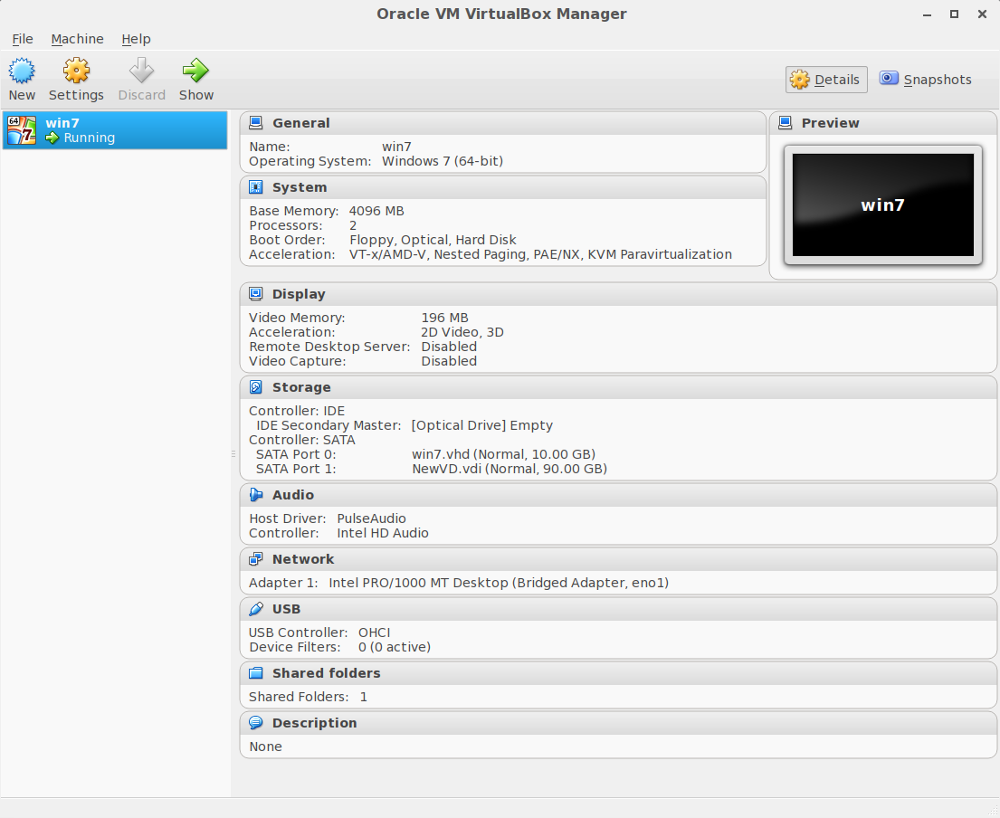

[Virtualization - Wikiwand](https://www.wikiwand.com/en/Virtualization)

[OSBoxes - Virtual Machines for VirtualBox & VMware](https://www.osboxes.org/)

[Performance Tuning on Virtual Machines | Learning Tree Blog](https://blog.learningtree.com/performance-tuning-on-virtual-machines/)
[VirtualBox vs. VMware Player: The Best Virtual Machine for Windows](https://www.makeuseof.com/tag/best-virtual-machine-windows/)
[The Best Virtual Machine for Linux: KVM vs. VirtualBox vs. QEMU vs. Hyper-V](https://www.makeuseof.com/best-virtual-machine-linux-kvm-virtualbox-qemu-hyper-v/)

# Hypervisor

A Hypervisor is also called as a Virtual Machine Monitor (VMM).

[Hypervisor 101: Understanding the Virtualization Market](http://www.datacenterknowledge.com/archives/2012/08/01/hypervisor-101-a-look-hypervisor-market/)

Type 1 hypervisors is an operating system that run directly on the system hardware ("native" or "bare metal" or "embedded").
Type 2 hypervisors run on a host operating system. Most client side VM software contains this kind of hypervisor.
Intel's VTx technology improved the performance of visualization (rendering binary translation and paravirtualization obsolete) and allowed for KVM to be implemented. More importantly, it negated most of the differences between “type-1” and “type-2” hypervisors.

[Ben Armstrong’s Virtualization Blog | Microsoft Learn](https://learn.microsoft.com/en-us/archive/blogs/virtual_pc_guy/)

[Comparison of platform virtualization software - Wikiwand](https://www.wikiwand.com/en/Comparison_of_platform_virtualization_software)
[A Performance Comparison of Hypervisors - VMWare](https://www.vmware.com/pdf/hypervisor_performance.pdf) (PDF)
[Performance Comparison of KVM, VMware and XenServer using a Large Telecommunication Application](https://www.thinkmind.org/download.php?articleid=cloud_computing_2014_5_20_20101) (PDF)
[Will Containers Replace Hypervisors? Almost Certainly! | Cloudscaling](http://cloudscaling.com/blog/cloud-computing/will-containers-replace-hypervisors-almost-certainly/)

[BSD Hypervisor](https://bhyve.org/)

## CPU

[Protection ring - Wikiwand](https://www.wikiwand.com/en/Protection_ring)
[Real mode - Wikiwand](https://www.wikiwand.com/en/Real_mode)
[Protected mode - Wikiwand](https://www.wikiwand.com/en/Protected_mode)
[x86 virtualization - Wikiwand](https://www.wikiwand.com/en/X86_virtualization)

[硬科技：為何x86的虛擬化這麼難搞(上) #作業系統 (152220) - Cool3c](https://www.cool3c.com/article/152220)
[硬科技：為何x86的虛擬化這麼難搞(中) #作業系統 (152291) - Cool3c](https://www.cool3c.com/article/152291)
[硬科技：為何x86的虛擬化這麼難搞(下) #作業系統 (152320) - Cool3c](https://www.cool3c.com/article/152320)
[硬科技：x86虛擬化由內到外還是繼續難搞(上) #intel (152574) - Cool3c](https://www.cool3c.com/article/152574)
[硬科技：x86虛擬化由內到外還是繼續難搞(中) #作業系統 (152657) - Cool3c](https://www.cool3c.com/article/152657)
[硬科技：x86虛擬化由內到外還是繼續難搞(下) #intel (152681) - Cool3c](https://www.cool3c.com/article/152681)

## GPU

[硬科技：GPU虛擬化為何超級難搞(上) #CPU (157525) - Cool3c](https://www.cool3c.com/article/157525)
[硬科技：GPU虛擬化為何超級難搞(中) #api (157526) - Cool3c](https://www.cool3c.com/article/157526)
[硬科技：GPU虛擬化為何超級難搞(下) #nvidia (157527) - Cool3c](https://www.cool3c.com/article/157527)

## KVM

> Type 2 Hypervisor, Linux Kernel

[Documents - KVM](https://www.linux-kvm.org/page/Documents)
[How to Install Kvm on Ubuntu 20.04 | Linuxize](https://linuxize.com/post/how-to-install-kvm-on-ubuntu-20-04/)

[Virtual Machine Manager](https://virt-manager.org/) virt-manager

[How to Use Virtualbox VMs on KVM In Linux](https://www.tecmint.com/migrate-virtualbox-vms-into-kvm-vms/amp/)

```sh
kvm -cdrom ubuntu-20.04.4-desktop-amd64.iso
```

## Xen

[The Xen Project, the powerful open source industry standard for virtualization.](http://www.xenproject.org/)
[Hypervisor x86 & ARM](http://www.xenproject.org/developers/teams/hypervisor.html)
[Xen & Docker: Made for Each Other! | Xen Project Blog](https://blog.xenproject.org/2014/09/08/xen-docker-made-for-each-other/)

Xen only check handle three things: memory, CPU and interrupts

## VMWare vSphere (ESXi)

> Type 1 Hypervisor, not play well with consumer level hardware

[Free VMware vSphere Hypervisor, Free Virtualization (ESXi) | United States](https://www.vmware.com/products/vsphere-hypervisor)
[Is ESXi Really Free? Let's put it to the Test](https://www.altaro.com/vmware/esxi-free/)

[VMware on a Raspberry Pi!?!?! (ESXi Install) - YouTube](https://www.youtube.com/watch?v=6aLyZisehCU)

## Proxmox Virtual Environment

> Type 2 Hypervisor (actually Ubuntu LTS), plays well with consumer level hardware

PVE: Proxmox Virtual Environment
[Proxmox Virtual Environment - Open-Source Server Virtualization Platform](https://www.proxmox.com/en/products/proxmox-virtual-environment/overview) PVE
[Proxmox VE Documentation Index](https://pve.proxmox.com/pve-docs/)
[Proxmox VE wiki](https://pve.proxmox.com/wiki/Main_Page)
[Virtual Machines Pt. 2 (Proxmox install w/ Kali Linux) - YouTube](https://www.youtube.com/watch?v=_u8qTN3cCnQ)

[Proxmox Mail Gateway - Email Security Solution](https://www.proxmox.com/en/products/proxmox-mail-gateway/overview) PMG
[Proxmox Backup Server - Open-Source Enterprise Backup Solution](https://www.proxmox.com/en/products/proxmox-backup-server/overview) PBS

[Proxmox Datacenter Manager: A new alternative to VMware vCenter? – 4sysops](https://4sysops.com/archives/proxmox-datacenter-manager-a-new-alternative-to-vmware-vcenter/)
[This Free Tool Gives Proxmox the Monitoring Dashboard It Always Needed - Virtualization Howto](https://www.virtualizationhowto.com/2025/10/this-free-tool-gives-proxmox-the-monitoring-dashboard-it-always-needed/)

[Hookscripts - Proxmox VE Administration Guide](https://pve.proxmox.com/pve-docs/pve-admin-guide.html#_hookscripts)
[Unlock the power of Proxmox hookscripts for VM automation](https://www.xda-developers.com/proxmox-hookscripts-are-the-best-automation-feature/)

[Proxmox VE 9.0 – 4sysops](https://4sysops.com/archives/proxmox-ve-90/)
[Proxmox Backup Server 4.0 – 4sysops](https://4sysops.com/archives/proxmox-backup-server-40/)

[Getting Started with Proxmox 8 - YouTube](https://www.youtube.com/playlist?list=PL4i6XWPjbaYm8FjhPVnKuxC1rM9OtJvqB) virtualize everything
[5 Things I Would Do On Fresh Install Of ProxMox - YouTube](https://www.youtube.com/watch?v=xD9Xyt2mdSI) use OEM install when creating template, storage pass through

[Before I do anything on Proxmox, I do this first... - YouTube](https://www.youtube.com/watch?v=GoZaMgEgrHw)
[Perfect Proxmox Template with Cloud Image and Cloud Init - YouTube](https://www.youtube.com/watch?v=shiIi38cJe4)
[Perfect Proxmox Template with Cloud Image and Cloud Init | Techno Tim Documentation](https://docs.technotim.live/posts/cloud-init-cloud-image/)
[Let's Install Proxmox 8.0! - YouTube](https://www.youtube.com/watch?v=sZcOlW-DwrU)

[Proxmox vs. XCP-ng: Which one's better for your home lab?](https://www.xda-developers.com/proxmox-vs-xcp-ng/)

[My Proxmox Home Server Walk-Through: Part 1 (TrueNAS, Portainer, Wireguard) - YouTube](https://www.youtube.com/watch?v=_sfddZHhOj4)
[Remote Gaming and Streaming w/ Proxmox - Proxmox Walk-Through: Part 2 - YouTube](https://www.youtube.com/watch?v=BoMlfk397h0) GPU pass-through

[IMPORT a Virtual Machine Template (OVA, VMDK, RAW, ...) into Proxmox! - YouTube](https://www.youtube.com/watch?v=k6-miz1Tb80)

[Proxmoxer Documentation](https://proxmoxer.github.io/docs/2.0/) Proxmoxer is a wrapper around the APIs for Proxmox products

[joshpatten/PVE-VDIClient: Proxmox based VDI client](https://github.com/joshpatten/PVE-VDIClient) `proxmoxer` + `virt-viewer`
[PROXMOX VDI Client - A Better Approach to Thin Clients for Proxmox - YouTube](https://www.youtube.com/watch?v=oLatrZBFQrw)

SmartHomeBeginner
[Mini Homelab Tour - I do a LOT with this Little Proxmox Server and 100+ Docker Apps - YouTube](https://www.youtube.com/watch?v=GfzgNJAM19o)
[Docker on Proxmox LXC 🚀 Zero Bloat and Pure Performance! - YouTube](https://www.youtube.com/watch?v=-ZSQdJ62r-Q)

## Migrate ESXI to Proxmox

[Proxmox VE Import Wizard: How to import VMs from VMware ESXi](https://www.proxmox.com/en/services/training-courses/videos/proxmox-virtual-environment/proxmox-ve-import-wizard-for-vmware)  
`apt install --reinstall pve-esxi-import-tools=0.7.2`

Tested issue on version 0.7.4
Need to down grade to 0.7.2

## Hyper-V

[Hyper-V - Wikiwand](https://www.wikiwand.com/en/Hyper-V)
[What Is Hyper-V & How Do You Use It? A Beginner's Guide](https://www.cloudwards.net/hyper-v/)
[Introduction to Hyper-V on Windows 10 | Microsoft Docs](https://docs.microsoft.com/en-us/virtualization/hyper-v-on-windows/about/)
[Enable Hyper-V on Windows 10 | Microsoft Docs](https://docs.microsoft.com/en-us/virtualization/hyper-v-on-windows/quick-start/enable-hyper-v)
[Run virtual machines on Windows 8.1 with Client Hyper‑V: A quick how-to | ZDNet](http://www.zdnet.com/pictures/run-virtual-machines-on-windows-8-1-with-client-hyper-v-a-quick-how-to/)

## QEMU

[QEMU](https://www.qemu.org/)
[QEMU - ArchWiki](https://wiki.archlinux.org/title/QEMU)
[Welcome to QEMU’s documentation! — QEMU documentation](https://qemu-project.gitlab.io/qemu/index.html)

[Eduardo Otubo: Qemu Sandboxing for dummies. - YouTube](https://www.youtube.com/watch?v=_7yGiafZdVc)
[QEMU Sandboxing for dummies | PPT](https://www.slideshare.net/EduardoOtubo/qemu-sandboxing-for-dummies)

[QEMU,KVM及QEMU-KVM介绍 - 又是火星人 - 博客园](https://web.archive.org/web/20231212100534/https://www.cnblogs.com/echo1937/p/7138294.html)
[QEMU vs. KVM: Exploring the Virtualization Giants](https://cloudzy.com/blog/qemu-vs-kvm/)
[(12) QEMU vs KVM: A Quick Comparison | LinkedIn](https://www.linkedin.com/pulse/qemu-vs-kvm-quick-comparison-raja-nagori-/)
[virtualization - Difference between KVM and QEMU - Server Fault](https://serverfault.com/questions/208693/difference-between-kvm-and-qemu)
[Can´t figure out the difference between QEMU and KVM : r/linuxmasterrace](https://www.reddit.com/r/linuxmasterrace/comments/qhrpm8/cant_figure_out_the_difference_between_qemu_and/)

[QEMU 10.0 Open-Source Virtualization Software Released, Here's What's New - 9to5Linux](https://9to5linux.com/qemu-10-0-open-source-virtualization-software-released-heres-whats-new)

[在 QEMU 中安装 Windows7 虚拟机](https://mp.weixin.qq.com/s/f2hj5XIpGvPtuFRwVWCtAg)
[Emulate Raspberry Pi with QEMU | Azeria Labs](https://azeria-labs.com/emulate-raspberry-pi-with-qemu/)

[quickemu-project/quickemu: Quickly create and run optimised Windows, macOS and Linux desktop virtual machines.](https://github.com/quickemu-project/quickemu)
[mawalu/qsandbox: Shell sandboxing using QEMU and virtiofsd. Just enter qsandbox run to open your current working dir in a temporary QEMU vm.](https://github.com/mawalu/qsandbox)
[lightweight initramfs](https://g3ngr33n.github.io/qemusandbox/)

[Emulating a Raspberry Pi with QEMU](https://gist.github.com/plembo/c4920016312f058209f5765cb9a3a25e)

```sh
yay -S qemu-base qemu-tools qemu-system-aarch64 qemu-system-arm qemu-system-riscv qemu-user-static
```

[how to run arm64 docker image on linux](https://www.phind.com/search?cache=l49hh6uev8h9ko5jjcd69vm1)
[Getting started with Docker for Arm on Linux | Docker](https://www.docker.com/blog/getting-started-with-docker-for-arm-on-linux/)

```sh
# run this to register qemu, `-p` for persistent
qemu-user-static --reset -p yes # if you have the installed locally on the host
docker run --rm --privileged multiarch/qemu-user-static --reset -p yes

# then these can be run
docker run --rm -it --platform linux/arm64 ubuntu:latest uname -a
docker run --rm -it --platform=linux/arm64/v8 arm64v8/alpine:3.18
```

## Frontends

### libvirt

[libvirt: The virtualization API](https://libvirt.org/)

- toolkit to manage VM platforms
- support KVM, QEMU, LXC, Xen, ...
- C, C#, Go, Python bindings

[libvirt / libvirt-go-module · GitLab](https://gitlab.com/libvirt/libvirt-go-module)
[libvirt / libvirt-python · GitLab](https://gitlab.com/libvirt/libvirt-python)

### Virtual Machine Manager

[Virtual Machine Manager](https://virt-manager.org/)

- creates and manages KVM-based virtual machines
- `virt-viewer` to view VM display (supports VNC and SPICE)

[SPICE](https://spice-space.org/)
[SPICE - Proxmox VE](https://pve.proxmox.com/wiki/SPICE)

## VirtualBox

[VirtualBox - ArchWiki](https://wiki.archlinux.org/title/VirtualBox)

[Downloads – Oracle VM VirtualBox](https://www.virtualbox.org/wiki/Downloads)
[Oracle® VM VirtualBox®](https://www.virtualbox.org/manual/)

[Chapter 8. VBoxManage](https://www.virtualbox.org/manual/ch08.html)
[Use VBoxManage to Pass Through USB device to VirtualBox VM – FlamingKeys – Active Directory, Office 365, PowerShell](https://flamingkeys.com/use-vboxmanage-to-pass-through-usb-device-to-vm/)

Also download the extension packs (PUEL, non-commercial only).

[you need to learn Virtual Machines RIGHT NOW!! (Kali Linux VM, Ubuntu, Windows) - YouTube](https://www.youtube.com/watch?v=wX75Z-4MEoM)

### Shared Folder

Requires Guest Additions

[Chapter 4. Guest Additions](https://www.virtualbox.org/manual/ch04.html#sharedfolders)
[Mounting VirtualBox shared folders on Ubuntu Server 16.04 LTS](https://gist.github.com/estorgio/1d679f962e8209f8a9232f7593683265)
[What does "auto-mount" do in VirtualBox shared folder setup? - Super User](https://superuser.com/questions/252257/what-does-auto-mount-do-in-virtualbox-shared-folder-setup)

```sh
sudo usermod -aG vboxsf
```

### Enable 64-bit support

> [virtualbox.org • View topic - I have a 64bit host, but can't install 64bit guests](https://forums.virtualbox.org/viewtopic.php?f=1&t=62339)

To enable 64bit guests, run through the following checklist:

1. Note your exact CPU model or part number, then go online and check its capabilities. The CPU must have 64bit capability and support either Intel or AMD virtualization technologies: VT-x or AMD-v.

2. You usually need to enable VT-x/AMD-v in the host PC BIOS. You need to check with your PC manual or support forum to find out how to boot into the BIOS screen. This is not something we here at the forums can help you with. Once you get there you need to look for something buried in a menu, perhaps in the security category. The option may be called something like "Enable Virtualization Technology". If you see "Virtual Directed I/O" then that is a different thing. Remember to reboot your host OS after making BIOS changes - in this case a full restart from power off is required, just resuming from a hibernated state may not do the job.

3. If (1) and (2) are already taken care of, then make sure that no other host apps are already using VT-x/AMD-v. The usual culprits are system level debuggers, other VM platforms, and some resident anti-virus applications. This has become a particular issue with 64bit Windows desktop and server hosts - especially Win8/Win2k12/Win10, since these may enable Microsoft's Hyper-v VM platform by default: this grabs ownership of VT-x and won't play nice with VirtualBox.

4. When creating a VM, make sure you choose the 64-bit version of the guest OS template in <VM Settings> | General | Basic | Version, e.g. choose "Ubuntu (64 bit)" and not "Ubuntu" or "Ubuntu (32bit)". This has become more important since VirtualBox 4.3.x, because choosing the correct template also allows other modern processor features to be visible to the guest - it's not just about 64bit capability any more.

## Gaming

[](./_assets/virtualization/virtualbox-win7.png)

Tips for the Guest Windows 7:

- Install Guest Additions
- Switching off Hibernation
- Switching off System Restore ("System protection")
- Reducing the size of the PagingFile ("Advanced system settings")
- Run "Turn Windows features on or off"
- [Trimming down an already installed Win 7.](http://www.overclock.net/t/1198847/trimming-down-an-already-installed-win-7)
- [Sean's Windows 7 Install & Optimization Guide for SSDs & HDDs](http://www.overclock.net/t/1156654/seans-windows-7-install-optimization-guide-for-ssds-hdds)

[Using ESXI for Virtualized Gaming - Justin-Tech Blog](https://blog.justin-tech.com/using-esxi-for-virtualized-gaming/)

[Fixing Audio in Linux Guests | VirtualBox - Without The Sarcasm](https://www.withoutthesarcasm.com/fixing-audio-in-linux-guests-virtualbox/)

## GPU sharing

> see `computer-hardware#interfaces`

[TWO Graphics Cards in ONE Slot?! - YouTube](https://www.youtube.com/watch?v=JGxWWvkOl98) PCIe Bifurcation

IOMMU: passthrough PCIe devices to VM (under AMI-Vi/VT-d branding)
Paravirtualization: small overhead sharing of hardware devices to VM via driver
GPU Paravirtualization in Windows 11 Hyper V make it easier than PCIe bifurcation

[Understanding the iommu Linux grub File Configuration](https://support.mellanox.com/s/article/understanding-the-iommu-linux-grub-file-configuration)
[7 Years Late is Better than Never. - YouTube](https://www.youtube.com/watch?v=JGvrXXonoqM)
[linux - What are the implication of using iommu=force in the boot kernel options? - Unix & Linux Stack Exchange](https://unix.stackexchange.com/questions/592538/what-are-the-implication-of-using-iommu-force-in-the-boot-kernel-options)

[GPU Passthrough with QEMU on Arch Linux | DominicM](http://dominicm.com/gpu-passthrough-qemu-arch-linux/)

[Proxmox vGPU Gaming Tutorial - Share Your GPU With Multiple VMs! - YouTube](https://www.youtube.com/watch?v=cPrOoeMxzu0)
[Proxmox 8.0 - PCIe Passthrough Tutorial - YouTube](https://www.youtube.com/watch?v=_hOBAGKLQkI)

### Hyper V

[How to Create and Run Virtual Machines With Hyper-V](https://www.howtogeek.com/196158/how-to-create-and-run-virtual-machines-with-hyper-v/)

[Nvidia tried so hard to stop this - GPU Sharing with Virtual Machines - YouTube](https://www.youtube.com/watch?v=Bc3LGVi5Sio)
[jamesstringerparsec/Easy-GPU-PV: A Project dedicated to making GPU Partitioning on Windows easier!](https://github.com/jamesstringerparsec/Easy-GPU-PV)
[Two Gamers, One GPU from your Windows PC! Hyper-V Paravirtualization Build and Tutorial - YouTube](https://www.youtube.com/watch?v=XLLcc29EZ_8)
[【全网首发】家用显卡虚拟化 vGPU，微软 Hyper-V 独有免费功能 - YouTube](https://www.youtube.com/watch?v=lUGaH7WMNBQ)
[四等分的显卡！用一张显卡开网吧是什么体验？ - YouTube](https://www.youtube.com/watch?v=KYCq3YcF2k0)

---

# The Battle

[Hypervisor "versus" Linux Containers with Docker !](http://www.slideshare.net/fasgoncalves/hypervisor-versus-linux-containers)
[Linux containers vs. VMs: A security comparison | InfoWorld](http://www.infoworld.com/article/3071679/linux/linux-containers-vs-vms-a-security-comparison.html)
[Why Containers Instead of Hypervisors?](http://blog.smartbear.com/web-monitoring/why-containers-instead-of-hypervisors/)
[Containers vs. virtual machines: How to tell which is the right choice for your enterprise | InfoWorld](http://www.infoworld.com/article/3068183/cloud-storage/containers-vs-virtual-machines-how-to-tell-which-is-the-right-choice-for-your-enterprise.html)
[Difference between Hypervisor Virtualization and Container Virtualization](http://www.slashroot.in/difference-between-hypervisor-virtualization-and-container-virtualization)
[What is Docker and why is it so darn popular? | ZDNet](http://www.zdnet.com/article/what-is-docker-and-why-is-it-so-darn-popular/)
[Will Containers Replace Hypervisors? Almost Certainly! | Cloudscaling](http://cloudscaling.com/blog/cloud-computing/will-containers-replace-hypervisors-almost-certainly/)

[Docker vs. VMWare: How Do They Stack Up?](https://www.upguard.com/articles/docker-vs.-vmware-how-do-they-stack-up)
[[Infographic] Docker vs. Vagrant](https://www.upguard.com/articles/docker-vs-vagrant)
[The Difference: Docker vs. Virtualization — munz & more](http://www.munzandmore.com/2015/cc/docker-container-vs-virtualization)

[Containers are not VMs | Docker Blog](https://blog.docker.com/2016/03/containers-are-not-vms/)
[There’s Application Virtualization and There’s Docker | Docker Blog](https://blog.docker.com/2016/04/app-virtualization-docker/)
[So, when do you use a Container or VM? | Docker Blog](https://blog.docker.com/2016/05/vm-or-containers/)

[Containers vs Hypervisors: The Battle Has Just Begun | Linux.com](https://www.linux.com/news/enterprise/cloud-computing/785769-containers-vs-hypervisors-the-battle-has-just-begun)
It's too early so say Containers have won and Hypervisors are obsolete.
