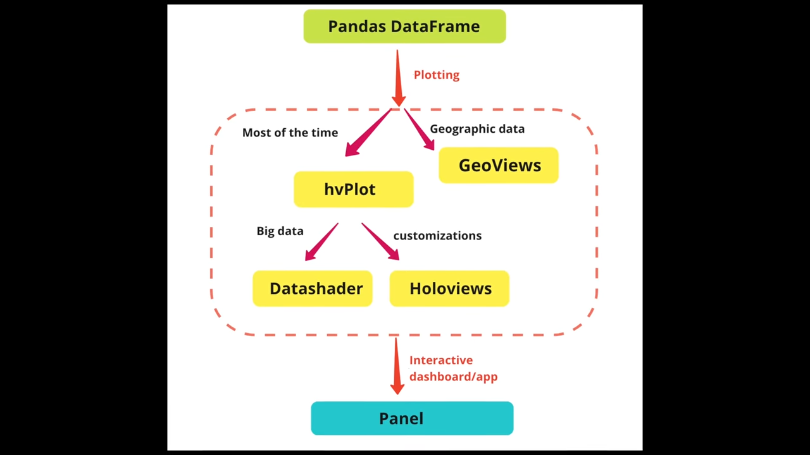

[Graph drawing - Wikiwand](http://www.wikiwand.com/en/Graph_drawing)
[The Key Differences Between Charts and Graphs Explained](https://www.worldoweb.co.uk/2019/key-differences-between-charts-and-graphs)
[Effective Data Visualisation - with Valentina D'Efilippo - YouTube](https://www.youtube.com/watch?v=MIZXqC1-VLc)
[Foundations of Data Visualisation - Computerphile - YouTube](https://www.youtube.com/watch?v=qQ9Wu1IxsYw)

[The Data Visualisation Catalogue](http://www.datavizcatalogue.com/) ❗!important
[Information is Beautiful](https://informationisbeautiful.net/)
[The Pudding](https://pudding.cool/) visualized journalism
[Explorable Explanations](https://explorabl.es/) interactive learning
[Blog About Infographics and Data Visualization - Cool Infographics](http://www.coolinfographics.com/)
[Telling stories with data using the grammar of graphics](https://codewords.recurse.com/issues/six/telling-stories-with-data-using-the-grammar-of-graphics) using R
[Best R packages for data import, data wrangling & data visualization | Computerworld](https://www.computerworld.com/article/2921176/business-intelligence/great-r-packages-for-data-import-wrangling-visualization.html)

[Jake VanderPlas - How to Think about Data Visualization - PyCon 2019 - YouTube](https://www.youtube.com/watch?v=vTingdk_pVM)
[The Grammar of Graphics (Statistics and Computing): Wilkinson, Leland, Wills, D., Rope, D., Norton, A., Dubbs, R.: 9780387245447: Amazon.com: Books](https://www.amazon.com/Grammar-Graphics-Statistics-Computing/dp/0387245448)
[A Comprehensive Guide to the Grammar of Graphics for Effective Visualization of Multi-dimensional Data](https://towardsdatascience.com/a-comprehensive-guide-to-the-grammar-of-graphics-for-effective-visualization-of-multi-dimensional-1f92b4ed4149)
[A layered grammar of graphics](https://vita.had.co.nz/papers/layered-grammar.html)

[Data visualization · GitHub](https://github.com/showcases/data-visualization)
[fasouto/awesome-dataviz: A curated list of awesome data visualization libraries and resources.](https://github.com/fasouto/awesome-dataviz)
[shivkumarganesh/InfoVizGeek: List of tools and Utilities for Data and Information Visualization. Ever Expanding list with Insights into some of the most happening Frameworks.](https://github.com/shivkumarganesh/InfoVizGeek)
[5 Amazing Tips for Data Visualization - Towards Data Science](https://towardsdatascience.com/5-amazing-tips-for-data-visualization-990fdb19c396)

[graphicalweb2014/public at master · mlarocca/graphicalweb2014](https://github.com/mlarocca/graphicalweb2014/tree/master/public) demo with Ractive and D3

[Agile Visualization](http://agilevisualization.com/) using [Pharo](http://pharo.org/)

[anvaka/ngraph: Beautiful Graphs](https://github.com/anvaka/ngraph)

[39 studies about human perception in 30 minutes — Medium](https://medium.com/@kennelliott/39-studies-about-human-perception-in-30-minutes-4728f9e31a73#.j5im2oxbz)
[Introducing the Snail Chart - Nightingale - Medium](https://medium.com/nightingale/yet-another-alternative-for-bar-charts-introducing-the-snail-chart-4fe69b938594)

## Book

[jsDataV.is - Data Visualization with JavaScript](http://jsdatav.is/)
[Introduction · Data Visualization for All](https://www.datavizforall.org/)
[The Grammar of Graphics](https://www.cs.uic.edu/~wilkinson/TheGrammarOfGraphics/GOG.html)

## Lightning

[Lightning | Data Visualization Server](http://lightning-viz.org/)
Server-client architecture, with Python, JS, Scala, R clients

[Lightning + Jupyter - Jupyter Notebook Viewer](https://nbviewer.jupyter.org/github/lightning-viz/lightning-example-notebooks/blob/master/index.ipynb)

## Python

[Python Data Visualization 2018: Why So Many Libraries? - Anaconda](https://www.anaconda.com/blog/developer-blog/python-data-visualization-2018-why-so-many-libraries/)
[Top 6 Python Libraries for Visualization: Which one to Use? | by Khuyen Tran | Jul, 2020 | Towards Data Science](https://towardsdatascience.com/top-6-python-libraries-for-visualization-which-one-to-use-fe43381cd658)
[What Are the Best Python Plotting Libraries? | by Will Norris | May, 2022 | Towards Data Science](https://towardsdatascience.com/what-are-the-best-python-plotting-libraries-df234a356aec)
[Introduction to Data Visualization in Python | by Gilbert Tanner | Towards Data Science](https://towardsdatascience.com/introduction-to-data-visualization-in-python-89a54c97fbed)
[Overview of Python Visualization Tools - Practical Business Python](https://pbpython.com/visualization-tools-1.html)
[Choosing a Python Visualization Tool - Practical Business Python](https://pbpython.com/python-vis-flowchart.html)
[Jake VanderPlas The Python Visualization Landscape PyCon 2017 - YouTube](https://www.youtube.com/watch?v=FytuB8nFHPQ)
[Creating Dashboard to Visualise Data In Python - DEV Community 👩‍💻👨‍💻](https://dev.to/steelwolf180/creating-dashboard-to-visualise-data-in-python-3493)
[Complete Guide to Data Visualization with Python - Towards Data Science](https://towardsdatascience.com/complete-guide-to-data-visualization-with-python-2dd74df12b5e)
[The 7 most popular ways to plot data in Python | Opensource.com](https://opensource.com/article/20/4/plot-data-python)
[PYTHON CHARTS | The definitive Python data visualization site](https://python-charts.com/) samples

[Welcome to pycircular’s documentation! — pycircular documentation](https://albahnsen.github.io/pycircular/)
[Introducing PyCircular: A Python Library for Circular Data Analysis | by Alejandro Correa Bahnsen | Jan, 2023 | Towards Data Science](https://towardsdatascience.com/introducing-pycircular-a-python-library-for-circular-data-analysis-bfd696a6a42b)

[Wide vs. long data](https://anvil.works/blog/tidy-data)
[Plotting in Python: Comparing the Options](https://anvil.works/blog/plotting-in-python)
[Choosing one of many Python visualization tools | by Gabriela Moreira Mafra | Magrathea](https://blog.magrathealabs.com/choosing-one-of-many-python-visualization-tools-7eb36fa5855f)
[5 Steps to Beautiful Bar Charts in Python | Towards Data Science](https://towardsdatascience.com/5-steps-to-build-beautiful-bar-charts-with-python-3691d434117a)

[From data to Viz | Find the graphic you need](https://www.data-to-viz.com/)
[Visualizing In-App User Journey Using Sankey Diagrams In Python | by Nicolas Esnis | Towards Data Science](https://towardsdatascience.com/visualizing-in-app-user-journey-using-sankey-diagrams-in-python-8373a7bb2d22)

[Notebook :: Anaconda.org](https://anaconda.org/jbednar/plotting_pitfalls/notebook) large data, use hvPlot/HoloViews over Datashader

[ResidentMario/missingno: Missing data visualization module for Python.](https://github.com/ResidentMario/missingno)

[PyViz documentation](http://pyviz.org/)
[PyViz Tutorial](http://pyviz.org/tutorial/index.html)
[PyViz Topics Examples](https://examples.pyviz.org/)
[PyViz: Simplifying the Data Visualisation process in Python.](https://towardsdatascience.com/pyviz-simplifying-the-data-visualisation-process-in-python-1b6d2cb728f1)

[Glue: multi-dimensional linked-data exploration](https://glueviz.org/)
[Glue documentation](http://docs.glueviz.org/en/stable/index.html)

[piccolomo/plotext: plotting on terminal](https://github.com/piccolomo/plotext)
[Making Plots In Your Terminal With Plotext - PyBites](https://pybit.es/articles/terminal-plotting-with-plotext/)

[Home — VisPy](http://vispy.org/)
[Visualize any Data Easily, from Notebooks to Dashboards | Scipy 2019 Tutorial | James Bednar - YouTube](https://www.youtube.com/watch?v=7deGS4IPAQ0)

[pyecharts - A Python Echarts Plotting Library](http://pyecharts.org/#/)
[pyecharts/pyecharts: 🎨 Python Echarts Plotting Library](https://github.com/pyecharts/pyecharts)

[RJT1990/pyflux: Open source time series library for Python](https://github.com/RJT1990/pyflux)

[Welcome! — Toyplot documentation](https://toyplot.readthedocs.io/en/stable/)
[sandialabs/toyplot: Interactive plotting for Python.](https://github.com/sandialabs/toyplot)

[AutoViML/AutoViz: Automatically Visualize any dataset, any size with a single line of code. Created by Ram Seshadri. Collaborators Welcome. Permission Granted upon Request.](https://github.com/AutoViML/AutoViz)

[Graph visualisation basics with Python Part I: Flowcharts | by Himalaya Bir Shrestha | Apr, 2022 | Towards Data Science](https://towardsdatascience.com/graph-visualisation-basics-with-python-part-i-flowcharts-6298c4f412e0)

### Holoviz

[High-level tools to simplify visualization in Python — HoloViz documentation](https://holoviz.org/)

[Datashader](http://datashader.org/) Accurately render even the largest data
[HoloViews — HoloViews](http://holoviews.org/) Datashader + Bokeh
[hvPlot documentation](https://hvplot.holoviz.org/)
[A high-level app and dashboarding solution for Python — Panel documentation](https://panel.holoviz.org/)

[How to Create a Beautiful Python Visualization Dashboard With Panel/Hvplot - YouTube](https://www.youtube.com/watch?v=uhxiXOTKzfs)

[Visualize any Data Easily, from Notebooks to Dashboards | Scipy 2019 Tutorial | James Bednar - YouTube](https://www.youtube.com/watch?v=7deGS4IPAQ0) 3:06:37, pyviz + holoviz

[Visualization and Interactive Dashboard in Python | by Sophia Yang | Towards Data Science](https://towardsdatascience.com/visualization-and-interactive-dashboard-in-python-c2f2a88b2ba3)
[Visualization and Interactive Dashboard in Python: My favorite Python Viz tools — HoloViz - YouTube](https://www.youtube.com/watch?v=wlzkiGPIV3I)
[Big Data Visualization Using Datashader in Python | How does Datashader work and why is it so fast? - YouTube](https://www.youtube.com/watch?v=U6dyIRolIhI)

### Matplotlib

[Matplotlib: Python plotting](https://matplotlib.org/)
[Usage — Matplotlib documentation](https://matplotlib.org/faq/usage_faq.html)
[User's Guide — Matplotlib documentation](https://matplotlib.org/users/index.html)
[Tutorials — Matplotlib documentation](https://matplotlib.org/tutorials/index.html)
[API Overview — Matplotlib documentation](https://matplotlib.org/api/index.html)

[Matplotlib Tutorial Series - Graphing in Python - YouTube](https://www.youtube.com/playlist?list=PLQVvvaa0QuDfefDfXb9Yf0la1fPDKluPF)
[Graphing in Matplotlib (chart generation) in Python - YouTube](https://www.youtube.com/playlist?list=PLQVvvaa0QuDfpEcGUM6ogsbrlWtqpS5-1)
[Customizing Matplotlib Graphs and Charts - YouTube](https://www.youtube.com/playlist?list=PLQVvvaa0QuDc2QjQOkZ4rtLYZVll_sZFZ)
[3D Graphing with Matplotlib - YouTube](https://www.youtube.com/playlist?list=PLQVvvaa0QuDe60TfxLrJzdQEacMEItxl-)

[Matplotlib Tutorial - Tutorialspoint](https://www.tutorialspoint.com/matplotlib/index.htm)
[A Beginners Guide to Creating Clean and Appetizing Python Charts](https://towardsdatascience.com/a-beginners-guide-to-creating-clean-and-appetizing-python-charts-f7e1cf1899d2)
[A Beginner’s Guide to Data Visualization Using Matplotlib](https://towardsdatascience.com/a-beginners-guide-to-data-visualization-using-matplotlib-22b15a0b090)
[The Last Matplotlib Tweaking Guide You’ll Ever Need](https://towardsdatascience.com/the-last-matplotlib-tweaking-guide-youll-ever-need-dbd4374a1c1e)
[Effectively Using Matplotlib - Practical Business Python](https://pbpython.com/effective-matplotlib.html)

[Beginner's Guide to matplotlib for Visualization and Exploration in Python](https://www.analyticsvidhya.com/blog/2020/02/beginner-guide-matplotlib-data-visualization-exploration-python/)
[10 matplotlib Tricks to Master Data Visualization in Python](https://www.analyticsvidhya.com/blog/2020/05/10-matplotlib-tricks-data-visualization-python/)
[Precision data plotting in Python with Matplotlib | Opensource.com](https://opensource.com/article/20/5/matplotlib-python)
[Python | Basic Gantt chart using Matplotlib - GeeksforGeeks](https://www.geeksforgeeks.org/python-basic-gantt-chart-using-matplotlib/)
[A Simple Guide to Beautiful Visualizations in Python | by Frank Andrade | Apr, 2021 | Towards Data Science](https://towardsdatascience.com/a-simple-guide-to-beautiful-visualizations-in-python-f564e6b9d392)
[Level Up with Python: Quickly Produce PDFs with Stunning Visuals | by Kate Wall | Feb, 2022 | Towards Data Science](https://towardsdatascience.com/level-up-with-python-quickly-produce-pdfs-with-stunning-visuals-d6750c9c7be2)

[Seaborn: statistical data visualization](https://seaborn.pydata.org/) abstraction layer using Long Form on top of Matplotlib
[Seaborn Tutorial - Tutorialspoint](https://www.tutorialspoint.com/seaborn/index.htm)
[Visual Storytelling with Seaborn - The Startup - Medium](https://medium.com/swlh/visual-storytelling-with-seaborn-28dc548dbc4b)
[Handy Data Visualization Functions in matplotlib & Seaborn to Speed Up Your EDA](https://medium.com/better-programming/handy-data-visualization-functions-in-matplotlib-seaborn-to-speed-up-your-eda-241ba0a9c47d)
[Data visualization made simple in Python with Seaborn | Opensource.com](https://opensource.com/article/20/5/seaborn-python)

[Plotting real-time data from Arduino using Python | HalfaGeek](https://importgeek.wordpress.com/2013/06/24/plotting-real-time-data-from-arduino-using-python/)
[Python Matplotlib (pyplot), a step-by-step Tutorial - Data Blogger](https://www.data-blogger.com/2017/11/15/python-matplotlib-pyplot-a-perfect-combination/)

[Visualization with Matplotlib | Python Data Science Handbook](https://jakevdp.github.io/PythonDataScienceHandbook/04.00-introduction-to-matplotlib.html)
[Visualization — pandas documentation](https://pandas.pydata.org/pandas-docs/stable/visualization.html)
[Simple Graphing with IPython and Pandas - Practical Business Python](http://pbpython.com/simple-graphing-pandas.html)
[A Comprehensive Guide To Visualizing and Analyzing DICOM Images in Python](https://medium.com/@hengloose/a-comprehensive-starter-guide-to-visualizing-and-analyzing-dicom-images-in-python-7a8430fcb7ed)

[python - How to make IPython notebook matplotlib plot inline - Stack Overflow](https://stackoverflow.com/questions/19410042/how-to-make-ipython-notebook-matplotlib-plot-inline)
[python - matplotlib hooking in to home/back/forward button events - Stack Overflow](https://stackoverflow.com/questions/14896580/matplotlib-hooking-in-to-home-back-forward-button-events)

`%matplotlib inline` on first line of script to render graph in Jupyter

### Bokeh

[Welcome to Bokeh — Bokeh documentation](https://bokeh.pydata.org/en/latest/) interactive plots in HTML
[User Guide — Bokeh documentation](https://bokeh.pydata.org/en/latest/docs/user_guide.html)
[Plotting with basic glyphs — Bokeh Documentation](https://docs.bokeh.org/en/latest/docs/user_guide/plotting.html#creating-figures)
[Providing data — Bokeh Documentation](https://docs.bokeh.org/en/latest/docs/user_guide/data.html)
[Styling visual attributes — Bokeh Documentation](https://docs.bokeh.org/en/latest/docs/user_guide/styling.html)
[Gallery — Bokeh Documentation](https://docs.bokeh.org/en/latest/docs/gallery.html)
[Making Interactions — Bokeh Documentation](https://docs.bokeh.org/en/latest/docs/user_guide/interaction.html)

[bokeh.plotting — Bokeh Documentation](https://docs.bokeh.org/en/latest/docs/reference/plotting.html)
[bokeh.models.sources — Bokeh Documentation](https://docs.bokeh.org/en/latest/docs/reference/models/sources.html#bokeh.models.sources.ColumnDataSource) ColumnDataSource
[bokeh.colors — Bokeh Documentation](https://docs.bokeh.org/en/latest/docs/reference/colors.html)
[bokeh.palettes — Bokeh Documentation](https://docs.bokeh.org/en/latest/docs/reference/palettes.html)
[bokeh.models.formatters — Bokeh Documentation](https://docs.bokeh.org/en/latest/docs/reference/models/formatters.html#bokeh.models.formatters.DatetimeTickFormatter) DatetimeTickFormatter

[Bokeh Tutorial - Tutorialspoint](https://www.tutorialspoint.com/bokeh/index.htm)
[How can Bokeh be used to generate sinusoidal waves in Python?](https://www.tutorialspoint.com/how-can-bokeh-be-used-to-generate-sinusoidal-waves-in-python) basics
[Data Visualization with Bokeh | Kaggle](https://www.kaggle.com/saurav9786/data-visualization-with-bokeh)
[Python | Data visualization using Bokeh - GeeksforGeeks](https://www.geeksforgeeks.org/python-data-visualization-using-bokeh/)
[Interactive Data Visualization in Python With Bokeh – Real Python](https://realpython.com/python-data-visualization-bokeh/)
[Creating an interactive map in Python using Bokeh and pandas | by Craig Dickson | Towards Data Science](https://towardsdatascience.com/creating-an-interactive-map-in-python-using-bokeh-and-pandas-f84414536a06)
[Easy Data Visualization Techniques with Bokeh | by Ilya Kvyatkovskiy | Towards Data Science](https://towardsdatascience.com/top-5-simple-techniques-for-data-visualization-using-bokeh-a7fa4e05d6e6)
[Interactive Bar Charts with Bokeh | by Ilya Kvyatkovskiy | Towards Data Science](https://towardsdatascience.com/interactive-bar-charts-with-bokeh-7230e5653ba3)
[Beautiful and Easy Plotting in Python — Pandas + Bokeh | by Christopher Tao | Towards Data Science](https://towardsdatascience.com/beautiful-and-easy-plotting-in-python-pandas-bokeh-afa92d792167)
[Visualizing Data with Bokeh and Pandas | Programming Historian](https://programminghistorian.org/en/lessons/visualizing-with-bokeh)
[Interactive data visualization with Bokeh - Jupyter Notebook Viewer](https://nbviewer.jupyter.org/github/bokeh/bokeh-notebooks/blob/master/index.ipynb)
[Add interactivity to your Python plots with Bokeh | Opensource.com](https://opensource.com/article/20/5/bokeh-python)
[Vector animations with Python - **del**( self )](https://zulko.gitddddhub.io/blog/2014/09/20/vector-animations-with-python/)

[phurwicz/hover: Never spend O(n) to annotate data again. Fun and precision come free.](https://github.com/phurwicz/hover)

#### Bokeh server

[Running a Bokeh server — Bokeh Documentation](https://docs.bokeh.org/en/latest/docs/user_guide/server.html)
[Server architecture — Bokeh Documentation](https://docs.bokeh.org/en/latest/docs/dev_guide/server.html)
[Embedding Bokeh content — Bokeh Documentation](https://docs.bokeh.org/en/latest/docs/user_guide/embed.html#userguide-embed-apps)

#### Timezone

[python - Bokeh time series plot annotation is off by 1 hour - Stack Overflow](https://stackoverflow.com/questions/41675041/bokeh-time-series-plot-annotation-is-off-by-1-hour)
[datetime axis type not handling timezone correctly · Issue #1135 · bokeh/bokeh](https://github.com/bokeh/bokeh/issues/1135)

### Chartify

[Welcome to chartify’s documentation!](https://chartify.readthedocs.io/en/latest/) Built on top of `Bokeh`
[spotify/chartify: Python library that makes it easy for data scientists to create charts.](https://github.com/spotify/chartify/)
[Introducing Chartify: Easier chart creation in Python for data scientists](https://labs.spotify.com/2018/11/15/introducing-chartify-easier-chart-creation-in-python-for-data-scientists/)

[Examples - Jupyter Notebook Viewer](https://nbviewer.jupyter.org/github/spotify/chartify/blob/master/examples/Examples.ipynb)
[Tutorial - Jupyter Notebook Viewer](https://nbviewer.jupyter.org/github/spotify/chartify/blob/master/examples/Chartify%20Tutorial.ipynb)

### Pygal

[Pygal — pygal documentation](http://www.pygal.org/en/stable/index.html)
[Kozea/pygal: PYthon svg GrAph plotting Library](https://github.com/Kozea/pygal)

[Creating Interactive Charts with Python Pygal | Pluralsight | Pluralsight](https://www.pluralsight.com/guides/creating-interactive-charts-with-python-pygal)
[Python Programming Tutorials](https://pythonprogramming.net/pygal-tutorial/)

### Plotly

[Plotly Open Source Graphing Libraries | | Plotly](https://plotly.com/graphing-libraries/)

[Plotly JavaScript Graphing Library | JavaScript | Plotly](https://plotly.com/javascript/)
[React Plotlyjs Index](https://plotly.com/javascript/react/)

[Plotly Python Graphing Library | Python | Plotly](https://plotly.com/python/)Built on top of `plotly.js`, interactive plots in HTML
[Plotly Express | Python | Plotly](https://plotly.com/python/plotly-express/) abstraction layer using Long Form similar to Seaborn
[Plotly Offline for IPython Notebooks](https://plot.ly/python/offline/)
[python_cheat_sheet.pdf](https://images.plot.ly/plotly-documentation/images/python_cheat_sheet.pdf)
[Plotly's Python API User Guide - Jupyter Notebook Viewer](https://nbviewer.jupyter.org/github/plotly/python-user-guide/blob/master/Index.ipynb)
[Visualize and communicate uncertainties clearly with Python and Plotly](https://towardsdatascience.com/visualize-and-communicate-uncertainties-with-python-and-plotly-1f30ece540d8)
[Simplify data visualization in Python with Plotly | Opensource.com](https://opensource.com/article/20/5/plotly-python)
[4 Reasons Why I’m Choosing Plotly as My Main Visualization Library | by Dario Radečić | Towards Data Science](https://towardsdatascience.com/4-reasons-why-im-choosing-plotly-as-the-main-visualization-library-dc4a961a402f)

[Dash by Plotly - Plotly](https://plot.ly/products/dash/)
[Creating Interactive Visualizations with Plotly’s Dash Framework - Practical Business Python](https://pbpython.com/plotly-dash-intro.html)
[Build a web data dashboard in just minutes with Python | by JP Hwang | Towards Data Science](https://towardsdatascience.com/build-a-web-data-dashboard-in-just-minutes-with-python-d722076aee2b)
[Data Visualization GUIs with Dash and Python - YouTube](https://www.youtube.com/playlist?list=PLQVvvaa0QuDfsGImWNt1eUEveHOepkjqt)
[Getting Started With Dash: Easy Data Visualization In Python - Part 1/3 - YouTube](https://www.youtube.com/watch?v=XOFrvzWFM7Y)
[Building A Financial Dashboard In Python With Dash - Part 2/3 - YouTube](https://www.youtube.com/watch?v=GlRauKqI08Y)
[Improving The Software Design Of The Financial Dashboard - Part 3/3 - YouTube](https://www.youtube.com/watch?v=L_KlPZ5qBOU)

[Python Histogram Plotting: NumPy, Matplotlib, Pandas & Seaborn – Real Python](https://realpython.com/python-histograms/)
[Customizing Plots with Python Matplotlib – Towards Data Science](https://towardsdatascience.com/customizing-plots-with-python-matplotlib-bcf02691931f)
[IPython Cookbook - Chapter 6 : Data Visualization](https://ipython-books.github.io/chapter-6-data-visualization/)

### Streamlit

[Streamlit — the fastest way to build custom ML tools .](https://www.streamlit.io/)
[How to use Streamlit to create beautiful ML tools - YouTube](https://www.youtube.com/watch?v=B2iAodr0fOo)

### plotnine

[A Grammar of Graphics for Python — plotnine documentation](https://plotnine.readthedocs.io/en/stable/) floowing the Grammar of Graphics, uses Matplotlib as backend
[has2k1/plotnine: A grammar of graphics for Python](https://github.com/has2k1/plotnine)
[Making Plots With plotnine – Data Analysis and Visualization in Python for Ecologists](https://datacarpentry.org/python-ecology-lesson/07-visualization-ggplot-python/index.html)

### Altair

[Altair: Declarative Visualization in Python — Altair documentation](https://altair-viz.github.io/) using Vega-Lite's grammar
[Introduction to Data Visualization with Altair - Practical Business Python](https://pbpython.com/altair-intro.html)
[Making Interactive Line Plots with Python Pandas and Altair | by Soner Yıldırım | May, 2021 | Towards Data Science](https://towardsdatascience.com/making-interactive-line-plots-with-python-pandas-and-altair-7ee1d109e3dd)

### pdvega

[PdVega: Interactive Vega-Lite Plots for Pandas — pdvega documentation](https://altair-viz.github.io/pdvega/)
[Intro to pdvega - Plotting for Pandas using Vega-Lite - Practical Business Python](https://pbpython.com/pdvega.html)

## JavaScript

[[d3-js]]
[[web-2d]]
[[web-visualization]]

[Data Visualization with JavaScript](http://jsdatav.is/intro.html)
[10 JavaScript libraries to draw your own diagrams](http://modeling-languages.com/javascript-drawing-libraries-diagrams/)
[Top 10 JavaScript Charting Libraries for Every Data Visualization Need](https://hackernoon.com/10-javascript-charting-libraries-data-visualization-b77523d23372)
[Datavisualization.ch Selected Tools](http://selection.datavisualization.ch/)

[billboard.js](https://naver.github.io/billboard.js/)

[dataarts/dat.gui: dat.gui is a lightweight controller library for JavaScript.](https://github.com/dataarts/dat.gui) widget for changing values in JavaScript
[Upload Images with dat.GUI : Polyvia - 羡辙杂俎](http://zhangwenli.com/blog/2015/05/29/upload-images-with-dat-gui/)
[cocopon/tweakpane: Compact GUI for fine-tuning parameters and monitoring value changes](https://github.com/cocopon/tweakpane)

[DataTables | Table plug-in for jQuery](http://www.datatables.net/)

[Data visualization with React and Ant Design - LogRocket Blog](https://blog.logrocket.com/data-visualization-with-react-ant-design/)

[SandDance](https://sanddance.js.org/)
[microsoft/SandDance: Visually explore, understand, and present your data.](https://github.com/Microsoft/SandDance)
[Microsoft open sources SandDance, a visual data exploration tool - Open Source Blog](https://cloudblogs.microsoft.com/opensource/2019/10/10/microsoft-open-sources-sanddance-visual-data-exploration-tool/)

[Aperture JS](http://aperturejs.com/)
[JavaScript InfoVis Toolkit](http://thejit.org/)
[JointJS - the HTML 5 JavaScript diagramming library.](http://www.jointjs.com/opensource)

[FoamTree](http://get.carrotsearch.com/foamtree/demo/) Treemap
[Carrot Search FoamTree: JavaScript Voronoi treemep demos](https://get.carrotsearch.com/foamtree/latest/demos/)

[React Flow - An open source library for building node based applications.](https://reactflow.dev/)

[Timeline JS - Beautifully crafted timelines that are easy, and intuitive to use.](http://timeline.knightlab.com/)
[Planby - React Electronic Program Guide, Schedule, Timeline and Events](https://planby.netlify.app/)

### ECharts

[Apache ECharts (incubating)](https://www.echartsjs.com/en/index.html)
[Apache ECharts (incubating)](https://echarts.apache.org/zh/index.html)
[使用 ECharts 与 ionic 创建原生应用 - 羡辙杂俎](http://zhangwenli.com/blog/2017/08/29/echarts-with-ionic/)
[https://ecomfe.github.io/echarts-liquidfill/example/](https://ecomfe.github.io/echarts-liquidfill/example/)

[ECharts 主题在线构建工具](https://echarts.baidu.com/theme-builder/)
[Ovilia/ECharts-Theme-Builder: Design your own theme for ECharts](https://github.com/Ovilia/ECharts-Theme-Builder)

[简单的 ECharts 数据可视化，30 分钟学会 | 码农俱乐部 - Golang 中国 - Go 语言中文社区](https://mlog.club/article/6989)

## C++

[epezent/implot: Advanced 2D Plotting for Dear ImGui](https://github.com/epezent/implot)

[Data Preprocessing And Visualization In C++ - Towards Data Science](https://towardsdatascience.com/data-preprocessing-and-visualization-in-c-6d97ed236f3b)

## Julia

[Gadfly.jl](http://gadflyjl.org/stable/)
[Plots in Julia](http://docs.juliaplots.org/latest/)

## Libraries

[Cytoscape: An Open Source Platform for Complex Network Analysis and Visualization](http://www.cytoscape.org/) R, Python, JS

[TimeMapper - Make Timelines and TimeMaps fast! - from the Open Knowledge Foundation Labs](http://timemapper.okfnlabs.org/) SaaS

[vis.gl - Urban Computing Foundation](https://vis.gl/)
