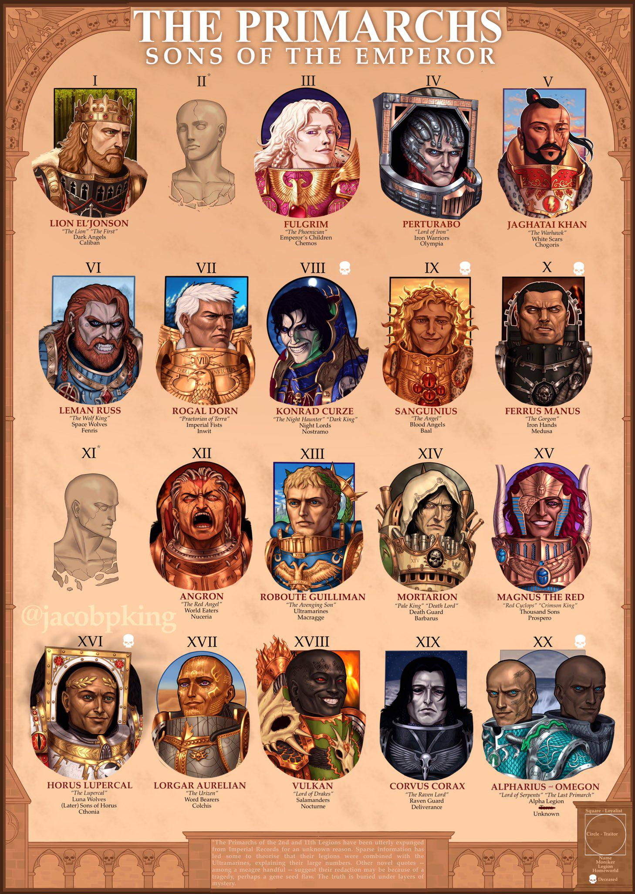

[Warhammer 40,000 - Wikiwand](https://www.wikiwand.com/en/Warhammer_40,000)
[Warhammer 40,000](https://warhammer40000.com/)
[Warhammer 40k Wiki | Fandom](https://warhammer40k.fandom.com/wiki/Warhammer_40k_Wiki)
[Warhammer 40k - Lexicanum](https://wh40k.lexicanum.com/wiki/Main_Page)

## Glossaries

> generated by GPT 5.4

| English      | 中文     | Description                                                                                                                     |
| ------------ | -------- | ------------------------------------------------------------------------------------------------------------------------------- |
| Aeldari      | 艾達靈族 | The formal name for the ancient and highly psychic Eldar species.                                                               |
| Eldar        | 靈族     | The older common name for the Aeldari species.                                                                                  |
| Necrontyr    | 懼亡者   | The mortal ancient ancestors of the Necrons, a short-lived species who biotransferred their souls into mechanical bodies.       |
| Men of Gold  | 金人     | A shadowy and possibly genetically or socially engineered strain of ancient humanity associated with mankind’s early expansion. |
| Men of Stone | 石人     | Mysterious artificial or post-human beings said to have helped humanity master interstellar expansion.                          |
| Men of Iron  | 鐵人     | Fully autonomous machine intelligences that served ancient humanity before turning against their creators.                      |

| English                           | 中文                     | Description                                                                                                                                                |
| --------------------------------- | ------------------------ | ---------------------------------------------------------------------------------------------------------------------------------------------------------- |
| Adeptus Astartes                  | 阿斯塔特修會             | The genetically engineered superhuman warriors commonly called Space Marines.                                                                              |
| Adeptus Custodes                  | 帝皇禁軍                 | The Emperor’s personal golden guardians, each far beyond a normal human warrior.                                                                           |
| Adeptus Mechanicus                | 機械修會                 | The priesthood of Mars that preserves, venerates, and manufactures Imperial technology.                                                                    |
| Adeptus Ministorum                | 帝國國教會               | The state religion of the Imperium devoted to worship of the Emperor.                                                                                      |
| Adepta Sororitas                  | 戰鬥修女會               | The militant sisterhood of the Imperial faith, also called the Sisters of Battle.                                                                          |
| Administratum                     | 行政部                   | The vast Imperial bureaucracy that handles governance, records, and tithes.                                                                                |
| Agri-world                        | 農業世界                 | A planet devoted primarily to large-scale food production for the Imperium.                                                                                |
| Alpha Legion                      | 阿爾法軍團               | A secretive Traitor Legion known for infiltration, misinformation, and hidden agendas.                                                                     |
| Apothecary                        | 藥劑官                   | A Space Marine battlefield medic responsible for healing and gene-seed recovery.                                                                           |
| Arbites                           | 帝國司法部               | The Imperial enforcers who uphold Imperial Law across the Emperor’s domains.                                                                               |
| Ark Mechanicus                    | 機械方舟艦               | A massive and ancient Mechanicus warship filled with sacred technology.                                                                                    |
| Armageddon                        | 阿米吉多頓               | A heavily contested Imperial world famous for apocalyptic wars against Orks and Chaos.                                                                     |
| Astartes                          | 阿斯塔特                 | A shortened term for Space Marines of the Adeptus Astartes.                                                                                                |
| Astra Militarum                   | 星界軍                   | The main massed human armies of the Imperium, formerly called the Imperial Guard.                                                                          |
| Astronomican                      | 星炬                     | A vast psychic beacon generated by the Emperor and sustained by sacrificed psykers, allowing Imperial Navigators to guide ships through the Warp.          |
| Astropath                         | 星語者                   | A soul-bound psyker used to send messages through the Warp across interstellar distances.                                                                  |
| Battle Barge                      | 戰鬥駁船                 | A large Space Marine capital ship built for assault, transport, and orbital warfare.                                                                       |
| Black Crusade                     | 黑色遠征                 | A major Chaos invasion launched from the Eye of Terror, often under Abaddon.                                                                               |
| Black Legion                      | 黑色軍團                 | The most infamous Traitor Legion, led by Abaddon after the Horus Heresy.                                                                                   |
| Black Templars                    | 黑色聖堂武士戰團         | A crusading Space Marine Chapter known for zeal, aggression, and rejection of psykers.                                                                     |
| Blood Angels                      | 血天使戰團               | A noble but tragic Space Marine Chapter cursed by genetic flaws and blood-hunger.                                                                          |
| Bolter                            | 爆彈槍                   | An iconic Imperial firearm that fires mass-reactive explosive shells.                                                                                      |
| Brother-Captain                   | 戰鬥兄弟連長             | A title used by some Space Marine or Grey Knight officers for elite command roles.                                                                         |
| Cadian                            | 卡迪亞兵                 | A soldier or style associated with the fortress world of Cadia and its military tradition.                                                                 |
| Cadia                             | 卡迪亞                   | The fortress world that long guarded the Eye of Terror until its destruction.                                                                              |
| Carnifex                          | 卡尼費克斯               | A heavily armored Tyranid bio-monster bred for shock assault and devastation.                                                                              |
| Castellan                         | 堡主 / 城堡指揮官        | A military title used for a fortress commander or senior war leader in some Imperial forces.                                                               |
| Catachan                          | 卡塔昌                   | A deadly death world whose soldiers are famous for toughness and jungle warfare.                                                                           |
| Chaos                             | 混沌                     | The corrupting force of the Warp and the great spiritual enemy of the Imperium.                                                                            |
| Chaos Cult                        | 混沌邪教                 | A mortal group that secretly or openly worships Chaos powers.                                                                                              |
| Chaos Daemons                     | 混沌惡魔                 | Warp-born entities formed from emotion and psychic energy in service to Chaos.                                                                             |
| Chaos Space Marines               | 混沌星際戰士             | Traitor Space Marines who rebelled or fell to Chaos corruption.                                                                                            |
| Chapter                           | 戰團                     | The standard organizational unit of the Adeptus Astartes, typically about a thousand Marines.                                                              |
| Chapter Master                    | 戰團長                   | The supreme commander of a Space Marine Chapter.                                                                                                           |
| Chaplain                          | 牧師官                   | A spiritual officer who maintains faith, morale, and doctrine within a Space Marine Chapter.                                                               |
| Cicatrix Maledictum               | 惡兆裂隙                 | The galaxy-spanning Warp rift that split the Imperium in the current era.                                                                                  |
| Commissar                         | 政委                     | A political officer who enforces discipline and loyalty within Imperial armed forces.                                                                      |
| Craftworld                        | 方舟世界                 | A vast Aeldari world-ship carrying the survivors of their ancient fallen empire.                                                                           |
| Crusade                           | 遠征                     | A large-scale military campaign launched in the Emperor’s name.                                                                                            |
| Dark Angels                       | 暗黑天使戰團             | The First Legion’s successor Chapter, secretive and obsessed with hunting the Fallen.                                                                      |
| Dark Eldar / Drukhari             | 黑暗靈族 / 德魯卡利      | Sadistic raiders from Commorragh in the Webway who survive by inflicting suffering on others.                                                              |
| Dark Mechanicum                   | 黑暗機械教               | Mechanicus hereteks and forge powers that have turned to Chaos.                                                                                            |
| Dark Age of Technology            | 科技黑暗時代前的黃金時代 | Humanity’s ancient golden age of expansion, science, and advanced machines.                                                                                |
| Death Guard                       | 死亡守衛                 | A Traitor Legion devoted to Nurgle and infamous for plague warfare and endurance.                                                                          |
| Death Korps of Krieg              | 克里格死亡兵團           | A grim Astra Militarum force known for siege warfare and sacrificial discipline.                                                                           |
| Death World                       | 死亡世界                 | A planet so hostile that survival itself is a constant struggle.                                                                                           |
| Dreadnought                       | 無畏機甲                 | A war walker containing the body of a mortally wounded Space Marine hero.                                                                                  |
| Ecclesiarchy                      | 國教會                   | Another common term for the Adeptus Ministorum, the Imperial church.                                                                                       |
| Emperor of Mankind                | 人類帝皇                 | The immortal ruler and divine figure at the center of the Imperium.                                                                                        |
| Emperor’s Children                | 帝皇之子                 | A Traitor Legion devoted to Slaanesh and obsessed with perfection and excess.                                                                              |
| Enginseer                         | 機械工程祭司             | A Mechanicus technician-priest who repairs and maintains sacred machinery.                                                                                 |
| Exarch                            | 鳳凰侍 / 戰道宗主        | A veteran Aeldari Aspect Warrior permanently bound to a single path of war.                                                                                |
| Exodite                           | 荒野靈族                 | Aeldari who rejected decadence and live on maiden worlds in austere societies.                                                                             |
| Exterminatus                      | 滅絕令                   | The sanctioned destruction of an entire world to deny it to the enemy.                                                                                     |
| Eye of Terror                     | 恐懼之眼                 | A great Warp storm and Chaos stronghold in the galaxy.                                                                                                     |
| Fallen                            | 墮天使                   | Dark Angels who turned during the Horus Heresy and were scattered through time and space.                                                                  |
| Farseer                           | 先知者                   | A powerful Aeldari psyker who reads fate and guides craftworld policy.                                                                                     |
| Fenris                            | 芬里斯                   | The savage home world of the Space Wolves Chapter.                                                                                                         |
| Forge World                       | 鑄造世界                 | A heavily industrial Mechanicus world dedicated to manufacturing war materiel.                                                                             |
| Gellar Field                      | 蓋勒力場                 | The protective field that shields ships from daemonic intrusion during Warp travel.                                                                        |
| Genestealer                       | 竊基因者                 | A Tyranid organism that infiltrates societies and seeds cults ahead of invasion.                                                                           |
| Genestealer Cult                  | 竊基因者教團             | A hidden uprising movement created by Genestealer infection and Tyranid influence.                                                                         |
| Gene-seed                         | 基因種子                 | The biological material used to create and sustain Space Marines.                                                                                          |
| Golden Throne                     | 黃金王座                 | The arcane life-support and psychic focus device that sustains the Emperor on Terra.                                                                       |
| Great Crusade                     | 大遠征                   | The Emperor’s campaign to reunify human worlds during the 30th millennium.                                                                                 |
| Great Rift                        | 大裂隙                   | A common name for the Cicatrix Maledictum that tore across the galaxy.                                                                                     |
| Grey Knights                      | 灰騎士                   | A secret Chapter of daemon-hunting psyker Space Marines tied to the Inquisition.                                                                           |
| Guardsman                         | 衛兵                     | A standard soldier of the Astra Militarum.                                                                                                                 |
| Heretek                           | 異端技師                 | A tech-priest or engineer condemned for forbidden or corrupted technological practice.                                                                     |
| Hive City                         | 巢都                     | A colossal vertical city housing enormous populations on industrial Imperial worlds.                                                                       |
| Hive Fleet                        | 巢群艦隊                 | A massive Tyranid invasion swarm crossing space as a living super-organism.                                                                                |
| Hormagaunt                        | 荷爾馬蟲                 | A fast, blade-limbed Tyranid assault creature used in overwhelming swarms.                                                                                 |
| Horus                             | 荷魯斯                   | The Warmaster who led the rebellion against the Emperor in the Horus Heresy.                                                                               |
| Horus Heresy                      | 荷魯斯之亂               | The great civil war that shattered the Imperium and crippled humanity’s future.                                                                            |
| Imperial Fists                    | 帝國之拳戰團             | A Space Marine force renowned for siegecraft, discipline, and defense.                                                                                     |
| Imperial Guard                    | 帝國衛隊                 | The older common name for the Astra Militarum.                                                                                                             |
| Imperial Knight                   | 帝國騎士機甲             | A towering noble-piloted war machine used by Knight Houses of the Imperium.                                                                                |
| Imperial Truth                    | 帝國真理                 | The secular, anti-religious doctrine spread by the Emperor during the Great Crusade.                                                                       |
| Imperium Nihilus                  | 虛無帝國                 | The half of the Imperium cut off by the Great Rift and plunged into darkness.                                                                              |
| Imperium of Man                   | 人類帝國                 | The vast authoritarian interstellar empire ruled in the Emperor’s name.                                                                                    |
| Inquisition                       | 審判庭                   | The secretive Imperial body that hunts heresy, witches, daemons, and xenos.                                                                                |
| Inquisitor                        | 審判官                   | An agent of the Inquisition empowered to act with nearly unlimited authority.                                                                              |
| Krieg                             | 克里格                   | A death world famous for producing the Death Korps and its culture of sacrifice.                                                                           |
| Lasgun                            | 雷射槍                   | The standard infantry energy weapon of the Astra Militarum.                                                                                                |
| Librarian                         | 智庫官                   | A Space Marine psyker who combines battlefield psychic power with lore keeping.                                                                            |
| Lord Commander                    | 最高統帥                 | A supreme Imperial military title, especially associated with Guilliman in the current era.                                                                |
| Machine Spirit                    | 機魂                     | The semi-mystical animating essence Imperial belief attributes to machines.                                                                                |
| Magos                             | 大賢者祭司               | A senior rank of Mechanicus tech-priest and master of specialized knowledge.                                                                               |
| Maiden World                      | 處女世界                 | A pristine world seeded or preserved by the Aeldari for colonization or refuge.                                                                            |
| Mekboy                            | 技霸 / 機工獸人          | An Ork mechanic and inventor who instinctively builds bizarre but functional machines.                                                                     |
| Militarum Tempestus               | 風暴兵軍務部             | The elite storm trooper arm of the Astra Militarum.                                                                                                        |
| Mon-keigh                         | 猴人                     | A contemptuous Aeldari term for humans or lesser beings.                                                                                                   |
| Navigator                         | 領航員                   | A mutant human who guides ships through the Warp using a third eye.                                                                                        |
| Necron                            | 太空死靈                 | An ancient race of machine-bodied beings awakened from tomb worlds.                                                                                        |
| Norn Queen                        | 諾恩女王                 | A vast Tyranid breeding intelligence that shapes and produces hive fleet organisms.                                                                        |
| Officio Assassinorum              | 刺客庭                   | The Imperial institution that trains and deploys sanctioned assassins.                                                                                     |
| Ogryn                             | 食人魔兵 / 歐格林        | A huge, abhuman strain of loyal Imperial soldiers valued for strength and simplicity.                                                                      |
| Old Ones                          | 上古者                   | An ancient and powerful species central to the prehistoric War in Heaven.                                                                                  |
| Ordo Hereticus                    | 異端審判庭               | The branch of the Inquisition focused on heresy, witches, and internal corruption.                                                                         |
| Ordo Malleus                      | 惡魔審判庭               | The branch of the Inquisition dedicated to fighting daemons and Chaos.                                                                                     |
| Ordo Xenos                        | 異形審判庭               | The branch of the Inquisition that studies and combats alien threats.                                                                                      |
| Ork                               | 歐克獸人                 | A brutal, fungal alien species that lives for fighting, looting, and loud machines.                                                                        |
| Painboy                           | 醫霸                     | An Ork surgeon who keeps warriors fighting with crude and horrifying procedures.                                                                           |
| Pariah                            | 反靈能者 / 虛空體        | A person with an anti-psychic blank aura that unsettles Warp-sensitive beings.                                                                             |
| Perpetual                         | 永生者                   | A rare being able to revive from death or survive across immense spans of time.                                                                            |
| Plague Marine                     | 瘟疫戰士                 | A Chaos Space Marine of Nurgle swollen with corruption, filth, and resilience.                                                                             |
| Power Armour                      | 動力裝甲                 | The advanced armored suit used by Space Marines and other elite Imperial warriors.                                                                         |
| Power Sword                       | 動力劍                   | A melee weapon surrounded by an energy field that cuts through armor.                                                                                      |
| Primarch                          | 原體                     | One of the Emperor’s superhuman sons created to lead the Space Marine Legions.                                                                             |
| Primaris Marine                   | 原鑄星際戰士             | An enhanced generation of Space Marines introduced after Guilliman’s return.                                                                               |
| Princeps                          | 首席機師                 | The primary pilot-commander of a Titan war machine.                                                                                                        |
| Psyker                            | 靈能者                   | A being capable of channeling Warp energy into psychic powers.                                                                                             |
| Raven Guard                       | 暗鴉守衛戰團             | A stealth-focused Space Marine force known for infiltration and rapid strikes.                                                                             |
| Reiver                            | 恐獵者                   | A Primaris Space Marine shock trooper specializing in terror and close assault.                                                                            |
| Rogue Trader                      | 行商浪人                 | A sanctioned Imperial explorer-merchant with unusual freedom beyond Imperial borders.                                                                      |
| Servitor                          | 機僕                     | A cybernetically altered human reduced to a semi-automated labor or combat unit.                                                                           |
| Skitarii                          | 機械教護教軍             | The cybernetic soldiery of the Adeptus Mechanicus.                                                                                                         |
| Slugga                            | 手砲                     | A common Ork pistol that fires solid projectiles with crude reliability.                                                                                   |
| Sisters of Silence                | 寂静修女                 | An all-female Imperial order of Untouchables who hunt witches, suppress Warp powers, and serve the Emperor as anti-psyker enforcers.                       |
| Sorcerer                          | 巫術師 / 混沌術士        | A psyker, often aligned with Chaos, who wields forbidden or Warp-fueled powers.                                                                            |
| Space Hulk                        | 太空廢船群               | A drifting mass of fused derelict ships often infested with deadly threats.                                                                                |
| Space Marine                      | 星際戰士                 | A transhuman super-soldier of the Adeptus Astartes.                                                                                                        |
| Space Wolves                      | 太空野狼戰團             | A fierce and tribal Space Marine Chapter descended from Leman Russ.                                                                                        |
| STC (Standard Template Construct) | 標準建造模板             | A lost human technology system used to build machines and colonies in ancient times.                                                                       |
| Successor Chapter                 | 子戰團                   | A Space Marine Chapter founded from the gene-seed of an older Chapter or Legion.                                                                           |
| Swarmlord                         | 蟲巢霸主                 | A legendary Tyranid synapse war-leader spawned for supreme battlefield command.                                                                            |
| T’au                              | 鈦帝國 / 鈦族            | A young alien civilization focused on technology, expansion, and the Greater Good.                                                                         |
| Tech-Priest                       | 機械祭司                 | A member of the Adeptus Mechanicus devoted to technology as both science and faith.                                                                        |
| Terminator Armour                 | 終結者裝甲               | Extremely heavy elite battle armor used by veteran Space Marines.                                                                                          |
| Terra                             | 泰拉                     | Earth, the throneworld of the Emperor and political heart of the Imperium.                                                                                 |
| Thunderhawk                       | 雷鷹運輸機               | A heavily armed Space Marine gunship used for transport and close air support.                                                                             |
| Thunder Warriors                  | 雷霆戰士                 | Proto-Astartes super-soldiers used by the Emperor during the Unification Wars.                                                                             |
| Titan                             | 泰坦機神                 | A colossal god-machine of the Adeptus Mechanicus built for apocalyptic warfare.                                                                            |
| Tomb World                        | 墓穴世界                 | A hidden Necron world where ancient legions lie dormant in stasis.                                                                                         |
| Traitor Legion                    | 叛徒軍團                 | One of the original Space Marine Legions that turned against the Emperor.                                                                                  |
| Tyranid                           | 泰倫蟲族                 | A bio-engineered extragalactic species that devours all biomass it encounters.                                                                             |
| Ultramar                          | 極限星域                 | The realm centered on the Ultramarines’ domain and model of relative Imperial order.                                                                       |
| Ultramarines                      | 極限戰士戰團             | A codex-adherent Space Marine force descended from Roboute Guilliman.                                                                                      |
| Underhive                         | 巢都下層                 | The lawless and impoverished lower depths of a hive city.                                                                                                  |
| Unification Wars                  | 泰拉統一戰爭             | The wars by which the Emperor conquered Terra before the Great Crusade.                                                                                    |
| Untouchables                      | 无魂者                   | Rare individuals born as psychic blanks whose null presence disrupts Warp energy, unsettles others, and makes them invaluable against psykers and daemons. |
| Waaagh!                           | Waaagh！                 | The psychic-fueled momentum of an Ork war migration and conquest.                                                                                          |
| Warboss                           | 戰老大 / 軍閥老大        | An Ork leader who rules through brute strength, charisma, and constant battle.                                                                             |
| War in Heaven                     | 天堂之戰                 | An ancient cosmic conflict involving the Old Ones, Necrons, and other primordial powers.                                                                   |
| Warp                              | 亞空間                   | The parallel psychic dimension used for faster-than-light travel and home to daemons.                                                                      |
| Warp Storm                        | 亞空間風暴               | A violent Warp disturbance that disrupts travel, communication, and reality.                                                                               |
| Webway                            | 網道                     | An ancient extradimensional tunnel network primarily used by the Aeldari.                                                                                  |
| White Scars                       | 白色傷痕戰團             | A fast-moving Space Marine Chapter famed for speed, mobility, and hit-and-run warfare.                                                                     |
| WAAAGH! energy                    | Waaagh靈能               | The gestalt psychic field generated by Orks that helps their society and machines function.                                                                |
| Word Bearers                      | 懷言者軍團               | A Traitor Legion fanatically devoted to religion and the worship of Chaos.                                                                                 |
| World Eaters                      | 吞世者軍團               | A berserk Traitor Legion devoted to Khorne and close-quarters slaughter.                                                                                   |
| Wraithbone                        | 靈骨                     | A psychic material used by the Aeldari to grow structures, weapons, and constructs.                                                                        |
| Wraithguard                       | 幽冥衛士                 | Spirit-animated Aeldari constructs inhabited by the souls of the dead.                                                                                     |
| Wych                              | 妖姬鬥士                 | A gladiatorial Dark Eldar warrior specializing in speed and close combat spectacle.                                                                        |
| Xenos                             | 異形                     | The Imperial term for alien species.                                                                                                                       |
| Ynnari                            | 伊納瑞                   | A new Aeldari movement devoted to the god of the dead and racial renewal.                                                                                  |
| Eldrad Ulthran                    | 埃爾德拉德·烏斯蘭        | One of the most powerful and farsighted Aeldari farseers.                                                                                                  |
| Asdrubael Vect                    | 阿斯德魯巴·維克特        | The supreme overlord of Commorragh and master of Drukhari intrigue.                                                                                        |
| Ghazghkull Mag Uruk Thraka        | 碎骨者卡茲古             | The greatest living Ork warboss and prophet of endless Waaagh.                                                                                             |
| The Beast                         | 獸霸                     | A near-apocalyptic Ork warlord whose empire nearly broke the Imperium in M32.                                                                              |
| Imotekh the Stormlord             | 伊莫泰克·風暴領主        | A brilliant Necron phaeron expanding his dominion through relentless conquest.                                                                             |
| Szarekh, the Silent King          | 扎瑞克，寂靜之王         | The last ruler of the Necrons who has returned to confront the galaxy’s new age.                                                                           |
| Trazyn the Infinite               | 塔拉辛，無盡者           | A Necron overlord obsessed with collecting historical artifacts and living specimens.                                                                      |
| Commander Shadowsun               | 影陽指揮官               | A master T’au commander renowned for strategy and mobile warfare.                                                                                          |
| Commander Farsight                | 遠見指揮官               | A famous T’au rebel commander who broke from the Ethereal-led empire.                                                                                      |

### Gods

| English                                                             | 中文       | Description                                                                      |
| ------------------------------------------------------------------- | ---------- | -------------------------------------------------------------------------------- |
| Chaos Gods                                                          | 混沌諸神   | The four great Warp powers: Khorne, Tzeentch, Nurgle, and Slaanesh.              |
| [C'tan](https://warhammer40k.fandom.com/wiki/C'tan)                 | 星神       | Ancient godlike energy beings once worshipped and then shattered by the Necrons. |
| [Gork and Mork](https://warhammer40k.fandom.com/wiki/Gork_and_Mork) | 高克與毛克 | The two brutal and cunning gods worshipped by the Orks.                          |
| [Khorne](https://warhammer40k.fandom.com/wiki/Khorne)               | 恐虐       | The Chaos God of war, rage, bloodshed, and martial slaughter.                    |
| [Nurgle](https://warhammer40k.fandom.com/wiki/Nurgle)               | 納垢       | The Chaos God of decay, disease, despair, endurance, and corrupt rebirth.        |
| Ruinous Powers                                                      | 毀滅諸神   | Another name for the Chaos Gods and their corrupting influence.                  |
| [Slaanesh](https://warhammer40k.fandom.com/wiki/Slaanesh)           | 色孽       | The Chaos God of excess, sensation, obsession, perfection, and indulgence.       |
| [Tzeentch](https://warhammer40k.fandom.com/wiki/Tzeentch)           | 奸奇       | The Chaos God of change, fate, ambition, sorcery, and manipulation.              |

[Gods of Warhammer - the Chaos Gods - YouTube](https://www.youtube.com/watch?v=5phbGxwew_M&t=16s)

### Figures in Imperium

| English                | 中文            | Description                                                                           |
| ---------------------- | --------------- | ------------------------------------------------------------------------------------- |
| The Emperor of Mankind | 人類之皇帝      | The immortal founder of the Imperium, now enthroned on the Golden Throne.             |
| Malcador the Sigillite | 馬卡多·印記者   | The Emperor’s closest human advisor and regent during the Siege of Terra.             |
| Belisarius Cawl        | 貝利撒留·考爾   | The archmagos responsible for creating and unveiling the Primaris Marines.            |
| Abaddon the Despoiler  | 阿巴頓·掠奪者   | Warmaster of Chaos and leader of the Black Legion’s Black Crusades.                   |
| Erebus                 | 艾瑞巴斯        | A Word Bearers chaplain whose schemes helped ignite the Horus Heresy.                 |
| Khârn the Betrayer     | 卡恩·背叛者     | A legendary World Eaters champion devoted to Khorne.                                  |
| Typhus                 | 泰弗斯          | Herald of Nurgle and plague-ridden champion of the Death Guard.                       |
| Ahriman                | 阿裡曼          | The greatest sorcerer of the Thousand Sons, obsessed with undoing his Legion’s curse. |
| Lucius the Eternal     | 盧修斯·永生者   | A swordsman of Slaanesh who returns through those who take pride in killing him.      |
| Fabius Bile            | 法比烏斯·拜爾   | A renegade apothecary infamous for grotesque experiments and genetic tampering.       |
| Saint Celestine        | 聖女塞勒絲汀    | A living saint of the Imperium who returns again and again to battle its foes.        |
| Sebastian Thor         | 塞巴斯蒂安·索爾 | The reformer priest who ended the Age of Apostasy and reshaped the Ecclesiarchy.      |
| Goge Vandire           | 戈格·範迪爾     | The tyrannical ruler whose madness plunged the Imperium into civil bloodshed.         |
| Constantine Valdor     | 君士坦丁·瓦爾多 | Captain-General of the Custodes and foremost guardian of the Emperor.                 |
| Yvraine                | 伊芙蕾妮        | A prophet of Ynnead central to the rise of the Ynnari.                                |
| Marneus Calgar         | 馬涅烏斯·卡爾加 | Chapter Master of the Ultramarines and one of the Imperium’s greatest commanders.     |
| Dante                  | 但丁            | Chapter Master of the Blood Angels and Regent of Imperium Nihilus.                    |

## Lore

[@game.mp4 - YouTube](https://www.youtube.com/@game.mp4)
[Arbitor Ian - YouTube](https://www.youtube.com/@ArbitorIan)
[Astartes Anonymous - YouTube](https://www.youtube.com/@astartesanonymous)
[CaptainYang 0V0 - YouTube](https://www.youtube.com/@captainyang)
[Icypie - YouTube](https://www.youtube.com/@Icypie-Chats)
[Lexicanum - YouTube](https://www.youtube.com/@lexicanum)
[Lore Bro - YouTube](https://www.youtube.com/@thelorebro)
[More Lore - YouTube](https://www.youtube.com/@MoreLoreYT)
[Nutbug - YouTube](https://www.youtube.com/@nutbug445)
[PancreasNoWork - YouTube](https://www.youtube.com/@pancreasnowork9939)
[The Gaming Storyteller - YouTube](https://www.youtube.com/@Dutch40KGuy)
[WesHammer - YouTube](https://www.youtube.com/@weshammer)
[戰錘40K - YouTube](https://www.youtube.com/playlist?list=PLe1YdiKWcqPR-6p2DOrs2wszsDiA1Pxi3) 达奇上校
[达奇上校 - YouTube](https://www.youtube.com/@DaQiShangXiao)
[鱼人君 Fishmanjun - YouTube](https://www.youtube.com/@fishmangame/search?query=%E6%88%98%E9%94%A440K)

[The Entire History Of Mankind In Warhammer 40K To Fall Asleep To - YouTube](https://www.youtube.com/watch?v=cgFQjg0tVuA) 2:34:27
[SECRET LEVEL E05: Warhammer 40k EXPLAINED for all you NEWBIES! (UPDATED) | Warhammer Lore - YouTube](https://www.youtube.com/watch?v=pLwY0Fzq9QQ)
[The Complete History of Warhammer 40k Lore - YouTube](https://www.youtube.com/watch?v=coHpSZ1ePPU) 56:54
[40K Timeline EXPLAINED. Everything You NEED to Know! | Warhammer Lore - YouTube](https://www.youtube.com/watch?v=B0Z4i1Sl94g) 50:35

GQ
[Warhammer 40,000 Expert Answers Your Questions - YouTube](https://www.youtube.com/watch?v=lYCDDEn2AY4&t=5s)
[Warhammer 40,000 Expert's Theories About the Biggest Unsolved Mysteries of Warhammer 40K - YouTube](https://www.youtube.com/watch?v=r1do-HnmJ5Y)
[Warhammer 40,000 Expert Answers Horus Heresy Questions - YouTube](https://www.youtube.com/watch?v=XKkDq8ki5_o)

[A Guide to the GALAXY of WARHAMMER 40k | Warhammer 40,000 Lore - YouTube](https://www.youtube.com/watch?v=rHqNN4XmnfY)

[戰錘40K - YouTube](https://www.youtube.com/playlist?list=PLe1YdiKWcqPR-6p2DOrs2wszsDiA1Pxi3) 达奇上校
[戰錘40k雜談 - YouTube](https://www.youtube.com/playlist?list=PLJxaeELT1p9mF_DDc95RNhzVDof3oDWD0) GTA系列

[The ENTIRE Horus Heresy Explained in 15 Minutes | Warhammer 40K Lore - YouTube](https://www.youtube.com/watch?v=_hQCQ8pNKsE) Lore Bro

[Every single Warhammer 40k (WH40k) Faction Explained | Part 1 - YouTube](https://www.youtube.com/watch?v=xCGKPRiJp84) Bricky
[Every single Warhammer 40k (WH40k) Faction Explained | Part 2 - YouTube](https://www.youtube.com/watch?v=Y6jnsX77TCU) Bricky
[EVERY SINGLE Faction In Warhammer 40k Explained! - YouTube](https://www.youtube.com/watch?v=dSSs5AIQ21M) More Lore
[The Endgame of Every Warhammer 40k Faction - YouTube](https://www.youtube.com/watch?v=x6M3OvOlRNM)
[40K Has an Ending. Nobody Wants to Read It. - YouTube](https://www.youtube.com/watch?v=-fnXc2B584c)

### Time Line

[The Complete Warhammer 40K Timeline That Actually Makes Sense - YouTube](https://www.youtube.com/watch?v=tMiVI-lbp2Q)
[忠诚！一个视频让你看懂《战锤40K》讲了个啥？ - YouTube](https://www.youtube.com/watch?v=LyQZgE_OCKM)
[《戰鎚40000》故事世界觀：新手入門編年史（上）. 「在冷酷黑暗的未來，只有戰爭。」 | by 荷魯斯在哈囉？ | 帝皇不是神 The Emperor isn’t a god | Medium](https://medium.com/%E5%B8%9D%E7%9A%87%E4%B8%8D%E6%98%AF%E7%A5%9E-the-emperor-isnt-a-god/%E6%88%B0%E9%8E%9A40000-%E6%95%85%E4%BA%8B%E4%B8%96%E7%95%8C%E8%A7%80-%E6%96%B0%E6%89%8B%E5%85%A5%E9%96%80%E7%B7%A8%E5%B9%B4%E5%8F%B2-%E4%B8%8A-f4c2ed09b848)
[《戰鎚40000》故事世界觀：新手入門編年史（中） - 帝皇不是神 The Emperor isn’t a god - Medium](https://medium.com/%E5%B8%9D%E7%9A%87%E4%B8%8D%E6%98%AF%E7%A5%9E-the-emperor-isnt-a-god/%E6%88%B0%E9%8E%9A40000-%E6%95%85%E4%BA%8B%E4%B8%96%E7%95%8C%E8%A7%80-%E6%96%B0%E6%89%8B%E5%85%A5%E9%96%80%E7%B7%A8%E5%B9%B4%E5%8F%B2-%E4%B8%AD-1aeab449a678)
[《戰鎚40000》故事世界觀：新手入門編年史（下）Part 1 - 帝皇不是神 The Emperor isn’t a god - Medium](https://medium.com/%E5%B8%9D%E7%9A%87%E4%B8%8D%E6%98%AF%E7%A5%9E-the-emperor-isnt-a-god/%E6%88%B0%E9%8E%9A40000-%E6%95%85%E4%BA%8B%E4%B8%96%E7%95%8C%E8%A7%80-%E6%96%B0%E6%89%8B%E5%85%A5%E9%96%80%E7%B7%A8%E5%B9%B4%E5%8F%B2-%E4%B8%8B-part-1-650c2abe4eb)
[《戰鎚40000》故事世界觀：新手入門編年史（下）Part 2. 「在冷酷黑暗的未來，只有戰爭。」 | by 荷魯斯在哈囉？ | 帝皇不是神 The Emperor isn’t a god | Medium](https://medium.com/%E5%B8%9D%E7%9A%87%E4%B8%8D%E6%98%AF%E7%A5%9E-the-emperor-isnt-a-god/%E6%88%B0%E9%8E%9A40000-%E6%95%85%E4%BA%8B%E4%B8%96%E7%95%8C%E8%A7%80-%E6%96%B0%E6%89%8B%E5%85%A5%E9%96%80%E7%B7%A8%E5%B9%B4%E5%8F%B2-%E4%B8%8B-part-2-a5f35b369fe)

> generated by GPT 5.4

- **Prehistory / Ancient Era**
  - **War in Heaven**
    - The Old Ones invented Webway for intergalactic travel without being corrupted by the Wrap (亞空間).
    - The Old Ones fight the Necrontyr (懼亡者).
    - The Necrontyr become the **Necrons** (機械死靈) with the help of the C’tan (星神, a supernatural being).
    - The Aeldari (branch of Eldar 神靈族) and Krork (Ork's ancestor) are created/uplifted as weapons.
    - The galaxy is devastated; the Old Ones exit the stage; the C’tan is shattered; the Necrons enter stasis (the Great Sleep).
  - **Rise of the Aeldari**
    - The Aeldari empire becomes the dominant galactic power.
  - **Humanity on Terra**
    - Human civilization slowly develops on Earth.

- **[M15–M25: Dark Age of Technology](https://warhammer40k.fandom.com/wiki/Age_of_Technology)**
  - Humanity expands across the stars.
  - STC (Standard Template Construct) technology, AI, and vast colony networks flourish.
  - Humanity reaches a technological golden age.
  - Cybernetic Revolt (Men of Iron Revolt), alliance of galactic powers (includin human) won at a terrible cost, AI is banned.

- **[M25–M30: Age of Strife](https://warhammer40k.fandom.com/wiki/Age_of_Strife)**
  - Warp storms isolate human worlds.
  - Psykers emerge in greater numbers.
  - AI rebellions and social collapse shatter human civilization.
  - Terra falls into techno-barbarian warfare.

- **Late M29–Early M30: Unification of Terra**
  - The Emperor of Mankind begins the [**Unification Wars**](https://warhammer40k.fandom.com/wiki/Unification_Wars).
  - Terra is conquered and unified under the Emperor.
  - The Thunder Warriors are used, then removed.
  - The foundations of the Imperium are established.

- **Early M30: Conquest of Luna and Mars Alliance**
  - The Emperor secures Luna.
  - The Treaty of Mars allies the Mechanicum with Terra.
  - Industrial and military strength for galactic conquest is secured.

- **Early M30: Fall of the Aeldari**
  - Slaanesh was given life by the immorality and hubris of the ancient Aeldari Empire.
  - Spirits of billions of Aeldari were drawn into the Warp and consumed by Slaanesh.
  - The Warp erupted into realspace, forming the Eye of Terror.
  - Only few Aeldari survived, forming the Craftworld, Drukhari and Harlequin.

- **M30: The Primarch Project**
  - The Emperor creates the Primarchs and Space Marine Legions.
  - 20 Primarchs and the 20 Space Marine Legions created from their gene-seed were established in the First Founding.
  - The infant Primarchs are scattered across the galaxy by Chaos.

- **M[30–M31: The Great Crusade](https://warhammer40k.fandom.com/wiki/Great_Crusade)**
  - The Imperium launches a galaxy-wide reconquest of lost human worlds.
  - The Emperor reunites with the Primarchs one by one.
  - Xenos empires and human separatists are destroyed or absorbed.
  - The Imperial Truth is spread: rejection of religion and superstition.
  - [一口氣看完-戰錘40K 2小時純享版 大遠征 原體叛亂 - YouTube](https://www.youtube.com/watch?v=U9TNRt97jqs)
  - [Great Crusade Chronology | Warhammer 40k Wiki | Fandom](https://warhammer40k.fandom.com/wiki/Great_Crusade_Chronology)

- **Late Great Crusade**
  - Ullanor Crusade ends in a major Imperial victory over the Orks.
  - Horus is named **Warmaster**, taking command of the Crusade.
  - The Emperor returns to Terra to work on the Webway Project.

- **[M31: The Horus Heresy](https://warhammer40k.fandom.com/wiki/Horus_Heresy)**
  - Horus is corrupted by Chaos.
  - Half the Primarchs and many Legions turn traitor.
  - The First Founding was shattered during the Horus Heresy.
  - Galaxy-wide civil war erupts across the Imperium.

- **Key Heresy Events**
  - **Drop Site Massacre at Isstvan V**
    - Loyalist Legions are betrayed and devastated.
  - **Burning of Prospero**
    - The Space Wolves destroy much of Magnus’s world.
  - **Shadow Crusade / Ruinstorm**
    - Ultramar is isolated; the war spreads.
  - **Beta-Garmon**
    - Massive battles open the road to Terra.

- **M31: Siege of Terra**
  - Traitor forces assault Terra.
  - The Emperor confronts Horus aboard the _Vengeful Spirit_.
  - Horus is slain.
  - The Emperor is mortally wounded and interred in the **Golden Throne**.

- **Immediate Aftermath**
  - The traitors retreat into the Eye of Terror.
  - The **Scouring** begins as loyalists pursue them.
  - Guilliman pushes the **Codex Astartes**.
  - Space Marine Legions are split into smaller Chapters.

- **M32–M41: The Imperium’s Long Decline**
  - [一口氣看完-戰錘40K 純享版 鑄造時代 雙皇紀元 叛教時代 - YouTube](https://www.youtube.com/watch?v=wDHXe5bJHK8)
  - The Imperium becomes increasingly bureaucratic, dogmatic, and theocratic.
  - The Emperor is worshipped as a god.
  - Countless wars are fought against xenos, mutants, heretics, and Chaos.
  - Knowledge and technology stagnate or are lost.

- **Major Developments During the Long Decline**
  - **[War of the Beast (M32)](https://warhammer40k.fandom.com/wiki/War_of_the_Beast)**
    [一口氣看完-戰錘40K 2小時純享版-野獸戰爭 - YouTube](https://www.youtube.com/watch?v=sNCR2UcDOLg)
  - **Age of Apostasy (M36)**
    - Goge Vandire rules through terror and corruption.
    - Civil war engulfs the Imperium.
    - Sebastian Thor leads a reformation.
    - The Adepta Sororitas emerge in their later role.
  - **Second and Third Wars for Armageddon (M41)**
    - Massive wars against Orks and Chaos.
    - Orks are lead by Ghazghkull Thraka.
  - **Shield of Baal (M41)**
    - The **Blood Angels** defend **Baal** from **Hive Fleet Leviathan**.
    - It shows a desperate war against overwhelming **Tyranid** forces.
    - The Blood Angels and their successors unified to defend the system but suffered devastating losses.
    - [重現萬年以前的軍團榮光！天使們的宿命之戰！【達奇】戰錘40K故事 - YouTube](https://www.youtube.com/watch?v=bNSfLN73Kgc)
    - [聖血天使的死亡防線！為蟲群布置的絞肉機戰場！【達奇】戰錘40K故事 - YouTube](https://www.youtube.com/watch?v=HcbXDjxEDYE)
    - [數萬精銳近乎覆滅，上億凡人化作塵埃，賭上性命的巴爾決戰！【達奇】戰錘40K故事 - YouTube](https://www.youtube.com/watch?v=SaXcfrfLS-c)
  - **Badab War**
    - Major Space Marine civil conflict.
  - **First Tyrannic War**
    - Hive Fleet Behemoth invades the galaxy.
    - Tyranids become a major known threat.
  - **Rise of the Necrons**
    - Tomb worlds begin awakening on a large scale.
  - **Tau Expansion**
    - The Tau emerge as a growing young empire.

- **Late M41: 13th Black Crusade**
  - Abaddon launches a massive Chaos offensive.
  - Cadia is besieged and ultimately falls.
  - The pylons are destroyed, worsening Warp instability.

- **Creation of the Great Rift**
  - The **Cicatrix Maledictum** tears across the galaxy.
  - The Imperium is split in two.
  - Warp travel and astropathic communication become far more dangerous.
  - Imperium Nihilus is plunged into isolation and darkness.

- **Return of Guilliman**
  - Roboute Guilliman is revived with the help of Archmagos Cawl and Yvraine.
  - Guilliman becomes Lord Commander of the Imperium.
  - He begins attempts to stabilize and reform the Imperium.

- **Primaris Space Marines**
  - Belisarius Cawl unveils the **Primaris Marines**.
  - New, larger Space Marines reinforce existing Chapters and found new ones.

- **M42: The Indomitus Crusade**
  - Guilliman launches a vast crusade to stabilize Imperial space.
  - Reinforcements and supplies are driven across the Rift-torn galaxy.
  - Many worlds are reclaimed, though the Imperium remains on the brink.

- **Plague Wars**
  - Guilliman battles Mortarion and the Death Guard in Ultramar.
  - Nurgle’s forces devastate Imperial worlds.
  - Ultramar becomes a central front in the new era.

- **Arks of Omen / Recent Era**
  - Abaddon and other major Chaos leaders pursue galaxy-shaping plans.
  - Vashtorr rises in influence.
  - Lion El’Jonson returns to the setting.
  - The galaxy remains in a state of total war.

- **Current State of Warhammer 40,000**
  - The Imperium survives, but barely.
  - Chaos is ascendant.
  - Tyranids, Necrons, Orks, Tau, Aeldari, and countless other forces continue major wars.
  - There is “only war.”

## Imperium of Man

More Lore
[EVERY SINGLE Imperial Faction Explained! - YouTube](https://www.youtube.com/watch?v=cm6t4Wgwtu4)
[EVERY SINGLE Power Weapon Explained! - YouTube](https://www.youtube.com/watch?v=IAGkBt1MAks)
[EVERY SINGLE Imperial Titan Explained! - YouTube](https://www.youtube.com/watch?v=oGpMEmrnUWY)
[EVERY SINGLE Space Marine Tank Explained! - YouTube](https://www.youtube.com/watch?v=lnbt8G75iv8)

The Gaming Storyteller
[How Powerful Is The Emperor Of Mankind? | Warhammer 40K Explained - YouTube](https://www.youtube.com/watch?v=SiSouFtz89s)

### Custodes

[Custodes Biology and Anatomy - Differences compared to Space marine - YouTube](https://www.youtube.com/watch?v=JJXAjlvVGT0)

The Gaming Storyteller
[How Powerful Is An Adeptus Custodes? | Warhammer 40K Explained - YouTube](https://www.youtube.com/watch?v=bY_bbk7yOpE)
[How Custodes Are Created | Warhammer 40K Explained - ft. Astartes Anonymous - YouTube](https://www.youtube.com/watch?v=0aZIYL3e4P4)
[How Many Custodians Does It Take To Kill A Primarch? | Warhammer 40K Explained - YouTube](https://www.youtube.com/watch?v=HBw6X1epK4o)
[Eyes Of The Emperor: Secrets Of The Ex-Custodes - YouTube](https://www.youtube.com/watch?v=0woojGOTL5U)

### Primarch/Legions 軍團

> First Founding before the Great Crusade in M30

[Every Primarch Explained in 32 Minutes | Warhammer 40K Lore - YouTube](https://www.youtube.com/watch?v=VVrvTXe8zZA) Lore Bro
[Every Primarch Ability in Warhammer 40K in 28 Minutes - YouTube](https://www.youtube.com/watch?v=vo8F7vsHlRU) PauL ALMiGHTY
[Ranking the 10 Most Powerful Primarchs in Warhammer 40K Universe - YouTube](https://www.youtube.com/watch?v=TCtRS_H9Urw)
[Space Marine Legions | Warhammer 40k Wiki | Fandom](https://warhammer40k.fandom.com/wiki/Space_Marine_Legions)

Nutbug
[List of all types of Primarch's Armour in Warhammer 40K - YouTube](https://www.youtube.com/watch?v=GGx_m-vBEBw)
[All Primarch SPECIAL WEAPONS (Melee and Ranged)| Warhammer 40K - YouTube](https://www.youtube.com/watch?v=hs76rX7mZLk)

CadianCanadian
[What Happened to the Traitor Primarchs? | Warhammer 40k Lore - YouTube](https://www.youtube.com/watch?v=tfJe3gMHFfo)

More Lore
[EVERY SINGLE Primarch Explained! - YouTube](https://www.youtube.com/watch?v=q5qYIW5cTtw&t=2319s)
[EVERY SINGLE Primarch Weapon Explained! - YouTube](https://www.youtube.com/watch?v=fgO5iW5VYVo)
[EVERY SINGLE Space Marine Legion Explained! - YouTube](https://www.youtube.com/watch?v=KdYimGQiFQ0)
[EVERY SINGLE Daemon Primarch Explained! - YouTube](https://www.youtube.com/watch?v=KKOcxiff7DE)

CaptainYang 0V0
[9大初創戰團~新兵入伍指南！【戰錘40K】 - YouTube](https://www.youtube.com/watch?v=KTG9qxtDBps)

[EVERY Space Marine Legion's Strengths and Weaknesses - YouTube](https://www.youtube.com/watch?v=F2w2y17WJIY)
[Every Primarch Ability in Warhammer 40K in 28 Minutes - YouTube](https://www.youtube.com/watch?v=vo8F7vsHlRU)
[他們是流落凡間的半神，也是帝皇最強大的子嗣【達奇】戰錘40K故事 - YouTube](https://www.youtube.com/watch?v=BN3MY7F1b7Q)
[他們是帝皇最強大的力量，也是一柄隨時能傷到自己的利刃【達奇】戰錘40K故事 - YouTube](https://www.youtube.com/watch?v=p-U54B2IMi4)

| Name              | 中文              | Legion                      | Description                                                                                                           |
| ----------------- | ----------------- | --------------------------- | --------------------------------------------------------------------------------------------------------------------- |
| Lion El’Jonson    | 萊昂·艾爾莊森     | Dark Angels                 | The stern and brilliant lord of the Dark Angels, renowned for knightly honor, secrecy, and tactical mastery.          |
| Fulgrim           | 福格瑞姆          | Emperor’s Children          | A perfection-obsessed primarch whose pursuit of beauty and excellence led him into corruption by Chaos.               |
| Perturabo         | 佩圖拉博          | Iron Warriors               | A siege master of immense intellect and bitterness, famed for relentless attritional warfare and cold efficiency.     |
| Jaghatai Khan     | 察合台·可汗       | White Scars                 | The swift and independent warlord of the White Scars, valuing speed, freedom, and the art of the hunt.                |
| Leman Russ        | 黎曼·魯斯         | Space Wolves                | The ferocious Wolf King, a savage yet cunning warrior who served as the Emperor’s executioner.                        |
| Rogal Dorn        | 羅格·多恩         | Imperial Fists              | The unyielding master of fortification and defense, defined by duty, stoicism, and absolute loyalty.                  |
| Konrad Curze      | 康拉德·科茲       | Night Lords                 | A haunted prophet of terror and justice who ruled through fear and foresaw his own dark fate.                         |
| Sanguinius        | 聖吉列斯          | Blood Angels                | The angelic and noble primarch beloved for his grace, compassion, and heroic sacrifice.                               |
| Ferrus Manus      | 費魯斯·馬努斯     | Iron Hands                  | A relentless and iron-willed warrior who prized strength, endurance, and ruthless self-mastery.                       |
| Angron            | 安格隆            | World Eaters                | A tragically enslaved berserker primarch consumed by rage, brutality, and the torment of the Butcher’s Nails.         |
| Roboute Guilliman | 羅伯特·基裡曼     | Ultramarines                | A master statesman and strategist who built empires, codified doctrine, and later led the Imperium’s renewal.         |
| Mortarion         | 莫塔裡安          | Death Guard                 | The grim lord of endurance and decay who despised tyranny yet fell into the corruption of Nurgle.                     |
| Magnus the Red    | 馬格努斯·赤紅     | Thousand Sons               | A peerless sorcerer-king of immense psychic power whose pursuit of forbidden knowledge doomed his Legion.             |
| Horus Lupercal    | 荷魯斯·盧佩卡爾   | Sons of Horus (Luna Wolves) | The Emperor’s favored son and Warmaster whose rebellion plunged the Imperium into the Horus Heresy.                   |
| Lorgar Aurelian   | 洛嘉·奧勒良       | Word Bearers                | A deeply spiritual primarch whose hunger for faith and meaning made him the architect of Chaos worship in the Heresy. |
| Vulkan            | 伏爾甘            | Salamanders                 | A compassionate giant and master smith who embodied resilience, craftsmanship, and protection of humanity.            |
| Corvus Corax      | 科拉克斯          | Raven Guard                 | A shadowed liberator and master of stealth warfare driven by justice, secrecy, and vengeance.                         |
| Alpharius Omegon  | 阿爾法瑞斯/歐梅岡 | Alpha Legion                | The twin and enigmatic masters of deception, espionage, and hidden motives whose true loyalties remain uncertain.     |

2 Legions (II and XI) and their Primarchs are "erased" prior to the Horus Heresy. Memories about them are locked.

### Space Marines/Chapters 戰團

> Second Founding, formation of Chapters from what's left of the Legions
> Adeptus Astartes, serve the Imperium in M41

[Category:Space Marines | Warhammer 40k Wiki | Fandom](https://warhammer40k.fandom.com/wiki/Category:Space_Marines)
[Space Marines | Warhammer 40k Wiki | Fandom](https://warhammer40k.fandom.com/wiki/Space_Marines)
[Category:Space Marine Chapters | Warhammer 40k Wiki | Fandom](https://warhammer40k.fandom.com/wiki/Category:Space_Marine_Chapters)
[Chapter | Warhammer 40k Wiki | Fandom](https://warhammer40k.fandom.com/wiki/Chapter)

[【游戏杂谈】星际战士需要拉屎吗？聊聊如何成为星际战士！ - YouTube](https://www.youtube.com/watch?v=wSmsoAJoFZg)
[How a Space Marine is CREATED in a Step by Step Process (Full Video clips) - YouTube](https://www.youtube.com/watch?v=WBaZ9YRRc3k)

[講解原鑄星際戰士與普通星際戰士的區別在哪？【戰錘40K】 - YouTube](https://www.youtube.com/watch?v=3ztl7TtS3FM)

More Lore
[EVERY SINGLE Ultramarines Chapter Explained! (Second Founding) - YouTube](https://www.youtube.com/watch?v=lPTBAMbecPM)
[ALL 22 Space Marine Organs Explained! - YouTube](https://www.youtube.com/watch?v=nh1VFG7pW5U)
[EVERY SINGLE Space Marine Power Armour Type Explained! - YouTube](https://www.youtube.com/watch?v=nWrm3Vnz930)
[The 10 Most Powerful Space Marine Chapters Explained! - YouTube](https://www.youtube.com/watch?v=3qeQ1iriUlY)

Astartes Anonymous
[ALL TERMINATOR ARMOUR | Warhammer 40,000 Lore Explained - YouTube](https://www.youtube.com/watch?v=szsQ7gYAmIU) "Tactical Dreadnought Armor"
[Every CUSTOM Terminator Suit | Warhammer 40,000 Lore Explained - YouTube](https://www.youtube.com/watch?v=KUubJ9FHDgM)

Installation00
[How Space Marines Are Made | Most Detailed Breakdown - YouTube](https://www.youtube.com/watch?v=qTPDON2SOYk)
[Space Marine Power Armor | Most Detailed Breakdown - YouTube](https://www.youtube.com/watch?v=CbvhEk1AR_c)

### Dreadnought

More Lore
[EVERY SINGLE Dreadnought In Warhammer 40k Explained! - YouTube](https://www.youtube.com/watch?v=1zzIRlNXVss)

Astartes Anonymous
[All Imperial Dreadnoughts - YouTube](https://www.youtube.com/watch?v=JL5yBv7DuyE)

## The Inquisition

[The Inquisition in 15 Minutes | All Ordos and Factions Explained - YouTube](https://www.youtube.com/watch?v=JnFFHyTbMvY)

## Xenos

[EVERY SINGLE Xenos Species In Warhammer 40k! - YouTube](https://www.youtube.com/watch?v=0Jg6ToCtmS0)

### Orks

[Category:Orks | Warhammer 40k Wiki | Fandom](https://warhammer40k.fandom.com/wiki/Category:Orks)
[Orks | Warhammer 40k Wiki | Fandom](https://warhammer40k.fandom.com/wiki/Orks)

### Tyranids

[Category:Tyranids | Warhammer 40k Wiki | Fandom](https://warhammer40k.fandom.com/wiki/Category:Tyranids)
[Tyranids | Warhammer 40k Wiki | Fandom](https://warhammer40k.fandom.com/wiki/Tyranids)

### Necrons

[Category:Necrons | Warhammer 40k Wiki | Fandom](https://warhammer40k.fandom.com/wiki/Category:Necrons)
[Necrons | Warhammer 40k Wiki | Fandom](https://warhammer40k.fandom.com/wiki/Necrons)

### T'au

[Category:Tau | Warhammer 40k Wiki | Fandom](https://warhammer40k.fandom.com/wiki/Category:Tau)
[T'au Empire | Warhammer 40k Wiki | Fandom](https://warhammer40k.fandom.com/wiki/T%27au_Empire)

### Aeldari

[Category:Aeldari | Warhammer 40k Wiki | Fandom](https://warhammer40k.fandom.com/wiki/Category:Aeldari)
[Aeldari | Warhammer 40k Wiki | Fandom](https://warhammer40k.fandom.com/wiki/Aeldari)
[Aeldari Empire | Warhammer 40k Wiki | Fandom](https://warhammer40k.fandom.com/wiki/Aeldari_Empire)

## Video Games

[The Evolution of Warhammer Video Games - Warhammer Writer Explains - YouTube](https://www.youtube.com/watch?v=EpIWUlG_5-0)
[Evolution of Warhammer Games [1991-2023] - YouTube](https://www.youtube.com/watch?v=vJ39p-viqVg)

[Historian & Armor Expert Reacts to Warhammer Arms & Armor - YouTube](https://www.youtube.com/watch?v=BsCXcW9pDLk)

Space Marine
[Warhammer 40k: Space Marine Story Recap - YouTube](https://www.youtube.com/watch?v=YsSnZKxCnbM)
[腳踢戰爭頭目，拳打混沌親王，如此勇猛是誰的部將？【達奇】戰錘40K故事 - YouTube](https://www.youtube.com/watch?v=9_BlWjBE4Vc)
[Firearms Expert Reacts To Warhammer 40K: Space Marine’s Guns - YouTube](https://www.youtube.com/watch?v=HxfLy9Z3iww)

Space Marine 2
[Essential Lore You Need To Know Before Space Marine 2 - YouTube](https://www.youtube.com/watch?v=NSB6JrP--F4)
[Warhammer 40,000: Space Marine 2 Everything To Know - YouTube](https://www.youtube.com/watch?v=FICmpVRL-nU)
[當猛男被強化為超級猛男，戰力有多逆天？【達奇】戰錘40K故事 - YouTube](https://www.youtube.com/watch?v=t6eryQAFGm4)
[Firearms Expert Reacts To Warhammer 40K: Space Marine 2's Guns - YouTube](https://www.youtube.com/watch?v=MLkdd1k-j2I&t=1s)
[Historian & Armor Expert Reacts to Warhammer 40k Space Marine 2's Weapons & Armor - YouTube](https://www.youtube.com/watch?v=wcVJbC0OvnQ)

Darktide
[Firearms Expert Reacts To Warhammer 40,000: Darktide’s Guns - YouTube](https://www.youtube.com/watch?v=o9lzIC05aHU)

Boltgun
[Firearms Expert Reacts To Warhammer 40,000: Boltgun’s Guns - YouTube](https://www.youtube.com/watch?v=ZNSgulYUor8)

## Board Games

[Explore our Games and Systems | Start Warhammer](https://start-warhammer.com/explore-our-games/)

[荷魯斯在哈囉？ – Medium](https://vorthosgeek.medium.com/)
[《戰鎚40,000》 新手規則入門導讀. 教你去哪找40K的規則？新手到底需要看哪些規則？ | by 荷魯斯在哈囉？ | 帝皇不是神 The Emperor isn’t a god | Medium](https://medium.com/%E5%B8%9D%E7%9A%87%E4%B8%8D%E6%98%AF%E7%A5%9E-the-emperor-isnt-a-god/%E6%88%B0%E9%8E%9A40-000-%E6%96%B0%E6%89%8B%E8%A6%8F%E5%89%87%E5%85%A5%E9%96%80%E5%B0%8E%E8%AE%80-539dd8ebd538)

## Arts

[40K Gallery - Warhammer 40K Artwork](https://40k.gallery/)
[Official Warhammer Artwork – Special Edition Prints & Merchandise](https://www.warhammerart.com/)

[阿斯塔特最全戰鬥合輯！一次看個夠！ ！ ！ - YouTube](https://www.youtube.com/watch?v=yJu46bMNiMk) anime
