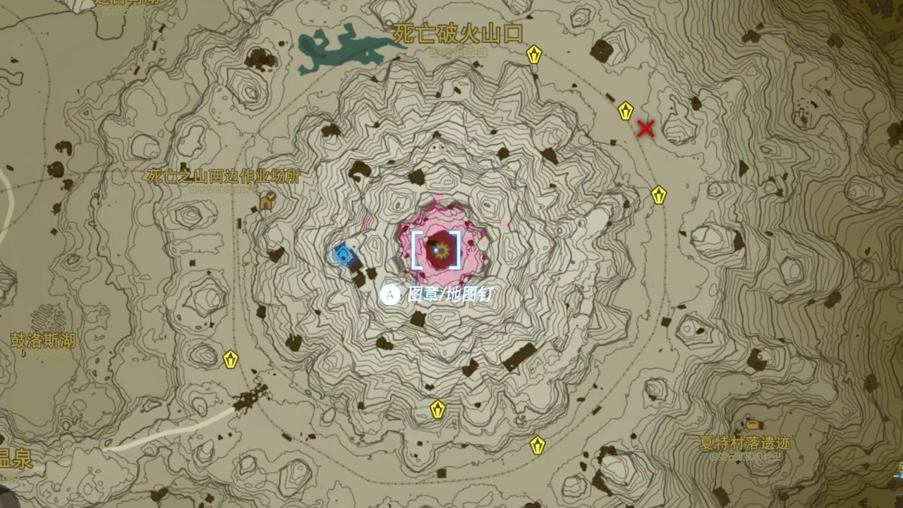

[塞尔达王国之泪性能分析：被 Switch 机能拖累的神作！ - YouTube](https://www.youtube.com/watch?v=aBHz767EbO4)
[官方开作弊“毁”游戏《王国之泪》游戏鉴赏【就知道玩游戏 2023】 - YouTube](https://www.youtube.com/watch?v=jjZHRKjXZ84)

[How Zelda Devs Fixed TOTK's Broken Physics - YouTube](https://www.youtube.com/watch?v=NfWOBGF4cu4)
[GDC Vault - Tunes of the Kingdom: Evolving Physics and Sounds for 'The Legend of Zelda: Tears of the Kingdom'](https://gdcvault.com/play/1034667/Tunes-of-the-Kingdom-Evolving)

[The Legend Of Zelda: Tears Of The Kingdom - How To Unlock The True Ending](https://www.dualshockers.com/zelda-totk-unlock-true-ending/)

## Maps

[Tears of the Kingdom Interactive Map](https://www.zeldadungeon.net/tears-of-the-kingdom-interactive-map/)
[Zelda: Tears of the Kingdom Map - Hyrule - IGN](https://www.ign.com/maps/the-legend-of-zelda-tears-of-the-kingdom/hyrule)
[Tears of the Kingdom Interactive Map | Map Genie](https://mapgenie.io/zelda-tears-of-the-kingdom)
[千岛电玩-王国之泪地图](https://sankeng.qiandaoapp.com/zelda2map/map)

[為了報復抄襲者 《薩爾達傳說 王國之淚》攻略作者做釣魚假攻略揭露多家中國遊戲自媒體直接照搬假數據 - 尼未亞 | Nmia Gaming](https://nmiagaming.com/%E7%82%BA%E4%BA%86%E5%A0%B1%E5%BE%A9%E6%8A%84%E8%A5%B2%E8%80%85-%E8%96%A9%E7%88%BE%E9%81%94%E5%82%B3%E8%AA%AA-%E7%8E%8B%E5%9C%8B%E4%B9%8B%E6%B7%9A%E6%94%BB%E7%95%A5%E4%BD%9C%E8%80%85%E5%81%9A%E9%87%A3/)

## Glitches/Speed Run

[How Speedrunners Beat Tears of The Kingdom in UNDER 1 HOUR (Speedrun World Record Breakdown) - YouTube](https://www.youtube.com/watch?v=R7RKHLDZMM8)
[How Speedrunners Beat Tears of the Kingdom in Under an Hour | Speedrun Explained - YouTube](https://www.youtube.com/watch?v=L67bfAdTMwk)
[How TotK Was Beaten in Under an Hour for the First Time EVER - Any% Speedrun Breakdown - YouTube](https://www.youtube.com/watch?v=BrNeOdaAwa8)
[How Speedrunners BROKE Tears of The Kingdom - YouTube](https://www.youtube.com/watch?v=UgHyUpT1XoY) 44:48

[How Nintendo _Accidentally_ BROKE Tears of The Kingdom EVEN MORE - YouTube](https://www.youtube.com/watch?v=PuAlWrXV7js)
[Every DUPLICATION Glitch In 1.2.0! How to Dupe Items, Devices and Weapons | Tears of the Kingdom - YouTube](https://www.youtube.com/watch?v=BZID7B_99QY)
[【塞爾達傳説 王國之淚】 1.1.2 新版本快速升級電池的簡單教程，手把手教學 @mrtts - YouTube](https://www.youtube.com/watch?v=8aXHL0-uTTY) weapon and resource cloning
[薩爾達傳說 | 王國之淚 | 無限複製武器 | 1.1.2 版本複製大法回來了 | 詳細教學個人小屋前置作業 | 【Somi 王國之淚】 - YouTube](https://www.youtube.com/watch?v=UkgKKceXsNw) weapon and resource cloning

## Guides

[The Legend of Zelda: Tears of the Kingdom - Zelda Dungeon Wiki, a The Legend of Zelda wiki](https://www.zeldadungeon.net/wiki/The_Legend_of_Zelda:_Tears_of_the_Kingdom)
[The Legend of Zelda: Tears of the Kingdom Guide - IGN](https://www.ign.com/wikis/the-legend-of-zelda-tears-of-the-kingdom)
[Zelda: Tears of the Kingdom - Complete Guide & Walkthrough](https://gamerant.com/tloz-totk-the-legend-of-zelda-tears-of-the-kingdom-walkthrough-shrines-side-quests-skyview-towers-korok-seeds/)

[【薩爾達傳說:王國之淚】Anny 遊戲攻略&資訊 - YouTube](https://www.youtube.com/playlist?list=PLPp1wjo6J_zZYF9XyaRNAR3M8bHoEGWir)
[The Legend of Zelda: Tears of the Kingdom Guides - YouTube](https://www.youtube.com/playlist?list=PL5octn-l9KEXHbzNIV7VkdOHX9NWic506)
[Zelda Tears of the Kingdom Guides 💎 - YouTube](https://www.youtube.com/playlist?list=PLqpGk7JGu_zxA8Ul3E2DKQXcNMCZz3cc7)
[Skyview Tower Guides Zelda Tears of the Kingdom 👑 - YouTube](https://www.youtube.com/playlist?list=PLqpGk7JGu_zxVpsiE5BM4OfZhklF4IErv)
[Shrine Guides Zelda Tears of the Kingdom 👑 - YouTube](https://www.youtube.com/playlist?list=PLqpGk7JGu_zyVI04whiH3peXsnkDFHldv)
[サカナ 180_sakana180 - YouTube](https://www.youtube.com/@sakana180)

[Don't Miss Zelda: Tears Of The Kingdom's Best Early-Game Feature](https://screenrant.com/zelda-tears-kingdom-autobuild-ability-early/)
[How To Unlock Autobuild in Zelda: Tears of the Kingdom](https://screenrant.com/unlock-autobuild-zelda-tears-kingdom-totk/)

[🤖️ 魂之神殿全流程攻略 含前期逃課解法 | 城堡的異變 環卡遺跡的秘密 第五賢者魔像米涅魯【薩爾達傳說:王國之淚】 - YouTube](https://www.youtube.com/watch?v=MkWttDuv6mA)
[魔像鋼彈 取得攻略｜最強大的戰力 坦克輔助｜魂之賢者 米涅魯 詳細地點 獲取方法｜薩爾達傳說王國之淚｜ 遊戲流程教學 ｜睡醒素材爆倉！ 全自動複製素材 王國之淚主題記憶手把即日起~5/30 超優惠團購 - YouTube](https://www.youtube.com/watch?v=4JKH-Ht-l9I)

[😈 解鎖地底魔人像商店 隱藏加愛心任務 來自地底的呼喚 瘴氣套裝 黑暗套裝 回憶服 全 7 個魔人像位置【薩爾達傳說:王國之淚】 - YouTube](https://www.youtube.com/watch?v=N8u4rp-_GR4)

[【王國之淚】番外 01 - 實用技巧攻略(一)｜王國之淚也通用的曠野之息技巧解說！（ver.1.2.0 版｜#八位堂） - YouTube](https://www.youtube.com/watch?v=zFLuHyITm00)
[【王國之淚】番外 04 - 實用技巧攻略(二)｜ 14 個小知識與小技巧（ver.1.2.0 版） - YouTube](https://www.youtube.com/watch?v=oXODBhMDS5Q)

[勞魯看了會生氣 😡15 種花式神廟逃課解密方法【薩爾達傳說:王國之淚】 - YouTube](https://www.youtube.com/watch?v=DLftfyD5RMo)

[My Life Is EASIER With These 183 Tips & Tricks For Zelda Tears of The Kingdom | Totk - YouTube](https://www.youtube.com/watch?v=DdZAnwY9ktk)
[Ultimate Beginner's Guide to Zelda TotK - YouTube](https://www.youtube.com/watch?v=vMOg_5G0ua0)
[42 Things You Didn't Know In Zelda Tears Of The Kingdom - YouTube](https://www.youtube.com/watch?v=bzxgabpUBnM)
[100 Tears of the Kingdom Tips and Secrets! - YouTube](https://www.youtube.com/watch?v=KEkPy_OXY1k)

[【實用】10 個你還不知道的王國之淚小知識《薩爾達傳說 : 王國之淚》 - YouTube](https://www.youtube.com/watch?v=krvqj2B-eRc)

[【速刷星星】星星碎片的大量取得方法與出現機制 ⭐《薩爾達傳說 : 王國之淚》 - YouTube](https://www.youtube.com/watch?v=avYBTzhOzQs)

### Easy Items

[王國之淚：無限刷炸彈花及元素果 - YouTube](https://www.youtube.com/watch?v=NNFDUIyVzsI)
[【薩爾達傳說 王國之淚】無限拿炸彈花及屬性果#薩爾達#炸彈花#無 BUG - YouTube](https://www.youtube.com/watch?v=mbwx6-zWRcY)

[【王國之淚】無需打人馬,4 把畢業弓直接拿,萌新必備！ - YouTube](https://www.youtube.com/watch?v=Jx_h2P5rpbo)

[🍄 傳送器 10 個推薦放置的位置 | 超富有洞窟 生命大松露 生命鱸魚【薩爾達傳說:王國之淚】 - YouTube](https://www.youtube.com/watch?v=MUqbUiVEIW0)

### Dragon Items

[【龍素材攻略】四條龍飛行路徑詳解，快速刷取龍的素材《薩爾達傳說 : 王國之淚》 - YouTube](https://www.youtube.com/watch?v=jOe9qA9vZ_k)
[【薩爾達傳說 王國之淚】四條龍刷新機制完整解說 | Anny 胖丁](https://annygames.com/2023/06/dragon/)
[四條龍刷新機制完整解說 | 詳細路線圖 | 龍角素材入手方式攻略 聶爾龍 費羅龍 奧爾龍 白龍【薩爾達傳說:王國之淚】 - YouTube](https://www.youtube.com/watch?v=jQPsCJMN6as)

### Money

[王國之淚| 4 種快速賺錢方法!! 其中 2 種稍微需要操作......塞哈特諾島神廟支線 賺盧比 前中期可 |新手 教學【薩爾達傳說】tears of the kingdom TotK - YouTube](https://www.youtube.com/watch?v=fcDU0TPQ6w4)

[【塞爾達傳說王國之淚】站著不動就能刷！分分鐘幾千盧比，海拉魯最強刷錢賺盧比攻略！ - YouTube](https://www.youtube.com/watch?v=u9jMVFxMdI0) Nabi Lake mini-game

[【薩爾達傳說 王國之淚】如何用 1 枚鑽石詐騙特里 100 萬？詐欺王林克壞事盡加儂不及他 金錢上限後還能賣東西嗎？特里賺錢 BUG【地方熊貓】TotK Terry Glitch【ティアキン】テリー増殖バグ - YouTube](https://www.youtube.com/watch?v=kKVZdI1iuBU)

### Lost Woods

[克洛格森林/迷途森林、莎莉亞湖正常進入法【薩爾達傳說：王國之淚】The Legend of Zelda: Tears of the Kingdom - YouTube](https://www.youtube.com/watch?v=PvhZuaaZXHI)

### Shield Surfing

[How to Shield Surf in Zelda Tears of the Kingdom](https://gamerant.com/zelda-tears-of-the-kingdom-shield-surf-how/)
ZL (Take Shield) + X (Jump) + A (Ride)

[Why Zelda: Tears of the Kingdom's Shield Surfing is One of Its Best Features](https://gamerant.com/zelda-tears-of-the-kingdom-shield-surfing-fun-best-feature/)

### Combat

[49 SECRET Combat Skills You May NOT Know (Tears Of The Kingdom) - YouTube](https://www.youtube.com/watch?v=mxuQiy2gZ2A)

[【王國之淚】番外 05 - 實用技巧攻略(三)｜王淚戰鬥系統的精髓（～ ver.1.2.0 版） - YouTube](https://www.youtube.com/watch?v=Y3AUNIheO84)

[【王國之淚】人馬怎麽打？無限偷襲教學，萌新開局也能打 - YouTube](https://www.youtube.com/watch?v=ukQxaCShAhw)
[王國之淚 你不可能還不知道人馬怎麼打吧? 人馬的打法動作詳解 | 一天打一隻，輕鬆又愉快 - YouTube](https://www.youtube.com/watch?v=1kZIDRKWj8s)
[【王国之泪】离谱的 5 个打怪技巧，无 bug 激发大师剑最强形态 - YouTube](https://www.youtube.com/watch?v=1Rm022XbMq0)

[Legend of Zelda Tears of the Kingdom Gleeok Location Guide](https://www.cbr.com/loz-totk-gleeok-location-guide/)
[王國之淚：前期獲取最強材料，最詳細的三頭龍教程，全部 14 只位置分享 - YouTube](https://www.youtube.com/watch?v=wH1eLaDtveI)

### Blood Moon

[【超詳細】血月後必做的四件事 🔴 血月機制詳細解說 | 薩爾達傳說 : 王國之淚 - YouTube](https://www.youtube.com/watch?v=6Mleo0ynEYs)

## Funny Moments

Red Arcade
[Zelda TotK: BEST MOMENTS! - YouTube](https://www.youtube.com/watch?v=3W78sLvMtf4)
[Zelda TotK: TOP 50 FUNNY MOMENTS! - YouTube](https://www.youtube.com/watch?v=8YHQq0xvtDg)
[Top 200 Best Builds & Moments In Zelda TotK - YouTube](https://www.youtube.com/watch?v=UkDcydKBb2k)

[Zelda TOTK - YouTube](https://www.youtube.com/playlist?list=PLAp_O-WDBQLDk0owRTliK7G7FUrKuFS6q) Top Gaming Plays

[SupaArcade Switch - YouTube](https://www.youtube.com/@supaarcadeswitch/featured)

## Sages

[⚡️ 賢者能力的隱藏用法 你還不知道的遊戲細節 | 全能魂之賢者 無限上升氣流【薩爾達傳說:王國之淚】 - YouTube](https://www.youtube.com/watch?v=vHu8Ull0028)
[20 個賢者的遺志全收集攻略 | 寶箱具體位置和入手方式 | 強化賢者的能力【薩爾達傳說:王國之淚】 - YouTube](https://www.youtube.com/watch?v=jWvnSQhU3rA)

[【王國之淚】解鎖沅神形態！無 CD 阿沅狂沖暴打巨型 BOSS - YouTube](https://www.youtube.com/watch?v=vapGYcqbufY)
[王國之淚：史上最燃賢者！當沅神覺醒了林克時間 - YouTube](https://www.youtube.com/watch?v=gHbKY8wSsl4)

[🤖️ 魂之神殿全流程攻略 含前期逃課解法 | 城堡的異變 環卡遺跡的秘密 第五賢者魔像米涅魯【薩爾達傳說:王國之淚】 - YouTube](https://www.youtube.com/watch?v=MkWttDuv6mA)

## Zonai Devices

[How to Unlock Autobuild Early in Tears of the Kingdom (All Abilities) - YouTube](https://www.youtube.com/watch?v=XeLELv3s8jc)
[This Glitch changes Tears of the Kingdom forever... - YouTube](https://www.youtube.com/watch?v=OmuWEI46dXo) use blocking to trigger Zonai devices remotely

[Tears Of The Kingdom | PRO BUILDING TIPS + Important Missable Ability! - YouTube](https://www.youtube.com/watch?v=xR_B3xoLIFk)

[Busting 1 Myth for EVERY Zonai Device! (Tears of the Kingdom) - YouTube](https://www.youtube.com/watch?v=WGzh-u8v6gE)
[EVERY Zonai Device in Zelda Tears of the Kingdom Ranked from Worst to Best - YouTube](https://www.youtube.com/watch?v=P1ry10xo7PU)

[【王國之淚】那些腦洞大開的離譜操作，一定有你沒玩過的 - YouTube](https://www.youtube.com/watch?v=2bdvtxKZ4NU) Octo balloon + Rocket

### Energy Cell/Battery

[How Does the ENERGY CELL Work in Tears of the Kingdom? | All your Zonai device questions answered! - YouTube](https://www.youtube.com/watch?v=TpFoMHQ1nyw)
[How do the ZONAI BATTERIES work in Tears of the Kingdom? - YouTube](https://www.youtube.com/watch?v=ZVk7u7L2dEA)
[Data Spreadsheet for Tears of the Kingdom - Google Sheets](https://docs.google.com/spreadsheets/d/1fBvQ17WHP3ASgtO8ode_rf1g4DfEHErMrHwwLppNTJM/edit#gid=0)
[DepletionCalculator2.xlsx - Google Sheets](https://docs.google.com/spreadsheets/d/1_RQ7WEL_TAGBn9h3Ccr8fXVVY9NyKEZk/edit#gid=288761839)

[How to Get More Batteries for Zonai Devices in Tears of the Kingdom - YouTube](https://www.youtube.com/watch?v=y4MHMQjGtgM)
[How to get more Batteries Zelda Tears of The Kingdom - YouTube](https://www.youtube.com/watch?v=XL-OyzYwX6g)
[Best Way to Increase Battery in Tears of the Kingdom - YouTube](https://www.youtube.com/watch?v=Bns2u4G44B4)

[🔋 升級擴充電池完整攻略 | 最高效率滿電 16 塊電池 詳細解說 | 快速入手烏姆礦石多種方式【薩爾達傳說:王國之淚】 - YouTube](https://www.youtube.com/watch?v=WcR1W2b5Fsg)

### Vehicles

[Ranking All 46 Yiga Schematics (Tears of the Kingdom) - YouTube](https://www.youtube.com/watch?v=vttJBat4va4)

[This is the ONLY Vehicle you will ever need in Zelda Tears of the Kingdom - YouTube](https://www.youtube.com/watch?v=Yxp9j53HRIU)
[【薩爾達傳說 王國之淚】MK 2 教學 - YouTube](https://www.youtube.com/watch?v=y2OIK8vhDQE)
[王國之淚 五個最省電最實用載具，藍圖必備的設計 & 解鎖藍圖能力的流程 - YouTube](https://www.youtube.com/watch?v=0rRNLDkkl1s)
[Mk2 飞行摩托有多难用？来点实用的 - YouTube](https://www.youtube.com/watch?v=BINJVgDpM5c)

[【開荒必備】最實用的天空和地面載具 | 薩爾達傳說 : 王國之淚 - YouTube](https://www.youtube.com/watch?v=rUZy0a0zw0s) 雙鍋車

[【王國之淚】誰是全網最好的載具？我把它們都測了一遍 - YouTube](https://www.youtube.com/watch?v=_GgEGGAXpcU)
[一口锅是如何拯救了林克的载具？ - YouTube](https://www.youtube.com/watch?v=UGCxq32hDsQ)

[【ゼルダの伝説】超高速車両　五輪バギーの作りかた【ティアーズオブザキングダム】 - YouTube](https://www.youtube.com/watch?v=-IKqS3-zuMs)

[8 Cheap & Great Autobuild Vehicles for Tears of the Kingdom - YouTube](https://www.youtube.com/watch?v=qTjnxosD6vE)
[Cheapest and Most Effective Vehicles | Best Vehicle TOTK - YouTube](https://www.youtube.com/watch?v=F2lLy12Gqck)

[Building in Zelda Tears of the Kingdom - Fast Car EASY Build Guide / Tutorial - YouTube](https://www.youtube.com/watch?v=_awzusN_snQ)

[lolo 今天玩什么 - YouTube](https://www.youtube.com/@lolo-player)
[自动战斗的科技已经发展到什么程度了？王国之泪自动战斗装置详解 - YouTube](https://www.youtube.com/watch?v=ZySsIN_fNoY)
[地底探索最惊艳的科技·全地形车详解 - YouTube](https://www.youtube.com/watch?v=LF8EYVkOSdE)
[人手一辆！探图必备的全地形车最详细教学 - YouTube](https://www.youtube.com/watch?v=APHz-FnUQ_c)

## Items

[How to Get Overpowered Fast in Tears of the Kingdom (Best Weapons, Bows, and Armor) - YouTube](https://www.youtube.com/watch?v=Ba-OvAjaDd8)

[How to get a Good Horse Early in Tears of the Kingdom - YouTube](https://www.youtube.com/watch?v=RPoeIA5CHHE)
[Zelda TOTK: 7 Essential Side Quests You Need to Do NOW - YouTube](https://www.youtube.com/watch?v=AqDQjd26XKA)

Travel Medallion

[【王國之淚】下了空島就能拿，光速白嫖裝備路線！ - YouTube](https://www.youtube.com/watch?v=KiM6g-yLyCs)
[【王國之淚】人馬怎麽打？你需要最高攻擊武器和盾牌製作過程 - YouTube](https://www.youtube.com/watch?v=evnGndRfS0o)

### Weapons

[Zelda: Breath Of The Wild – 7 Weapons That Should Always Be In Your Inventory](https://gamerant.com/zelda-breath-of-the-wild-best-weapons-inventory/)
[Best Early-Game Weapon Fusion Combos In Zelda: Tears Of The Kingdom](https://gamerant.com/zelda-tears-of-the-kingdom-best-early-game-melee-weapon-fusion-combinations-fuse-ability-totk/)

[細節整理：武器類型大盤點與各種材料的隱藏設定【薩爾達傳說：王國之淚】The Legend of Zelda: Tears of the Kingdom - YouTube](https://www.youtube.com/watch?v=Q9LDQrreBtU)
[⚔️ 地底嶄新武器的刷新機制 完整攻略 ✨ 全系列武器入手位置 | 格魯德 卓拉 戒心 森民 王族近衛系列 劈石劍 迴旋鏢【薩爾達傳說:王國之淚】 - YouTube](https://www.youtube.com/watch?v=WahZ7tQJoCk)
[【王國之淚】獲取全新武器方法和刷新點，跟腐朽武器說再見！王族卓拉近衛格魯德大全 - YouTube](https://www.youtube.com/watch?v=zrMKNo2OuEU)

### Armor

[Every Armor Set in The Legend of Zelda: Tears of the Kingdom (& What They Look Like)](https://gamerant.com/legend-of-zelda-tears-of-the-kingdom-tloz-totk-all-armor-every-armor-set-appearance/)
[There's One Zelda: Tears of the Kingdom Armor Set Everyone Should Get First](https://screenrant.com/zelda-tears-kingdom-gloom-armor-set-depths/)

[One Zelda: TOTK Side Quest Should Be Completed First If You Want Link To Stay Alive](https://screenrant.com/zelda-tears-kingdom-great-fairy-quest-armor-upgrades/) Great Fairy

[One Zelda: TOTK Armor Set Makes Getting Yiga Schematics Easy](https://screenrant.com/zelda-tears-kingdom-yiga-schematics-armor-depths/)

[【雷光套裝 橡膠套裝入手方式】雙雷套裝|電流攻擊|電麻防護|薩爾達傳說:王國之淚 - YouTube](https://www.youtube.com/watch?v=w69IuocvQKo)

[薩爾達傳說-王國之淚 攀登套裝獲取攻略 攀登頭巾、攀登護手、攀登鞋 套裝強化材料一覽表 新手爬山探勘必備 攀登速度提升 攀登跳躍精力持久 - YouTube](https://wddww.youtube.com/watch?v=EN7hXyFIi5Q)

[200%電池!! 能源套裝 左納尼烏姆三件套裝入手地點&方式攻略 | 耗電減半【薩爾達傳說:王國之淚】 - YouTube](https://www.youtube.com/watch?v=YCiQdvS6h04)

[王國之淚| 全魔人像完整跑法攻略, 防瘴氣三心套裝&回憶英傑服取得 (中央大廢礦魔人像來自地底的呼喚補充資訊請先看置頂留言)【薩爾達傳說】tears of the kingdom TotK - YouTube](https://www.youtube.com/watch?v=kao4QJcn-F8)

### Food/Recipe

[Zelda: Breath Of The Wild - Best Food Recipes For Bonus Hearts](https://gamerant.com/legend-zelda-breath-wild-best-food-recipes-bonus-hearts/)

[王國之淚| 海拉魯生態浩劫! 蘑菇彈彈劍超好用的 大量物資採集地點 |新手 攻略 遊戲 教學【薩爾達傳說】tears of the kingdom TotK - YouTube](https://www.youtube.com/watch?v=LqoN0xkGWaU) Satori Mountain
[王國之淚| 三防料理超好用?! 料理隱藏機制&各屬性推薦食譜 | 新手 攻略 遊戲【薩爾達傳說】tears of the kingdom TotK - YouTube](https://www.youtube.com/watch?v=DO8YrY0qgU0)

### Korok seeds

## Emulation

[Best Zelda: Tears of the Kingdom PC Mods - Improve Graphics, Gameplay, Quality of Life](https://wccftech.com/how-to/14369best-zelda-tears-of-the-kingdom-pc-mods-improve-graphics-gameplay-quality-of-life12/)
[Everything You Need to Know: Mods, Best Versions, and Emulators for Zelda Tears of the Kingdom on PC - YouTube](https://www.youtube.com/watch?v=t4nRMVwAb5w)
[The Legend of Zelda: Tears of the Kingdom | TOTK | Mods & Resources](https://gamebanana.com/games/7617)
[HolographicWings/TOTK-Mods-collection: Mod repo for TOTK on Yuzu emulator.](https://github.com/HolographicWings/TOTK-Mods-collection)

DynamicFPS: requires unlocking FPS for 30+, causing stutter
DynamicFPS++
ChuckPatch: 1080p, improves shadow, disable FSR, disable quality reduction of far object
Xbox/SteamDeck UI: buttons
Streamline all in one: remove unnecessary animations and cutscenes
